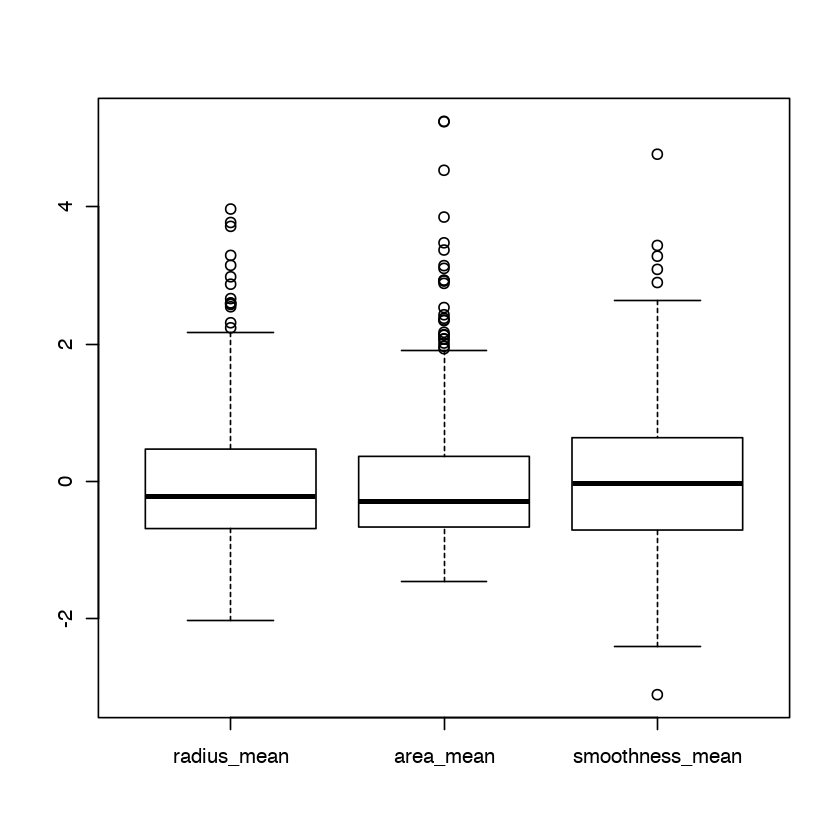
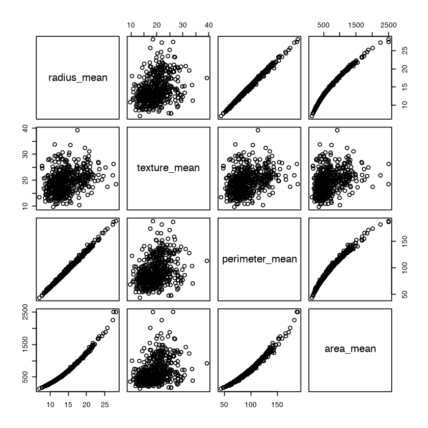
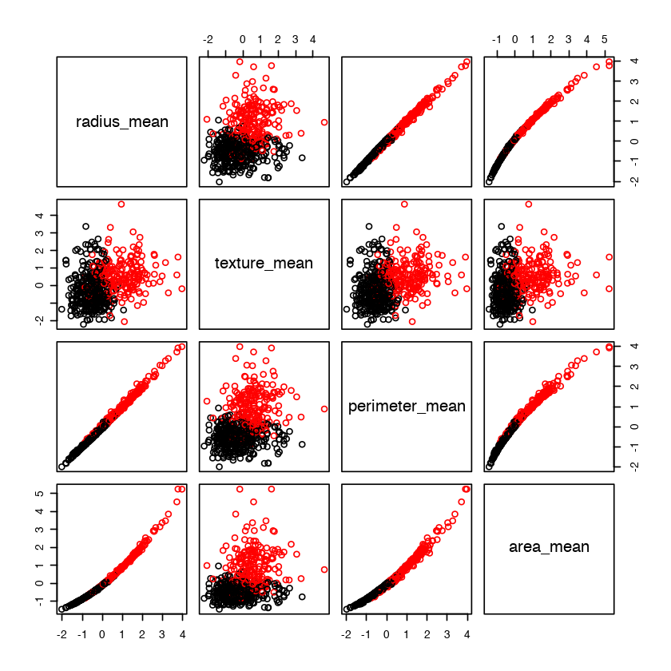
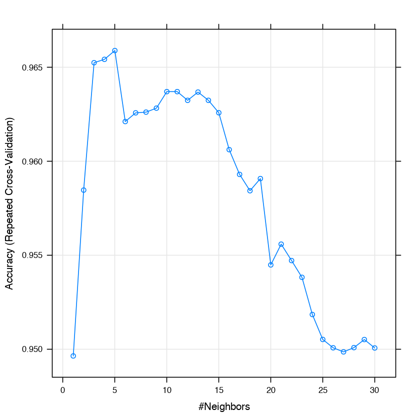

**Juan Ignacio Isern Ghosn**

## Diagnosing breast cancer with k-NN
We will use the "Breast Cancer Wisconsin Diagnostic" dataset from the UCI Machine Learning Repository, which is available at http://archive.ics.uci.edu/ml.

The breast cancer data includes 569 examples of cancer biopsies, each with 32 features. One feature is an identification number, another is the cancer diagnosis, and 30 are numeric-valued laboratory measurements. The diagnosis is coded as M to indicate malignant or B to indicate benign.

### Import data file


```R
# Local directory - use your own!!!!!!
setwd("/Users/jisern/OneDrive - Universidad de Las Palmas de Gran Canaria/UGR/Máster/Primer semestre/Introducción a la ciencia de datos/Clasificación")
```


```R
# Load data
wbcd <- read.csv("wisc_bc_data.csv", stringsAsFactors = FALSE)
# Examine the structure of the wbcd data frame
str(wbcd)
wbcd
```

    'data.frame':	569 obs. of  32 variables:
     $ id               : int  87139402 8910251 905520 868871 9012568 906539 925291 87880 862989 89827 ...
     $ diagnosis        : chr  "B" "B" "B" "B" ...
     $ radius_mean      : num  12.3 10.6 11 11.3 15.2 ...
     $ texture_mean     : num  12.4 18.9 16.8 13.4 13.2 ...
     $ perimeter_mean   : num  78.8 69.3 70.9 73 97.7 ...
     $ area_mean        : num  464 346 373 385 712 ...
     $ smoothness_mean  : num  0.1028 0.0969 0.1077 0.1164 0.0796 ...
     $ compactness_mean : num  0.0698 0.1147 0.078 0.1136 0.0693 ...
     $ concavity_mean   : num  0.0399 0.0639 0.0305 0.0464 0.0339 ...
     $ points_mean      : num  0.037 0.0264 0.0248 0.048 0.0266 ...
     $ symmetry_mean    : num  0.196 0.192 0.171 0.177 0.172 ...
     $ dimension_mean   : num  0.0595 0.0649 0.0634 0.0607 0.0554 ...
     $ radius_se        : num  0.236 0.451 0.197 0.338 0.178 ...
     $ texture_se       : num  0.666 1.197 1.387 1.343 0.412 ...
     $ perimeter_se     : num  1.67 3.43 1.34 1.85 1.34 ...
     $ area_se          : num  17.4 27.1 13.5 26.3 17.7 ...
     $ smoothness_se    : num  0.00805 0.00747 0.00516 0.01127 0.00501 ...
     $ compactness_se   : num  0.0118 0.03581 0.00936 0.03498 0.01485 ...
     $ concavity_se     : num  0.0168 0.0335 0.0106 0.0219 0.0155 ...
     $ points_se        : num  0.01241 0.01365 0.00748 0.01965 0.00915 ...
     $ symmetry_se      : num  0.0192 0.035 0.0172 0.0158 0.0165 ...
     $ dimension_se     : num  0.00225 0.00332 0.0022 0.00344 0.00177 ...
     $ radius_worst     : num  13.5 11.9 12.4 11.9 16.2 ...
     $ texture_worst    : num  15.6 22.9 26.4 15.8 15.7 ...
     $ perimeter_worst  : num  87 78.3 79.9 76.5 104.5 ...
     $ area_worst       : num  549 425 471 434 819 ...
     $ smoothness_worst : num  0.139 0.121 0.137 0.137 0.113 ...
     $ compactness_worst: num  0.127 0.252 0.148 0.182 0.174 ...
     $ concavity_worst  : num  0.1242 0.1916 0.1067 0.0867 0.1362 ...
     $ points_worst     : num  0.0939 0.0793 0.0743 0.0861 0.0818 ...
     $ symmetry_worst   : num  0.283 0.294 0.3 0.21 0.249 ...
     $ dimension_worst  : num  0.0677 0.0759 0.0788 0.0678 0.0677 ...


<table>
<thead><tr><th scope=col>id</th><th scope=col>diagnosis</th><th scope=col>radius_mean</th><th scope=col>texture_mean</th><th scope=col>perimeter_mean</th><th scope=col>area_mean</th><th scope=col>smoothness_mean</th><th scope=col>compactness_mean</th><th scope=col>concavity_mean</th><th scope=col>points_mean</th><th scope=col>⋯</th><th scope=col>radius_worst</th><th scope=col>texture_worst</th><th scope=col>perimeter_worst</th><th scope=col>area_worst</th><th scope=col>smoothness_worst</th><th scope=col>compactness_worst</th><th scope=col>concavity_worst</th><th scope=col>points_worst</th><th scope=col>symmetry_worst</th><th scope=col>dimension_worst</th></tr></thead>
<tbody>
	<tr><td>87139402</td><td>B       </td><td>12.320  </td><td>12.39   </td><td> 78.85  </td><td> 464.1  </td><td>0.10280 </td><td>0.06981 </td><td>0.039870</td><td>0.037000</td><td>⋯       </td><td>13.50   </td><td>15.64   </td><td> 86.97  </td><td> 549.1  </td><td>0.1385  </td><td>0.12660 </td><td>0.124200</td><td>0.09391 </td><td>0.2827  </td><td>0.06771 </td></tr>
	<tr><td> 8910251</td><td>B       </td><td>10.600  </td><td>18.95   </td><td> 69.28  </td><td> 346.4  </td><td>0.09688 </td><td>0.11470 </td><td>0.063870</td><td>0.026420</td><td>⋯       </td><td>11.88   </td><td>22.94   </td><td> 78.28  </td><td> 424.8  </td><td>0.1213  </td><td>0.25150 </td><td>0.191600</td><td>0.07926 </td><td>0.2940  </td><td>0.07587 </td></tr>
	<tr><td>  905520</td><td>B       </td><td>11.040  </td><td>16.83   </td><td> 70.92  </td><td> 373.2  </td><td>0.10770 </td><td>0.07804 </td><td>0.030460</td><td>0.024800</td><td>⋯       </td><td>12.41   </td><td>26.44   </td><td> 79.93  </td><td> 471.4  </td><td>0.1369  </td><td>0.14820 </td><td>0.106700</td><td>0.07431 </td><td>0.2998  </td><td>0.07881 </td></tr>
	<tr><td>  868871</td><td>B       </td><td>11.280  </td><td>13.39   </td><td> 73.00  </td><td> 384.8  </td><td>0.11640 </td><td>0.11360 </td><td>0.046350</td><td>0.047960</td><td>⋯       </td><td>11.92   </td><td>15.77   </td><td> 76.53  </td><td> 434.0  </td><td>0.1367  </td><td>0.18220 </td><td>0.086690</td><td>0.08611 </td><td>0.2102  </td><td>0.06784 </td></tr>
	<tr><td> 9012568</td><td>B       </td><td>15.190  </td><td>13.21   </td><td> 97.65  </td><td> 711.8  </td><td>0.07963 </td><td>0.06934 </td><td>0.033930</td><td>0.026570</td><td>⋯       </td><td>16.20   </td><td>15.73   </td><td>104.50  </td><td> 819.1  </td><td>0.1126  </td><td>0.17370 </td><td>0.136200</td><td>0.08178 </td><td>0.2487  </td><td>0.06766 </td></tr>
	<tr><td>  906539</td><td>B       </td><td>11.570  </td><td>19.04   </td><td> 74.20  </td><td> 409.7  </td><td>0.08546 </td><td>0.07722 </td><td>0.054850</td><td>0.014280</td><td>⋯       </td><td>13.07   </td><td>26.98   </td><td> 86.43  </td><td> 520.5  </td><td>0.1249  </td><td>0.19370 </td><td>0.256000</td><td>0.06664 </td><td>0.3035  </td><td>0.08284 </td></tr>
	<tr><td>  925291</td><td>B       </td><td>11.510  </td><td>23.93   </td><td> 74.52  </td><td> 403.5  </td><td>0.09261 </td><td>0.10210 </td><td>0.111200</td><td>0.041050</td><td>⋯       </td><td>12.48   </td><td>37.16   </td><td> 82.28  </td><td> 474.2  </td><td>0.1298  </td><td>0.25170 </td><td>0.363000</td><td>0.09653 </td><td>0.2112  </td><td>0.08732 </td></tr>
	<tr><td>   87880</td><td>M       </td><td>13.810  </td><td>23.75   </td><td> 91.56  </td><td> 597.8  </td><td>0.13230 </td><td>0.17680 </td><td>0.155800</td><td>0.091760</td><td>⋯       </td><td>19.20   </td><td>41.85   </td><td>128.50  </td><td>1153.0  </td><td>0.2226  </td><td>0.52090 </td><td>0.464600</td><td>0.20130 </td><td>0.4432  </td><td>0.10860 </td></tr>
	<tr><td>  862989</td><td>B       </td><td>10.490  </td><td>19.29   </td><td> 67.41  </td><td> 336.1  </td><td>0.09989 </td><td>0.08578 </td><td>0.029950</td><td>0.012010</td><td>⋯       </td><td>11.54   </td><td>23.31   </td><td> 74.22  </td><td> 402.8  </td><td>0.1219  </td><td>0.14860 </td><td>0.079870</td><td>0.03203 </td><td>0.2826  </td><td>0.07552 </td></tr>
	<tr><td>   89827</td><td>B       </td><td>11.060  </td><td>14.96   </td><td> 71.49  </td><td> 373.9  </td><td>0.10330 </td><td>0.09097 </td><td>0.053970</td><td>0.033410</td><td>⋯       </td><td>11.92   </td><td>19.90   </td><td> 79.76  </td><td> 440.0  </td><td>0.1418  </td><td>0.22100 </td><td>0.229900</td><td>0.10750 </td><td>0.3301  </td><td>0.09080 </td></tr>
	<tr><td>   91485</td><td>M       </td><td>20.590  </td><td>21.24   </td><td>137.80  </td><td>1320.0  </td><td>0.10850 </td><td>0.16440 </td><td>0.218800</td><td>0.112100</td><td>⋯       </td><td>23.86   </td><td>30.76   </td><td>163.20  </td><td>1760.0  </td><td>0.1464  </td><td>0.35970 </td><td>0.517900</td><td>0.21130 </td><td>0.2480  </td><td>0.08999 </td></tr>
	<tr><td> 8711003</td><td>B       </td><td>12.250  </td><td>17.94   </td><td> 78.27  </td><td> 460.3  </td><td>0.08654 </td><td>0.06679 </td><td>0.038850</td><td>0.023310</td><td>⋯       </td><td>13.59   </td><td>25.22   </td><td> 86.60  </td><td> 564.2  </td><td>0.1217  </td><td>0.17880 </td><td>0.194300</td><td>0.08211 </td><td>0.3113  </td><td>0.08132 </td></tr>
	<tr><td> 9113455</td><td>B       </td><td>13.140  </td><td>20.74   </td><td> 85.98  </td><td> 536.9  </td><td>0.08675 </td><td>0.10890 </td><td>0.108500</td><td>0.035100</td><td>⋯       </td><td>14.80   </td><td>25.46   </td><td>100.90  </td><td> 689.1  </td><td>0.1351  </td><td>0.35490 </td><td>0.450400</td><td>0.11810 </td><td>0.2563  </td><td>0.08174 </td></tr>
	<tr><td>  857810</td><td>B       </td><td>13.050  </td><td>19.31   </td><td> 82.61  </td><td> 527.2  </td><td>0.08060 </td><td>0.03789 </td><td>0.000692</td><td>0.004167</td><td>⋯       </td><td>14.23   </td><td>22.25   </td><td> 90.24  </td><td> 624.1  </td><td>0.1021  </td><td>0.06191 </td><td>0.001845</td><td>0.01111 </td><td>0.2439  </td><td>0.06289 </td></tr>
	<tr><td> 9111805</td><td>M       </td><td>19.590  </td><td>25.00   </td><td>127.70  </td><td>1191.0  </td><td>0.10320 </td><td>0.09871 </td><td>0.165500</td><td>0.090630</td><td>⋯       </td><td>21.44   </td><td>30.96   </td><td>139.80  </td><td>1421.0  </td><td>0.1528  </td><td>0.18450 </td><td>0.397700</td><td>0.14660 </td><td>0.2293  </td><td>0.06091 </td></tr>
	<tr><td>  925277</td><td>B       </td><td>14.590  </td><td>22.68   </td><td> 96.39  </td><td> 657.1  </td><td>0.08473 </td><td>0.13300 </td><td>0.102900</td><td>0.037360</td><td>⋯       </td><td>15.48   </td><td>27.27   </td><td>105.90  </td><td> 733.5  </td><td>0.1026  </td><td>0.31710 </td><td>0.366200</td><td>0.11050 </td><td>0.2258  </td><td>0.08004 </td></tr>
	<tr><td>  867387</td><td>B       </td><td>15.710  </td><td>13.93   </td><td>102.00  </td><td> 761.7  </td><td>0.09462 </td><td>0.09462 </td><td>0.071350</td><td>0.059330</td><td>⋯       </td><td>17.50   </td><td>19.25   </td><td>114.30  </td><td> 922.8  </td><td>0.1223  </td><td>0.19490 </td><td>0.170900</td><td>0.13740 </td><td>0.2723  </td><td>0.07071 </td></tr>
	<tr><td>89511502</td><td>B       </td><td>12.670  </td><td>17.30   </td><td> 81.25  </td><td> 489.9  </td><td>0.10280 </td><td>0.07664 </td><td>0.031930</td><td>0.021070</td><td>⋯       </td><td>13.71   </td><td>21.10   </td><td> 88.70  </td><td> 574.4  </td><td>0.1384  </td><td>0.12120 </td><td>0.102000</td><td>0.05602 </td><td>0.2688  </td><td>0.06888 </td></tr>
	<tr><td>89263202</td><td>M       </td><td>20.090  </td><td>23.86   </td><td>134.70  </td><td>1247.0  </td><td>0.10800 </td><td>0.18380 </td><td>0.228300</td><td>0.128000</td><td>⋯       </td><td>23.68   </td><td>29.43   </td><td>158.80  </td><td>1696.0  </td><td>0.1347  </td><td>0.33910 </td><td>0.493200</td><td>0.19230 </td><td>0.3294  </td><td>0.09469 </td></tr>
	<tr><td>  866714</td><td>B       </td><td>12.190  </td><td>13.29   </td><td> 79.08  </td><td> 455.8  </td><td>0.10660 </td><td>0.09509 </td><td>0.028550</td><td>0.028820</td><td>⋯       </td><td>13.34   </td><td>17.81   </td><td> 91.38  </td><td> 545.2  </td><td>0.1427  </td><td>0.25850 </td><td>0.099150</td><td>0.08187 </td><td>0.3469  </td><td>0.09241 </td></tr>
	<tr><td>  874373</td><td>B       </td><td>11.710  </td><td>17.19   </td><td> 74.68  </td><td> 420.3  </td><td>0.09774 </td><td>0.06141 </td><td>0.038090</td><td>0.032390</td><td>⋯       </td><td>13.01   </td><td>21.39   </td><td> 84.42  </td><td> 521.5  </td><td>0.1323  </td><td>0.10400 </td><td>0.152100</td><td>0.10990 </td><td>0.2572  </td><td>0.07097 </td></tr>
	<tr><td>  919812</td><td>B       </td><td>11.690  </td><td>24.44   </td><td> 76.37  </td><td> 406.4  </td><td>0.12360 </td><td>0.15520 </td><td>0.045150</td><td>0.045310</td><td>⋯       </td><td>12.98   </td><td>32.19   </td><td> 86.12  </td><td> 487.7  </td><td>0.1768  </td><td>0.32510 </td><td>0.139500</td><td>0.13080 </td><td>0.2803  </td><td>0.09970 </td></tr>
	<tr><td>  904971</td><td>B       </td><td>10.940  </td><td>18.59   </td><td> 70.39  </td><td> 370.0  </td><td>0.10040 </td><td>0.07460 </td><td>0.049440</td><td>0.029320</td><td>⋯       </td><td>12.40   </td><td>25.58   </td><td> 82.76  </td><td> 472.4  </td><td>0.1363  </td><td>0.16440 </td><td>0.141200</td><td>0.07887 </td><td>0.2251  </td><td>0.07732 </td></tr>
	<tr><td>  866458</td><td>B       </td><td>15.100  </td><td>16.39   </td><td> 99.58  </td><td> 674.5  </td><td>0.11500 </td><td>0.18070 </td><td>0.113800</td><td>0.085340</td><td>⋯       </td><td>16.11   </td><td>18.33   </td><td>105.90  </td><td> 762.6  </td><td>0.1386  </td><td>0.28830 </td><td>0.196000</td><td>0.14230 </td><td>0.2590  </td><td>0.07779 </td></tr>
	<tr><td>  864292</td><td>B       </td><td>10.510  </td><td>20.19   </td><td> 68.64  </td><td> 334.2  </td><td>0.11220 </td><td>0.13030 </td><td>0.064760</td><td>0.030680</td><td>⋯       </td><td>11.16   </td><td>22.75   </td><td> 72.62  </td><td> 374.4  </td><td>0.1300  </td><td>0.20490 </td><td>0.129500</td><td>0.06136 </td><td>0.2383  </td><td>0.09026 </td></tr>
	<tr><td>  859983</td><td>M       </td><td>13.800  </td><td>15.79   </td><td> 90.43  </td><td> 584.1  </td><td>0.10070 </td><td>0.12800 </td><td>0.077890</td><td>0.050690</td><td>⋯       </td><td>16.57   </td><td>20.86   </td><td>110.30  </td><td> 812.4  </td><td>0.1411  </td><td>0.35420 </td><td>0.277900</td><td>0.13830 </td><td>0.2589  </td><td>0.10300 </td></tr>
	<tr><td>  862009</td><td>B       </td><td>13.450  </td><td>18.30   </td><td> 86.60  </td><td> 555.1  </td><td>0.10220 </td><td>0.08165 </td><td>0.039740</td><td>0.027800</td><td>⋯       </td><td>15.10   </td><td>25.94   </td><td> 97.59  </td><td> 699.4  </td><td>0.1339  </td><td>0.17510 </td><td>0.138100</td><td>0.07911 </td><td>0.2678  </td><td>0.06603 </td></tr>
	<tr><td>  852973</td><td>M       </td><td>15.300  </td><td>25.27   </td><td>102.40  </td><td> 732.4  </td><td>0.10820 </td><td>0.16970 </td><td>0.168300</td><td>0.087510</td><td>⋯       </td><td>20.27   </td><td>36.71   </td><td>149.30  </td><td>1269.0  </td><td>0.1641  </td><td>0.61100 </td><td>0.633500</td><td>0.20240 </td><td>0.4027  </td><td>0.09876 </td></tr>
	<tr><td>  898143</td><td>B       </td><td> 9.606  </td><td>16.84   </td><td> 61.64  </td><td> 280.5  </td><td>0.08481 </td><td>0.09228 </td><td>0.084220</td><td>0.022920</td><td>⋯       </td><td>10.75   </td><td>23.07   </td><td> 71.25  </td><td> 353.6  </td><td>0.1233  </td><td>0.34160 </td><td>0.434100</td><td>0.08120 </td><td>0.2982  </td><td>0.09825 </td></tr>
	<tr><td> 9010877</td><td>B       </td><td>13.400  </td><td>16.95   </td><td> 85.48  </td><td> 552.4  </td><td>0.07937 </td><td>0.05696 </td><td>0.021810</td><td>0.014730</td><td>⋯       </td><td>14.73   </td><td>21.70   </td><td> 93.76  </td><td> 663.5  </td><td>0.1213  </td><td>0.16760 </td><td>0.136400</td><td>0.06987 </td><td>0.2741  </td><td>0.07582 </td></tr>
	<tr><td>⋮</td><td>⋮</td><td>⋮</td><td>⋮</td><td>⋮</td><td>⋮</td><td>⋮</td><td>⋮</td><td>⋮</td><td>⋮</td><td>⋱</td><td>⋮</td><td>⋮</td><td>⋮</td><td>⋮</td><td>⋮</td><td>⋮</td><td>⋮</td><td>⋮</td><td>⋮</td><td>⋮</td></tr>
	<tr><td>   862485</td><td>B        </td><td>11.600   </td><td>12.84    </td><td> 74.34   </td><td> 412.6   </td><td>0.08983  </td><td>0.07525  </td><td>0.04196  </td><td>0.033500 </td><td>⋯        </td><td>13.060   </td><td>17.16    </td><td> 82.96   </td><td> 512.5   </td><td>0.14310  </td><td>0.18510  </td><td>0.192200 </td><td>0.084490 </td><td>0.2772   </td><td>0.08756  </td></tr>
	<tr><td>   879830</td><td>M        </td><td>17.010   </td><td>20.26    </td><td>109.70   </td><td> 904.3   </td><td>0.08772  </td><td>0.07304  </td><td>0.06950  </td><td>0.053900 </td><td>⋯        </td><td>19.800   </td><td>25.05    </td><td>130.00   </td><td>1210.0   </td><td>0.11110  </td><td>0.14860  </td><td>0.193200 </td><td>0.109600 </td><td>0.3275   </td><td>0.06469  </td></tr>
	<tr><td>   917092</td><td>B        </td><td> 9.295   </td><td>13.90    </td><td> 59.96   </td><td> 257.8   </td><td>0.13710  </td><td>0.12250  </td><td>0.03332  </td><td>0.024210 </td><td>⋯        </td><td>10.570   </td><td>17.84    </td><td> 67.84   </td><td> 326.6   </td><td>0.18500  </td><td>0.20970  </td><td>0.099960 </td><td>0.072620 </td><td>0.3681   </td><td>0.08982  </td></tr>
	<tr><td>  8912521</td><td>B        </td><td>12.580   </td><td>18.40    </td><td> 79.83   </td><td> 489.0   </td><td>0.08393  </td><td>0.04216  </td><td>0.00186  </td><td>0.002924 </td><td>⋯        </td><td>13.500   </td><td>23.08    </td><td> 85.56   </td><td> 564.1   </td><td>0.10380  </td><td>0.06624  </td><td>0.005579 </td><td>0.008772 </td><td>0.2505   </td><td>0.06431  </td></tr>
	<tr><td>   895100</td><td>M        </td><td>20.340   </td><td>21.51    </td><td>135.90   </td><td>1264.0   </td><td>0.11700  </td><td>0.18750  </td><td>0.25650  </td><td>0.150400 </td><td>⋯        </td><td>25.300   </td><td>31.86    </td><td>171.10   </td><td>1938.0   </td><td>0.15920  </td><td>0.44920  </td><td>0.534400 </td><td>0.268500 </td><td>0.5558   </td><td>0.10240  </td></tr>
	<tr><td>  8610862</td><td>M        </td><td>20.180   </td><td>23.97    </td><td>143.70   </td><td>1245.0   </td><td>0.12860  </td><td>0.34540  </td><td>0.37540  </td><td>0.160400 </td><td>⋯        </td><td>23.370   </td><td>31.72    </td><td>170.30   </td><td>1623.0   </td><td>0.16390  </td><td>0.61640  </td><td>0.768100 </td><td>0.250800 </td><td>0.5440   </td><td>0.09964  </td></tr>
	<tr><td>   891670</td><td>B        </td><td>12.950   </td><td>16.02    </td><td> 83.14   </td><td> 513.7   </td><td>0.10050  </td><td>0.07943  </td><td>0.06155  </td><td>0.033700 </td><td>⋯        </td><td>13.740   </td><td>19.93    </td><td> 88.81   </td><td> 585.4   </td><td>0.14830  </td><td>0.20680  </td><td>0.224100 </td><td>0.105600 </td><td>0.3380   </td><td>0.09584  </td></tr>
	<tr><td>   864726</td><td>B        </td><td> 8.950   </td><td>15.76    </td><td> 58.74   </td><td> 245.2   </td><td>0.09462  </td><td>0.12430  </td><td>0.09263  </td><td>0.023080 </td><td>⋯        </td><td> 9.414   </td><td>17.07    </td><td> 63.34   </td><td> 270.0   </td><td>0.11790  </td><td>0.18790  </td><td>0.154400 </td><td>0.038460 </td><td>0.1652   </td><td>0.07722  </td></tr>
	<tr><td>  9010598</td><td>B        </td><td>12.760   </td><td>18.84    </td><td> 81.87   </td><td> 496.6   </td><td>0.09676  </td><td>0.07952  </td><td>0.02688  </td><td>0.017810 </td><td>⋯        </td><td>13.750   </td><td>25.99    </td><td> 87.82   </td><td> 579.7   </td><td>0.12980  </td><td>0.18390  </td><td>0.125500 </td><td>0.083120 </td><td>0.2744   </td><td>0.07238  </td></tr>
	<tr><td>   925292</td><td>B        </td><td>14.050   </td><td>27.15    </td><td> 91.38   </td><td> 600.4   </td><td>0.09929  </td><td>0.11260  </td><td>0.04462  </td><td>0.043040 </td><td>⋯        </td><td>15.300   </td><td>33.17    </td><td>100.20   </td><td> 706.7   </td><td>0.12410  </td><td>0.22640  </td><td>0.132600 </td><td>0.104800 </td><td>0.2250   </td><td>0.08321  </td></tr>
	<tr><td>   857155</td><td>B        </td><td>12.050   </td><td>14.63    </td><td> 78.04   </td><td> 449.3   </td><td>0.10310  </td><td>0.09092  </td><td>0.06592  </td><td>0.027490 </td><td>⋯        </td><td>13.760   </td><td>20.70    </td><td> 89.88   </td><td> 582.6   </td><td>0.14940  </td><td>0.21560  </td><td>0.305000 </td><td>0.065480 </td><td>0.2747   </td><td>0.08301  </td></tr>
	<tr><td>   905190</td><td>B        </td><td>12.850   </td><td>21.37    </td><td> 82.63   </td><td> 514.5   </td><td>0.07551  </td><td>0.08316  </td><td>0.06126  </td><td>0.018670 </td><td>⋯        </td><td>14.400   </td><td>27.01    </td><td> 91.63   </td><td> 645.8   </td><td>0.09402  </td><td>0.19360  </td><td>0.183800 </td><td>0.056010 </td><td>0.2488   </td><td>0.08151  </td></tr>
	<tr><td>   901011</td><td>B        </td><td>11.140   </td><td>14.07    </td><td> 71.24   </td><td> 384.6   </td><td>0.07274  </td><td>0.06064  </td><td>0.04505  </td><td>0.014710 </td><td>⋯        </td><td>12.120   </td><td>15.82    </td><td> 79.62   </td><td> 453.5   </td><td>0.08864  </td><td>0.12560  </td><td>0.120100 </td><td>0.039220 </td><td>0.2576   </td><td>0.07018  </td></tr>
	<tr><td> 84501001</td><td>M        </td><td>12.460   </td><td>24.04    </td><td> 83.97   </td><td> 475.9   </td><td>0.11860  </td><td>0.23960  </td><td>0.22730  </td><td>0.085430 </td><td>⋯        </td><td>15.090   </td><td>40.68    </td><td> 97.65   </td><td> 711.4   </td><td>0.18530  </td><td>1.05800  </td><td>1.105000 </td><td>0.221000 </td><td>0.4366   </td><td>0.20750  </td></tr>
	<tr><td>    91858</td><td>B        </td><td>11.750   </td><td>17.56    </td><td> 75.89   </td><td> 422.9   </td><td>0.10730  </td><td>0.09713  </td><td>0.05282  </td><td>0.044400 </td><td>⋯        </td><td>13.500   </td><td>27.98    </td><td> 88.52   </td><td> 552.3   </td><td>0.13490  </td><td>0.18540  </td><td>0.136600 </td><td>0.101000 </td><td>0.2478   </td><td>0.07757  </td></tr>
	<tr><td>  9112367</td><td>B        </td><td>13.210   </td><td>25.25    </td><td> 84.10   </td><td> 537.9   </td><td>0.08791  </td><td>0.05205  </td><td>0.02772  </td><td>0.020680 </td><td>⋯        </td><td>14.350   </td><td>34.23    </td><td> 91.29   </td><td> 632.9   </td><td>0.12890  </td><td>0.10630  </td><td>0.139000 </td><td>0.060050 </td><td>0.2444   </td><td>0.06788  </td></tr>
	<tr><td>   903516</td><td>M        </td><td>21.610   </td><td>22.28    </td><td>144.40   </td><td>1407.0   </td><td>0.11670  </td><td>0.20870  </td><td>0.28100  </td><td>0.156200 </td><td>⋯        </td><td>26.230   </td><td>28.74    </td><td>172.00   </td><td>2081.0   </td><td>0.15020  </td><td>0.57170  </td><td>0.705300 </td><td>0.242200 </td><td>0.3828   </td><td>0.10070  </td></tr>
	<tr><td> 88518501</td><td>B        </td><td>11.500   </td><td>18.45    </td><td> 73.28   </td><td> 407.4   </td><td>0.09345  </td><td>0.05991  </td><td>0.02638  </td><td>0.020690 </td><td>⋯        </td><td>12.970   </td><td>22.46    </td><td> 83.12   </td><td> 508.9   </td><td>0.11830  </td><td>0.10490  </td><td>0.081050 </td><td>0.065440 </td><td>0.2740   </td><td>0.06487  </td></tr>
	<tr><td>   906564</td><td>B        </td><td>14.690   </td><td>13.98    </td><td> 98.22   </td><td> 656.1   </td><td>0.10310  </td><td>0.18360  </td><td>0.14500  </td><td>0.063000 </td><td>⋯        </td><td>16.460   </td><td>18.34    </td><td>114.10   </td><td> 809.2   </td><td>0.13120  </td><td>0.36350  </td><td>0.321900 </td><td>0.110800 </td><td>0.2827   </td><td>0.09208  </td></tr>
	<tr><td>   871641</td><td>B        </td><td>11.080   </td><td>14.71    </td><td> 70.21   </td><td> 372.7   </td><td>0.10060  </td><td>0.05743  </td><td>0.02363  </td><td>0.025830 </td><td>⋯        </td><td>11.350   </td><td>16.82    </td><td> 72.01   </td><td> 396.5   </td><td>0.12160  </td><td>0.08240  </td><td>0.039380 </td><td>0.043060 </td><td>0.1902   </td><td>0.07313  </td></tr>
	<tr><td>  9110944</td><td>B        </td><td>14.800   </td><td>17.66    </td><td> 95.88   </td><td> 674.8   </td><td>0.09179  </td><td>0.08890  </td><td>0.04069  </td><td>0.022600 </td><td>⋯        </td><td>16.430   </td><td>22.74    </td><td>105.90   </td><td> 829.5   </td><td>0.12260  </td><td>0.18810  </td><td>0.206000 </td><td>0.083080 </td><td>0.3600   </td><td>0.07285  </td></tr>
	<tr><td>   854268</td><td>M        </td><td>14.250   </td><td>21.72    </td><td> 93.63   </td><td> 633.0   </td><td>0.09823  </td><td>0.10980  </td><td>0.13190  </td><td>0.055980 </td><td>⋯        </td><td>15.890   </td><td>30.36    </td><td>116.20   </td><td> 799.6   </td><td>0.14460  </td><td>0.42380  </td><td>0.518600 </td><td>0.144700 </td><td>0.3591   </td><td>0.10140  </td></tr>
	<tr><td> 89511501</td><td>B        </td><td>12.200   </td><td>15.21    </td><td> 78.01   </td><td> 457.9   </td><td>0.08673  </td><td>0.06545  </td><td>0.01994  </td><td>0.016920 </td><td>⋯        </td><td>13.750   </td><td>21.38    </td><td> 91.11   </td><td> 583.1   </td><td>0.12560  </td><td>0.19280  </td><td>0.116700 </td><td>0.055560 </td><td>0.2661   </td><td>0.07961  </td></tr>
	<tr><td>  9113156</td><td>B        </td><td>14.400   </td><td>26.99    </td><td> 92.25   </td><td> 646.1   </td><td>0.06995  </td><td>0.05223  </td><td>0.03476  </td><td>0.017370 </td><td>⋯        </td><td>15.400   </td><td>31.98    </td><td>100.40   </td><td> 734.6   </td><td>0.10170  </td><td>0.14600  </td><td>0.147200 </td><td>0.055630 </td><td>0.2345   </td><td>0.06464  </td></tr>
	<tr><td>   894855</td><td>B        </td><td>12.860   </td><td>13.32    </td><td> 82.82   </td><td> 504.8   </td><td>0.11340  </td><td>0.08834  </td><td>0.03800  </td><td>0.034000 </td><td>⋯        </td><td>14.040   </td><td>21.08    </td><td> 92.80   </td><td> 599.5   </td><td>0.15470  </td><td>0.22310  </td><td>0.179100 </td><td>0.115500 </td><td>0.2382   </td><td>0.08553  </td></tr>
	<tr><td>911320502</td><td>B        </td><td>13.170   </td><td>18.22    </td><td> 84.28   </td><td> 537.3   </td><td>0.07466  </td><td>0.05994  </td><td>0.04859  </td><td>0.028700 </td><td>⋯        </td><td>14.900   </td><td>23.89    </td><td> 95.10   </td><td> 687.6   </td><td>0.12820  </td><td>0.19650  </td><td>0.187600 </td><td>0.104500 </td><td>0.2235   </td><td>0.06925  </td></tr>
	<tr><td>   898677</td><td>B        </td><td>10.260   </td><td>14.71    </td><td> 66.20   </td><td> 321.6   </td><td>0.09882  </td><td>0.09159  </td><td>0.03581  </td><td>0.020370 </td><td>⋯        </td><td>10.880   </td><td>19.48    </td><td> 70.89   </td><td> 357.1   </td><td>0.13600  </td><td>0.16360  </td><td>0.071620 </td><td>0.040740 </td><td>0.2434   </td><td>0.08488  </td></tr>
	<tr><td>   873885</td><td>M        </td><td>15.280   </td><td>22.41    </td><td> 98.92   </td><td> 710.6   </td><td>0.09057  </td><td>0.10520  </td><td>0.05375  </td><td>0.032630 </td><td>⋯        </td><td>17.800   </td><td>28.03    </td><td>113.80   </td><td> 973.1   </td><td>0.13010  </td><td>0.32990  </td><td>0.363000 </td><td>0.122600 </td><td>0.3175   </td><td>0.09772  </td></tr>
	<tr><td>   911201</td><td>B        </td><td>14.530   </td><td>13.98    </td><td> 93.86   </td><td> 644.2   </td><td>0.10990  </td><td>0.09242  </td><td>0.06895  </td><td>0.064950 </td><td>⋯        </td><td>15.800   </td><td>16.93    </td><td>103.10   </td><td> 749.9   </td><td>0.13470  </td><td>0.14780  </td><td>0.137300 </td><td>0.106900 </td><td>0.2606   </td><td>0.07810  </td></tr>
	<tr><td>  9012795</td><td>M        </td><td>21.370   </td><td>15.10    </td><td>141.30   </td><td>1386.0   </td><td>0.10010  </td><td>0.15150  </td><td>0.19320  </td><td>0.125500 </td><td>⋯        </td><td>22.690   </td><td>21.84    </td><td>152.10   </td><td>1535.0   </td><td>0.11920  </td><td>0.28400  </td><td>0.402400 </td><td>0.196600 </td><td>0.2730   </td><td>0.08666  </td></tr>
</tbody>
</table>


### Preprocess data


```R
# Drop the id feature
wbcd <- wbcd[,-1]
```


```R
# Table of diagnosis
table(wbcd$diagnosis)
```


    
      B   M 
    357 212 


```R
# Recode diagnosis as a factor
wbcd$diagnosis <- factor(wbcd$diagnosis, levels = c("B", "M"), labels = c("Benign", "Malignant"))
table(wbcd$diagnosis)
```


    
       Benign Malignant 
          357       212 


```R
# Table or proportions with more informative labels
round(prop.table(table(wbcd$diagnosis)) * 100, digits = 1)
```


    
       Benign Malignant 
         62.7      37.3 


```R
# Summarize three numeric features
summary(wbcd[,c("radius_mean", "area_mean", "smoothness_mean")])
```


      radius_mean       area_mean      smoothness_mean  
     Min.   : 6.981   Min.   : 143.5   Min.   :0.05263  
     1st Qu.:11.700   1st Qu.: 420.3   1st Qu.:0.08637  
     Median :13.370   Median : 551.1   Median :0.09587  
     Mean   :14.127   Mean   : 654.9   Mean   :0.09636  
     3rd Qu.:15.780   3rd Qu.: 782.7   3rd Qu.:0.10530  
     Max.   :28.110   Max.   :2501.0   Max.   :0.16340  


```R
# Normalize the wbcd data
wbcd_n <- as.data.frame(lapply(wbcd[,2:31], scale, center = TRUE, scale = TRUE))
# Confirm that normalization worked
summary(wbcd_n[,c("radius_mean", "area_mean", "smoothness_mean")])
boxplot(wbcd_n[,c("radius_mean", "area_mean", "smoothness_mean")])
```


      radius_mean        area_mean       smoothness_mean   
     Min.   :-2.0279   Min.   :-1.4532   Min.   :-3.10935  
     1st Qu.:-0.6888   1st Qu.:-0.6666   1st Qu.:-0.71034  
     Median :-0.2149   Median :-0.2949   Median :-0.03486  
     Mean   : 0.0000   Mean   : 0.0000   Mean   : 0.00000  
     3rd Qu.: 0.4690   3rd Qu.: 0.3632   3rd Qu.: 0.63564  
     Max.   : 3.9678   Max.   : 5.2459   Max.   : 4.76672  





### Visualize data


```R
plot(wbcd[,2:5])
```





```R
plot(wbcd_n[,1:4], col=wbcd[,1])
```





```R
# Try with ggplot2!
```


```R
cor(wbcd[,2:5])
```


<table>
<thead><tr><th></th><th scope=col>radius_mean</th><th scope=col>texture_mean</th><th scope=col>perimeter_mean</th><th scope=col>area_mean</th></tr></thead>
<tbody>
	<tr><th scope=row>radius_mean</th><td>1.0000000</td><td>0.3237819</td><td>0.9978553</td><td>0.9873572</td></tr>
	<tr><th scope=row>texture_mean</th><td>0.3237819</td><td>1.0000000</td><td>0.3295331</td><td>0.3210857</td></tr>
	<tr><th scope=row>perimeter_mean</th><td>0.9978553</td><td>0.3295331</td><td>1.0000000</td><td>0.9865068</td></tr>
	<tr><th scope=row>area_mean</th><td>0.9873572</td><td>0.3210857</td><td>0.9865068</td><td>1.0000000</td></tr>
</tbody>
</table>


```R
cor(wbcd_n[,1:4])
```


<table>
<thead><tr><th></th><th scope=col>radius_mean</th><th scope=col>texture_mean</th><th scope=col>perimeter_mean</th><th scope=col>area_mean</th></tr></thead>
<tbody>
	<tr><th scope=row>radius_mean</th><td>1.0000000</td><td>0.3237819</td><td>0.9978553</td><td>0.9873572</td></tr>
	<tr><th scope=row>texture_mean</th><td>0.3237819</td><td>1.0000000</td><td>0.3295331</td><td>0.3210857</td></tr>
	<tr><th scope=row>perimeter_mean</th><td>0.9978553</td><td>0.3295331</td><td>1.0000000</td><td>0.9865068</td></tr>
	<tr><th scope=row>area_mean</th><td>0.9873572</td><td>0.3210857</td><td>0.9865068</td><td>1.0000000</td></tr>
</tbody>
</table>


### Create training and test datasets


```R
# Create training and test data
shuffle_ds <- sample(dim(wbcd_n)[1])
eightypct <- (dim(wbcd_n)[1] * 80) %/% 100
wbcd_train <- wbcd_n[shuffle_ds[1:eightypct], ]
wbcd_test <- wbcd_n[shuffle_ds[(eightypct+1):dim(wbcd_n)[1]], ]

# Create labels for training and test data
wbcd_train_labels <- wbcd[shuffle_ds[1:eightypct], 1]
wbcd_test_labels <- wbcd[shuffle_ds[(eightypct+1):dim(wbcd_n)[1]], 1]
```

### Training a model on the data - By hand...


```R
# Load the "class" library
library(class)
wbcd_test_pred <- knn(train = wbcd_train, test = wbcd_test, cl = wbcd_train_labels, k=21)
wbcd_test_pred
```


<ol class=list-inline>
	<li>Benign</li>
	<li>Benign</li>
	<li>Malignant</li>
	<li>Benign</li>
	<li>Benign</li>
	<li>Benign</li>
	<li>Benign</li>
	<li>Malignant</li>
	<li>Benign</li>
	<li>Benign</li>
	<li>Malignant</li>
	<li>Benign</li>
	<li>Benign</li>
	<li>Benign</li>
	<li>Benign</li>
	<li>Benign</li>
	<li>Benign</li>
	<li>Benign</li>
	<li>Benign</li>
	<li>Benign</li>
	<li>Benign</li>
	<li>Malignant</li>
	<li>Benign</li>
	<li>Malignant</li>
	<li>Benign</li>
	<li>Benign</li>
	<li>Malignant</li>
	<li>Malignant</li>
	<li>Benign</li>
	<li>Benign</li>
	<li>Benign</li>
	<li>Benign</li>
	<li>Benign</li>
	<li>Benign</li>
	<li>Malignant</li>
	<li>Malignant</li>
	<li>Malignant</li>
	<li>Benign</li>
	<li>Benign</li>
	<li>Benign</li>
	<li>Malignant</li>
	<li>Benign</li>
	<li>Benign</li>
	<li>Benign</li>
	<li>Benign</li>
	<li>Benign</li>
	<li>Benign</li>
	<li>Malignant</li>
	<li>Benign</li>
	<li>Benign</li>
	<li>Benign</li>
	<li>Malignant</li>
	<li>Malignant</li>
	<li>Benign</li>
	<li>Benign</li>
	<li>Benign</li>
	<li>Malignant</li>
	<li>Malignant</li>
	<li>Benign</li>
	<li>Malignant</li>
	<li>Benign</li>
	<li>Malignant</li>
	<li>Malignant</li>
	<li>Benign</li>
	<li>Benign</li>
	<li>Benign</li>
	<li>Benign</li>
	<li>Malignant</li>
	<li>Benign</li>
	<li>Benign</li>
	<li>Malignant</li>
	<li>Benign</li>
	<li>Malignant</li>
	<li>Benign</li>
	<li>Malignant</li>
	<li>Benign</li>
	<li>Malignant</li>
	<li>Benign</li>
	<li>Benign</li>
	<li>Benign</li>
	<li>Benign</li>
	<li>Benign</li>
	<li>Malignant</li>
	<li>Malignant</li>
	<li>Benign</li>
	<li>Malignant</li>
	<li>Benign</li>
	<li>Malignant</li>
	<li>Benign</li>
	<li>Benign</li>
	<li>Benign</li>
	<li>Benign</li>
	<li>Malignant</li>
	<li>Benign</li>
	<li>Benign</li>
	<li>Malignant</li>
	<li>Benign</li>
	<li>Benign</li>
	<li>Benign</li>
	<li>Benign</li>
	<li>Benign</li>
	<li>Benign</li>
	<li>Malignant</li>
	<li>Benign</li>
	<li>Malignant</li>
	<li>Benign</li>
	<li>Benign</li>
	<li>Benign</li>
	<li>Benign</li>
	<li>Malignant</li>
	<li>Benign</li>
	<li>Benign</li>
	<li>Malignant</li>
	<li>Benign</li>
</ol>

<details>
	<summary style=display:list-item;cursor:pointer>
		<strong>Levels</strong>:
	</summary>
	<ol class=list-inline>
		<li>'Benign'</li>
		<li>'Malignant'</li>
	</ol>
</details>


```R
# Evaluating model performance
table(wbcd_test_pred,wbcd_test_labels)
```


                  wbcd_test_labels
    wbcd_test_pred Benign Malignant
         Benign        74         6
         Malignant      0        34


### Training a model on the data - Using caret...


```R
require(caret)
knnModel <- train(x = wbcd_train, y = wbcd_train_labels, method = "knn")
class(knnModel)
knnModel
```

    Loading required package: caret
    Loading required package: lattice
    Loading required package: ggplot2
    Warning message:
    “package ‘ggplot2’ was built under R version 3.4.4”


'train'


    k-Nearest Neighbors 
    
    455 samples
     30 predictor
      2 classes: 'Benign', 'Malignant' 
    
    No pre-processing
    Resampling: Bootstrapped (25 reps) 
    Summary of sample sizes: 455, 455, 455, 455, 455, 455, ... 
    Resampling results across tuning parameters:
    
      k  Accuracy   Kappa    
      5  0.9643797  0.9227526
      7  0.9631373  0.9199051
      9  0.9638837  0.9215091
    
    Accuracy was used to select the optimal model using the largest value.
    The final value used for the model was k = 5.


```R
knnModel <- train(wbcd_train, wbcd_train_labels, method="knn", metric="Accuracy", tuneGrid = data.frame(.k=1:15))
knnModel
```


    k-Nearest Neighbors 
    
    455 samples
     30 predictor
      2 classes: 'Benign', 'Malignant' 
    
    No pre-processing
    Resampling: Bootstrapped (25 reps) 
    Summary of sample sizes: 455, 455, 455, 455, 455, 455, ... 
    Resampling results across tuning parameters:
    
      k   Accuracy   Kappa    
       1  0.9541740  0.9004900
       2  0.9525094  0.8973300
       3  0.9528066  0.8979055
       4  0.9533271  0.8988521
       5  0.9511473  0.8940222
       6  0.9566116  0.9057171
       7  0.9544809  0.9011708
       8  0.9544205  0.9010768
       9  0.9563081  0.9050449
      10  0.9567943  0.9058508
      11  0.9589191  0.9104817
      12  0.9594042  0.9114702
      13  0.9589319  0.9103825
      14  0.9577580  0.9078341
      15  0.9565727  0.9051924
    
    Accuracy was used to select the optimal model using the largest value.
    The final value used for the model was k = 12.


```R
require(caret)
knnModel <- train(x = wbcd[shuffle_ds[1:eightypct],-1], y = wbcd[shuffle_ds[1:eightypct],1], method = "knn", preProc = c("center", "scale"))
class(knnModel)
knnModel
```


'train'


    k-Nearest Neighbors 
    
    455 samples
     30 predictor
      2 classes: 'Benign', 'Malignant' 
    
    Pre-processing: centered (30), scaled (30) 
    Resampling: Bootstrapped (25 reps) 
    Summary of sample sizes: 455, 455, 455, 455, 455, 455, ... 
    Resampling results across tuning parameters:
    
      k  Accuracy   Kappa    
      5  0.9549678  0.9031691
      7  0.9550739  0.9034259
      9  0.9576769  0.9089413
    
    Accuracy was used to select the optimal model using the largest value.
    The final value used for the model was k = 9.


### Predicting using the model


```R
knnPred <- predict(knnModel, newdata = wbcd[shuffle_ds[(eightypct+1):dim(wbcd_n)[1]], -1])
knnPred
```


<ol class=list-inline>
	<li>Benign</li>
	<li>Benign</li>
	<li>Malignant</li>
	<li>Benign</li>
	<li>Benign</li>
	<li>Benign</li>
	<li>Benign</li>
	<li>Malignant</li>
	<li>Benign</li>
	<li>Benign</li>
	<li>Malignant</li>
	<li>Benign</li>
	<li>Benign</li>
	<li>Benign</li>
	<li>Benign</li>
	<li>Benign</li>
	<li>Benign</li>
	<li>Benign</li>
	<li>Benign</li>
	<li>Benign</li>
	<li>Benign</li>
	<li>Malignant</li>
	<li>Benign</li>
	<li>Malignant</li>
	<li>Benign</li>
	<li>Benign</li>
	<li>Malignant</li>
	<li>Malignant</li>
	<li>Benign</li>
	<li>Benign</li>
	<li>Benign</li>
	<li>Benign</li>
	<li>Benign</li>
	<li>Benign</li>
	<li>Malignant</li>
	<li>Malignant</li>
	<li>Malignant</li>
	<li>Benign</li>
	<li>Benign</li>
	<li>Malignant</li>
	<li>Malignant</li>
	<li>Benign</li>
	<li>Benign</li>
	<li>Benign</li>
	<li>Benign</li>
	<li>Benign</li>
	<li>Benign</li>
	<li>Malignant</li>
	<li>Benign</li>
	<li>Benign</li>
	<li>Benign</li>
	<li>Malignant</li>
	<li>Malignant</li>
	<li>Benign</li>
	<li>Benign</li>
	<li>Benign</li>
	<li>Malignant</li>
	<li>Malignant</li>
	<li>Benign</li>
	<li>Malignant</li>
	<li>Benign</li>
	<li>Malignant</li>
	<li>Malignant</li>
	<li>Benign</li>
	<li>Benign</li>
	<li>Benign</li>
	<li>Benign</li>
	<li>Malignant</li>
	<li>Benign</li>
	<li>Benign</li>
	<li>Malignant</li>
	<li>Benign</li>
	<li>Malignant</li>
	<li>Benign</li>
	<li>Malignant</li>
	<li>Benign</li>
	<li>Malignant</li>
	<li>Benign</li>
	<li>Benign</li>
	<li>Benign</li>
	<li>Benign</li>
	<li>Benign</li>
	<li>Malignant</li>
	<li>Malignant</li>
	<li>Benign</li>
	<li>Malignant</li>
	<li>Benign</li>
	<li>Malignant</li>
	<li>Benign</li>
	<li>Benign</li>
	<li>Benign</li>
	<li>Benign</li>
	<li>Malignant</li>
	<li>Benign</li>
	<li>Benign</li>
	<li>Malignant</li>
	<li>Benign</li>
	<li>Benign</li>
	<li>Benign</li>
	<li>Benign</li>
	<li>Benign</li>
	<li>Benign</li>
	<li>Malignant</li>
	<li>Benign</li>
	<li>Malignant</li>
	<li>Benign</li>
	<li>Benign</li>
	<li>Benign</li>
	<li>Benign</li>
	<li>Malignant</li>
	<li>Benign</li>
	<li>Benign</li>
	<li>Malignant</li>
	<li>Benign</li>
</ol>

<details>
	<summary style=display:list-item;cursor:pointer>
		<strong>Levels</strong>:
	</summary>
	<ol class=list-inline>
		<li>'Benign'</li>
		<li>'Malignant'</li>
	</ol>
</details>


```R
postResample(pred = knnPred, obs = wbcd[shuffle_ds[(eightypct+1):dim(wbcd_n)[1]], 1])
Widgets
Help

```


<dl class=dl-horizontal>
	<dt>Accuracy</dt>
		<dd>0.956140350877193</dd>
	<dt>Kappa</dt>
		<dd>0.900869565217391</dd>
</dl>


    Error in eval(expr, envir, enclos): objeto 'Widgets' no encontrado
    Traceback:


## Exercise
Try with different k choices and do a quick comparison. You can draw a plot to show the results.


```R
model <- train(wbcd_train, wbcd_train_labels, method="knn", trControl = trainControl("repeatedcv", number = 10, repeats = 10), 
    preProcess = c("center","scale"), metric="Accuracy", tuneGrid = data.frame(.k=1:30)
)
plot(model)
```





```R
model
```


    k-Nearest Neighbors 
    
    455 samples
     30 predictor
      2 classes: 'Benign', 'Malignant' 
    
    Pre-processing: centered (30), scaled (30) 
    Resampling: Cross-Validated (10 fold, repeated 10 times) 
    Summary of sample sizes: 410, 409, 409, 409, 410, 409, ... 
    Resampling results across tuning parameters:
    
      k   Accuracy   Kappa    
       1  0.9496308  0.8920197
       2  0.9584670  0.9109586
       3  0.9652542  0.9246123
       4  0.9654335  0.9254199
       5  0.9659015  0.9261853
       6  0.9621195  0.9179327
       7  0.9625825  0.9190651
       8  0.9626209  0.9192167
       9  0.9628335  0.9195203
      10  0.9637129  0.9213226
      11  0.9637129  0.9212008
      12  0.9632494  0.9199750
      13  0.9636892  0.9209663
      14  0.9632496  0.9199083
      15  0.9625879  0.9184661
      16  0.9606217  0.9141460
      17  0.9593027  0.9111711
      18  0.9584329  0.9092973
      19  0.9590803  0.9105902
      20  0.9544810  0.9006996
      21  0.9555873  0.9030852
      22  0.9547127  0.9011351
      23  0.9538192  0.8992010
      24  0.9518381  0.8949834
      25  0.9505096  0.8920680
      26  0.9500654  0.8910934
      27  0.9498478  0.8906410
      28  0.9500750  0.8911178
      29  0.9505050  0.8920851
      30  0.9500559  0.8910913
    
    Accuracy was used to select the optimal model using the largest value.
    The final value used for the model was k = 5.


```R
wbcd_train_labels
```


<ol class=list-inline>
	<li>Benign</li>
	<li>Malignant</li>
	<li>Malignant</li>
	<li>Benign</li>
	<li>Benign</li>
	<li>Benign</li>
	<li>Benign</li>
	<li>Benign</li>
	<li>Benign</li>
	<li>Malignant</li>
	<li>Benign</li>
	<li>Malignant</li>
	<li>Benign</li>
	<li>Benign</li>
	<li>Benign</li>
	<li>Benign</li>
	<li>Malignant</li>
	<li>Benign</li>
	<li>Malignant</li>
	<li>Malignant</li>
	<li>Malignant</li>
	<li>Benign</li>
	<li>Malignant</li>
	<li>Malignant</li>
	<li>Benign</li>
	<li>Benign</li>
	<li>Malignant</li>
	<li>Benign</li>
	<li>Benign</li>
	<li>Benign</li>
	<li>Malignant</li>
	<li>Malignant</li>
	<li>Benign</li>
	<li>Benign</li>
	<li>Benign</li>
	<li>Malignant</li>
	<li>Malignant</li>
	<li>Benign</li>
	<li>Malignant</li>
	<li>Benign</li>
	<li>Malignant</li>
	<li>Benign</li>
	<li>Benign</li>
	<li>Benign</li>
	<li>Malignant</li>
	<li>Benign</li>
	<li>Malignant</li>
	<li>Benign</li>
	<li>Malignant</li>
	<li>Benign</li>
	<li>Benign</li>
	<li>Malignant</li>
	<li>Benign</li>
	<li>Benign</li>
	<li>Benign</li>
	<li>Benign</li>
	<li>Benign</li>
	<li>Benign</li>
	<li>Malignant</li>
	<li>Benign</li>
	<li>Benign</li>
	<li>Malignant</li>
	<li>Benign</li>
	<li>Malignant</li>
	<li>Malignant</li>
	<li>Benign</li>
	<li>Benign</li>
	<li>Benign</li>
	<li>Benign</li>
	<li>Benign</li>
	<li>Malignant</li>
	<li>Benign</li>
	<li>Benign</li>
	<li>Malignant</li>
	<li>Benign</li>
	<li>Malignant</li>
	<li>Benign</li>
	<li>Malignant</li>
	<li>Benign</li>
	<li>Benign</li>
	<li>Benign</li>
	<li>Malignant</li>
	<li>Benign</li>
	<li>Benign</li>
	<li>Malignant</li>
	<li>Benign</li>
	<li>Malignant</li>
	<li>Benign</li>
	<li>Benign</li>
	<li>Benign</li>
	<li>Benign</li>
	<li>Benign</li>
	<li>Benign</li>
	<li>Malignant</li>
	<li>Malignant</li>
	<li>Benign</li>
	<li>Benign</li>
	<li>Benign</li>
	<li>Benign</li>
	<li>Malignant</li>
	<li>Malignant</li>
	<li>Benign</li>
	<li>Benign</li>
	<li>Malignant</li>
	<li>Malignant</li>
	<li>Malignant</li>
	<li>Benign</li>
	<li>Benign</li>
	<li>Benign</li>
	<li>Benign</li>
	<li>Benign</li>
	<li>Benign</li>
	<li>Benign</li>
	<li>Benign</li>
	<li>Benign</li>
	<li>Benign</li>
	<li>Malignant</li>
	<li>Benign</li>
	<li>Malignant</li>
	<li>Benign</li>
	<li>Benign</li>
	<li>Benign</li>
	<li>Benign</li>
	<li>Benign</li>
	<li>Malignant</li>
	<li>Malignant</li>
	<li>Benign</li>
	<li>Benign</li>
	<li>Benign</li>
	<li>Benign</li>
	<li>Malignant</li>
	<li>Malignant</li>
	<li>Malignant</li>
	<li>Benign</li>
	<li>Benign</li>
	<li>Benign</li>
	<li>Benign</li>
	<li>Malignant</li>
	<li>Benign</li>
	<li>Benign</li>
	<li>Malignant</li>
	<li>Benign</li>
	<li>Benign</li>
	<li>Benign</li>
	<li>Malignant</li>
	<li>Benign</li>
	<li>Benign</li>
	<li>Benign</li>
	<li>Malignant</li>
	<li>Benign</li>
	<li>Benign</li>
	<li>Benign</li>
	<li>Benign</li>
	<li>Benign</li>
	<li>Malignant</li>
	<li>Benign</li>
	<li>Malignant</li>
	<li>Benign</li>
	<li>Benign</li>
	<li>Benign</li>
	<li>Malignant</li>
	<li>Malignant</li>
	<li>Benign</li>
	<li>Benign</li>
	<li>Benign</li>
	<li>Malignant</li>
	<li>Benign</li>
	<li>Benign</li>
	<li>Benign</li>
	<li>Malignant</li>
	<li>Malignant</li>
	<li>Benign</li>
	<li>Malignant</li>
	<li>Benign</li>
	<li>Benign</li>
	<li>Benign</li>
	<li>Benign</li>
	<li>Malignant</li>
	<li>Malignant</li>
	<li>Malignant</li>
	<li>Malignant</li>
	<li>Benign</li>
	<li>Benign</li>
	<li>Malignant</li>
	<li>Benign</li>
	<li>Benign</li>
	<li>Malignant</li>
	<li>Malignant</li>
	<li>Malignant</li>
	<li>Benign</li>
	<li>Malignant</li>
	<li>Malignant</li>
	<li>Malignant</li>
	<li>Benign</li>
	<li>Malignant</li>
	<li>Benign</li>
	<li>Malignant</li>
	<li>Benign</li>
	<li>Malignant</li>
	<li>Benign</li>
	<li>Malignant</li>
	<li>Malignant</li>
	<li>Benign</li>
	<li>Benign</li>
	<li>Malignant</li>
	<li>Benign</li>
	<li>Benign</li>
	<li>Malignant</li>
	<li>Malignant</li>
	<li>Malignant</li>
	<li>Benign</li>
	<li>Benign</li>
	<li>Benign</li>
	<li>Malignant</li>
	<li>Benign</li>
	<li>Benign</li>
	<li>Benign</li>
	<li>Malignant</li>
	<li>Benign</li>
	<li>Malignant</li>
	<li>Benign</li>
	<li>Malignant</li>
	<li>Benign</li>
	<li>Malignant</li>
	<li>Malignant</li>
	<li>Benign</li>
	<li>Malignant</li>
	<li>Benign</li>
	<li>Benign</li>
	<li>Malignant</li>
	<li>Benign</li>
	<li>Benign</li>
	<li>Benign</li>
	<li>Benign</li>
	<li>Benign</li>
	<li>Malignant</li>
	<li>Malignant</li>
	<li>Malignant</li>
	<li>Malignant</li>
	<li>Benign</li>
	<li>Benign</li>
	<li>Benign</li>
	<li>Malignant</li>
	<li>Malignant</li>
	<li>Benign</li>
	<li>Benign</li>
	<li>Malignant</li>
	<li>Benign</li>
	<li>Malignant</li>
	<li>Benign</li>
	<li>Benign</li>
	<li>Malignant</li>
	<li>Benign</li>
	<li>Malignant</li>
	<li>Benign</li>
	<li>Benign</li>
	<li>Malignant</li>
	<li>Benign</li>
	<li>Benign</li>
	<li>Benign</li>
	<li>Benign</li>
	<li>Benign</li>
	<li>Malignant</li>
	<li>Benign</li>
	<li>Benign</li>
	<li>Benign</li>
	<li>Benign</li>
	<li>Malignant</li>
	<li>Benign</li>
	<li>Benign</li>
	<li>Benign</li>
	<li>Benign</li>
	<li>Malignant</li>
	<li>Malignant</li>
	<li>Benign</li>
	<li>Malignant</li>
	<li>Benign</li>
	<li>Benign</li>
	<li>Benign</li>
	<li>Malignant</li>
	<li>Malignant</li>
	<li>Benign</li>
	<li>Benign</li>
	<li>Benign</li>
	<li>Benign</li>
	<li>Benign</li>
	<li>Benign</li>
	<li>Malignant</li>
	<li>Benign</li>
	<li>Benign</li>
	<li>Malignant</li>
	<li>Benign</li>
	<li>Malignant</li>
	<li>Benign</li>
	<li>Malignant</li>
	<li>Benign</li>
	<li>Malignant</li>
	<li>Malignant</li>
	<li>Benign</li>
	<li>Benign</li>
	<li>Malignant</li>
	<li>Benign</li>
	<li>Benign</li>
	<li>Benign</li>
	<li>Malignant</li>
	<li>Malignant</li>
	<li>Malignant</li>
	<li>Malignant</li>
	<li>Benign</li>
	<li>Benign</li>
	<li>Benign</li>
	<li>Benign</li>
	<li>Benign</li>
	<li>Benign</li>
	<li>Benign</li>
	<li>Malignant</li>
	<li>Malignant</li>
	<li>Benign</li>
	<li>Benign</li>
	<li>Malignant</li>
	<li>Malignant</li>
	<li>Benign</li>
	<li>Benign</li>
	<li>Malignant</li>
	<li>Benign</li>
	<li>Benign</li>
	<li>Benign</li>
	<li>Benign</li>
	<li>Benign</li>
	<li>Benign</li>
	<li>Benign</li>
	<li>Benign</li>
	<li>Benign</li>
	<li>Malignant</li>
	<li>Benign</li>
	<li>Malignant</li>
	<li>Malignant</li>
	<li>Malignant</li>
	<li>Malignant</li>
	<li>Malignant</li>
	<li>Malignant</li>
	<li>Benign</li>
	<li>Malignant</li>
	<li>Malignant</li>
	<li>Malignant</li>
	<li>Malignant</li>
	<li>Benign</li>
	<li>Benign</li>
	<li>Malignant</li>
	<li>Malignant</li>
	<li>Benign</li>
	<li>Benign</li>
	<li>Benign</li>
	<li>Benign</li>
	<li>Malignant</li>
	<li>Benign</li>
	<li>Malignant</li>
	<li>Malignant</li>
	<li>Benign</li>
	<li>Benign</li>
	<li>Benign</li>
	<li>Malignant</li>
	<li>Benign</li>
	<li>Malignant</li>
	<li>Malignant</li>
	<li>Benign</li>
	<li>Malignant</li>
	<li>Benign</li>
	<li>Benign</li>
	<li>Malignant</li>
	<li>Benign</li>
	<li>Malignant</li>
	<li>Benign</li>
	<li>Malignant</li>
	<li>Benign</li>
	<li>Malignant</li>
	<li>Malignant</li>
	<li>Benign</li>
	<li>Malignant</li>
	<li>Benign</li>
	<li>Malignant</li>
	<li>Benign</li>
	<li>Benign</li>
	<li>Benign</li>
	<li>Benign</li>
	<li>Benign</li>
	<li>Malignant</li>
	<li>Malignant</li>
	<li>Benign</li>
	<li>Benign</li>
	<li>Benign</li>
	<li>Malignant</li>
	<li>Benign</li>
	<li>Benign</li>
	<li>Benign</li>
	<li>Benign</li>
	<li>Benign</li>
	<li>Malignant</li>
	<li>Malignant</li>
	<li>Benign</li>
	<li>Malignant</li>
	<li>Benign</li>
	<li>Malignant</li>
	<li>Malignant</li>
	<li>Benign</li>
	<li>Benign</li>
	<li>Malignant</li>
	<li>Benign</li>
	<li>Benign</li>
	<li>Benign</li>
	<li>Malignant</li>
	<li>Malignant</li>
	<li>Malignant</li>
	<li>Benign</li>
	<li>Malignant</li>
	<li>Benign</li>
	<li>Malignant</li>
	<li>Malignant</li>
	<li>Benign</li>
	<li>Benign</li>
	<li>Malignant</li>
	<li>Benign</li>
	<li>Benign</li>
	<li>Benign</li>
	<li>Benign</li>
	<li>Benign</li>
	<li>Benign</li>
	<li>Malignant</li>
	<li>Malignant</li>
	<li>Malignant</li>
	<li>Benign</li>
	<li>Benign</li>
	<li>Malignant</li>
	<li>Benign</li>
	<li>Benign</li>
	<li>Benign</li>
	<li>Benign</li>
	<li>Benign</li>
	<li>Benign</li>
	<li>Malignant</li>
	<li>Benign</li>
	<li>Benign</li>
	<li>Benign</li>
	<li>Benign</li>
	<li>Benign</li>
	<li>Benign</li>
	<li>Benign</li>
	<li>Benign</li>
	<li>Malignant</li>
	<li>Benign</li>
	<li>Malignant</li>
	<li>Benign</li>
	<li>Malignant</li>
	<li>Benign</li>
	<li>Malignant</li>
</ol>

<details>
	<summary style=display:list-item;cursor:pointer>
		<strong>Levels</strong>:
	</summary>
	<ol class=list-inline>
		<li>'Benign'</li>
		<li>'Malignant'</li>
	</ol>
</details>


```R

```
