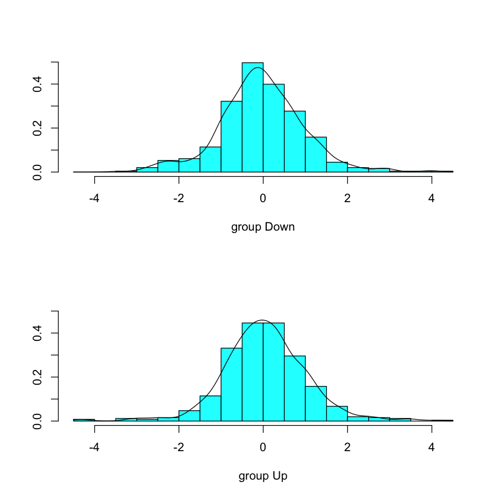
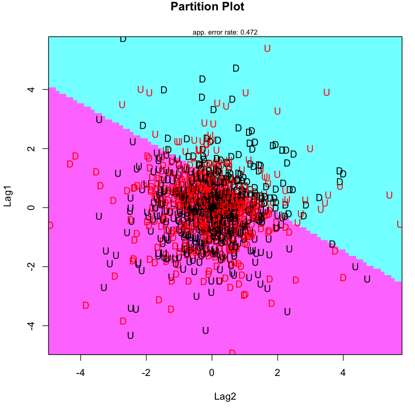
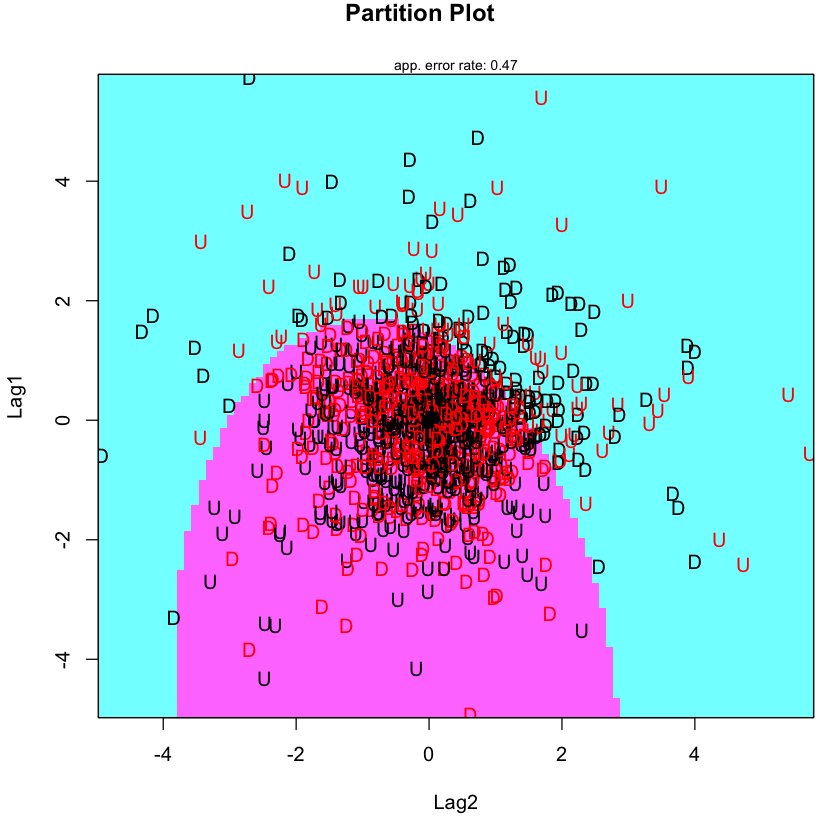
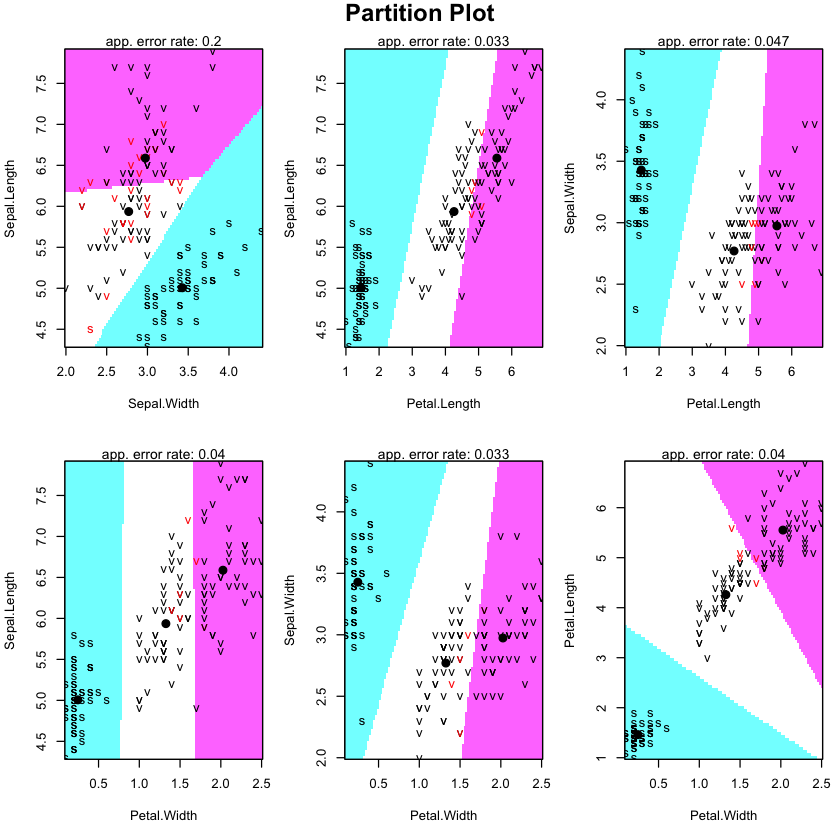
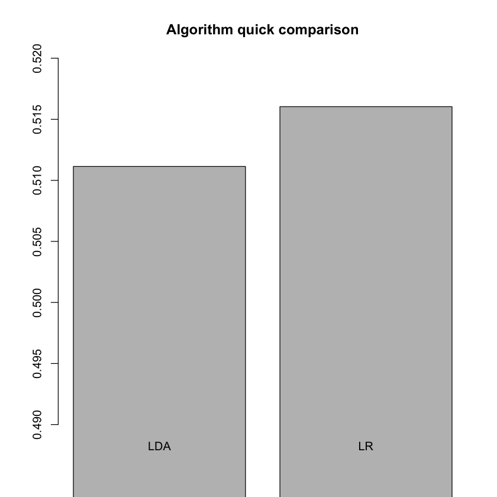
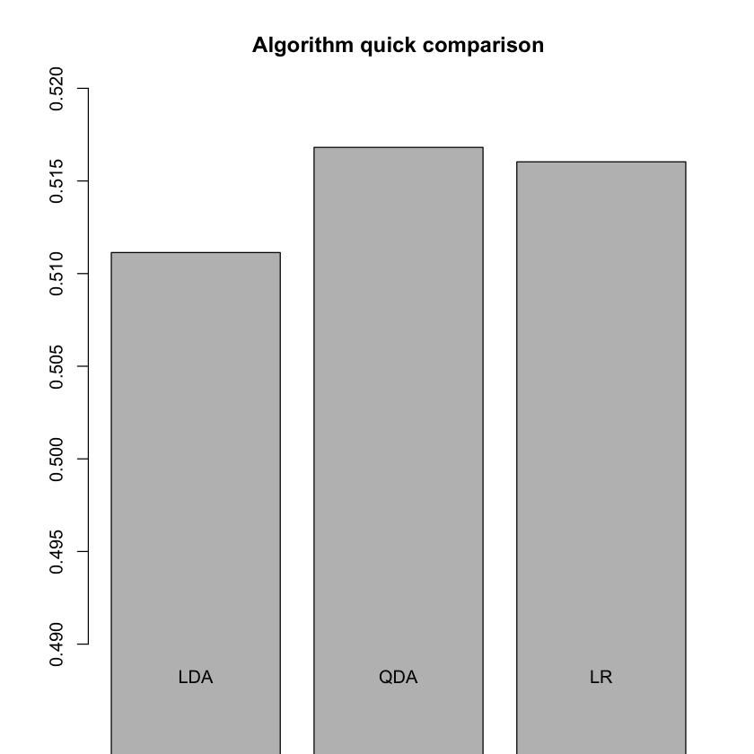

## LDA & QDA
### The Stock Market data
We will use the "The Stock Market dataset” from the book “An Introduction to Statistical Learning, with applications in R”, G. James, D. Witten,  T. Hastie and R. Tibshirani, Springer, 2013. There is a package in R called ISLR with this dataset included.

Daily percentage returns for the S&P 500 stock index between 2001 and 2005 (source: raw values of the S&P 500 were obtained from Yahoo Finance and then converted to percentages and lagged).

The stock market data includes 1250 examples of stock market information, each with 9 features: Year, Lag1, Lag2, Lag3, Lag4, Lag5, Volume, Today and Direction. Direction is the class feature with two possible outcomes: up or down.


```R
library(MASS)
library(ISLR)

# First check LDA assumtions!

# The observations are a random sample: we will assume there are...
# Each predictor variable is normally distributed
shapiro.test(Smarket$Lag1)
shapiro.test(Smarket$Lag2)
```


    
    	Shapiro-Wilk normality test
    
    data:  Smarket$Lag1
    W = 0.97219, p-value = 8.889e-15


    
    	Shapiro-Wilk normality test
    
    data:  Smarket$Lag2
    W = 0.97217, p-value = 8.798e-15


```R
qqnorm(y = Smarket$Lag1)
qqline(y = Smarket$Lag1)
```


```R
# Predictors have a common variance
boxplot(Smarket[,2:3])

var(Smarket$Lag1)
var(Smarket$Lag2)
```


1.29117506222642


1.2911328189265


```R
# Linear Discriminant Analysis
lda.fit <- lda(Direction~Lag1+Lag2,data=Smarket, subset=Year<2005)
lda.fit
```


    Call:
    lda(Direction ~ Lag1 + Lag2, data = Smarket, subset = Year < 
        2005)
    
    Prior probabilities of groups:
        Down       Up 
    0.491984 0.508016 
    
    Group means:
                Lag1        Lag2
    Down  0.04279022  0.03389409
    Up   -0.03954635 -0.03132544
    
    Coefficients of linear discriminants:
                LD1
    Lag1 -0.6420190
    Lag2 -0.5135293


## $D=v_1X_1+v_2X_2+\ldots+v_iX_i+a$


```R
plot(lda.fit, type="both", xlab = "LD1", ylab = "Normalized frequency") # xlab and ylab are overwritten
```





```R
Smarket.2005 <- subset(Smarket,Year==2005)
lda.pred <- predict(lda.fit,Smarket.2005)
class(lda.pred)
lda.pred
```


'list'


<dl>
	<dt>$class</dt>
		<dd><ol class=list-inline>
	<li>Up</li>
	<li>Up</li>
	<li>Up</li>
	<li>Up</li>
	<li>Up</li>
	<li>Up</li>
	<li>Up</li>
	<li>Up</li>
	<li>Up</li>
	<li>Up</li>
	<li>Up</li>
	<li>Down</li>
	<li>Up</li>
	<li>Up</li>
	<li>Up</li>
	<li>Up</li>
	<li>Up</li>
	<li>Down</li>
	<li>Up</li>
	<li>Up</li>
	<li>Down</li>
	<li>Down</li>
	<li>Down</li>
	<li>Up</li>
	<li>Down</li>
	<li>Down</li>
	<li>Up</li>
	<li>Up</li>
	<li>Up</li>
	<li>Down</li>
	<li>Down</li>
	<li>Up</li>
	<li>Up</li>
	<li>Up</li>
	<li>Up</li>
	<li>Up</li>
	<li>Up</li>
	<li>Down</li>
	<li>Down</li>
	<li>Up</li>
	<li>Up</li>
	<li>Up</li>
	<li>Up</li>
	<li>Down</li>
	<li>Down</li>
	<li>Up</li>
	<li>Up</li>
	<li>Up</li>
	<li>Up</li>
	<li>Up</li>
	<li>Up</li>
	<li>Up</li>
	<li>Up</li>
	<li>Up</li>
	<li>Up</li>
	<li>Up</li>
	<li>Up</li>
	<li>Up</li>
	<li>Up</li>
	<li>Up</li>
	<li>Down</li>
	<li>Down</li>
	<li>Up</li>
	<li>Up</li>
	<li>Down</li>
	<li>Down</li>
	<li>Down</li>
	<li>Up</li>
	<li>Up</li>
	<li>Up</li>
	<li>Up</li>
	<li>Up</li>
	<li>Up</li>
	<li>Up</li>
	<li>Down</li>
	<li>Up</li>
	<li>Down</li>
	<li>Down</li>
	<li>Up</li>
	<li>Up</li>
	<li>Up</li>
	<li>Up</li>
	<li>Up</li>
	<li>Down</li>
	<li>Up</li>
	<li>Down</li>
	<li>Down</li>
	<li>Up</li>
	<li>Up</li>
	<li>Up</li>
	<li>Up</li>
	<li>Up</li>
	<li>Up</li>
	<li>Down</li>
	<li>Down</li>
	<li>Down</li>
	<li>Down</li>
	<li>Up</li>
	<li>Up</li>
	<li>Up</li>
	<li>Up</li>
	<li>Up</li>
	<li>Down</li>
	<li>Up</li>
	<li>Up</li>
	<li>Down</li>
	<li>Up</li>
	<li>Up</li>
	<li>Up</li>
	<li>Up</li>
	<li>Up</li>
	<li>Up</li>
	<li>Up</li>
	<li>Up</li>
	<li>Up</li>
	<li>Up</li>
	<li>Down</li>
	<li>Up</li>
	<li>Up</li>
	<li>Up</li>
	<li>Up</li>
	<li>Up</li>
	<li>Up</li>
	<li>Down</li>
	<li>Down</li>
	<li>Up</li>
	<li>Up</li>
	<li>Down</li>
	<li>Up</li>
	<li>Up</li>
	<li>Down</li>
	<li>Down</li>
	<li>Down</li>
	<li>Up</li>
	<li>Up</li>
	<li>Up</li>
	<li>Up</li>
	<li>Up</li>
	<li>Down</li>
	<li>Up</li>
	<li>Up</li>
	<li>Up</li>
	<li>Up</li>
	<li>Down</li>
	<li>Down</li>
	<li>Up</li>
	<li>Up</li>
	<li>Down</li>
	<li>Down</li>
	<li>Up</li>
	<li>Up</li>
	<li>Up</li>
	<li>Up</li>
	<li>Up</li>
	<li>Up</li>
	<li>Up</li>
	<li>Up</li>
	<li>Up</li>
	<li>Up</li>
	<li>Up</li>
	<li>Up</li>
	<li>Up</li>
	<li>Up</li>
	<li>Up</li>
	<li>Up</li>
	<li>Up</li>
	<li>Up</li>
	<li>Up</li>
	<li>Down</li>
	<li>Down</li>
	<li>Up</li>
	<li>Down</li>
	<li>Down</li>
	<li>Up</li>
	<li>Up</li>
	<li>Up</li>
	<li>Up</li>
	<li>Up</li>
	<li>Up</li>
	<li>Down</li>
	<li>Up</li>
	<li>Up</li>
	<li>Up</li>
	<li>Up</li>
	<li>Up</li>
	<li>Up</li>
	<li>Up</li>
	<li>Up</li>
	<li>Down</li>
	<li>Down</li>
	<li>Up</li>
	<li>Up</li>
	<li>Up</li>
	<li>Up</li>
	<li>Up</li>
	<li>Up</li>
	<li>Up</li>
	<li>Up</li>
	<li>Up</li>
	<li>Down</li>
	<li>Down</li>
	<li>Up</li>
	<li>Down</li>
	<li>Up</li>
	<li>Up</li>
	<li>Down</li>
	<li>Down</li>
	<li>Up</li>
	<li>Up</li>
	<li>Down</li>
	<li>Down</li>
	<li>Up</li>
	<li>Down</li>
	<li>Down</li>
	<li>Up</li>
	<li>Up</li>
	<li>Up</li>
	<li>Up</li>
	<li>Down</li>
	<li>Down</li>
	<li>Up</li>
	<li>Up</li>
	<li>Up</li>
	<li>Down</li>
	<li>Down</li>
	<li>Down</li>
	<li>Down</li>
	<li>Down</li>
	<li>Up</li>
	<li>Up</li>
	<li>Up</li>
	<li>Up</li>
	<li>Down</li>
	<li>Down</li>
	<li>Up</li>
	<li>Up</li>
	<li>Up</li>
	<li>Up</li>
	<li>Up</li>
	<li>Up</li>
	<li>Down</li>
	<li>Down</li>
	<li>Up</li>
	<li>Up</li>
	<li>Up</li>
	<li>Up</li>
	<li>Up</li>
	<li>Down</li>
	<li>Up</li>
	<li>Up</li>
	<li>Up</li>
	<li>Up</li>
</ol>

<details>
	<summary style=display:list-item;cursor:pointer>
		<strong>Levels</strong>:
	</summary>
	<ol class=list-inline>
		<li>'Down'</li>
		<li>'Up'</li>
	</ol>
</details></dd>
	<dt>$posterior</dt>
		<dd><table>
<thead><tr><th></th><th scope=col>Down</th><th scope=col>Up</th></tr></thead>
<tbody>
	<tr><th scope=row>999</th><td>0.4901792</td><td>0.5098208</td></tr>
	<tr><th scope=row>1000</th><td>0.4792185</td><td>0.5207815</td></tr>
	<tr><th scope=row>1001</th><td>0.4668185</td><td>0.5331815</td></tr>
	<tr><th scope=row>1002</th><td>0.4740011</td><td>0.5259989</td></tr>
	<tr><th scope=row>1003</th><td>0.4927877</td><td>0.5072123</td></tr>
	<tr><th scope=row>1004</th><td>0.4938562</td><td>0.5061438</td></tr>
	<tr><th scope=row>1005</th><td>0.4951016</td><td>0.5048984</td></tr>
	<tr><th scope=row>1006</th><td>0.4872861</td><td>0.5127139</td></tr>
	<tr><th scope=row>1007</th><td>0.4907013</td><td>0.5092987</td></tr>
	<tr><th scope=row>1008</th><td>0.4844026</td><td>0.5155974</td></tr>
	<tr><th scope=row>1009</th><td>0.4906963</td><td>0.5093037</td></tr>
	<tr><th scope=row>1010</th><td>0.5119988</td><td>0.4880012</td></tr>
	<tr><th scope=row>1011</th><td>0.4895152</td><td>0.5104848</td></tr>
	<tr><th scope=row>1012</th><td>0.4706761</td><td>0.5293239</td></tr>
	<tr><th scope=row>1013</th><td>0.4744593</td><td>0.5255407</td></tr>
	<tr><th scope=row>1014</th><td>0.4799583</td><td>0.5200417</td></tr>
	<tr><th scope=row>1015</th><td>0.4935775</td><td>0.5064225</td></tr>
	<tr><th scope=row>1016</th><td>0.5030894</td><td>0.4969106</td></tr>
	<tr><th scope=row>1017</th><td>0.4978806</td><td>0.5021194</td></tr>
	<tr><th scope=row>1018</th><td>0.4886331</td><td>0.5113669</td></tr>
	<tr><th scope=row>1019</th><td>0.5006568</td><td>0.4993432</td></tr>
	<tr><th scope=row>1020</th><td>0.5108735</td><td>0.4891265</td></tr>
	<tr><th scope=row>1021</th><td>0.5039925</td><td>0.4960075</td></tr>
	<tr><th scope=row>1022</th><td>0.4916335</td><td>0.5083665</td></tr>
	<tr><th scope=row>1023</th><td>0.5041772</td><td>0.4958228</td></tr>
	<tr><th scope=row>1024</th><td>0.5026751</td><td>0.4973249</td></tr>
	<tr><th scope=row>1025</th><td>0.4914043</td><td>0.5085957</td></tr>
	<tr><th scope=row>1026</th><td>0.4805964</td><td>0.5194036</td></tr>
	<tr><th scope=row>1027</th><td>0.4882718</td><td>0.5117282</td></tr>
	<tr><th scope=row>1028</th><td>0.5062187</td><td>0.4937813</td></tr>
	<tr><th scope=row>⋮</th><td>⋮</td><td>⋮</td></tr>
	<tr><th scope=row>1221</th><td>0.4901606</td><td>0.5098394</td></tr>
	<tr><th scope=row>1222</th><td>0.5069730</td><td>0.4930270</td></tr>
	<tr><th scope=row>1223</th><td>0.5084764</td><td>0.4915236</td></tr>
	<tr><th scope=row>1224</th><td>0.5041288</td><td>0.4958712</td></tr>
	<tr><th scope=row>1225</th><td>0.5048299</td><td>0.4951701</td></tr>
	<tr><th scope=row>1226</th><td>0.5023879</td><td>0.4976121</td></tr>
	<tr><th scope=row>1227</th><td>0.4986903</td><td>0.5013097</td></tr>
	<tr><th scope=row>1228</th><td>0.4824758</td><td>0.5175242</td></tr>
	<tr><th scope=row>1229</th><td>0.4825469</td><td>0.5174531</td></tr>
	<tr><th scope=row>1230</th><td>0.4831600</td><td>0.5168400</td></tr>
	<tr><th scope=row>1231</th><td>0.5017497</td><td>0.4982503</td></tr>
	<tr><th scope=row>1232</th><td>0.5058708</td><td>0.4941292</td></tr>
	<tr><th scope=row>1233</th><td>0.4890321</td><td>0.5109679</td></tr>
	<tr><th scope=row>1234</th><td>0.4911052</td><td>0.5088948</td></tr>
	<tr><th scope=row>1235</th><td>0.4864250</td><td>0.5135750</td></tr>
	<tr><th scope=row>1236</th><td>0.4847062</td><td>0.5152938</td></tr>
	<tr><th scope=row>1237</th><td>0.4944890</td><td>0.5055110</td></tr>
	<tr><th scope=row>1238</th><td>0.4962261</td><td>0.5037739</td></tr>
	<tr><th scope=row>1239</th><td>0.5005702</td><td>0.4994298</td></tr>
	<tr><th scope=row>1240</th><td>0.5039068</td><td>0.4960932</td></tr>
	<tr><th scope=row>1241</th><td>0.4946376</td><td>0.5053624</td></tr>
	<tr><th scope=row>1242</th><td>0.4864366</td><td>0.5135634</td></tr>
	<tr><th scope=row>1243</th><td>0.4807022</td><td>0.5192978</td></tr>
	<tr><th scope=row>1244</th><td>0.4851439</td><td>0.5148561</td></tr>
	<tr><th scope=row>1245</th><td>0.4951734</td><td>0.5048266</td></tr>
	<tr><th scope=row>1246</th><td>0.5005893</td><td>0.4994107</td></tr>
	<tr><th scope=row>1247</th><td>0.4972210</td><td>0.5027790</td></tr>
	<tr><th scope=row>1248</th><td>0.4791988</td><td>0.5208012</td></tr>
	<tr><th scope=row>1249</th><td>0.4831673</td><td>0.5168327</td></tr>
	<tr><th scope=row>1250</th><td>0.4892591</td><td>0.5107409</td></tr>
</tbody>
</table>
</dd>
	<dt>$x</dt>
		<dd><table>
<thead><tr><th></th><th scope=col>LD1</th></tr></thead>
<tbody>
	<tr><th scope=row>999</th><td> 0.08293096</td></tr>
	<tr><th scope=row>1000</th><td> 0.59114102</td></tr>
	<tr><th scope=row>1001</th><td> 1.16723063</td></tr>
	<tr><th scope=row>1002</th><td> 0.83335022</td></tr>
	<tr><th scope=row>1003</th><td>-0.03792892</td></tr>
	<tr><th scope=row>1004</th><td>-0.08743142</td></tr>
	<tr><th scope=row>1005</th><td>-0.14512719</td></tr>
	<tr><th scope=row>1006</th><td> 0.21701324</td></tr>
	<tr><th scope=row>1007</th><td> 0.05873792</td></tr>
	<tr><th scope=row>1008</th><td> 0.35068642</td></tr>
	<tr><th scope=row>1009</th><td> 0.05897298</td></tr>
	<tr><th scope=row>1010</th><td>-0.92794134</td></tr>
	<tr><th scope=row>1011</th><td> 0.11370190</td></tr>
	<tr><th scope=row>1012</th><td> 0.98783874</td></tr>
	<tr><th scope=row>1013</th><td> 0.81206862</td></tr>
	<tr><th scope=row>1014</th><td> 0.55681363</td></tr>
	<tr><th scope=row>1015</th><td>-0.07452314</td></tr>
	<tr><th scope=row>1016</th><td>-0.51514029</td></tr>
	<tr><th scope=row>1017</th><td>-0.27386231</td></tr>
	<tr><th scope=row>1018</th><td> 0.15458312</td></tr>
	<tr><th scope=row>1019</th><td>-0.40245951</td></tr>
	<tr><th scope=row>1020</th><td>-0.87578825</td></tr>
	<tr><th scope=row>1021</th><td>-0.55697509</td></tr>
	<tr><th scope=row>1022</th><td> 0.01554560</td></tr>
	<tr><th scope=row>1023</th><td>-0.56553277</td></tr>
	<tr><th scope=row>1024</th><td>-0.49594761</td></tr>
	<tr><th scope=row>1025</th><td> 0.02616642</td></tr>
	<tr><th scope=row>1026</th><td> 0.52721157</td></tr>
	<tr><th scope=row>1027</th><td> 0.17132674</td></tr>
	<tr><th scope=row>1028</th><td>-0.66010638</td></tr>
	<tr><th scope=row>⋮</th><td>⋮</td></tr>
	<tr><th scope=row>1221</th><td> 0.08379600</td></tr>
	<tr><th scope=row>1222</th><td>-0.69505302</td></tr>
	<tr><th scope=row>1223</th><td>-0.76471079</td></tr>
	<tr><th scope=row>1224</th><td>-0.56328828</td></tr>
	<tr><th scope=row>1225</th><td>-0.59576696</td></tr>
	<tr><th scope=row>1226</th><td>-0.48264484</td></tr>
	<tr><th scope=row>1227</th><td>-0.31136800</td></tr>
	<tr><th scope=row>1228</th><td> 0.44003922</td></tr>
	<tr><th scope=row>1229</th><td> 0.43673801</td></tr>
	<tr><th scope=row>1230</th><td> 0.40830569</td></tr>
	<tr><th scope=row>1231</th><td>-0.45308190</td></tr>
	<tr><th scope=row>1232</th><td>-0.64398757</td></tr>
	<tr><th scope=row>1233</th><td> 0.13609219</td></tr>
	<tr><th scope=row>1234</th><td> 0.04002311</td></tr>
	<tr><th scope=row>1235</th><td> 0.25692843</td></tr>
	<tr><th scope=row>1236</th><td> 0.33661313</td></tr>
	<tr><th scope=row>1237</th><td>-0.11674814</td></tr>
	<tr><th scope=row>1238</th><td>-0.19722269</td></tr>
	<tr><th scope=row>1239</th><td>-0.39844839</td></tr>
	<tr><th scope=row>1240</th><td>-0.55300609</td></tr>
	<tr><th scope=row>1241</th><td>-0.12363544</td></tr>
	<tr><th scope=row>1242</th><td> 0.25639169</td></tr>
	<tr><th scope=row>1243</th><td> 0.52230360</td></tr>
	<tr><th scope=row>1244</th><td> 0.31631819</td></tr>
	<tr><th scope=row>1245</th><td>-0.14845546</td></tr>
	<tr><th scope=row>1246</th><td>-0.39933278</td></tr>
	<tr><th scope=row>1247</th><td>-0.24330754</td></tr>
	<tr><th scope=row>1248</th><td> 0.59205506</td></tr>
	<tr><th scope=row>1249</th><td> 0.40796662</td></tr>
	<tr><th scope=row>1250</th><td> 0.12557151</td></tr>
</tbody>
</table>
</dd>
</dl>


```R
data.frame(lda.pred)
```


<table>
<thead><tr><th></th><th scope=col>class</th><th scope=col>posterior.Down</th><th scope=col>posterior.Up</th><th scope=col>LD1</th></tr></thead>
<tbody>
	<tr><th scope=row>999</th><td>Up         </td><td>0.4901792  </td><td>0.5098208  </td><td> 0.08293096</td></tr>
	<tr><th scope=row>1000</th><td>Up         </td><td>0.4792185  </td><td>0.5207815  </td><td> 0.59114102</td></tr>
	<tr><th scope=row>1001</th><td>Up         </td><td>0.4668185  </td><td>0.5331815  </td><td> 1.16723063</td></tr>
	<tr><th scope=row>1002</th><td>Up         </td><td>0.4740011  </td><td>0.5259989  </td><td> 0.83335022</td></tr>
	<tr><th scope=row>1003</th><td>Up         </td><td>0.4927877  </td><td>0.5072123  </td><td>-0.03792892</td></tr>
	<tr><th scope=row>1004</th><td>Up         </td><td>0.4938562  </td><td>0.5061438  </td><td>-0.08743142</td></tr>
	<tr><th scope=row>1005</th><td>Up         </td><td>0.4951016  </td><td>0.5048984  </td><td>-0.14512719</td></tr>
	<tr><th scope=row>1006</th><td>Up         </td><td>0.4872861  </td><td>0.5127139  </td><td> 0.21701324</td></tr>
	<tr><th scope=row>1007</th><td>Up         </td><td>0.4907013  </td><td>0.5092987  </td><td> 0.05873792</td></tr>
	<tr><th scope=row>1008</th><td>Up         </td><td>0.4844026  </td><td>0.5155974  </td><td> 0.35068642</td></tr>
	<tr><th scope=row>1009</th><td>Up         </td><td>0.4906963  </td><td>0.5093037  </td><td> 0.05897298</td></tr>
	<tr><th scope=row>1010</th><td>Down       </td><td>0.5119988  </td><td>0.4880012  </td><td>-0.92794134</td></tr>
	<tr><th scope=row>1011</th><td>Up         </td><td>0.4895152  </td><td>0.5104848  </td><td> 0.11370190</td></tr>
	<tr><th scope=row>1012</th><td>Up         </td><td>0.4706761  </td><td>0.5293239  </td><td> 0.98783874</td></tr>
	<tr><th scope=row>1013</th><td>Up         </td><td>0.4744593  </td><td>0.5255407  </td><td> 0.81206862</td></tr>
	<tr><th scope=row>1014</th><td>Up         </td><td>0.4799583  </td><td>0.5200417  </td><td> 0.55681363</td></tr>
	<tr><th scope=row>1015</th><td>Up         </td><td>0.4935775  </td><td>0.5064225  </td><td>-0.07452314</td></tr>
	<tr><th scope=row>1016</th><td>Down       </td><td>0.5030894  </td><td>0.4969106  </td><td>-0.51514029</td></tr>
	<tr><th scope=row>1017</th><td>Up         </td><td>0.4978806  </td><td>0.5021194  </td><td>-0.27386231</td></tr>
	<tr><th scope=row>1018</th><td>Up         </td><td>0.4886331  </td><td>0.5113669  </td><td> 0.15458312</td></tr>
	<tr><th scope=row>1019</th><td>Down       </td><td>0.5006568  </td><td>0.4993432  </td><td>-0.40245951</td></tr>
	<tr><th scope=row>1020</th><td>Down       </td><td>0.5108735  </td><td>0.4891265  </td><td>-0.87578825</td></tr>
	<tr><th scope=row>1021</th><td>Down       </td><td>0.5039925  </td><td>0.4960075  </td><td>-0.55697509</td></tr>
	<tr><th scope=row>1022</th><td>Up         </td><td>0.4916335  </td><td>0.5083665  </td><td> 0.01554560</td></tr>
	<tr><th scope=row>1023</th><td>Down       </td><td>0.5041772  </td><td>0.4958228  </td><td>-0.56553277</td></tr>
	<tr><th scope=row>1024</th><td>Down       </td><td>0.5026751  </td><td>0.4973249  </td><td>-0.49594761</td></tr>
	<tr><th scope=row>1025</th><td>Up         </td><td>0.4914043  </td><td>0.5085957  </td><td> 0.02616642</td></tr>
	<tr><th scope=row>1026</th><td>Up         </td><td>0.4805964  </td><td>0.5194036  </td><td> 0.52721157</td></tr>
	<tr><th scope=row>1027</th><td>Up         </td><td>0.4882718  </td><td>0.5117282  </td><td> 0.17132674</td></tr>
	<tr><th scope=row>1028</th><td>Down       </td><td>0.5062187  </td><td>0.4937813  </td><td>-0.66010638</td></tr>
	<tr><th scope=row>⋮</th><td>⋮</td><td>⋮</td><td>⋮</td><td>⋮</td></tr>
	<tr><th scope=row>1221</th><td>Up         </td><td>0.4901606  </td><td>0.5098394  </td><td> 0.08379600</td></tr>
	<tr><th scope=row>1222</th><td>Down       </td><td>0.5069730  </td><td>0.4930270  </td><td>-0.69505302</td></tr>
	<tr><th scope=row>1223</th><td>Down       </td><td>0.5084764  </td><td>0.4915236  </td><td>-0.76471079</td></tr>
	<tr><th scope=row>1224</th><td>Down       </td><td>0.5041288  </td><td>0.4958712  </td><td>-0.56328828</td></tr>
	<tr><th scope=row>1225</th><td>Down       </td><td>0.5048299  </td><td>0.4951701  </td><td>-0.59576696</td></tr>
	<tr><th scope=row>1226</th><td>Down       </td><td>0.5023879  </td><td>0.4976121  </td><td>-0.48264484</td></tr>
	<tr><th scope=row>1227</th><td>Up         </td><td>0.4986903  </td><td>0.5013097  </td><td>-0.31136800</td></tr>
	<tr><th scope=row>1228</th><td>Up         </td><td>0.4824758  </td><td>0.5175242  </td><td> 0.44003922</td></tr>
	<tr><th scope=row>1229</th><td>Up         </td><td>0.4825469  </td><td>0.5174531  </td><td> 0.43673801</td></tr>
	<tr><th scope=row>1230</th><td>Up         </td><td>0.4831600  </td><td>0.5168400  </td><td> 0.40830569</td></tr>
	<tr><th scope=row>1231</th><td>Down       </td><td>0.5017497  </td><td>0.4982503  </td><td>-0.45308190</td></tr>
	<tr><th scope=row>1232</th><td>Down       </td><td>0.5058708  </td><td>0.4941292  </td><td>-0.64398757</td></tr>
	<tr><th scope=row>1233</th><td>Up         </td><td>0.4890321  </td><td>0.5109679  </td><td> 0.13609219</td></tr>
	<tr><th scope=row>1234</th><td>Up         </td><td>0.4911052  </td><td>0.5088948  </td><td> 0.04002311</td></tr>
	<tr><th scope=row>1235</th><td>Up         </td><td>0.4864250  </td><td>0.5135750  </td><td> 0.25692843</td></tr>
	<tr><th scope=row>1236</th><td>Up         </td><td>0.4847062  </td><td>0.5152938  </td><td> 0.33661313</td></tr>
	<tr><th scope=row>1237</th><td>Up         </td><td>0.4944890  </td><td>0.5055110  </td><td>-0.11674814</td></tr>
	<tr><th scope=row>1238</th><td>Up         </td><td>0.4962261  </td><td>0.5037739  </td><td>-0.19722269</td></tr>
	<tr><th scope=row>1239</th><td>Down       </td><td>0.5005702  </td><td>0.4994298  </td><td>-0.39844839</td></tr>
	<tr><th scope=row>1240</th><td>Down       </td><td>0.5039068  </td><td>0.4960932  </td><td>-0.55300609</td></tr>
	<tr><th scope=row>1241</th><td>Up         </td><td>0.4946376  </td><td>0.5053624  </td><td>-0.12363544</td></tr>
	<tr><th scope=row>1242</th><td>Up         </td><td>0.4864366  </td><td>0.5135634  </td><td> 0.25639169</td></tr>
	<tr><th scope=row>1243</th><td>Up         </td><td>0.4807022  </td><td>0.5192978  </td><td> 0.52230360</td></tr>
	<tr><th scope=row>1244</th><td>Up         </td><td>0.4851439  </td><td>0.5148561  </td><td> 0.31631819</td></tr>
	<tr><th scope=row>1245</th><td>Up         </td><td>0.4951734  </td><td>0.5048266  </td><td>-0.14845546</td></tr>
	<tr><th scope=row>1246</th><td>Down       </td><td>0.5005893  </td><td>0.4994107  </td><td>-0.39933278</td></tr>
	<tr><th scope=row>1247</th><td>Up         </td><td>0.4972210  </td><td>0.5027790  </td><td>-0.24330754</td></tr>
	<tr><th scope=row>1248</th><td>Up         </td><td>0.4791988  </td><td>0.5208012  </td><td> 0.59205506</td></tr>
	<tr><th scope=row>1249</th><td>Up         </td><td>0.4831673  </td><td>0.5168327  </td><td> 0.40796662</td></tr>
	<tr><th scope=row>1250</th><td>Up         </td><td>0.4892591  </td><td>0.5107409  </td><td> 0.12557151</td></tr>
</tbody>
</table>


```R
table(lda.pred$class,Smarket.2005$Direction)
mean(lda.pred$class==Smarket.2005$Direction)
```


          
           Down  Up
      Down   35  35
      Up     76 106


0.55952380952381


```R
library(klaR)
partimat(Direction~Lag1+Lag2, data=Smarket, method="lda")
```

    Warning message:
    “package ‘klaR’ was built under R version 3.4.4”





### QDA


```R
# Check same variance but this time for each class
var(Smarket[Smarket$Direction == "Up",]$Lag1)
var(Smarket[Smarket$Direction == "Up",]$Lag2)
var(Smarket[Smarket$Direction == "Down",]$Lag1)
var(Smarket[Smarket$Direction == "Down",]$Lag2)
```


1.27913706688038


1.24717074806801


1.30204143704291


1.33905195969342


```R
# QDA
qda.fit <- qda(Direction~Lag1+Lag2, data=Smarket, subset=Year<2005)
qda.fit
```


    Call:
    qda(Direction ~ Lag1 + Lag2, data = Smarket, subset = Year < 
        2005)
    
    Prior probabilities of groups:
        Down       Up 
    0.491984 0.508016 
    
    Group means:
                Lag1        Lag2
    Down  0.04279022  0.03389409
    Up   -0.03954635 -0.03132544


```R
qda.pred <- predict(qda.fit,Smarket.2005)
class(qda.pred)
data.frame(qda.pred)
```


'list'


<table>
<thead><tr><th></th><th scope=col>class</th><th scope=col>posterior.Down</th><th scope=col>posterior.Up</th></tr></thead>
<tbody>
	<tr><th scope=row>999</th><td>Up       </td><td>0.4873243</td><td>0.5126757</td></tr>
	<tr><th scope=row>1000</th><td>Up       </td><td>0.4759011</td><td>0.5240989</td></tr>
	<tr><th scope=row>1001</th><td>Up       </td><td>0.4636911</td><td>0.5363089</td></tr>
	<tr><th scope=row>1002</th><td>Up       </td><td>0.4739253</td><td>0.5260747</td></tr>
	<tr><th scope=row>1003</th><td>Up       </td><td>0.4903426</td><td>0.5096574</td></tr>
	<tr><th scope=row>1004</th><td>Up       </td><td>0.4913561</td><td>0.5086439</td></tr>
	<tr><th scope=row>1005</th><td>Up       </td><td>0.4922951</td><td>0.5077049</td></tr>
	<tr><th scope=row>1006</th><td>Up       </td><td>0.4847447</td><td>0.5152553</td></tr>
	<tr><th scope=row>1007</th><td>Up       </td><td>0.4889595</td><td>0.5110405</td></tr>
	<tr><th scope=row>1008</th><td>Up       </td><td>0.4818971</td><td>0.5181029</td></tr>
	<tr><th scope=row>1009</th><td>Up       </td><td>0.4900684</td><td>0.5099316</td></tr>
	<tr><th scope=row>1010</th><td>Down     </td><td>0.5088085</td><td>0.4911915</td></tr>
	<tr><th scope=row>1011</th><td>Up       </td><td>0.4894810</td><td>0.5105190</td></tr>
	<tr><th scope=row>1012</th><td>Up       </td><td>0.4688268</td><td>0.5311732</td></tr>
	<tr><th scope=row>1013</th><td>Up       </td><td>0.4722794</td><td>0.5277206</td></tr>
	<tr><th scope=row>1014</th><td>Up       </td><td>0.4777870</td><td>0.5222130</td></tr>
	<tr><th scope=row>1015</th><td>Up       </td><td>0.4911091</td><td>0.5088909</td></tr>
	<tr><th scope=row>1016</th><td>Down     </td><td>0.5002717</td><td>0.4997283</td></tr>
	<tr><th scope=row>1017</th><td>Up       </td><td>0.4955825</td><td>0.5044175</td></tr>
	<tr><th scope=row>1018</th><td>Up       </td><td>0.4857602</td><td>0.5142398</td></tr>
	<tr><th scope=row>1019</th><td>Up       </td><td>0.4978382</td><td>0.5021618</td></tr>
	<tr><th scope=row>1020</th><td>Down     </td><td>0.5088226</td><td>0.4911774</td></tr>
	<tr><th scope=row>1021</th><td>Down     </td><td>0.5019936</td><td>0.4980064</td></tr>
	<tr><th scope=row>1022</th><td>Up       </td><td>0.4890898</td><td>0.5109102</td></tr>
	<tr><th scope=row>1023</th><td>Down     </td><td>0.5011552</td><td>0.4988448</td></tr>
	<tr><th scope=row>1024</th><td>Down     </td><td>0.5029427</td><td>0.4970573</td></tr>
	<tr><th scope=row>1025</th><td>Up       </td><td>0.4885935</td><td>0.5114065</td></tr>
	<tr><th scope=row>1026</th><td>Up       </td><td>0.4773670</td><td>0.5226330</td></tr>
	<tr><th scope=row>1027</th><td>Up       </td><td>0.4875491</td><td>0.5124509</td></tr>
	<tr><th scope=row>1028</th><td>Down     </td><td>0.5031841</td><td>0.4968159</td></tr>
	<tr><th scope=row>⋮</th><td>⋮</td><td>⋮</td><td>⋮</td></tr>
	<tr><th scope=row>1221</th><td>Up       </td><td>0.4877420</td><td>0.5122580</td></tr>
	<tr><th scope=row>1222</th><td>Down     </td><td>0.5034870</td><td>0.4965130</td></tr>
	<tr><th scope=row>1223</th><td>Down     </td><td>0.5072026</td><td>0.4927974</td></tr>
	<tr><th scope=row>1224</th><td>Down     </td><td>0.5013232</td><td>0.4986768</td></tr>
	<tr><th scope=row>1225</th><td>Down     </td><td>0.5022002</td><td>0.4977998</td></tr>
	<tr><th scope=row>1226</th><td>Up       </td><td>0.4998972</td><td>0.5001028</td></tr>
	<tr><th scope=row>1227</th><td>Up       </td><td>0.4960284</td><td>0.5039716</td></tr>
	<tr><th scope=row>1228</th><td>Up       </td><td>0.4795114</td><td>0.5204886</td></tr>
	<tr><th scope=row>1229</th><td>Up       </td><td>0.4814821</td><td>0.5185179</td></tr>
	<tr><th scope=row>1230</th><td>Up       </td><td>0.4800757</td><td>0.5199243</td></tr>
	<tr><th scope=row>1231</th><td>Up       </td><td>0.4999209</td><td>0.5000791</td></tr>
	<tr><th scope=row>1232</th><td>Down     </td><td>0.5065969</td><td>0.4934031</td></tr>
	<tr><th scope=row>1233</th><td>Up       </td><td>0.4861643</td><td>0.5138357</td></tr>
	<tr><th scope=row>1234</th><td>Up       </td><td>0.4884233</td><td>0.5115767</td></tr>
	<tr><th scope=row>1235</th><td>Up       </td><td>0.4835435</td><td>0.5164565</td></tr>
	<tr><th scope=row>1236</th><td>Up       </td><td>0.4823991</td><td>0.5176009</td></tr>
	<tr><th scope=row>1237</th><td>Up       </td><td>0.4916742</td><td>0.5083258</td></tr>
	<tr><th scope=row>1238</th><td>Up       </td><td>0.4935411</td><td>0.5064589</td></tr>
	<tr><th scope=row>1239</th><td>Up       </td><td>0.4975061</td><td>0.5024939</td></tr>
	<tr><th scope=row>1240</th><td>Down     </td><td>0.5014406</td><td>0.4985594</td></tr>
	<tr><th scope=row>1241</th><td>Up       </td><td>0.4922761</td><td>0.5077239</td></tr>
	<tr><th scope=row>1242</th><td>Up       </td><td>0.4835458</td><td>0.5164542</td></tr>
	<tr><th scope=row>1243</th><td>Up       </td><td>0.4776625</td><td>0.5223375</td></tr>
	<tr><th scope=row>1244</th><td>Up       </td><td>0.4831210</td><td>0.5168790</td></tr>
	<tr><th scope=row>1245</th><td>Up       </td><td>0.4922994</td><td>0.5077006</td></tr>
	<tr><th scope=row>1246</th><td>Up       </td><td>0.4976701</td><td>0.5023299</td></tr>
	<tr><th scope=row>1247</th><td>Up       </td><td>0.4947874</td><td>0.5052126</td></tr>
	<tr><th scope=row>1248</th><td>Up       </td><td>0.4758642</td><td>0.5241358</td></tr>
	<tr><th scope=row>1249</th><td>Up       </td><td>0.4826950</td><td>0.5173050</td></tr>
	<tr><th scope=row>1250</th><td>Up       </td><td>0.4864459</td><td>0.5135541</td></tr>
</tbody>
</table>


```R
table(qda.pred$class,Smarket.2005$Direction)
mean(qda.pred$class==Smarket.2005$Direction)
```


          
           Down  Up
      Down   30  20
      Up     81 121


0.599206349206349


```R
partimat(Direction~Lag1+Lag2, data=Smarket ,method="qda")
```





## Iris Data
When there are more than two groups we can estimate more than one discriminant function:
## $D_1=v_1X_1+v_2X_2+\ldots+v_iX_i+a$
## $D_2=w_1X_1+w_2X_2+\ldots+w_iX_i+b$
For example, when there are three groups, we could estimate (1) a function for discriminating between group 1 and groups 2 and 3 combined, and (2) another function for discriminating between group 2 and group 3.
### LDA


```R
data(iris)
iris.lda <- lda(Species ~ Sepal.Length + Sepal.Width + Petal.Length + Petal.Width,  data = iris)
iris.lda
```


    Call:
    lda(Species ~ Sepal.Length + Sepal.Width + Petal.Length + Petal.Width, 
        data = iris)
    
    Prior probabilities of groups:
        setosa versicolor  virginica 
     0.3333333  0.3333333  0.3333333 
    
    Group means:
               Sepal.Length Sepal.Width Petal.Length Petal.Width
    setosa            5.006       3.428        1.462       0.246
    versicolor        5.936       2.770        4.260       1.326
    virginica         6.588       2.974        5.552       2.026
    
    Coefficients of linear discriminants:
                        LD1         LD2
    Sepal.Length  0.8293776  0.02410215
    Sepal.Width   1.5344731  2.16452123
    Petal.Length -2.2012117 -0.93192121
    Petal.Width  -2.8104603  2.83918785
    
    Proportion of trace:
       LD1    LD2 
    0.9912 0.0088 


```R
partimat(Species ~ Sepal.Length + Sepal.Width + Petal.Length + Petal.Width, data=iris, method="lda")
```





### Using caret...


```R
TrainData <- iris[,1:4]
TrainClasses <- iris[,5]
library(caret)
ldaFit <- train(TrainData, TrainClasses,
                method = "lda",
                preProcess = c("center", "scale"),
                tuneLength = 10,
                trControl = trainControl(method = "cv"))
ldaFit
confusionMatrix(ldaFit)
```

    Loading required package: lattice
    Loading required package: ggplot2
    Warning message:
    “package ‘ggplot2’ was built under R version 3.4.4”


    Linear Discriminant Analysis 
    
    150 samples
      4 predictor
      3 classes: 'setosa', 'versicolor', 'virginica' 
    
    Pre-processing: centered (4), scaled (4) 
    Resampling: Cross-Validated (10 fold) 
    Summary of sample sizes: 135, 135, 135, 135, 135, 135, ... 
    Resampling results:
    
      Accuracy  Kappa
      0.98      0.97 


    Cross-Validated (10 fold) Confusion Matrix 
    
    (entries are percentual average cell counts across resamples)
     
                Reference
    Prediction   setosa versicolor virginica
      setosa       33.3        0.0       0.0
      versicolor    0.0       32.0       0.7
      virginica     0.0        1.3      32.7
                              
     Accuracy (average) : 0.98


```R
qdaFit <- train(TrainData, TrainClasses,
                method = "qda",
                preProcess = c("center", "scale"),
                tuneLength = 10,
                trControl = trainControl(method = "cv"))
qdaFit
confusionMatrix(qdaFit)
```


    Quadratic Discriminant Analysis 
    
    150 samples
      4 predictor
      3 classes: 'setosa', 'versicolor', 'virginica' 
    
    Pre-processing: centered (4), scaled (4) 
    Resampling: Cross-Validated (10 fold) 
    Summary of sample sizes: 135, 135, 135, 135, 135, 135, ... 
    Resampling results:
    
      Accuracy   Kappa
      0.9733333  0.96 


    Cross-Validated (10 fold) Confusion Matrix 
    
    (entries are percentual average cell counts across resamples)
     
                Reference
    Prediction   setosa versicolor virginica
      setosa       33.3        0.0       0.0
      versicolor    0.0       31.3       0.7
      virginica     0.0        2.0      32.7
                                
     Accuracy (average) : 0.9733


## Exercise 1
* Try lda with all Lag variables.


```R
library(caret)
library(ISLR)

var(Smarket$Lag1)
var(Smarket$Lag2)
var(Smarket$Lag3)
var(Smarket$Lag4)
var(Smarket$Lag5)

# function to set up random seeds
setSeeds <- function(method = "cv", numbers = 1, repeats = 1, tunes = NULL, seed = 1237) {
  #B is the number of resamples and integer vector of M (numbers + tune length if any)
  B <- if (method == "cv") numbers
  else if(method == "repeatedcv") numbers * repeats
  else NULL
  
  if(is.null(length)) {
    seeds <- NULL
  } else {
    set.seed(seed = seed)
    seeds <- vector(mode = "list", length = B)
    seeds <- lapply(seeds, function(x) sample.int(n = 1000000, size = numbers + ifelse(is.null(tunes), 0, tunes)))
    seeds[[length(seeds) + 1]] <- sample.int(n = 1000000, size = 1)
  }
  # return seeds
  seeds
}

mySeeds <- setSeeds(numbers = 10, seed = 2468)
                
ldaFit <- train(Smarket[,2:6], Smarket[,9],
                method = "lda",
                preProcess = c("center", "scale"),
                tuneLength = 10,
                trControl = trainControl(method = "cv", seeds = mySeeds))
ldaFit
confusionMatrix(ldaFit)

```


1.29117506222642


1.2911328189265


1.29664442448359


1.29680562160128


1.31687148397502


    Linear Discriminant Analysis 
    
    1250 samples
       5 predictor
       2 classes: 'Down', 'Up' 
    
    Pre-processing: centered (5), scaled (5) 
    Resampling: Cross-Validated (10 fold) 
    Summary of sample sizes: 1125, 1125, 1125, 1125, 1125, 1125, ... 
    Resampling results:
    
      Accuracy   Kappa       
      0.5111362  -0.001066492


    Cross-Validated (10 fold) Confusion Matrix 
    
    (entries are percentual average cell counts across resamples)
     
              Reference
    Prediction Down   Up
          Down  8.6  9.4
          Up   39.5 42.5
                                
     Accuracy (average) : 0.5112


```R
glmFit <- train(Smarket[,2:6], y = Smarket[,9], 
                method = "glm", 
                preProcess = c("center", "scale"),
                tuneLength = 10, 
                control = glm.control(maxit=500),
                trControl = trainControl(method = "cv", seeds = mySeeds))
glmFit
confusionMatrix(glmFit)
```


    Generalized Linear Model 
    
    1250 samples
       5 predictor
       2 classes: 'Down', 'Up' 
    
    Pre-processing: centered (5), scaled (5) 
    Resampling: Cross-Validated (10 fold) 
    Summary of sample sizes: 1125, 1124, 1126, 1124, 1125, 1125, ... 
    Resampling results:
    
      Accuracy   Kappa     
      0.5160326  0.00837743


    Cross-Validated (10 fold) Confusion Matrix 
    
    (entries are percentual average cell counts across resamples)
     
              Reference
    Prediction Down   Up
          Down  8.6  8.9
          Up   39.5 43.0
                               
     Accuracy (average) : 0.516


* Make a quick comparison between logistic regression and lda.


```R
qdaFit <- train(Smarket[,2:6], y = Smarket[,9], 
                method = "glm", 
                preProcess = c("center", "scale"),
                tuneLength = 10, 
                control = glm.control(maxit=500),
                trControl = trainControl(method = "cv", seeds = mySeeds))
glmFit
confusionMatrix(glmFit)

barplot(c(ldaFit$results$Accuracy, glmFit$results$Accuracy), 
        main="Algorithm quick comparison", 
        names.arg=c("LDA", "LR"), ylim=c(0.49,0.52))
```


    Generalized Linear Model 
    
    1250 samples
       5 predictor
       2 classes: 'Down', 'Up' 
    
    Pre-processing: centered (5), scaled (5) 
    Resampling: Cross-Validated (10 fold) 
    Summary of sample sizes: 1125, 1124, 1126, 1124, 1125, 1125, ... 
    Resampling results:
    
      Accuracy   Kappa     
      0.5160326  0.00837743


    Cross-Validated (10 fold) Confusion Matrix 
    
    (entries are percentual average cell counts across resamples)
     
              Reference
    Prediction Down   Up
          Down  8.6  8.9
          Up   39.5 43.0
                               
     Accuracy (average) : 0.516





* Try with qda and compare all three methods. Plot the results.


```R
qdaFit <- train(Smarket[,2:6], Smarket[,9],
                method = "qda",
                preProcess = c("center", "scale"),
                tuneLength = 10,
                trControl = trainControl(method = "cv", seeds = mySeeds))
qdaFit

barplot(c(ldaFit$results$Accuracy, qdaFit$results$Accuracy, glmFit$results$Accuracy), 
        main="Algorithm quick comparison", 
        names.arg=c("LDA", "QDA", "LR"), ylim=c(0.49,0.52))
```


    Quadratic Discriminant Analysis 
    
    1250 samples
       5 predictor
       2 classes: 'Down', 'Up' 
    
    Pre-processing: centered (5), scaled (5) 
    Resampling: Cross-Validated (10 fold) 
    Summary of sample sizes: 1125, 1124, 1126, 1124, 1125, 1125, ... 
    Resampling results:
    
      Accuracy   Kappa     
      0.5168131  0.01713287





## Exercise 2
Using only the information in file clasif_train_alumnos.csv:
* Compare lda and qda using Wilcoxon.


```R
resultados<-read.csv("Datos/clasif_test_alumos.csv")
tablatst<-cbind(resultados[,2:dim(resultados)[2]])
colnames(tablatst) <-names(resultados)[2:dim(resultados)[2]]
rownames(tablatst) <-resultados[,1]

resultados<-read.csv("Datos/clasif_train_alumnos.csv")
tablatra<-cbind(resultados[,2:dim(resultados)[2]])
colnames(tablatra) <-names(resultados)[2:dim(resultados)[2]]
rownames(tablatra) <-resultados[,1]

difs<-(tablatst[,3] -tablatst[,2]) / tablatst[,3]
wilc_2_3 <-cbind(ifelse(difs<0, abs(difs)+0.1, 0+0.1), ifelse(difs>0, abs(difs)+0.1, 0+0.1))
colnames(wilc_2_3) <-c(colnames(tablatst)[2], colnames(tablatst)[3])
head(wilc_2_3)

LMvsKNNtst<-wilcox.test(wilc_2_3[,1], wilc_2_3[,2], alternative = "two.sided", paired=TRUE)
Rmas<-LMvsKNNtst$statistic
pvalue<-LMvsKNNtst$p.value
LMvsKNNtst<-wilcox.test(wilc_2_3[,2], wilc_2_3[,1], alternative = "two.sided", paired=TRUE)
Rmenos<-LMvsKNNtst$statistic
Rmas
Rmenos
pvalue
```


<table>
<thead><tr><th scope=col>out_test_lda</th><th scope=col>out_test_qda</th></tr></thead>
<tbody>
	<tr><td>0.1717489</td><td>0.1000000</td></tr>
	<tr><td>0.1685921</td><td>0.1000000</td></tr>
	<tr><td>0.1000000</td><td>0.1593161</td></tr>
	<tr><td>0.2412213</td><td>0.1000000</td></tr>
	<tr><td>0.1000000</td><td>0.1157624</td></tr>
	<tr><td>0.1000000</td><td>0.1041506</td></tr>
</tbody>
</table>


<strong>V:</strong> 99


<strong>V:</strong> 111


0.840822219848633


**No existen diferencias significativas entre ambos.**
* Perform a multiple comparison using Friedman.


```R
test_friedman<-friedman.test(as.matrix(tablatst))
test_friedman
```


    
    	Friedman rank sum test
    
    data:  as.matrix(tablatst)
    Friedman chi-squared = 0.7, df = 2, p-value = 0.7047


**No existen diferencias significativas entre los algoritmos**
* Using Holm see if there is a winning algorithm (even if Friedman says there is no chance…).


```R
tam <-dim(tablatst)
groups <-rep(1:tam[2], each=tam[1])
pairwise.wilcox.test(as.matrix(tablatst), groups, p.adjust= "holm", paired = TRUE)
```


    
    	Pairwise comparisons using Wilcoxon signed rank test 
    
    data:  as.matrix(tablatst) and groups 
    
      1    2   
    2 1.00 -   
    3 0.53 1.00
    
    P value adjustment method: holm 


**No existen diferencias significativas entre los algoritmos**
