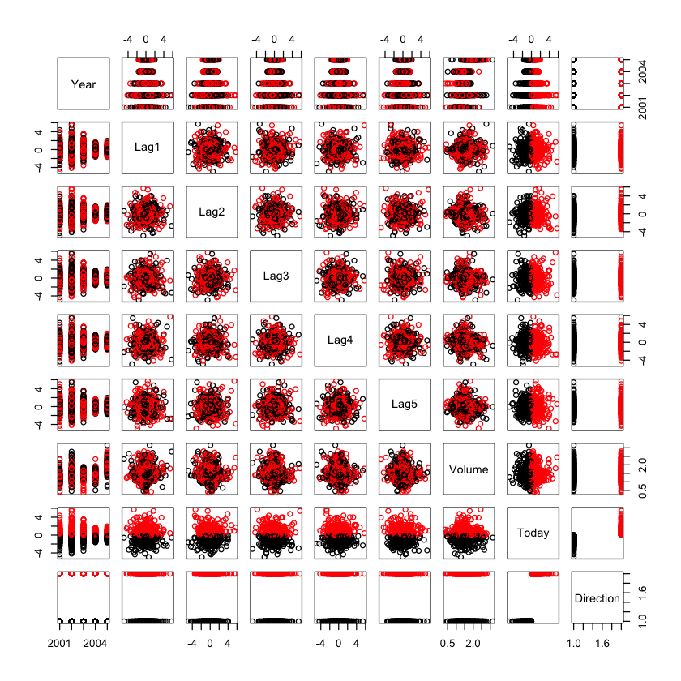

**Juan Ignacio Isern Ghosn**

## The Stock Market Data
We will use the "The Stock Market dataset” from the book “An Introduction to Statistical Learning, with applications in R”, G. James, D. Witten,  T. Hastie and R. Tibshirani, Springer, 2013. There is a package in R called ISLR with this dataset included.

Daily percentage returns for the S&P 500 stock index between 2001 and 2005 (source: raw values of the S&P 500 were obtained from Yahoo Finance and then converted to percentages and lagged).

The stock market data includes 1250 examples of stock market information, each with 9 features: Year, Lag1, Lag2, Lag3, Lag4, Lag5, Volume, Today and Direction. Direction is the class feature with two possible outcomes: up or down.

### Load data


```R
library(ISLR)
names(Smarket)
summary(Smarket)
```


<ol class=list-inline>
	<li>'Year'</li>
	<li>'Lag1'</li>
	<li>'Lag2'</li>
	<li>'Lag3'</li>
	<li>'Lag4'</li>
	<li>'Lag5'</li>
	<li>'Volume'</li>
	<li>'Today'</li>
	<li>'Direction'</li>
</ol>


          Year           Lag1                Lag2                Lag3          
     Min.   :2001   Min.   :-4.922000   Min.   :-4.922000   Min.   :-4.922000  
     1st Qu.:2002   1st Qu.:-0.639500   1st Qu.:-0.639500   1st Qu.:-0.640000  
     Median :2003   Median : 0.039000   Median : 0.039000   Median : 0.038500  
     Mean   :2003   Mean   : 0.003834   Mean   : 0.003919   Mean   : 0.001716  
     3rd Qu.:2004   3rd Qu.: 0.596750   3rd Qu.: 0.596750   3rd Qu.: 0.596750  
     Max.   :2005   Max.   : 5.733000   Max.   : 5.733000   Max.   : 5.733000  
          Lag4                Lag5              Volume           Today          
     Min.   :-4.922000   Min.   :-4.92200   Min.   :0.3561   Min.   :-4.922000  
     1st Qu.:-0.640000   1st Qu.:-0.64000   1st Qu.:1.2574   1st Qu.:-0.639500  
     Median : 0.038500   Median : 0.03850   Median :1.4229   Median : 0.038500  
     Mean   : 0.001636   Mean   : 0.00561   Mean   :1.4783   Mean   : 0.003138  
     3rd Qu.: 0.596750   3rd Qu.: 0.59700   3rd Qu.:1.6417   3rd Qu.: 0.596750  
     Max.   : 5.733000   Max.   : 5.73300   Max.   :3.1525   Max.   : 5.733000  
     Direction 
     Down:602  
     Up  :648  
               
               
               
               


```R
?Smarket
```

A typical predictor has the form response ~ terms where response is the (numeric) response vector and terms is a series of terms which specifies a linear predictor for response. For binomial and quasibinomial families the response can also be specified as a factor (when the first level denotes failure and all others success) or as a two-column matrix with the columns giving the numbers of successes and failures. A terms specification of the form first + second indicates all the terms in first together with all the terms in second with any duplicates removed.


```R
class(Smarket$Direction)
levels(Smarket$Direction)
```


'factor'


<ol class=list-inline>
	<li>'Down'</li>
	<li>'Up'</li>
</ol>


### Analyze data


```R
pairs(Smarket,col=Smarket$Direction)
```





```R
# Hacer en ggplot2, te animas?
```


```R
cor(Smarket) # This won't work, why?
```


    Error in cor(Smarket): 'x' must be numeric
    Traceback:


    1. cor(Smarket)

    2. stop("'x' must be numeric")


```R
cor(Smarket[,-9]) # Note that Volume has some correlation with Year...
```


<table>
<thead><tr><th></th><th scope=col>Year</th><th scope=col>Lag1</th><th scope=col>Lag2</th><th scope=col>Lag3</th><th scope=col>Lag4</th><th scope=col>Lag5</th><th scope=col>Volume</th><th scope=col>Today</th></tr></thead>
<tbody>
	<tr><th scope=row>Year</th><td>1.00000000  </td><td> 0.029699649</td><td> 0.030596422</td><td> 0.033194581</td><td> 0.035688718</td><td> 0.029787995</td><td> 0.53900647 </td><td> 0.030095229</td></tr>
	<tr><th scope=row>Lag1</th><td>0.02969965  </td><td> 1.000000000</td><td>-0.026294328</td><td>-0.010803402</td><td>-0.002985911</td><td>-0.005674606</td><td> 0.04090991 </td><td>-0.026155045</td></tr>
	<tr><th scope=row>Lag2</th><td>0.03059642  </td><td>-0.026294328</td><td> 1.000000000</td><td>-0.025896670</td><td>-0.010853533</td><td>-0.003557949</td><td>-0.04338321 </td><td>-0.010250033</td></tr>
	<tr><th scope=row>Lag3</th><td>0.03319458  </td><td>-0.010803402</td><td>-0.025896670</td><td> 1.000000000</td><td>-0.024051036</td><td>-0.018808338</td><td>-0.04182369 </td><td>-0.002447647</td></tr>
	<tr><th scope=row>Lag4</th><td>0.03568872  </td><td>-0.002985911</td><td>-0.010853533</td><td>-0.024051036</td><td> 1.000000000</td><td>-0.027083641</td><td>-0.04841425 </td><td>-0.006899527</td></tr>
	<tr><th scope=row>Lag5</th><td>0.02978799  </td><td>-0.005674606</td><td>-0.003557949</td><td>-0.018808338</td><td>-0.027083641</td><td> 1.000000000</td><td>-0.02200231 </td><td>-0.034860083</td></tr>
	<tr><th scope=row>Volume</th><td>0.53900647  </td><td> 0.040909908</td><td>-0.043383215</td><td>-0.041823686</td><td>-0.048414246</td><td>-0.022002315</td><td> 1.00000000 </td><td> 0.014591823</td></tr>
	<tr><th scope=row>Today</th><td>0.03009523  </td><td>-0.026155045</td><td>-0.010250033</td><td>-0.002447647</td><td>-0.006899527</td><td>-0.034860083</td><td> 0.01459182 </td><td> 1.000000000</td></tr>
</tbody>
</table>


```R
boxplot(Smarket$Volume~Smarket$Year)
```


```R
# Hacer en ggplot2, te animas?
```


```R
# Direction is derive from Today
cor(as.numeric(Smarket$Direction),Smarket$Today)
```


0.730562901536447


### Logistic regression - quick view


```R
glm.fit <- glm(Direction~Lag1+Lag2+Lag3+Lag4+Lag5+Volume, data=Smarket, family=binomial)
summary(glm.fit)
```


    
    Call:
    glm(formula = Direction ~ Lag1 + Lag2 + Lag3 + Lag4 + Lag5 + 
        Volume, family = binomial, data = Smarket)
    
    Deviance Residuals: 
       Min      1Q  Median      3Q     Max  
    -1.446  -1.203   1.065   1.145   1.326  
    
    Coefficients:
                 Estimate Std. Error z value Pr(>|z|)
    (Intercept) -0.126000   0.240736  -0.523    0.601
    Lag1        -0.073074   0.050167  -1.457    0.145
    Lag2        -0.042301   0.050086  -0.845    0.398
    Lag3         0.011085   0.049939   0.222    0.824
    Lag4         0.009359   0.049974   0.187    0.851
    Lag5         0.010313   0.049511   0.208    0.835
    Volume       0.135441   0.158360   0.855    0.392
    
    (Dispersion parameter for binomial family taken to be 1)
    
        Null deviance: 1731.2  on 1249  degrees of freedom
    Residual deviance: 1727.6  on 1243  degrees of freedom
    AIC: 1741.6
    
    Number of Fisher Scoring iterations: 3


```R
glm.probs <- predict(glm.fit,type="response") 
glm.probs
```


<dl class=dl-horizontal>
	<dt>1</dt>
		<dd>0.507084133395401</dd>
	<dt>2</dt>
		<dd>0.481467878454591</dd>
	<dt>3</dt>
		<dd>0.481138835214201</dd>
	<dt>4</dt>
		<dd>0.515222355813022</dd>
	<dt>5</dt>
		<dd>0.510781162691538</dd>
	<dt>6</dt>
		<dd>0.506956460534911</dd>
	<dt>7</dt>
		<dd>0.492650874187038</dd>
	<dt>8</dt>
		<dd>0.509229158207377</dd>
	<dt>9</dt>
		<dd>0.517613526170958</dd>
	<dt>10</dt>
		<dd>0.488837779771376</dd>
	<dt>11</dt>
		<dd>0.496521102804677</dd>
	<dt>12</dt>
		<dd>0.519783354758247</dd>
	<dt>13</dt>
		<dd>0.518303110389085</dd>
	<dt>14</dt>
		<dd>0.496385229893968</dd>
	<dt>15</dt>
		<dd>0.486489244054581</dd>
	<dt>16</dt>
		<dd>0.515365999291633</dd>
	<dt>17</dt>
		<dd>0.505397643251241</dd>
	<dt>18</dt>
		<dd>0.53193215555475</dd>
	<dt>19</dt>
		<dd>0.516716345338029</dd>
	<dt>20</dt>
		<dd>0.498327248797269</dd>
	<dt>21</dt>
		<dd>0.522979701161004</dd>
	<dt>22</dt>
		<dd>0.522167731255742</dd>
	<dt>23</dt>
		<dd>0.534063877021252</dd>
	<dt>24</dt>
		<dd>0.492097088348467</dd>
	<dt>25</dt>
		<dd>0.500875098183717</dd>
	<dt>26</dt>
		<dd>0.519121093069559</dd>
	<dt>27</dt>
		<dd>0.491967894749216</dd>
	<dt>28</dt>
		<dd>0.537379584855279</dd>
	<dt>29</dt>
		<dd>0.557130599863959</dd>
	<dt>30</dt>
		<dd>0.55743626491108</dd>
	<dt>31</dt>
		<dd>0.530706313988035</dd>
	<dt>32</dt>
		<dd>0.508343706975712</dd>
	<dt>33</dt>
		<dd>0.471401529958507</dd>
	<dt>34</dt>
		<dd>0.494951625853692</dd>
	<dt>35</dt>
		<dd>0.54713457238636</dd>
	<dt>36</dt>
		<dd>0.526091012212311</dd>
	<dt>37</dt>
		<dd>0.520331863304897</dd>
	<dt>38</dt>
		<dd>0.490230631468964</dd>
	<dt>39</dt>
		<dd>0.476037534937652</dd>
	<dt>40</dt>
		<dd>0.485066669047232</dd>
	<dt>41</dt>
		<dd>0.497946161844965</dd>
	<dt>42</dt>
		<dd>0.553538668743411</dd>
	<dt>43</dt>
		<dd>0.617644221960681</dd>
	<dt>44</dt>
		<dd>0.528451754993172</dd>
	<dt>45</dt>
		<dd>0.530125145600628</dd>
	<dt>46</dt>
		<dd>0.515368107673713</dd>
	<dt>47</dt>
		<dd>0.5355160565048</dd>
	<dt>48</dt>
		<dd>0.494579457073692</dd>
	<dt>49</dt>
		<dd>0.524946995318405</dd>
	<dt>50</dt>
		<dd>0.573559265472135</dd>
	<dt>51</dt>
		<dd>0.545508020995801</dd>
	<dt>52</dt>
		<dd>0.47659918769805</dd>
	<dt>53</dt>
		<dd>0.453169125902012</dd>
	<dt>54</dt>
		<dd>0.454431812185405</dd>
	<dt>55</dt>
		<dd>0.537902518914994</dd>
	<dt>56</dt>
		<dd>0.559174230087208</dd>
	<dt>57</dt>
		<dd>0.499191798302744</dd>
	<dt>58</dt>
		<dd>0.521932788441639</dd>
	<dt>59</dt>
		<dd>0.586172248931929</dd>
	<dt>60</dt>
		<dd>0.556075664652636</dd>
	<dt>61</dt>
		<dd>0.428909535607629</dd>
	<dt>62</dt>
		<dd>0.489640205358733</dd>
	<dt>63</dt>
		<dd>0.513338658897446</dd>
	<dt>64</dt>
		<dd>0.460177559316208</dd>
	<dt>65</dt>
		<dd>0.496290874904591</dd>
	<dt>66</dt>
		<dd>0.48473612309696</dd>
	<dt>67</dt>
		<dd>0.497213649276263</dd>
	<dt>68</dt>
		<dd>0.501372686049996</dd>
	<dt>69</dt>
		<dd>0.453777866777696</dd>
	<dt>70</dt>
		<dd>0.460873607820951</dd>
	<dt>71</dt>
		<dd>0.52848739054321</dd>
	<dt>72</dt>
		<dd>0.554195314179131</dd>
	<dt>73</dt>
		<dd>0.558078000268531</dd>
	<dt>74</dt>
		<dd>0.490078693899401</dd>
	<dt>75</dt>
		<dd>0.479540174137997</dd>
	<dt>76</dt>
		<dd>0.470803509034274</dd>
	<dt>77</dt>
		<dd>0.502660293704731</dd>
	<dt>78</dt>
		<dd>0.496076465205238</dd>
	<dt>79</dt>
		<dd>0.502078587937896</dd>
	<dt>80</dt>
		<dd>0.540247082855195</dd>
	<dt>81</dt>
		<dd>0.497141849859707</dd>
	<dt>82</dt>
		<dd>0.489405275275278</dd>
	<dt>83</dt>
		<dd>0.509230095741104</dd>
	<dt>84</dt>
		<dd>0.515841427751185</dd>
	<dt>85</dt>
		<dd>0.512198300489426</dd>
	<dt>86</dt>
		<dd>0.511032235587138</dd>
	<dt>87</dt>
		<dd>0.499204041910264</dd>
	<dt>88</dt>
		<dd>0.49793771279037</dd>
	<dt>89</dt>
		<dd>0.462610700617764</dd>
	<dt>90</dt>
		<dd>0.478131627442584</dd>
	<dt>91</dt>
		<dd>0.507653191461115</dd>
	<dt>92</dt>
		<dd>0.483458611252147</dd>
	<dt>93</dt>
		<dd>0.507619180091087</dd>
	<dt>94</dt>
		<dd>0.543770607314797</dd>
	<dt>95</dt>
		<dd>0.520079990025692</dd>
	<dt>96</dt>
		<dd>0.513989828107826</dd>
	<dt>97</dt>
		<dd>0.526521824354565</dd>
	<dt>98</dt>
		<dd>0.537972639236588</dd>
	<dt>99</dt>
		<dd>0.511166156934783</dd>
	<dt>100</dt>
		<dd>0.480060273950104</dd>
	<dt>101</dt>
		<dd>0.479463969460248</dd>
	<dt>102</dt>
		<dd>0.47568225531398</dd>
	<dt>103</dt>
		<dd>0.513906082351853</dd>
	<dt>104</dt>
		<dd>0.512364567571995</dd>
	<dt>105</dt>
		<dd>0.50592022001458</dd>
	<dt>106</dt>
		<dd>0.52554649565831</dd>
	<dt>107</dt>
		<dd>0.509655077795929</dd>
	<dt>108</dt>
		<dd>0.520900952267153</dd>
	<dt>109</dt>
		<dd>0.550328370908082</dd>
	<dt>110</dt>
		<dd>0.545488550612707</dd>
	<dt>111</dt>
		<dd>0.512625005030102</dd>
	<dt>112</dt>
		<dd>0.499242049906225</dd>
	<dt>113</dt>
		<dd>0.48775593345109</dd>
	<dt>114</dt>
		<dd>0.489556354357137</dd>
	<dt>115</dt>
		<dd>0.515969218269174</dd>
	<dt>116</dt>
		<dd>0.530149898810611</dd>
	<dt>117</dt>
		<dd>0.51995457938978</dd>
	<dt>118</dt>
		<dd>0.517179460744969</dd>
	<dt>119</dt>
		<dd>0.491431232567761</dd>
	<dt>120</dt>
		<dd>0.516961687448814</dd>
	<dt>121</dt>
		<dd>0.491832662962698</dd>
	<dt>122</dt>
		<dd>0.483577596256179</dd>
	<dt>123</dt>
		<dd>0.530238853778946</dd>
	<dt>124</dt>
		<dd>0.561395182299783</dd>
	<dt>125</dt>
		<dd>0.514940585001777</dd>
	<dt>126</dt>
		<dd>0.520442272533358</dd>
	<dt>127</dt>
		<dd>0.525867329380195</dd>
	<dt>128</dt>
		<dd>0.465234451701566</dd>
	<dt>129</dt>
		<dd>0.468163014253394</dd>
	<dt>130</dt>
		<dd>0.519562853537666</dd>
	<dt>131</dt>
		<dd>0.510693673230439</dd>
	<dt>132</dt>
		<dd>0.517193152887887</dd>
	<dt>133</dt>
		<dd>0.510621971593238</dd>
	<dt>134</dt>
		<dd>0.506006782403682</dd>
	<dt>135</dt>
		<dd>0.538324923951328</dd>
	<dt>136</dt>
		<dd>0.554936635185953</dd>
	<dt>137</dt>
		<dd>0.495915907507757</dd>
	<dt>138</dt>
		<dd>0.464344399164046</dd>
	<dt>139</dt>
		<dd>0.483876944135816</dd>
	<dt>140</dt>
		<dd>0.501180557093674</dd>
	<dt>141</dt>
		<dd>0.504957271268645</dd>
	<dt>142</dt>
		<dd>0.503860549919541</dd>
	<dt>143</dt>
		<dd>0.500323937389489</dd>
	<dt>144</dt>
		<dd>0.507809332059799</dd>
	<dt>145</dt>
		<dd>0.52580664719599</dd>
	<dt>146</dt>
		<dd>0.509343343113312</dd>
	<dt>147</dt>
		<dd>0.531369062604003</dd>
	<dt>148</dt>
		<dd>0.521231977685663</dd>
	<dt>149</dt>
		<dd>0.48374984457337</dd>
	<dt>150</dt>
		<dd>0.485878261997374</dd>
	<dt>151</dt>
		<dd>0.504243504975965</dd>
	<dt>152</dt>
		<dd>0.523597124890174</dd>
	<dt>153</dt>
		<dd>0.506980759479532</dd>
	<dt>154</dt>
		<dd>0.525948696385517</dd>
	<dt>155</dt>
		<dd>0.499811912122886</dd>
	<dt>156</dt>
		<dd>0.511461356043641</dd>
	<dt>157</dt>
		<dd>0.505320743784105</dd>
	<dt>158</dt>
		<dd>0.493831566619609</dd>
	<dt>159</dt>
		<dd>0.47208274618812</dd>
	<dt>160</dt>
		<dd>0.482829420961434</dd>
	<dt>161</dt>
		<dd>0.540954422538822</dd>
	<dt>162</dt>
		<dd>0.53983669754705</dd>
	<dt>163</dt>
		<dd>0.550131498575762</dd>
	<dt>164</dt>
		<dd>0.502423327141245</dd>
	<dt>165</dt>
		<dd>0.493968878430045</dd>
	<dt>166</dt>
		<dd>0.512170110780181</dd>
	<dt>167</dt>
		<dd>0.552771023064064</dd>
	<dt>168</dt>
		<dd>0.574512696844097</dd>
	<dt>169</dt>
		<dd>0.513456477991849</dd>
	<dt>170</dt>
		<dd>0.617817212124571</dd>
	<dt>171</dt>
		<dd>0.577981412391065</dd>
	<dt>172</dt>
		<dd>0.55860715350237</dd>
	<dt>173</dt>
		<dd>0.597383954732507</dd>
	<dt>174</dt>
		<dd>0.594899302142155</dd>
	<dt>175</dt>
		<dd>0.462751442544637</dd>
	<dt>176</dt>
		<dd>0.449342711700995</dd>
	<dt>177</dt>
		<dd>0.518419459726266</dd>
	<dt>178</dt>
		<dd>0.509298536191555</dd>
	<dt>179</dt>
		<dd>0.482228771398667</dd>
	<dt>180</dt>
		<dd>0.493567755636975</dd>
	<dt>181</dt>
		<dd>0.499546688754712</dd>
	<dt>182</dt>
		<dd>0.4824232702583</dd>
	<dt>183</dt>
		<dd>0.514940401774063</dd>
	<dt>184</dt>
		<dd>0.519991500473508</dd>
	<dt>185</dt>
		<dd>0.522288210178267</dd>
	<dt>186</dt>
		<dd>0.533649280864217</dd>
	<dt>187</dt>
		<dd>0.474157291132536</dd>
	<dt>188</dt>
		<dd>0.471189225331526</dd>
	<dt>189</dt>
		<dd>0.510075312242599</dd>
	<dt>190</dt>
		<dd>0.519754942939079</dd>
	<dt>191</dt>
		<dd>0.506439858668974</dd>
	<dt>192</dt>
		<dd>0.546496252957047</dd>
	<dt>193</dt>
		<dd>0.545422015635591</dd>
	<dt>194</dt>
		<dd>0.508403465876805</dd>
	<dt>195</dt>
		<dd>0.468457399737127</dd>
	<dt>196</dt>
		<dd>0.500128851483725</dd>
	<dt>197</dt>
		<dd>0.521266864861251</dd>
	<dt>198</dt>
		<dd>0.492675519143616</dd>
	<dt>199</dt>
		<dd>0.491575173138935</dd>
	<dt>200</dt>
		<dd>0.547658153096178</dd>
	<dt>201</dt>
		<dd>0.57291358646833</dd>
	<dt>202</dt>
		<dd>0.530332467774077</dd>
	<dt>203</dt>
		<dd>0.46199342318649</dd>
	<dt>204</dt>
		<dd>0.466879528477554</dd>
	<dt>205</dt>
		<dd>0.484047912769005</dd>
	<dt>206</dt>
		<dd>0.478824743764572</dd>
	<dt>207</dt>
		<dd>0.516476293530319</dd>
	<dt>208</dt>
		<dd>0.526382170964165</dd>
	<dt>209</dt>
		<dd>0.506401090767913</dd>
	<dt>210</dt>
		<dd>0.507426947808975</dd>
	<dt>211</dt>
		<dd>0.483173290180984</dd>
	<dt>212</dt>
		<dd>0.494861541448263</dd>
	<dt>213</dt>
		<dd>0.51926555444873</dd>
	<dt>214</dt>
		<dd>0.522954533551358</dd>
	<dt>215</dt>
		<dd>0.501964919736437</dd>
	<dt>216</dt>
		<dd>0.5151648695487</dd>
	<dt>217</dt>
		<dd>0.522581225882863</dd>
	<dt>218</dt>
		<dd>0.465984389294838</dd>
	<dt>219</dt>
		<dd>0.482879104494967</dd>
	<dt>220</dt>
		<dd>0.518304963696312</dd>
	<dt>221</dt>
		<dd>0.560160295150821</dd>
	<dt>222</dt>
		<dd>0.518028236199006</dd>
	<dt>223</dt>
		<dd>0.499182373063676</dd>
	<dt>224</dt>
		<dd>0.522057645428479</dd>
	<dt>225</dt>
		<dd>0.495444136509511</dd>
	<dt>226</dt>
		<dd>0.47376513535966</dd>
	<dt>227</dt>
		<dd>0.501879392741317</dd>
	<dt>228</dt>
		<dd>0.534516295658494</dd>
	<dt>229</dt>
		<dd>0.554357481320675</dd>
	<dt>230</dt>
		<dd>0.539589664325397</dd>
	<dt>231</dt>
		<dd>0.513154081121612</dd>
	<dt>232</dt>
		<dd>0.54130040311516</dd>
	<dt>233</dt>
		<dd>0.518481014694888</dd>
	<dt>234</dt>
		<dd>0.484392988564871</dd>
	<dt>235</dt>
		<dd>0.487295881136978</dd>
	<dt>236</dt>
		<dd>0.499722813640916</dd>
	<dt>237</dt>
		<dd>0.533375959969039</dd>
	<dt>238</dt>
		<dd>0.532690330589669</dd>
	<dt>239</dt>
		<dd>0.480164662958511</dd>
	<dt>240</dt>
		<dd>0.488726890282901</dd>
	<dt>241</dt>
		<dd>0.480292579907969</dd>
	<dt>242</dt>
		<dd>0.488502909384665</dd>
	<dt>243</dt>
		<dd>0.520036085285065</dd>
	<dt>244</dt>
		<dd>0.513025374134797</dd>
	<dt>245</dt>
		<dd>0.492463330769263</dd>
	<dt>246</dt>
		<dd>0.498525718580795</dd>
	<dt>247</dt>
		<dd>0.519109349291287</dd>
	<dt>248</dt>
		<dd>0.529868607733245</dd>
	<dt>249</dt>
		<dd>0.532204141096258</dd>
	<dt>250</dt>
		<dd>0.514413095599093</dd>
	<dt>251</dt>
		<dd>0.521685424125977</dd>
	<dt>252</dt>
		<dd>0.53179155171777</dd>
	<dt>253</dt>
		<dd>0.506047752238772</dd>
	<dt>254</dt>
		<dd>0.537449079634002</dd>
	<dt>255</dt>
		<dd>0.512071492128261</dd>
	<dt>256</dt>
		<dd>0.516630345497749</dd>
	<dt>257</dt>
		<dd>0.537460575821218</dd>
	<dt>258</dt>
		<dd>0.507276460206262</dd>
	<dt>259</dt>
		<dd>0.504505361030745</dd>
	<dt>260</dt>
		<dd>0.506417714048488</dd>
	<dt>261</dt>
		<dd>0.508912491471014</dd>
	<dt>262</dt>
		<dd>0.584641475977328</dd>
	<dt>263</dt>
		<dd>0.546627541854067</dd>
	<dt>264</dt>
		<dd>0.473828106768254</dd>
	<dt>265</dt>
		<dd>0.508451107349524</dd>
	<dt>266</dt>
		<dd>0.568929325612743</dd>
	<dt>267</dt>
		<dd>0.566422983976646</dd>
	<dt>268</dt>
		<dd>0.535360443117276</dd>
	<dt>269</dt>
		<dd>0.520507879185858</dd>
	<dt>270</dt>
		<dd>0.482092327524228</dd>
	<dt>271</dt>
		<dd>0.462623383925745</dd>
	<dt>272</dt>
		<dd>0.49953205659216</dd>
	<dt>273</dt>
		<dd>0.50238797587739</dd>
	<dt>274</dt>
		<dd>0.510460916529843</dd>
	<dt>275</dt>
		<dd>0.541987837003451</dd>
	<dt>276</dt>
		<dd>0.555482650037973</dd>
	<dt>277</dt>
		<dd>0.511579615517099</dd>
	<dt>278</dt>
		<dd>0.521041317470445</dd>
	<dt>279</dt>
		<dd>0.514146209135401</dd>
	<dt>280</dt>
		<dd>0.467305010262701</dd>
	<dt>281</dt>
		<dd>0.496038934721327</dd>
	<dt>282</dt>
		<dd>0.517806354333269</dd>
	<dt>283</dt>
		<dd>0.526647146550087</dd>
	<dt>284</dt>
		<dd>0.484246485051812</dd>
	<dt>285</dt>
		<dd>0.462322510466845</dd>
	<dt>286</dt>
		<dd>0.518248273604287</dd>
	<dt>287</dt>
		<dd>0.511194216938962</dd>
	<dt>288</dt>
		<dd>0.521288774614928</dd>
	<dt>289</dt>
		<dd>0.517860314818049</dd>
	<dt>290</dt>
		<dd>0.497526131892673</dd>
	<dt>291</dt>
		<dd>0.517567715419783</dd>
	<dt>292</dt>
		<dd>0.535867303372563</dd>
	<dt>293</dt>
		<dd>0.523170039282767</dd>
	<dt>294</dt>
		<dd>0.496862306103049</dd>
	<dt>295</dt>
		<dd>0.493865344983021</dd>
	<dt>296</dt>
		<dd>0.504507610388395</dd>
	<dt>297</dt>
		<dd>0.539373159932464</dd>
	<dt>298</dt>
		<dd>0.531651594611997</dd>
	<dt>299</dt>
		<dd>0.513194825066341</dd>
	<dt>300</dt>
		<dd>0.533298840851317</dd>
	<dt>301</dt>
		<dd>0.509850719962057</dd>
	<dt>302</dt>
		<dd>0.487837880589817</dd>
	<dt>303</dt>
		<dd>0.494306567508253</dd>
	<dt>304</dt>
		<dd>0.501908121991441</dd>
	<dt>305</dt>
		<dd>0.528120815046687</dd>
	<dt>306</dt>
		<dd>0.538742167325637</dd>
	<dt>307</dt>
		<dd>0.51908776055014</dd>
	<dt>308</dt>
		<dd>0.506111934969468</dd>
	<dt>309</dt>
		<dd>0.500512583999105</dd>
	<dt>310</dt>
		<dd>0.516811315078298</dd>
	<dt>311</dt>
		<dd>0.503968391086557</dd>
	<dt>312</dt>
		<dd>0.548483217996224</dd>
	<dt>313</dt>
		<dd>0.526996210330163</dd>
	<dt>314</dt>
		<dd>0.507695726963067</dd>
	<dt>315</dt>
		<dd>0.47840886480685</dd>
	<dt>316</dt>
		<dd>0.487418364672942</dd>
	<dt>317</dt>
		<dd>0.525674128040814</dd>
	<dt>318</dt>
		<dd>0.511943270053364</dd>
	<dt>319</dt>
		<dd>0.541086488752366</dd>
	<dt>320</dt>
		<dd>0.542349698101534</dd>
	<dt>321</dt>
		<dd>0.529996359066323</dd>
	<dt>322</dt>
		<dd>0.524979956014839</dd>
	<dt>323</dt>
		<dd>0.53456630548825</dd>
	<dt>324</dt>
		<dd>0.542373304755847</dd>
	<dt>325</dt>
		<dd>0.508614217758652</dd>
	<dt>326</dt>
		<dd>0.4836341778468</dd>
	<dt>327</dt>
		<dd>0.505552521414536</dd>
	<dt>328</dt>
		<dd>0.534901759985668</dd>
	<dt>329</dt>
		<dd>0.556811242284988</dd>
	<dt>330</dt>
		<dd>0.539290456168955</dd>
	<dt>331</dt>
		<dd>0.446044512422663</dd>
	<dt>332</dt>
		<dd>0.486459807732862</dd>
	<dt>333</dt>
		<dd>0.558668309852415</dd>
	<dt>334</dt>
		<dd>0.493191731359087</dd>
	<dt>335</dt>
		<dd>0.45985622146744</dd>
	<dt>336</dt>
		<dd>0.50203273129668</dd>
	<dt>337</dt>
		<dd>0.510918205778448</dd>
	<dt>338</dt>
		<dd>0.498971972247184</dd>
	<dt>339</dt>
		<dd>0.524170917902983</dd>
	<dt>340</dt>
		<dd>0.545340311200555</dd>
	<dt>341</dt>
		<dd>0.507990968473092</dd>
	<dt>342</dt>
		<dd>0.480094538441717</dd>
	<dt>343</dt>
		<dd>0.505379337127234</dd>
	<dt>344</dt>
		<dd>0.531922158921797</dd>
	<dt>345</dt>
		<dd>0.526355801153375</dd>
	<dt>346</dt>
		<dd>0.521390076393779</dd>
	<dt>347</dt>
		<dd>0.503570600629291</dd>
	<dt>348</dt>
		<dd>0.551516240533659</dd>
	<dt>349</dt>
		<dd>0.542599862544358</dd>
	<dt>350</dt>
		<dd>0.489292929377273</dd>
	<dt>351</dt>
		<dd>0.544151914413005</dd>
	<dt>352</dt>
		<dd>0.533691270710774</dd>
	<dt>353</dt>
		<dd>0.502577022429115</dd>
	<dt>354</dt>
		<dd>0.533804616136482</dd>
	<dt>355</dt>
		<dd>0.53025337495819</dd>
	<dt>356</dt>
		<dd>0.524004099927561</dd>
	<dt>357</dt>
		<dd>0.534867279034276</dd>
	<dt>358</dt>
		<dd>0.45482587175453</dd>
	<dt>359</dt>
		<dd>0.475470793213774</dd>
	<dt>360</dt>
		<dd>0.547533506298753</dd>
	<dt>361</dt>
		<dd>0.563622699681641</dd>
	<dt>362</dt>
		<dd>0.567152567573479</dd>
	<dt>363</dt>
		<dd>0.525107900855769</dd>
	<dt>364</dt>
		<dd>0.534251383222394</dd>
	<dt>365</dt>
		<dd>0.552600941135953</dd>
	<dt>366</dt>
		<dd>0.495658842719438</dd>
	<dt>367</dt>
		<dd>0.519383070561336</dd>
	<dt>368</dt>
		<dd>0.556421698177442</dd>
	<dt>369</dt>
		<dd>0.593705602086018</dd>
	<dt>370</dt>
		<dd>0.529695610914261</dd>
	<dt>371</dt>
		<dd>0.408446109845907</dd>
	<dt>372</dt>
		<dd>0.483259485350259</dd>
	<dt>373</dt>
		<dd>0.577739146388022</dd>
	<dt>374</dt>
		<dd>0.622482287774818</dd>
	<dt>375</dt>
		<dd>0.560627644447979</dd>
	<dt>376</dt>
		<dd>0.50844219149078</dd>
	<dt>377</dt>
		<dd>0.556884998306849</dd>
	<dt>378</dt>
		<dd>0.559645293056727</dd>
	<dt>379</dt>
		<dd>0.563672063797686</dd>
	<dt>380</dt>
		<dd>0.562663450207857</dd>
	<dt>381</dt>
		<dd>0.648643505508766</dd>
	<dt>382</dt>
		<dd>0.63121798296719</dd>
	<dt>383</dt>
		<dd>0.617584937460071</dd>
	<dt>384</dt>
		<dd>0.461340151424653</dd>
	<dt>385</dt>
		<dd>0.475202056348234</dd>
	<dt>386</dt>
		<dd>0.50551343925566</dd>
	<dt>387</dt>
		<dd>0.417720445496607</dd>
	<dt>388</dt>
		<dd>0.483523959333469</dd>
	<dt>389</dt>
		<dd>0.532949439287907</dd>
	<dt>390</dt>
		<dd>0.586103980510283</dd>
	<dt>391</dt>
		<dd>0.609845598249439</dd>
	<dt>392</dt>
		<dd>0.597753082942222</dd>
	<dt>393</dt>
		<dd>0.490592382975067</dd>
	<dt>394</dt>
		<dd>0.428727752120171</dd>
	<dt>395</dt>
		<dd>0.437959004030315</dd>
	<dt>396</dt>
		<dd>0.475053827723082</dd>
	<dt>397</dt>
		<dd>0.531044746964168</dd>
	<dt>398</dt>
		<dd>0.570987522372637</dd>
	<dt>399</dt>
		<dd>0.477991373630337</dd>
	<dt>400</dt>
		<dd>0.449809704444163</dd>
	<dt>401</dt>
		<dd>0.506674602532255</dd>
	<dt>402</dt>
		<dd>0.47805972642823</dd>
	<dt>403</dt>
		<dd>0.52590716838372</dd>
	<dt>404</dt>
		<dd>0.514970542427222</dd>
	<dt>405</dt>
		<dd>0.477121838422448</dd>
	<dt>406</dt>
		<dd>0.537651282527102</dd>
	<dt>407</dt>
		<dd>0.516420332220245</dd>
	<dt>408</dt>
		<dd>0.530350927037242</dd>
	<dt>409</dt>
		<dd>0.555267911315633</dd>
	<dt>410</dt>
		<dd>0.522918604598036</dd>
	<dt>411</dt>
		<dd>0.497184757147729</dd>
	<dt>412</dt>
		<dd>0.581480039746007</dd>
	<dt>413</dt>
		<dd>0.521655440739881</dd>
	<dt>414</dt>
		<dd>0.514581834724394</dd>
	<dt>415</dt>
		<dd>0.489436866299031</dd>
	<dt>416</dt>
		<dd>0.459603433225799</dd>
	<dt>417</dt>
		<dd>0.490031520562226</dd>
	<dt>418</dt>
		<dd>0.4922907783202</dd>
	<dt>419</dt>
		<dd>0.562662068590294</dd>
	<dt>420</dt>
		<dd>0.535988621794999</dd>
	<dt>421</dt>
		<dd>0.491291216343513</dd>
	<dt>422</dt>
		<dd>0.546993113602846</dd>
	<dt>423</dt>
		<dd>0.543352853253906</dd>
	<dt>424</dt>
		<dd>0.575077890566983</dd>
	<dt>425</dt>
		<dd>0.550811039610084</dd>
	<dt>426</dt>
		<dd>0.523416001604028</dd>
	<dt>427</dt>
		<dd>0.563352583197432</dd>
	<dt>428</dt>
		<dd>0.486272583876038</dd>
	<dt>429</dt>
		<dd>0.45752179683369</dd>
	<dt>430</dt>
		<dd>0.558228837578474</dd>
	<dt>431</dt>
		<dd>0.592924198244415</dd>
	<dt>432</dt>
		<dd>0.472898463259813</dd>
	<dt>433</dt>
		<dd>0.518871148307626</dd>
	<dt>434</dt>
		<dd>0.568827510662215</dd>
	<dt>435</dt>
		<dd>0.581411659528118</dd>
	<dt>436</dt>
		<dd>0.581576602251244</dd>
	<dt>437</dt>
		<dd>0.50864074458264</dd>
	<dt>438</dt>
		<dd>0.550800100158424</dd>
	<dt>439</dt>
		<dd>0.498680012959354</dd>
	<dt>440</dt>
		<dd>0.415233296443653</dd>
	<dt>441</dt>
		<dd>0.462179933843463</dd>
	<dt>442</dt>
		<dd>0.452609170433058</dd>
	<dt>443</dt>
		<dd>0.536272572750044</dd>
	<dt>444</dt>
		<dd>0.538372118396967</dd>
	<dt>445</dt>
		<dd>0.488611553751743</dd>
	<dt>446</dt>
		<dd>0.492341908824534</dd>
	<dt>447</dt>
		<dd>0.522669301212238</dd>
	<dt>448</dt>
		<dd>0.533318001142747</dd>
	<dt>449</dt>
		<dd>0.549249315198144</dd>
	<dt>450</dt>
		<dd>0.502458134064005</dd>
	<dt>451</dt>
		<dd>0.506878430636333</dd>
	<dt>452</dt>
		<dd>0.54840707941464</dd>
	<dt>453</dt>
		<dd>0.506342285241046</dd>
	<dt>454</dt>
		<dd>0.523931104618301</dd>
	<dt>455</dt>
		<dd>0.49057451817153</dd>
	<dt>456</dt>
		<dd>0.489492179785019</dd>
	<dt>457</dt>
		<dd>0.49747573072589</dd>
	<dt>458</dt>
		<dd>0.505142349193794</dd>
	<dt>459</dt>
		<dd>0.558468842785784</dd>
	<dt>460</dt>
		<dd>0.563757893072187</dd>
	<dt>461</dt>
		<dd>0.550947638181911</dd>
	<dt>462</dt>
		<dd>0.51752363101866</dd>
	<dt>463</dt>
		<dd>0.497077854443436</dd>
	<dt>464</dt>
		<dd>0.470510840917843</dd>
	<dt>465</dt>
		<dd>0.474974845288834</dd>
	<dt>466</dt>
		<dd>0.533097893100757</dd>
	<dt>467</dt>
		<dd>0.539398852621878</dd>
	<dt>468</dt>
		<dd>0.493572876917275</dd>
	<dt>469</dt>
		<dd>0.488600988918994</dd>
	<dt>470</dt>
		<dd>0.508937445649564</dd>
	<dt>471</dt>
		<dd>0.530297098770266</dd>
	<dt>472</dt>
		<dd>0.565139635912925</dd>
	<dt>473</dt>
		<dd>0.490681083709347</dd>
	<dt>474</dt>
		<dd>0.459646775093425</dd>
	<dt>475</dt>
		<dd>0.532885418629106</dd>
	<dt>476</dt>
		<dd>0.548089286133993</dd>
	<dt>477</dt>
		<dd>0.550066249846944</dd>
	<dt>478</dt>
		<dd>0.531152037022428</dd>
	<dt>479</dt>
		<dd>0.506886296439316</dd>
	<dt>480</dt>
		<dd>0.539092261988637</dd>
	<dt>481</dt>
		<dd>0.508055390534383</dd>
	<dt>482</dt>
		<dd>0.488450730616628</dd>
	<dt>483</dt>
		<dd>0.517515083989931</dd>
	<dt>484</dt>
		<dd>0.539641376352695</dd>
	<dt>485</dt>
		<dd>0.485481941426146</dd>
	<dt>486</dt>
		<dd>0.496436075515095</dd>
	<dt>487</dt>
		<dd>0.552323981480362</dd>
	<dt>488</dt>
		<dd>0.543098255177368</dd>
	<dt>489</dt>
		<dd>0.513743395274751</dd>
	<dt>490</dt>
		<dd>0.481776111720846</dd>
	<dt>491</dt>
		<dd>0.490512072090319</dd>
	<dt>492</dt>
		<dd>0.506015568289983</dd>
	<dt>493</dt>
		<dd>0.529026851287779</dd>
	<dt>494</dt>
		<dd>0.511251054367996</dd>
	<dt>495</dt>
		<dd>0.493049980513192</dd>
	<dt>496</dt>
		<dd>0.445865429282592</dd>
	<dt>497</dt>
		<dd>0.469662838822904</dd>
	<dt>498</dt>
		<dd>0.487072044561669</dd>
	<dt>499</dt>
		<dd>0.516760390670353</dd>
	<dt>500</dt>
		<dd>0.565151671025517</dd>
	<dt>501</dt>
		<dd>0.504131218545095</dd>
	<dt>502</dt>
		<dd>0.498648701675987</dd>
	<dt>503</dt>
		<dd>0.518736589330449</dd>
	<dt>504</dt>
		<dd>0.506950790177157</dd>
	<dt>505</dt>
		<dd>0.541698443675591</dd>
	<dt>506</dt>
		<dd>0.544090652126799</dd>
	<dt>507</dt>
		<dd>0.54117595516849</dd>
	<dt>508</dt>
		<dd>0.554041183570415</dd>
	<dt>509</dt>
		<dd>0.548327171319684</dd>
	<dt>510</dt>
		<dd>0.51128145441487</dd>
	<dt>511</dt>
		<dd>0.554023305007624</dd>
	<dt>512</dt>
		<dd>0.573363877815016</dd>
	<dt>513</dt>
		<dd>0.502756340856024</dd>
	<dt>514</dt>
		<dd>0.487653700430146</dd>
	<dt>515</dt>
		<dd>0.546377776868459</dd>
	<dt>516</dt>
		<dd>0.522877222855592</dd>
	<dt>517</dt>
		<dd>0.485984864047721</dd>
	<dt>518</dt>
		<dd>0.537649952465048</dd>
	<dt>519</dt>
		<dd>0.541047571869052</dd>
	<dt>520</dt>
		<dd>0.535172373516442</dd>
	<dt>521</dt>
		<dd>0.533524170072317</dd>
	<dt>522</dt>
		<dd>0.500573831459068</dd>
	<dt>523</dt>
		<dd>0.513835617696613</dd>
	<dt>524</dt>
		<dd>0.540911752695187</dd>
	<dt>525</dt>
		<dd>0.532151479175911</dd>
	<dt>526</dt>
		<dd>0.475162988983469</dd>
	<dt>527</dt>
		<dd>0.447261801349454</dd>
	<dt>528</dt>
		<dd>0.499561282137564</dd>
	<dt>529</dt>
		<dd>0.54368967598044</dd>
	<dt>530</dt>
		<dd>0.509857738970952</dd>
	<dt>531</dt>
		<dd>0.530413744839883</dd>
	<dt>532</dt>
		<dd>0.524631081156145</dd>
	<dt>533</dt>
		<dd>0.52696239306826</dd>
	<dt>534</dt>
		<dd>0.505617714974209</dd>
	<dt>535</dt>
		<dd>0.487428093751776</dd>
	<dt>536</dt>
		<dd>0.520349223102866</dd>
	<dt>537</dt>
		<dd>0.547582329769419</dd>
	<dt>538</dt>
		<dd>0.514423921605191</dd>
	<dt>539</dt>
		<dd>0.514609918105245</dd>
	<dt>540</dt>
		<dd>0.506736294118589</dd>
	<dt>541</dt>
		<dd>0.545012584890248</dd>
	<dt>542</dt>
		<dd>0.56168336901049</dd>
	<dt>543</dt>
		<dd>0.516662557199755</dd>
	<dt>544</dt>
		<dd>0.456359231073249</dd>
	<dt>545</dt>
		<dd>0.473857395111167</dd>
	<dt>546</dt>
		<dd>0.468055163055067</dd>
	<dt>547</dt>
		<dd>0.48557944339493</dd>
	<dt>548</dt>
		<dd>0.517021765619756</dd>
	<dt>549</dt>
		<dd>0.51441863718085</dd>
	<dt>550</dt>
		<dd>0.500852004442939</dd>
	<dt>551</dt>
		<dd>0.555767599975108</dd>
	<dt>552</dt>
		<dd>0.537683982874919</dd>
	<dt>553</dt>
		<dd>0.506437127537773</dd>
	<dt>554</dt>
		<dd>0.520078483276828</dd>
	<dt>555</dt>
		<dd>0.514578957998999</dd>
	<dt>556</dt>
		<dd>0.558783961376632</dd>
	<dt>557</dt>
		<dd>0.511172451775753</dd>
	<dt>558</dt>
		<dd>0.455204197818453</dd>
	<dt>559</dt>
		<dd>0.493182234693018</dd>
	<dt>560</dt>
		<dd>0.516361489410389</dd>
	<dt>561</dt>
		<dd>0.521770496993824</dd>
	<dt>562</dt>
		<dd>0.518731373592424</dd>
	<dt>563</dt>
		<dd>0.539445443871955</dd>
	<dt>564</dt>
		<dd>0.515159991270591</dd>
	<dt>565</dt>
		<dd>0.503194069794317</dd>
	<dt>566</dt>
		<dd>0.473209398628568</dd>
	<dt>567</dt>
		<dd>0.482678357147326</dd>
	<dt>568</dt>
		<dd>0.544029905717111</dd>
	<dt>569</dt>
		<dd>0.50683388148934</dd>
	<dt>570</dt>
		<dd>0.496270154497242</dd>
	<dt>571</dt>
		<dd>0.489020191705707</dd>
	<dt>572</dt>
		<dd>0.48667146741076</dd>
	<dt>573</dt>
		<dd>0.54004445090058</dd>
	<dt>574</dt>
		<dd>0.554498534128763</dd>
	<dt>575</dt>
		<dd>0.498946947322062</dd>
	<dt>576</dt>
		<dd>0.4917022203546</dd>
	<dt>577</dt>
		<dd>0.526962139059534</dd>
	<dt>578</dt>
		<dd>0.5196190510395</dd>
	<dt>579</dt>
		<dd>0.499459539990312</dd>
	<dt>580</dt>
		<dd>0.508930893950317</dd>
	<dt>581</dt>
		<dd>0.516664091990712</dd>
	<dt>582</dt>
		<dd>0.523014769264933</dd>
	<dt>583</dt>
		<dd>0.544202307021317</dd>
	<dt>584</dt>
		<dd>0.497539703521982</dd>
	<dt>585</dt>
		<dd>0.475414288317267</dd>
	<dt>586</dt>
		<dd>0.508979593934743</dd>
	<dt>587</dt>
		<dd>0.52913864899892</dd>
	<dt>588</dt>
		<dd>0.514378032888444</dd>
	<dt>589</dt>
		<dd>0.51736260847848</dd>
	<dt>590</dt>
		<dd>0.563570775698067</dd>
	<dt>591</dt>
		<dd>0.548062361209145</dd>
	<dt>592</dt>
		<dd>0.506268465532492</dd>
	<dt>593</dt>
		<dd>0.48980312963917</dd>
	<dt>594</dt>
		<dd>0.491263377699551</dd>
	<dt>595</dt>
		<dd>0.486275011060265</dd>
	<dt>596</dt>
		<dd>0.50082545291624</dd>
	<dt>597</dt>
		<dd>0.538560092724967</dd>
	<dt>598</dt>
		<dd>0.508282070649935</dd>
	<dt>599</dt>
		<dd>0.507221602375332</dd>
	<dt>600</dt>
		<dd>0.508899724448234</dd>
	<dt>601</dt>
		<dd>0.494163157312678</dd>
	<dt>602</dt>
		<dd>0.508556163546857</dd>
	<dt>603</dt>
		<dd>0.537051414885541</dd>
	<dt>604</dt>
		<dd>0.542919887724556</dd>
	<dt>605</dt>
		<dd>0.511828003162118</dd>
	<dt>606</dt>
		<dd>0.484016037980824</dd>
	<dt>607</dt>
		<dd>0.504746599872023</dd>
	<dt>608</dt>
		<dd>0.531133912246807</dd>
	<dt>609</dt>
		<dd>0.489310636575926</dd>
	<dt>610</dt>
		<dd>0.49407564294068</dd>
	<dt>611</dt>
		<dd>0.524911945122887</dd>
	<dt>612</dt>
		<dd>0.552528555248024</dd>
	<dt>613</dt>
		<dd>0.545710008981502</dd>
	<dt>614</dt>
		<dd>0.536144441625456</dd>
	<dt>615</dt>
		<dd>0.523363124566057</dd>
	<dt>616</dt>
		<dd>0.52344803372824</dd>
	<dt>617</dt>
		<dd>0.502014590463422</dd>
	<dt>618</dt>
		<dd>0.512329902830213</dd>
	<dt>619</dt>
		<dd>0.537213574535199</dd>
	<dt>620</dt>
		<dd>0.50284093424798</dd>
	<dt>621</dt>
		<dd>0.490209203687422</dd>
	<dt>622</dt>
		<dd>0.496559373174961</dd>
	<dt>623</dt>
		<dd>0.495412345968746</dd>
	<dt>624</dt>
		<dd>0.497767465971006</dd>
	<dt>625</dt>
		<dd>0.53620720898635</dd>
	<dt>626</dt>
		<dd>0.551776963030825</dd>
	<dt>627</dt>
		<dd>0.510512299491967</dd>
	<dt>628</dt>
		<dd>0.492826178510345</dd>
	<dt>629</dt>
		<dd>0.518169739845531</dd>
	<dt>630</dt>
		<dd>0.540226544311609</dd>
	<dt>631</dt>
		<dd>0.556763664058127</dd>
	<dt>632</dt>
		<dd>0.505216362332863</dd>
	<dt>633</dt>
		<dd>0.519366548069421</dd>
	<dt>634</dt>
		<dd>0.514065106503287</dd>
	<dt>635</dt>
		<dd>0.49915918172397</dd>
	<dt>636</dt>
		<dd>0.535898761836338</dd>
	<dt>637</dt>
		<dd>0.490128628854494</dd>
	<dt>638</dt>
		<dd>0.499637871432503</dd>
	<dt>639</dt>
		<dd>0.538375982857902</dd>
	<dt>640</dt>
		<dd>0.528239222791418</dd>
	<dt>641</dt>
		<dd>0.521589095757407</dd>
	<dt>642</dt>
		<dd>0.528514284342449</dd>
	<dt>643</dt>
		<dd>0.517520132368369</dd>
	<dt>644</dt>
		<dd>0.540921717091749</dd>
	<dt>645</dt>
		<dd>0.533632130788591</dd>
	<dt>646</dt>
		<dd>0.493563170523284</dd>
	<dt>647</dt>
		<dd>0.488127107077918</dd>
	<dt>648</dt>
		<dd>0.491596703359437</dd>
	<dt>649</dt>
		<dd>0.488541135012299</dd>
	<dt>650</dt>
		<dd>0.514119856922485</dd>
	<dt>651</dt>
		<dd>0.507786296902525</dd>
	<dt>652</dt>
		<dd>0.484142896130743</dd>
	<dt>653</dt>
		<dd>0.492676984804724</dd>
	<dt>654</dt>
		<dd>0.498024697775829</dd>
	<dt>655</dt>
		<dd>0.514753409745758</dd>
	<dt>656</dt>
		<dd>0.515789292820244</dd>
	<dt>657</dt>
		<dd>0.530641704023588</dd>
	<dt>658</dt>
		<dd>0.511994151588846</dd>
	<dt>659</dt>
		<dd>0.499515106965737</dd>
	<dt>660</dt>
		<dd>0.499340029191464</dd>
	<dt>661</dt>
		<dd>0.495171432002238</dd>
	<dt>662</dt>
		<dd>0.485554950509263</dd>
	<dt>663</dt>
		<dd>0.489977452813581</dd>
	<dt>664</dt>
		<dd>0.505778972070465</dd>
	<dt>665</dt>
		<dd>0.51687526371164</dd>
	<dt>666</dt>
		<dd>0.533733582295072</dd>
	<dt>667</dt>
		<dd>0.505937310892545</dd>
	<dt>668</dt>
		<dd>0.520469670981622</dd>
	<dt>669</dt>
		<dd>0.55411984494739</dd>
	<dt>670</dt>
		<dd>0.514873772056581</dd>
	<dt>671</dt>
		<dd>0.498008018006741</dd>
	<dt>672</dt>
		<dd>0.508628257773779</dd>
	<dt>673</dt>
		<dd>0.492642933857418</dd>
	<dt>674</dt>
		<dd>0.505497307539047</dd>
	<dt>675</dt>
		<dd>0.50208931731398</dd>
	<dt>676</dt>
		<dd>0.5131346197554</dd>
	<dt>677</dt>
		<dd>0.545388058960657</dd>
	<dt>678</dt>
		<dd>0.516630314287905</dd>
	<dt>679</dt>
		<dd>0.548582646626871</dd>
	<dt>680</dt>
		<dd>0.549220795444606</dd>
	<dt>681</dt>
		<dd>0.529188435497867</dd>
	<dt>682</dt>
		<dd>0.499127565299316</dd>
	<dt>683</dt>
		<dd>0.523157704968238</dd>
	<dt>684</dt>
		<dd>0.491518127363931</dd>
	<dt>685</dt>
		<dd>0.481956594346262</dd>
	<dt>686</dt>
		<dd>0.508615029656174</dd>
	<dt>687</dt>
		<dd>0.488348715581198</dd>
	<dt>688</dt>
		<dd>0.507376479875404</dd>
	<dt>689</dt>
		<dd>0.519760159941146</dd>
	<dt>690</dt>
		<dd>0.523514441751816</dd>
	<dt>691</dt>
		<dd>0.50292025877679</dd>
	<dt>692</dt>
		<dd>0.49291370614298</dd>
	<dt>693</dt>
		<dd>0.49651124905399</dd>
	<dt>694</dt>
		<dd>0.523569761746696</dd>
	<dt>695</dt>
		<dd>0.516033738900913</dd>
	<dt>696</dt>
		<dd>0.53161808290218</dd>
	<dt>697</dt>
		<dd>0.510893419594319</dd>
	<dt>698</dt>
		<dd>0.508641897438927</dd>
	<dt>699</dt>
		<dd>0.549957873134066</dd>
	<dt>700</dt>
		<dd>0.531499678490919</dd>
	<dt>701</dt>
		<dd>0.519148725212558</dd>
	<dt>702</dt>
		<dd>0.513715260721419</dd>
	<dt>703</dt>
		<dd>0.489242256845618</dd>
	<dt>704</dt>
		<dd>0.503396345633589</dd>
	<dt>705</dt>
		<dd>0.527869669438648</dd>
	<dt>706</dt>
		<dd>0.518312685793191</dd>
	<dt>707</dt>
		<dd>0.500809371230481</dd>
	<dt>708</dt>
		<dd>0.519142422825788</dd>
	<dt>709</dt>
		<dd>0.526950920653239</dd>
	<dt>710</dt>
		<dd>0.509612243322092</dd>
	<dt>711</dt>
		<dd>0.519727347412746</dd>
	<dt>712</dt>
		<dd>0.525913219810814</dd>
	<dt>713</dt>
		<dd>0.514698985284367</dd>
	<dt>714</dt>
		<dd>0.492712151117955</dd>
	<dt>715</dt>
		<dd>0.500764806003975</dd>
	<dt>716</dt>
		<dd>0.529971693590703</dd>
	<dt>717</dt>
		<dd>0.537224922157742</dd>
	<dt>718</dt>
		<dd>0.538446181261663</dd>
	<dt>719</dt>
		<dd>0.504771404460834</dd>
	<dt>720</dt>
		<dd>0.514358750423922</dd>
	<dt>721</dt>
		<dd>0.51610203327522</dd>
	<dt>722</dt>
		<dd>0.47850485387321</dd>
	<dt>723</dt>
		<dd>0.493886836517065</dd>
	<dt>724</dt>
		<dd>0.498633032897866</dd>
	<dt>725</dt>
		<dd>0.485542053999081</dd>
	<dt>726</dt>
		<dd>0.500528135608691</dd>
	<dt>727</dt>
		<dd>0.510789647196382</dd>
	<dt>728</dt>
		<dd>0.528158651031672</dd>
	<dt>729</dt>
		<dd>0.513008199679171</dd>
	<dt>730</dt>
		<dd>0.522067020269101</dd>
	<dt>731</dt>
		<dd>0.504509028221167</dd>
	<dt>732</dt>
		<dd>0.524425295819097</dd>
	<dt>733</dt>
		<dd>0.529783376839373</dd>
	<dt>734</dt>
		<dd>0.494831095674546</dd>
	<dt>735</dt>
		<dd>0.492371564053558</dd>
	<dt>736</dt>
		<dd>0.528175237589058</dd>
	<dt>737</dt>
		<dd>0.517950386660634</dd>
	<dt>738</dt>
		<dd>0.510017800980398</dd>
	<dt>739</dt>
		<dd>0.500323966606997</dd>
	<dt>740</dt>
		<dd>0.513449439082475</dd>
	<dt>741</dt>
		<dd>0.509486568954894</dd>
	<dt>742</dt>
		<dd>0.500924902494792</dd>
	<dt>743</dt>
		<dd>0.490386219877628</dd>
	<dt>744</dt>
		<dd>0.480969750854335</dd>
	<dt>745</dt>
		<dd>0.481091469856898</dd>
	<dt>746</dt>
		<dd>0.490190747863857</dd>
	<dt>747</dt>
		<dd>0.502763275185855</dd>
	<dt>748</dt>
		<dd>0.514396296495191</dd>
	<dt>749</dt>
		<dd>0.506350543210135</dd>
	<dt>750</dt>
		<dd>0.503293276163085</dd>
	<dt>751</dt>
		<dd>0.523758338201087</dd>
	<dt>752</dt>
		<dd>0.522643350875744</dd>
	<dt>753</dt>
		<dd>0.541816160620466</dd>
	<dt>754</dt>
		<dd>0.522532843523459</dd>
	<dt>755</dt>
		<dd>0.526491923757355</dd>
	<dt>756</dt>
		<dd>0.510801219101688</dd>
	<dt>757</dt>
		<dd>0.512008975318723</dd>
	<dt>758</dt>
		<dd>0.515079305008705</dd>
	<dt>759</dt>
		<dd>0.521361511349144</dd>
	<dt>760</dt>
		<dd>0.519149236671327</dd>
	<dt>761</dt>
		<dd>0.525172463952225</dd>
	<dt>762</dt>
		<dd>0.532237385611324</dd>
	<dt>763</dt>
		<dd>0.499409079657095</dd>
	<dt>764</dt>
		<dd>0.530881417759044</dd>
	<dt>765</dt>
		<dd>0.567718248355334</dd>
	<dt>766</dt>
		<dd>0.538356072682137</dd>
	<dt>767</dt>
		<dd>0.520435055326656</dd>
	<dt>768</dt>
		<dd>0.514430223604646</dd>
	<dt>769</dt>
		<dd>0.510333950142298</dd>
	<dt>770</dt>
		<dd>0.540023002083316</dd>
	<dt>771</dt>
		<dd>0.527372405283535</dd>
	<dt>772</dt>
		<dd>0.492421888070071</dd>
	<dt>773</dt>
		<dd>0.502794145366436</dd>
	<dt>774</dt>
		<dd>0.511326921620969</dd>
	<dt>775</dt>
		<dd>0.503924735733142</dd>
	<dt>776</dt>
		<dd>0.519730841529226</dd>
	<dt>777</dt>
		<dd>0.532084963033744</dd>
	<dt>778</dt>
		<dd>0.506181037736195</dd>
	<dt>779</dt>
		<dd>0.513242924748913</dd>
	<dt>780</dt>
		<dd>0.533803733268322</dd>
	<dt>781</dt>
		<dd>0.527269459532748</dd>
	<dt>782</dt>
		<dd>0.523254851919572</dd>
	<dt>783</dt>
		<dd>0.523855242483307</dd>
	<dt>784</dt>
		<dd>0.506572558274964</dd>
	<dt>785</dt>
		<dd>0.507370042296168</dd>
	<dt>786</dt>
		<dd>0.519470791675544</dd>
	<dt>787</dt>
		<dd>0.502377040838957</dd>
	<dt>788</dt>
		<dd>0.520431027537316</dd>
	<dt>789</dt>
		<dd>0.519842762909947</dd>
	<dt>790</dt>
		<dd>0.504096487083308</dd>
	<dt>791</dt>
		<dd>0.510725882579066</dd>
	<dt>792</dt>
		<dd>0.52417763364704</dd>
	<dt>793</dt>
		<dd>0.540245188533389</dd>
	<dt>794</dt>
		<dd>0.555859133963348</dd>
	<dt>795</dt>
		<dd>0.572152117702573</dd>
	<dt>796</dt>
		<dd>0.501290702955655</dd>
	<dt>797</dt>
		<dd>0.526581193452112</dd>
	<dt>798</dt>
		<dd>0.520331344548541</dd>
	<dt>799</dt>
		<dd>0.486563855300876</dd>
	<dt>800</dt>
		<dd>0.506167491607862</dd>
	<dt>801</dt>
		<dd>0.540379886323203</dd>
	<dt>802</dt>
		<dd>0.556764045493339</dd>
	<dt>803</dt>
		<dd>0.533578082644357</dd>
	<dt>804</dt>
		<dd>0.519451276105706</dd>
	<dt>805</dt>
		<dd>0.484680782244481</dd>
	<dt>806</dt>
		<dd>0.493404202878707</dd>
	<dt>807</dt>
		<dd>0.49705720098229</dd>
	<dt>808</dt>
		<dd>0.495418231862585</dd>
	<dt>809</dt>
		<dd>0.525913241990466</dd>
	<dt>810</dt>
		<dd>0.516314240050007</dd>
	<dt>811</dt>
		<dd>0.506626746615704</dd>
	<dt>812</dt>
		<dd>0.495700499060433</dd>
	<dt>813</dt>
		<dd>0.514944253898878</dd>
	<dt>814</dt>
		<dd>0.537663009684988</dd>
	<dt>815</dt>
		<dd>0.521490650455015</dd>
	<dt>816</dt>
		<dd>0.49716751122105</dd>
	<dt>817</dt>
		<dd>0.533929456604256</dd>
	<dt>818</dt>
		<dd>0.536903230812956</dd>
	<dt>819</dt>
		<dd>0.518834789151238</dd>
	<dt>820</dt>
		<dd>0.506718096741298</dd>
	<dt>821</dt>
		<dd>0.497954498208444</dd>
	<dt>822</dt>
		<dd>0.547989343869846</dd>
	<dt>823</dt>
		<dd>0.535690417113871</dd>
	<dt>824</dt>
		<dd>0.496252377458674</dd>
	<dt>825</dt>
		<dd>0.497900433673623</dd>
	<dt>826</dt>
		<dd>0.520828657933424</dd>
	<dt>827</dt>
		<dd>0.525266466930612</dd>
	<dt>828</dt>
		<dd>0.5564187417673</dd>
	<dt>829</dt>
		<dd>0.559353951548606</dd>
	<dt>830</dt>
		<dd>0.538180470566986</dd>
	<dt>831</dt>
		<dd>0.506423228022295</dd>
	<dt>832</dt>
		<dd>0.504716189373464</dd>
	<dt>833</dt>
		<dd>0.512266228387665</dd>
	<dt>834</dt>
		<dd>0.531105552077034</dd>
	<dt>835</dt>
		<dd>0.559687355806813</dd>
	<dt>836</dt>
		<dd>0.565873237644199</dd>
	<dt>837</dt>
		<dd>0.512663817547203</dd>
	<dt>838</dt>
		<dd>0.506962987884492</dd>
	<dt>839</dt>
		<dd>0.512035034977706</dd>
	<dt>840</dt>
		<dd>0.515304779845887</dd>
	<dt>841</dt>
		<dd>0.53905078585105</dd>
	<dt>842</dt>
		<dd>0.513114672570983</dd>
	<dt>843</dt>
		<dd>0.515123709935072</dd>
	<dt>844</dt>
		<dd>0.510601739084492</dd>
	<dt>845</dt>
		<dd>0.501446747214864</dd>
	<dt>846</dt>
		<dd>0.504022442174224</dd>
	<dt>847</dt>
		<dd>0.490198068900415</dd>
	<dt>848</dt>
		<dd>0.496263947745785</dd>
	<dt>849</dt>
		<dd>0.51120915479428</dd>
	<dt>850</dt>
		<dd>0.507846667076312</dd>
	<dt>851</dt>
		<dd>0.516269415915596</dd>
	<dt>852</dt>
		<dd>0.505841206724804</dd>
	<dt>853</dt>
		<dd>0.52166451324012</dd>
	<dt>854</dt>
		<dd>0.505425027856957</dd>
	<dt>855</dt>
		<dd>0.473700644245948</dd>
	<dt>856</dt>
		<dd>0.489703861839391</dd>
	<dt>857</dt>
		<dd>0.531156830315267</dd>
	<dt>858</dt>
		<dd>0.515060767996904</dd>
	<dt>859</dt>
		<dd>0.52343489021981</dd>
	<dt>860</dt>
		<dd>0.513001738977455</dd>
	<dt>861</dt>
		<dd>0.495132003824205</dd>
	<dt>862</dt>
		<dd>0.51390639189033</dd>
	<dt>863</dt>
		<dd>0.515165506857852</dd>
	<dt>864</dt>
		<dd>0.512872650561498</dd>
	<dt>865</dt>
		<dd>0.513819062688756</dd>
	<dt>866</dt>
		<dd>0.497122205441473</dd>
	<dt>867</dt>
		<dd>0.512883931303378</dd>
	<dt>868</dt>
		<dd>0.545008077652375</dd>
	<dt>869</dt>
		<dd>0.523951391865659</dd>
	<dt>870</dt>
		<dd>0.511461451958654</dd>
	<dt>871</dt>
		<dd>0.505988078609815</dd>
	<dt>872</dt>
		<dd>0.532904362141052</dd>
	<dt>873</dt>
		<dd>0.523478587134016</dd>
	<dt>874</dt>
		<dd>0.528851919362754</dd>
	<dt>875</dt>
		<dd>0.51636723429168</dd>
	<dt>876</dt>
		<dd>0.523283698281471</dd>
	<dt>877</dt>
		<dd>0.509087172440994</dd>
	<dt>878</dt>
		<dd>0.496247069017778</dd>
	<dt>879</dt>
		<dd>0.505852788769328</dd>
	<dt>880</dt>
		<dd>0.522287599843236</dd>
	<dt>881</dt>
		<dd>0.528882060392259</dd>
	<dt>882</dt>
		<dd>0.530477648718347</dd>
	<dt>883</dt>
		<dd>0.517276119548268</dd>
	<dt>884</dt>
		<dd>0.501840974834629</dd>
	<dt>885</dt>
		<dd>0.539836054751822</dd>
	<dt>886</dt>
		<dd>0.535129460830698</dd>
	<dt>887</dt>
		<dd>0.526459158843834</dd>
	<dt>888</dt>
		<dd>0.52961195479941</dd>
	<dt>889</dt>
		<dd>0.50148061424996</dd>
	<dt>890</dt>
		<dd>0.507526414639345</dd>
	<dt>891</dt>
		<dd>0.511180137500019</dd>
	<dt>892</dt>
		<dd>0.507453978848741</dd>
	<dt>893</dt>
		<dd>0.506291443972239</dd>
	<dt>894</dt>
		<dd>0.522063398381729</dd>
	<dt>895</dt>
		<dd>0.525897243697232</dd>
	<dt>896</dt>
		<dd>0.546121981816531</dd>
	<dt>897</dt>
		<dd>0.564593367642186</dd>
	<dt>898</dt>
		<dd>0.513140926956733</dd>
	<dt>899</dt>
		<dd>0.477404184401077</dd>
	<dt>900</dt>
		<dd>0.500533498887992</dd>
	<dt>901</dt>
		<dd>0.540386325878282</dd>
	<dt>902</dt>
		<dd>0.520428040192341</dd>
	<dt>903</dt>
		<dd>0.482232617361594</dd>
	<dt>904</dt>
		<dd>0.489865556465456</dd>
	<dt>905</dt>
		<dd>0.487995824654935</dd>
	<dt>906</dt>
		<dd>0.508412292865154</dd>
	<dt>907</dt>
		<dd>0.508508149749413</dd>
	<dt>908</dt>
		<dd>0.503125897290891</dd>
	<dt>909</dt>
		<dd>0.51137332628633</dd>
	<dt>910</dt>
		<dd>0.493680481257194</dd>
	<dt>911</dt>
		<dd>0.495722539457756</dd>
	<dt>912</dt>
		<dd>0.494259907498205</dd>
	<dt>913</dt>
		<dd>0.510715058463492</dd>
	<dt>914</dt>
		<dd>0.509571841950132</dd>
	<dt>915</dt>
		<dd>0.497960167953195</dd>
	<dt>916</dt>
		<dd>0.484387734554324</dd>
	<dt>917</dt>
		<dd>0.49506976700744</dd>
	<dt>918</dt>
		<dd>0.506106593181089</dd>
	<dt>919</dt>
		<dd>0.513466490052938</dd>
	<dt>920</dt>
		<dd>0.52003887007264</dd>
	<dt>921</dt>
		<dd>0.499452819321619</dd>
	<dt>922</dt>
		<dd>0.505438662946305</dd>
	<dt>923</dt>
		<dd>0.504079670666935</dd>
	<dt>924</dt>
		<dd>0.523645406745404</dd>
	<dt>925</dt>
		<dd>0.510863433733508</dd>
	<dt>926</dt>
		<dd>0.504519973936989</dd>
	<dt>927</dt>
		<dd>0.514282413502886</dd>
	<dt>928</dt>
		<dd>0.507833418039386</dd>
	<dt>929</dt>
		<dd>0.53415197786329</dd>
	<dt>930</dt>
		<dd>0.536855267397616</dd>
	<dt>931</dt>
		<dd>0.509225535798149</dd>
	<dt>932</dt>
		<dd>0.517531878554028</dd>
	<dt>933</dt>
		<dd>0.506988254931692</dd>
	<dt>934</dt>
		<dd>0.49945005326418</dd>
	<dt>935</dt>
		<dd>0.524179260612805</dd>
	<dt>936</dt>
		<dd>0.495592930023327</dd>
	<dt>937</dt>
		<dd>0.500941647482194</dd>
	<dt>938</dt>
		<dd>0.519466239057161</dd>
	<dt>939</dt>
		<dd>0.50932664318268</dd>
	<dt>940</dt>
		<dd>0.53314483229176</dd>
	<dt>941</dt>
		<dd>0.539005702269938</dd>
	<dt>942</dt>
		<dd>0.503385973973796</dd>
	<dt>943</dt>
		<dd>0.512515294515122</dd>
	<dt>944</dt>
		<dd>0.532766152610125</dd>
	<dt>945</dt>
		<dd>0.541448725567017</dd>
	<dt>946</dt>
		<dd>0.523854856376171</dd>
	<dt>947</dt>
		<dd>0.495832682307129</dd>
	<dt>948</dt>
		<dd>0.536591629317413</dd>
	<dt>949</dt>
		<dd>0.535153267668183</dd>
	<dt>950</dt>
		<dd>0.519738891687739</dd>
	<dt>951</dt>
		<dd>0.532459220974566</dd>
	<dt>952</dt>
		<dd>0.525374743096549</dd>
	<dt>953</dt>
		<dd>0.497299772283734</dd>
	<dt>954</dt>
		<dd>0.486365975843021</dd>
	<dt>955</dt>
		<dd>0.508119090056852</dd>
	<dt>956</dt>
		<dd>0.51974629183307</dd>
	<dt>957</dt>
		<dd>0.520022063147693</dd>
	<dt>958</dt>
		<dd>0.52870699873384</dd>
	<dt>959</dt>
		<dd>0.508995118870718</dd>
	<dt>960</dt>
		<dd>0.488225543132233</dd>
	<dt>961</dt>
		<dd>0.505905761278614</dd>
	<dt>962</dt>
		<dd>0.519517212989535</dd>
	<dt>963</dt>
		<dd>0.527773719879528</dd>
	<dt>964</dt>
		<dd>0.526762681647343</dd>
	<dt>965</dt>
		<dd>0.500675674252477</dd>
	<dt>966</dt>
		<dd>0.493377735555308</dd>
	<dt>967</dt>
		<dd>0.510723489598294</dd>
	<dt>968</dt>
		<dd>0.532296077472944</dd>
	<dt>969</dt>
		<dd>0.527258799889161</dd>
	<dt>970</dt>
		<dd>0.509796085711022</dd>
	<dt>971</dt>
		<dd>0.538863053472969</dd>
	<dt>972</dt>
		<dd>0.516522360419988</dd>
	<dt>973</dt>
		<dd>0.5097322610846</dd>
	<dt>974</dt>
		<dd>0.499574459774241</dd>
	<dt>975</dt>
		<dd>0.478326482574229</dd>
	<dt>976</dt>
		<dd>0.523267723500261</dd>
	<dt>977</dt>
		<dd>0.533166280053711</dd>
	<dt>978</dt>
		<dd>0.505754008734492</dd>
	<dt>979</dt>
		<dd>0.512644209417023</dd>
	<dt>980</dt>
		<dd>0.523465045687151</dd>
	<dt>981</dt>
		<dd>0.517226902819884</dd>
	<dt>982</dt>
		<dd>0.545199485423728</dd>
	<dt>983</dt>
		<dd>0.522648273784729</dd>
	<dt>984</dt>
		<dd>0.505348641687742</dd>
	<dt>985</dt>
		<dd>0.512092202381908</dd>
	<dt>986</dt>
		<dd>0.501598247039191</dd>
	<dt>987</dt>
		<dd>0.506367572964513</dd>
	<dt>988</dt>
		<dd>0.5218670602832</dd>
	<dt>989</dt>
		<dd>0.533859625381424</dd>
	<dt>990</dt>
		<dd>0.566816762255796</dd>
	<dt>991</dt>
		<dd>0.524770772482859</dd>
	<dt>992</dt>
		<dd>0.499759565408563</dd>
	<dt>993</dt>
		<dd>0.49760133008692</dd>
	<dt>994</dt>
		<dd>0.49707958190092</dd>
	<dt>995</dt>
		<dd>0.510265666566406</dd>
	<dt>996</dt>
		<dd>0.496538992245169</dd>
	<dt>997</dt>
		<dd>0.49221318052707</dd>
	<dt>998</dt>
		<dd>0.497616636253288</dd>
	<dt>999</dt>
		<dd>0.498050155323534</dd>
	<dt>1000</dt>
		<dd>0.537684591077369</dd>
	<dt>1001</dt>
		<dd>0.556072185260562</dd>
	<dt>1002</dt>
		<dd>0.543697297285239</dd>
	<dt>1003</dt>
		<dd>0.513573777374621</dd>
	<dt>1004</dt>
		<dd>0.511610232633045</dd>
	<dt>1005</dt>
		<dd>0.511342203900932</dd>
	<dt>1006</dt>
		<dd>0.525903760884619</dd>
	<dt>1007</dt>
		<dd>0.522076819503914</dd>
	<dt>1008</dt>
		<dd>0.529900916424533</dd>
	<dt>1009</dt>
		<dd>0.51243718438682</dd>
	<dt>1010</dt>
		<dd>0.495524046067522</dd>
	<dt>1011</dt>
		<dd>0.526999996631283</dd>
	<dt>1012</dt>
		<dd>0.551713208123931</dd>
	<dt>1013</dt>
		<dd>0.545143071397568</dd>
	<dt>1014</dt>
		<dd>0.5304140144785</dd>
	<dt>1015</dt>
		<dd>0.513407371686506</dd>
	<dt>1016</dt>
		<dd>0.506335460066742</dd>
	<dt>1017</dt>
		<dd>0.515454038334964</dd>
	<dt>1018</dt>
		<dd>0.529958117042321</dd>
	<dt>1019</dt>
		<dd>0.515072427445318</dd>
	<dt>1020</dt>
		<dd>0.504508269577087</dd>
	<dt>1021</dt>
		<dd>0.510097368766062</dd>
	<dt>1022</dt>
		<dd>0.525995683225995</dd>
	<dt>1023</dt>
		<dd>0.511740318025733</dd>
	<dt>1024</dt>
		<dd>0.506187310642507</dd>
	<dt>1025</dt>
		<dd>0.519948190267115</dd>
	<dt>1026</dt>
		<dd>0.536333363715856</dd>
	<dt>1027</dt>
		<dd>0.523098697941086</dd>
	<dt>1028</dt>
		<dd>0.501740941623428</dd>
	<dt>1029</dt>
		<dd>0.502861085740123</dd>
	<dt>1030</dt>
		<dd>0.514127867104007</dd>
	<dt>1031</dt>
		<dd>0.518029330315188</dd>
	<dt>1032</dt>
		<dd>0.539066556855124</dd>
	<dt>1033</dt>
		<dd>0.529090282877605</dd>
	<dt>1034</dt>
		<dd>0.551862012672542</dd>
	<dt>1035</dt>
		<dd>0.522794826492924</dd>
	<dt>1036</dt>
		<dd>0.493679508637561</dd>
	<dt>1037</dt>
		<dd>0.493080789157692</dd>
	<dt>1038</dt>
		<dd>0.530878331958649</dd>
	<dt>1039</dt>
		<dd>0.528615198724625</dd>
	<dt>1040</dt>
		<dd>0.518546210658783</dd>
	<dt>1041</dt>
		<dd>0.525374355205005</dd>
	<dt>1042</dt>
		<dd>0.505606845072523</dd>
	<dt>1043</dt>
		<dd>0.505455020511127</dd>
	<dt>1044</dt>
		<dd>0.52872027839725</dd>
	<dt>1045</dt>
		<dd>0.552781452918098</dd>
	<dt>1046</dt>
		<dd>0.531907985154809</dd>
	<dt>1047</dt>
		<dd>0.526173519585501</dd>
	<dt>1048</dt>
		<dd>0.511812297288958</dd>
	<dt>1049</dt>
		<dd>0.523233401488094</dd>
	<dt>1050</dt>
		<dd>0.547312295514241</dd>
	<dt>1051</dt>
		<dd>0.524577679127339</dd>
	<dt>1052</dt>
		<dd>0.544170613969139</dd>
	<dt>1053</dt>
		<dd>0.536215787900681</dd>
	<dt>1054</dt>
		<dd>0.561833209201777</dd>
	<dt>1055</dt>
		<dd>0.552876802233995</dd>
	<dt>1056</dt>
		<dd>0.523673801810744</dd>
	<dt>1057</dt>
		<dd>0.520698928870019</dd>
	<dt>1058</dt>
		<dd>0.552163359077182</dd>
	<dt>1059</dt>
		<dd>0.523008179103149</dd>
	<dt>1060</dt>
		<dd>0.528361724811809</dd>
	<dt>1061</dt>
		<dd>0.556954990513888</dd>
	<dt>1062</dt>
		<dd>0.541781430009274</dd>
	<dt>1063</dt>
		<dd>0.522346810507511</dd>
	<dt>1064</dt>
		<dd>0.519523409805324</dd>
	<dt>1065</dt>
		<dd>0.519742520739837</dd>
	<dt>1066</dt>
		<dd>0.535994020594703</dd>
	<dt>1067</dt>
		<dd>0.532244569366317</dd>
	<dt>1068</dt>
		<dd>0.525037632181936</dd>
	<dt>1069</dt>
		<dd>0.552910659569536</dd>
	<dt>1070</dt>
		<dd>0.577702389187448</dd>
	<dt>1071</dt>
		<dd>0.597480662886735</dd>
	<dt>1072</dt>
		<dd>0.550385359228762</dd>
	<dt>1073</dt>
		<dd>0.517097758148881</dd>
	<dt>1074</dt>
		<dd>0.555597710610151</dd>
	<dt>1075</dt>
		<dd>0.522623513002467</dd>
	<dt>1076</dt>
		<dd>0.527674469641766</dd>
	<dt>1077</dt>
		<dd>0.524477515797976</dd>
	<dt>1078</dt>
		<dd>0.541087074128879</dd>
	<dt>1079</dt>
		<dd>0.54923337698331</dd>
	<dt>1080</dt>
		<dd>0.556596656813774</dd>
	<dt>1081</dt>
		<dd>0.539922534549943</dd>
	<dt>1082</dt>
		<dd>0.510043346169734</dd>
	<dt>1083</dt>
		<dd>0.540146875640279</dd>
	<dt>1084</dt>
		<dd>0.525819816080803</dd>
	<dt>1085</dt>
		<dd>0.531499516921031</dd>
	<dt>1086</dt>
		<dd>0.535396151393108</dd>
	<dt>1087</dt>
		<dd>0.522828515402128</dd>
	<dt>1088</dt>
		<dd>0.547460394331097</dd>
	<dt>1089</dt>
		<dd>0.535099406410838</dd>
	<dt>1090</dt>
		<dd>0.54805023686888</dd>
	<dt>1091</dt>
		<dd>0.561568734068786</dd>
	<dt>1092</dt>
		<dd>0.513220524340316</dd>
	<dt>1093</dt>
		<dd>0.506481456647753</dd>
	<dt>1094</dt>
		<dd>0.518702385774648</dd>
	<dt>1095</dt>
		<dd>0.512627339027188</dd>
	<dt>1096</dt>
		<dd>0.528557320385166</dd>
	<dt>1097</dt>
		<dd>0.525396585292184</dd>
	<dt>1098</dt>
		<dd>0.524254761530164</dd>
	<dt>1099</dt>
		<dd>0.535367301104289</dd>
	<dt>1100</dt>
		<dd>0.516985280528815</dd>
	<dt>1101</dt>
		<dd>0.506837792690763</dd>
	<dt>1102</dt>
		<dd>0.541812663243466</dd>
	<dt>1103</dt>
		<dd>0.520643407996992</dd>
	<dt>1104</dt>
		<dd>0.517440414034535</dd>
	<dt>1105</dt>
		<dd>0.535603154526456</dd>
	<dt>1106</dt>
		<dd>0.526858908275959</dd>
	<dt>1107</dt>
		<dd>0.531028433546382</dd>
	<dt>1108</dt>
		<dd>0.529901524737559</dd>
	<dt>1109</dt>
		<dd>0.521426421823221</dd>
	<dt>1110</dt>
		<dd>0.523258706307764</dd>
	<dt>1111</dt>
		<dd>0.523984259546447</dd>
	<dt>1112</dt>
		<dd>0.518923382655842</dd>
	<dt>1113</dt>
		<dd>0.525449554346841</dd>
	<dt>1114</dt>
		<dd>0.520281746390676</dd>
	<dt>1115</dt>
		<dd>0.538852896307665</dd>
	<dt>1116</dt>
		<dd>0.52478415271447</dd>
	<dt>1117</dt>
		<dd>0.533999929854633</dd>
	<dt>1118</dt>
		<dd>0.533846994733958</dd>
	<dt>1119</dt>
		<dd>0.557077540130482</dd>
	<dt>1120</dt>
		<dd>0.574629344418576</dd>
	<dt>1121</dt>
		<dd>0.533263175134582</dd>
	<dt>1122</dt>
		<dd>0.508006874686602</dd>
	<dt>1123</dt>
		<dd>0.516565956498038</dd>
	<dt>1124</dt>
		<dd>0.554584657283404</dd>
	<dt>1125</dt>
		<dd>0.526733285553591</dd>
	<dt>1126</dt>
		<dd>0.510806770517688</dd>
	<dt>1127</dt>
		<dd>0.536799134053607</dd>
	<dt>1128</dt>
		<dd>0.540094803269043</dd>
	<dt>1129</dt>
		<dd>0.50935975918415</dd>
	<dt>1130</dt>
		<dd>0.508249678109572</dd>
	<dt>1131</dt>
		<dd>0.52480103450844</dd>
	<dt>1132</dt>
		<dd>0.530920287959602</dd>
	<dt>1133</dt>
		<dd>0.537186670838177</dd>
	<dt>1134</dt>
		<dd>0.524095376344114</dd>
	<dt>1135</dt>
		<dd>0.532417508627282</dd>
	<dt>1136</dt>
		<dd>0.532287888937314</dd>
	<dt>1137</dt>
		<dd>0.521952268735131</dd>
	<dt>1138</dt>
		<dd>0.548376712204914</dd>
	<dt>1139</dt>
		<dd>0.526879629279902</dd>
	<dt>1140</dt>
		<dd>0.528808552094781</dd>
	<dt>1141</dt>
		<dd>0.535935933943583</dd>
	<dt>1142</dt>
		<dd>0.522707994206183</dd>
	<dt>1143</dt>
		<dd>0.522191502331709</dd>
	<dt>1144</dt>
		<dd>0.537812695759004</dd>
	<dt>1145</dt>
		<dd>0.536013957225336</dd>
	<dt>1146</dt>
		<dd>0.524049446743252</dd>
	<dt>1147</dt>
		<dd>0.527244747394264</dd>
	<dt>1148</dt>
		<dd>0.548326648761884</dd>
	<dt>1149</dt>
		<dd>0.557466799130526</dd>
	<dt>1150</dt>
		<dd>0.542422949447584</dd>
	<dt>1151</dt>
		<dd>0.51961062613716</dd>
	<dt>1152</dt>
		<dd>0.533788379661147</dd>
	<dt>1153</dt>
		<dd>0.522534966374191</dd>
	<dt>1154</dt>
		<dd>0.530195793448739</dd>
	<dt>1155</dt>
		<dd>0.525827064075517</dd>
	<dt>1156</dt>
		<dd>0.548038119504094</dd>
	<dt>1157</dt>
		<dd>0.543648580861917</dd>
	<dt>1158</dt>
		<dd>0.526597207572525</dd>
	<dt>1159</dt>
		<dd>0.51946572806978</dd>
	<dt>1160</dt>
		<dd>0.516615775572593</dd>
	<dt>1161</dt>
		<dd>0.529855004216832</dd>
	<dt>1162</dt>
		<dd>0.549636088765849</dd>
	<dt>1163</dt>
		<dd>0.524021621344607</dd>
	<dt>1164</dt>
		<dd>0.526998040684385</dd>
	<dt>1165</dt>
		<dd>0.516335129858736</dd>
	<dt>1166</dt>
		<dd>0.53006180618225</dd>
	<dt>1167</dt>
		<dd>0.534742114900846</dd>
	<dt>1168</dt>
		<dd>0.530619553518451</dd>
	<dt>1169</dt>
		<dd>0.531761075499302</dd>
	<dt>1170</dt>
		<dd>0.515718823914135</dd>
	<dt>1171</dt>
		<dd>0.522722121186517</dd>
	<dt>1172</dt>
		<dd>0.54206455312742</dd>
	<dt>1173</dt>
		<dd>0.528272301874219</dd>
	<dt>1174</dt>
		<dd>0.529788540700758</dd>
	<dt>1175</dt>
		<dd>0.555279603759542</dd>
	<dt>1176</dt>
		<dd>0.550247473491676</dd>
	<dt>1177</dt>
		<dd>0.541230871265355</dd>
	<dt>1178</dt>
		<dd>0.556505742960604</dd>
	<dt>1179</dt>
		<dd>0.537565597768765</dd>
	<dt>1180</dt>
		<dd>0.568407242142721</dd>
	<dt>1181</dt>
		<dd>0.579585856516232</dd>
	<dt>1182</dt>
		<dd>0.552044815132454</dd>
	<dt>1183</dt>
		<dd>0.524619500032146</dd>
	<dt>1184</dt>
		<dd>0.532683966468625</dd>
	<dt>1185</dt>
		<dd>0.533688045706573</dd>
	<dt>1186</dt>
		<dd>0.539044059630489</dd>
	<dt>1187</dt>
		<dd>0.525103240765623</dd>
	<dt>1188</dt>
		<dd>0.52878619119344</dd>
	<dt>1189</dt>
		<dd>0.544273865284368</dd>
	<dt>1190</dt>
		<dd>0.569942460067147</dd>
	<dt>1191</dt>
		<dd>0.59339561382331</dd>
	<dt>1192</dt>
		<dd>0.58258356725502</dd>
	<dt>1193</dt>
		<dd>0.531123022379831</dd>
	<dt>1194</dt>
		<dd>0.544731577759839</dd>
	<dt>1195</dt>
		<dd>0.553728684847976</dd>
	<dt>1196</dt>
		<dd>0.563608212508959</dd>
	<dt>1197</dt>
		<dd>0.55431410237411</dd>
	<dt>1198</dt>
		<dd>0.52422656322695</dd>
	<dt>1199</dt>
		<dd>0.52173210459693</dd>
	<dt>1200</dt>
		<dd>0.55840287320045</dd>
	<dt>1201</dt>
		<dd>0.545788892453669</dd>
	<dt>1202</dt>
		<dd>0.568350341125128</dd>
	<dt>1203</dt>
		<dd>0.567420065308965</dd>
	<dt>1204</dt>
		<dd>0.507401665360296</dd>
	<dt>1205</dt>
		<dd>0.534095799457315</dd>
	<dt>1206</dt>
		<dd>0.563231339301691</dd>
	<dt>1207</dt>
		<dd>0.576369690123818</dd>
	<dt>1208</dt>
		<dd>0.532447232559533</dd>
	<dt>1209</dt>
		<dd>0.520281067461031</dd>
	<dt>1210</dt>
		<dd>0.551401493624906</dd>
	<dt>1211</dt>
		<dd>0.546679004571425</dd>
	<dt>1212</dt>
		<dd>0.546981404319466</dd>
	<dt>1213</dt>
		<dd>0.536859508357712</dd>
	<dt>1214</dt>
		<dd>0.534184385775849</dd>
	<dt>1215</dt>
		<dd>0.542534590370865</dd>
	<dt>1216</dt>
		<dd>0.545658180223379</dd>
	<dt>1217</dt>
		<dd>0.53136723894319</dd>
	<dt>1218</dt>
		<dd>0.51425263196174</dd>
	<dt>1219</dt>
		<dd>0.532826615229917</dd>
	<dt>1220</dt>
		<dd>0.559225513149601</dd>
	<dt>1221</dt>
		<dd>0.543702728442459</dd>
	<dt>1222</dt>
		<dd>0.526739759143949</dd>
	<dt>1223</dt>
		<dd>0.532925674891656</dd>
	<dt>1224</dt>
		<dd>0.527918025748001</dd>
	<dt>1225</dt>
		<dd>0.535059161536329</dd>
	<dt>1226</dt>
		<dd>0.528898341815224</dd>
	<dt>1227</dt>
		<dd>0.489335682825299</dd>
	<dt>1228</dt>
		<dd>0.553432850141434</dd>
	<dt>1229</dt>
		<dd>0.556724956847317</dd>
	<dt>1230</dt>
		<dd>0.55925050971105</dd>
	<dt>1231</dt>
		<dd>0.540017516157707</dd>
	<dt>1232</dt>
		<dd>0.523059897510097</dd>
	<dt>1233</dt>
		<dd>0.552914280664337</dd>
	<dt>1234</dt>
		<dd>0.54132688176341</dd>
	<dt>1235</dt>
		<dd>0.549588677618862</dd>
	<dt>1236</dt>
		<dd>0.549506834045377</dd>
	<dt>1237</dt>
		<dd>0.52714128772922</dd>
	<dt>1238</dt>
		<dd>0.526329348107182</dd>
	<dt>1239</dt>
		<dd>0.537529945388149</dd>
	<dt>1240</dt>
		<dd>0.528169652718701</dd>
	<dt>1241</dt>
		<dd>0.542833697801475</dd>
	<dt>1242</dt>
		<dd>0.565004943915565</dd>
	<dt>1243</dt>
		<dd>0.558721643285622</dd>
	<dt>1244</dt>
		<dd>0.542579822032479</dd>
	<dt>1245</dt>
		<dd>0.531386983156272</dd>
	<dt>1246</dt>
		<dd>0.51989236492457</dd>
	<dt>1247</dt>
		<dd>0.505925562454441</dd>
	<dt>1248</dt>
		<dd>0.539268299126025</dd>
	<dt>1249</dt>
		<dd>0.52611829016149</dd>
	<dt>1250</dt>
		<dd>0.517916561781826</dd>
</dl>


```R
glm.pred <- ifelse(glm.probs>0.5,"Up","Down")
glm.pred
```


<dl class=dl-horizontal>
	<dt>1</dt>
		<dd>'Up'</dd>
	<dt>2</dt>
		<dd>'Down'</dd>
	<dt>3</dt>
		<dd>'Down'</dd>
	<dt>4</dt>
		<dd>'Up'</dd>
	<dt>5</dt>
		<dd>'Up'</dd>
	<dt>6</dt>
		<dd>'Up'</dd>
	<dt>7</dt>
		<dd>'Down'</dd>
	<dt>8</dt>
		<dd>'Up'</dd>
	<dt>9</dt>
		<dd>'Up'</dd>
	<dt>10</dt>
		<dd>'Down'</dd>
	<dt>11</dt>
		<dd>'Down'</dd>
	<dt>12</dt>
		<dd>'Up'</dd>
	<dt>13</dt>
		<dd>'Up'</dd>
	<dt>14</dt>
		<dd>'Down'</dd>
	<dt>15</dt>
		<dd>'Down'</dd>
	<dt>16</dt>
		<dd>'Up'</dd>
	<dt>17</dt>
		<dd>'Up'</dd>
	<dt>18</dt>
		<dd>'Up'</dd>
	<dt>19</dt>
		<dd>'Up'</dd>
	<dt>20</dt>
		<dd>'Down'</dd>
	<dt>21</dt>
		<dd>'Up'</dd>
	<dt>22</dt>
		<dd>'Up'</dd>
	<dt>23</dt>
		<dd>'Up'</dd>
	<dt>24</dt>
		<dd>'Down'</dd>
	<dt>25</dt>
		<dd>'Up'</dd>
	<dt>26</dt>
		<dd>'Up'</dd>
	<dt>27</dt>
		<dd>'Down'</dd>
	<dt>28</dt>
		<dd>'Up'</dd>
	<dt>29</dt>
		<dd>'Up'</dd>
	<dt>30</dt>
		<dd>'Up'</dd>
	<dt>31</dt>
		<dd>'Up'</dd>
	<dt>32</dt>
		<dd>'Up'</dd>
	<dt>33</dt>
		<dd>'Down'</dd>
	<dt>34</dt>
		<dd>'Down'</dd>
	<dt>35</dt>
		<dd>'Up'</dd>
	<dt>36</dt>
		<dd>'Up'</dd>
	<dt>37</dt>
		<dd>'Up'</dd>
	<dt>38</dt>
		<dd>'Down'</dd>
	<dt>39</dt>
		<dd>'Down'</dd>
	<dt>40</dt>
		<dd>'Down'</dd>
	<dt>41</dt>
		<dd>'Down'</dd>
	<dt>42</dt>
		<dd>'Up'</dd>
	<dt>43</dt>
		<dd>'Up'</dd>
	<dt>44</dt>
		<dd>'Up'</dd>
	<dt>45</dt>
		<dd>'Up'</dd>
	<dt>46</dt>
		<dd>'Up'</dd>
	<dt>47</dt>
		<dd>'Up'</dd>
	<dt>48</dt>
		<dd>'Down'</dd>
	<dt>49</dt>
		<dd>'Up'</dd>
	<dt>50</dt>
		<dd>'Up'</dd>
	<dt>51</dt>
		<dd>'Up'</dd>
	<dt>52</dt>
		<dd>'Down'</dd>
	<dt>53</dt>
		<dd>'Down'</dd>
	<dt>54</dt>
		<dd>'Down'</dd>
	<dt>55</dt>
		<dd>'Up'</dd>
	<dt>56</dt>
		<dd>'Up'</dd>
	<dt>57</dt>
		<dd>'Down'</dd>
	<dt>58</dt>
		<dd>'Up'</dd>
	<dt>59</dt>
		<dd>'Up'</dd>
	<dt>60</dt>
		<dd>'Up'</dd>
	<dt>61</dt>
		<dd>'Down'</dd>
	<dt>62</dt>
		<dd>'Down'</dd>
	<dt>63</dt>
		<dd>'Up'</dd>
	<dt>64</dt>
		<dd>'Down'</dd>
	<dt>65</dt>
		<dd>'Down'</dd>
	<dt>66</dt>
		<dd>'Down'</dd>
	<dt>67</dt>
		<dd>'Down'</dd>
	<dt>68</dt>
		<dd>'Up'</dd>
	<dt>69</dt>
		<dd>'Down'</dd>
	<dt>70</dt>
		<dd>'Down'</dd>
	<dt>71</dt>
		<dd>'Up'</dd>
	<dt>72</dt>
		<dd>'Up'</dd>
	<dt>73</dt>
		<dd>'Up'</dd>
	<dt>74</dt>
		<dd>'Down'</dd>
	<dt>75</dt>
		<dd>'Down'</dd>
	<dt>76</dt>
		<dd>'Down'</dd>
	<dt>77</dt>
		<dd>'Up'</dd>
	<dt>78</dt>
		<dd>'Down'</dd>
	<dt>79</dt>
		<dd>'Up'</dd>
	<dt>80</dt>
		<dd>'Up'</dd>
	<dt>81</dt>
		<dd>'Down'</dd>
	<dt>82</dt>
		<dd>'Down'</dd>
	<dt>83</dt>
		<dd>'Up'</dd>
	<dt>84</dt>
		<dd>'Up'</dd>
	<dt>85</dt>
		<dd>'Up'</dd>
	<dt>86</dt>
		<dd>'Up'</dd>
	<dt>87</dt>
		<dd>'Down'</dd>
	<dt>88</dt>
		<dd>'Down'</dd>
	<dt>89</dt>
		<dd>'Down'</dd>
	<dt>90</dt>
		<dd>'Down'</dd>
	<dt>91</dt>
		<dd>'Up'</dd>
	<dt>92</dt>
		<dd>'Down'</dd>
	<dt>93</dt>
		<dd>'Up'</dd>
	<dt>94</dt>
		<dd>'Up'</dd>
	<dt>95</dt>
		<dd>'Up'</dd>
	<dt>96</dt>
		<dd>'Up'</dd>
	<dt>97</dt>
		<dd>'Up'</dd>
	<dt>98</dt>
		<dd>'Up'</dd>
	<dt>99</dt>
		<dd>'Up'</dd>
	<dt>100</dt>
		<dd>'Down'</dd>
	<dt>101</dt>
		<dd>'Down'</dd>
	<dt>102</dt>
		<dd>'Down'</dd>
	<dt>103</dt>
		<dd>'Up'</dd>
	<dt>104</dt>
		<dd>'Up'</dd>
	<dt>105</dt>
		<dd>'Up'</dd>
	<dt>106</dt>
		<dd>'Up'</dd>
	<dt>107</dt>
		<dd>'Up'</dd>
	<dt>108</dt>
		<dd>'Up'</dd>
	<dt>109</dt>
		<dd>'Up'</dd>
	<dt>110</dt>
		<dd>'Up'</dd>
	<dt>111</dt>
		<dd>'Up'</dd>
	<dt>112</dt>
		<dd>'Down'</dd>
	<dt>113</dt>
		<dd>'Down'</dd>
	<dt>114</dt>
		<dd>'Down'</dd>
	<dt>115</dt>
		<dd>'Up'</dd>
	<dt>116</dt>
		<dd>'Up'</dd>
	<dt>117</dt>
		<dd>'Up'</dd>
	<dt>118</dt>
		<dd>'Up'</dd>
	<dt>119</dt>
		<dd>'Down'</dd>
	<dt>120</dt>
		<dd>'Up'</dd>
	<dt>121</dt>
		<dd>'Down'</dd>
	<dt>122</dt>
		<dd>'Down'</dd>
	<dt>123</dt>
		<dd>'Up'</dd>
	<dt>124</dt>
		<dd>'Up'</dd>
	<dt>125</dt>
		<dd>'Up'</dd>
	<dt>126</dt>
		<dd>'Up'</dd>
	<dt>127</dt>
		<dd>'Up'</dd>
	<dt>128</dt>
		<dd>'Down'</dd>
	<dt>129</dt>
		<dd>'Down'</dd>
	<dt>130</dt>
		<dd>'Up'</dd>
	<dt>131</dt>
		<dd>'Up'</dd>
	<dt>132</dt>
		<dd>'Up'</dd>
	<dt>133</dt>
		<dd>'Up'</dd>
	<dt>134</dt>
		<dd>'Up'</dd>
	<dt>135</dt>
		<dd>'Up'</dd>
	<dt>136</dt>
		<dd>'Up'</dd>
	<dt>137</dt>
		<dd>'Down'</dd>
	<dt>138</dt>
		<dd>'Down'</dd>
	<dt>139</dt>
		<dd>'Down'</dd>
	<dt>140</dt>
		<dd>'Up'</dd>
	<dt>141</dt>
		<dd>'Up'</dd>
	<dt>142</dt>
		<dd>'Up'</dd>
	<dt>143</dt>
		<dd>'Up'</dd>
	<dt>144</dt>
		<dd>'Up'</dd>
	<dt>145</dt>
		<dd>'Up'</dd>
	<dt>146</dt>
		<dd>'Up'</dd>
	<dt>147</dt>
		<dd>'Up'</dd>
	<dt>148</dt>
		<dd>'Up'</dd>
	<dt>149</dt>
		<dd>'Down'</dd>
	<dt>150</dt>
		<dd>'Down'</dd>
	<dt>151</dt>
		<dd>'Up'</dd>
	<dt>152</dt>
		<dd>'Up'</dd>
	<dt>153</dt>
		<dd>'Up'</dd>
	<dt>154</dt>
		<dd>'Up'</dd>
	<dt>155</dt>
		<dd>'Down'</dd>
	<dt>156</dt>
		<dd>'Up'</dd>
	<dt>157</dt>
		<dd>'Up'</dd>
	<dt>158</dt>
		<dd>'Down'</dd>
	<dt>159</dt>
		<dd>'Down'</dd>
	<dt>160</dt>
		<dd>'Down'</dd>
	<dt>161</dt>
		<dd>'Up'</dd>
	<dt>162</dt>
		<dd>'Up'</dd>
	<dt>163</dt>
		<dd>'Up'</dd>
	<dt>164</dt>
		<dd>'Up'</dd>
	<dt>165</dt>
		<dd>'Down'</dd>
	<dt>166</dt>
		<dd>'Up'</dd>
	<dt>167</dt>
		<dd>'Up'</dd>
	<dt>168</dt>
		<dd>'Up'</dd>
	<dt>169</dt>
		<dd>'Up'</dd>
	<dt>170</dt>
		<dd>'Up'</dd>
	<dt>171</dt>
		<dd>'Up'</dd>
	<dt>172</dt>
		<dd>'Up'</dd>
	<dt>173</dt>
		<dd>'Up'</dd>
	<dt>174</dt>
		<dd>'Up'</dd>
	<dt>175</dt>
		<dd>'Down'</dd>
	<dt>176</dt>
		<dd>'Down'</dd>
	<dt>177</dt>
		<dd>'Up'</dd>
	<dt>178</dt>
		<dd>'Up'</dd>
	<dt>179</dt>
		<dd>'Down'</dd>
	<dt>180</dt>
		<dd>'Down'</dd>
	<dt>181</dt>
		<dd>'Down'</dd>
	<dt>182</dt>
		<dd>'Down'</dd>
	<dt>183</dt>
		<dd>'Up'</dd>
	<dt>184</dt>
		<dd>'Up'</dd>
	<dt>185</dt>
		<dd>'Up'</dd>
	<dt>186</dt>
		<dd>'Up'</dd>
	<dt>187</dt>
		<dd>'Down'</dd>
	<dt>188</dt>
		<dd>'Down'</dd>
	<dt>189</dt>
		<dd>'Up'</dd>
	<dt>190</dt>
		<dd>'Up'</dd>
	<dt>191</dt>
		<dd>'Up'</dd>
	<dt>192</dt>
		<dd>'Up'</dd>
	<dt>193</dt>
		<dd>'Up'</dd>
	<dt>194</dt>
		<dd>'Up'</dd>
	<dt>195</dt>
		<dd>'Down'</dd>
	<dt>196</dt>
		<dd>'Up'</dd>
	<dt>197</dt>
		<dd>'Up'</dd>
	<dt>198</dt>
		<dd>'Down'</dd>
	<dt>199</dt>
		<dd>'Down'</dd>
	<dt>200</dt>
		<dd>'Up'</dd>
	<dt>201</dt>
		<dd>'Up'</dd>
	<dt>202</dt>
		<dd>'Up'</dd>
	<dt>203</dt>
		<dd>'Down'</dd>
	<dt>204</dt>
		<dd>'Down'</dd>
	<dt>205</dt>
		<dd>'Down'</dd>
	<dt>206</dt>
		<dd>'Down'</dd>
	<dt>207</dt>
		<dd>'Up'</dd>
	<dt>208</dt>
		<dd>'Up'</dd>
	<dt>209</dt>
		<dd>'Up'</dd>
	<dt>210</dt>
		<dd>'Up'</dd>
	<dt>211</dt>
		<dd>'Down'</dd>
	<dt>212</dt>
		<dd>'Down'</dd>
	<dt>213</dt>
		<dd>'Up'</dd>
	<dt>214</dt>
		<dd>'Up'</dd>
	<dt>215</dt>
		<dd>'Up'</dd>
	<dt>216</dt>
		<dd>'Up'</dd>
	<dt>217</dt>
		<dd>'Up'</dd>
	<dt>218</dt>
		<dd>'Down'</dd>
	<dt>219</dt>
		<dd>'Down'</dd>
	<dt>220</dt>
		<dd>'Up'</dd>
	<dt>221</dt>
		<dd>'Up'</dd>
	<dt>222</dt>
		<dd>'Up'</dd>
	<dt>223</dt>
		<dd>'Down'</dd>
	<dt>224</dt>
		<dd>'Up'</dd>
	<dt>225</dt>
		<dd>'Down'</dd>
	<dt>226</dt>
		<dd>'Down'</dd>
	<dt>227</dt>
		<dd>'Up'</dd>
	<dt>228</dt>
		<dd>'Up'</dd>
	<dt>229</dt>
		<dd>'Up'</dd>
	<dt>230</dt>
		<dd>'Up'</dd>
	<dt>231</dt>
		<dd>'Up'</dd>
	<dt>232</dt>
		<dd>'Up'</dd>
	<dt>233</dt>
		<dd>'Up'</dd>
	<dt>234</dt>
		<dd>'Down'</dd>
	<dt>235</dt>
		<dd>'Down'</dd>
	<dt>236</dt>
		<dd>'Down'</dd>
	<dt>237</dt>
		<dd>'Up'</dd>
	<dt>238</dt>
		<dd>'Up'</dd>
	<dt>239</dt>
		<dd>'Down'</dd>
	<dt>240</dt>
		<dd>'Down'</dd>
	<dt>241</dt>
		<dd>'Down'</dd>
	<dt>242</dt>
		<dd>'Down'</dd>
	<dt>243</dt>
		<dd>'Up'</dd>
	<dt>244</dt>
		<dd>'Up'</dd>
	<dt>245</dt>
		<dd>'Down'</dd>
	<dt>246</dt>
		<dd>'Down'</dd>
	<dt>247</dt>
		<dd>'Up'</dd>
	<dt>248</dt>
		<dd>'Up'</dd>
	<dt>249</dt>
		<dd>'Up'</dd>
	<dt>250</dt>
		<dd>'Up'</dd>
	<dt>251</dt>
		<dd>'Up'</dd>
	<dt>252</dt>
		<dd>'Up'</dd>
	<dt>253</dt>
		<dd>'Up'</dd>
	<dt>254</dt>
		<dd>'Up'</dd>
	<dt>255</dt>
		<dd>'Up'</dd>
	<dt>256</dt>
		<dd>'Up'</dd>
	<dt>257</dt>
		<dd>'Up'</dd>
	<dt>258</dt>
		<dd>'Up'</dd>
	<dt>259</dt>
		<dd>'Up'</dd>
	<dt>260</dt>
		<dd>'Up'</dd>
	<dt>261</dt>
		<dd>'Up'</dd>
	<dt>262</dt>
		<dd>'Up'</dd>
	<dt>263</dt>
		<dd>'Up'</dd>
	<dt>264</dt>
		<dd>'Down'</dd>
	<dt>265</dt>
		<dd>'Up'</dd>
	<dt>266</dt>
		<dd>'Up'</dd>
	<dt>267</dt>
		<dd>'Up'</dd>
	<dt>268</dt>
		<dd>'Up'</dd>
	<dt>269</dt>
		<dd>'Up'</dd>
	<dt>270</dt>
		<dd>'Down'</dd>
	<dt>271</dt>
		<dd>'Down'</dd>
	<dt>272</dt>
		<dd>'Down'</dd>
	<dt>273</dt>
		<dd>'Up'</dd>
	<dt>274</dt>
		<dd>'Up'</dd>
	<dt>275</dt>
		<dd>'Up'</dd>
	<dt>276</dt>
		<dd>'Up'</dd>
	<dt>277</dt>
		<dd>'Up'</dd>
	<dt>278</dt>
		<dd>'Up'</dd>
	<dt>279</dt>
		<dd>'Up'</dd>
	<dt>280</dt>
		<dd>'Down'</dd>
	<dt>281</dt>
		<dd>'Down'</dd>
	<dt>282</dt>
		<dd>'Up'</dd>
	<dt>283</dt>
		<dd>'Up'</dd>
	<dt>284</dt>
		<dd>'Down'</dd>
	<dt>285</dt>
		<dd>'Down'</dd>
	<dt>286</dt>
		<dd>'Up'</dd>
	<dt>287</dt>
		<dd>'Up'</dd>
	<dt>288</dt>
		<dd>'Up'</dd>
	<dt>289</dt>
		<dd>'Up'</dd>
	<dt>290</dt>
		<dd>'Down'</dd>
	<dt>291</dt>
		<dd>'Up'</dd>
	<dt>292</dt>
		<dd>'Up'</dd>
	<dt>293</dt>
		<dd>'Up'</dd>
	<dt>294</dt>
		<dd>'Down'</dd>
	<dt>295</dt>
		<dd>'Down'</dd>
	<dt>296</dt>
		<dd>'Up'</dd>
	<dt>297</dt>
		<dd>'Up'</dd>
	<dt>298</dt>
		<dd>'Up'</dd>
	<dt>299</dt>
		<dd>'Up'</dd>
	<dt>300</dt>
		<dd>'Up'</dd>
	<dt>301</dt>
		<dd>'Up'</dd>
	<dt>302</dt>
		<dd>'Down'</dd>
	<dt>303</dt>
		<dd>'Down'</dd>
	<dt>304</dt>
		<dd>'Up'</dd>
	<dt>305</dt>
		<dd>'Up'</dd>
	<dt>306</dt>
		<dd>'Up'</dd>
	<dt>307</dt>
		<dd>'Up'</dd>
	<dt>308</dt>
		<dd>'Up'</dd>
	<dt>309</dt>
		<dd>'Up'</dd>
	<dt>310</dt>
		<dd>'Up'</dd>
	<dt>311</dt>
		<dd>'Up'</dd>
	<dt>312</dt>
		<dd>'Up'</dd>
	<dt>313</dt>
		<dd>'Up'</dd>
	<dt>314</dt>
		<dd>'Up'</dd>
	<dt>315</dt>
		<dd>'Down'</dd>
	<dt>316</dt>
		<dd>'Down'</dd>
	<dt>317</dt>
		<dd>'Up'</dd>
	<dt>318</dt>
		<dd>'Up'</dd>
	<dt>319</dt>
		<dd>'Up'</dd>
	<dt>320</dt>
		<dd>'Up'</dd>
	<dt>321</dt>
		<dd>'Up'</dd>
	<dt>322</dt>
		<dd>'Up'</dd>
	<dt>323</dt>
		<dd>'Up'</dd>
	<dt>324</dt>
		<dd>'Up'</dd>
	<dt>325</dt>
		<dd>'Up'</dd>
	<dt>326</dt>
		<dd>'Down'</dd>
	<dt>327</dt>
		<dd>'Up'</dd>
	<dt>328</dt>
		<dd>'Up'</dd>
	<dt>329</dt>
		<dd>'Up'</dd>
	<dt>330</dt>
		<dd>'Up'</dd>
	<dt>331</dt>
		<dd>'Down'</dd>
	<dt>332</dt>
		<dd>'Down'</dd>
	<dt>333</dt>
		<dd>'Up'</dd>
	<dt>334</dt>
		<dd>'Down'</dd>
	<dt>335</dt>
		<dd>'Down'</dd>
	<dt>336</dt>
		<dd>'Up'</dd>
	<dt>337</dt>
		<dd>'Up'</dd>
	<dt>338</dt>
		<dd>'Down'</dd>
	<dt>339</dt>
		<dd>'Up'</dd>
	<dt>340</dt>
		<dd>'Up'</dd>
	<dt>341</dt>
		<dd>'Up'</dd>
	<dt>342</dt>
		<dd>'Down'</dd>
	<dt>343</dt>
		<dd>'Up'</dd>
	<dt>344</dt>
		<dd>'Up'</dd>
	<dt>345</dt>
		<dd>'Up'</dd>
	<dt>346</dt>
		<dd>'Up'</dd>
	<dt>347</dt>
		<dd>'Up'</dd>
	<dt>348</dt>
		<dd>'Up'</dd>
	<dt>349</dt>
		<dd>'Up'</dd>
	<dt>350</dt>
		<dd>'Down'</dd>
	<dt>351</dt>
		<dd>'Up'</dd>
	<dt>352</dt>
		<dd>'Up'</dd>
	<dt>353</dt>
		<dd>'Up'</dd>
	<dt>354</dt>
		<dd>'Up'</dd>
	<dt>355</dt>
		<dd>'Up'</dd>
	<dt>356</dt>
		<dd>'Up'</dd>
	<dt>357</dt>
		<dd>'Up'</dd>
	<dt>358</dt>
		<dd>'Down'</dd>
	<dt>359</dt>
		<dd>'Down'</dd>
	<dt>360</dt>
		<dd>'Up'</dd>
	<dt>361</dt>
		<dd>'Up'</dd>
	<dt>362</dt>
		<dd>'Up'</dd>
	<dt>363</dt>
		<dd>'Up'</dd>
	<dt>364</dt>
		<dd>'Up'</dd>
	<dt>365</dt>
		<dd>'Up'</dd>
	<dt>366</dt>
		<dd>'Down'</dd>
	<dt>367</dt>
		<dd>'Up'</dd>
	<dt>368</dt>
		<dd>'Up'</dd>
	<dt>369</dt>
		<dd>'Up'</dd>
	<dt>370</dt>
		<dd>'Up'</dd>
	<dt>371</dt>
		<dd>'Down'</dd>
	<dt>372</dt>
		<dd>'Down'</dd>
	<dt>373</dt>
		<dd>'Up'</dd>
	<dt>374</dt>
		<dd>'Up'</dd>
	<dt>375</dt>
		<dd>'Up'</dd>
	<dt>376</dt>
		<dd>'Up'</dd>
	<dt>377</dt>
		<dd>'Up'</dd>
	<dt>378</dt>
		<dd>'Up'</dd>
	<dt>379</dt>
		<dd>'Up'</dd>
	<dt>380</dt>
		<dd>'Up'</dd>
	<dt>381</dt>
		<dd>'Up'</dd>
	<dt>382</dt>
		<dd>'Up'</dd>
	<dt>383</dt>
		<dd>'Up'</dd>
	<dt>384</dt>
		<dd>'Down'</dd>
	<dt>385</dt>
		<dd>'Down'</dd>
	<dt>386</dt>
		<dd>'Up'</dd>
	<dt>387</dt>
		<dd>'Down'</dd>
	<dt>388</dt>
		<dd>'Down'</dd>
	<dt>389</dt>
		<dd>'Up'</dd>
	<dt>390</dt>
		<dd>'Up'</dd>
	<dt>391</dt>
		<dd>'Up'</dd>
	<dt>392</dt>
		<dd>'Up'</dd>
	<dt>393</dt>
		<dd>'Down'</dd>
	<dt>394</dt>
		<dd>'Down'</dd>
	<dt>395</dt>
		<dd>'Down'</dd>
	<dt>396</dt>
		<dd>'Down'</dd>
	<dt>397</dt>
		<dd>'Up'</dd>
	<dt>398</dt>
		<dd>'Up'</dd>
	<dt>399</dt>
		<dd>'Down'</dd>
	<dt>400</dt>
		<dd>'Down'</dd>
	<dt>401</dt>
		<dd>'Up'</dd>
	<dt>402</dt>
		<dd>'Down'</dd>
	<dt>403</dt>
		<dd>'Up'</dd>
	<dt>404</dt>
		<dd>'Up'</dd>
	<dt>405</dt>
		<dd>'Down'</dd>
	<dt>406</dt>
		<dd>'Up'</dd>
	<dt>407</dt>
		<dd>'Up'</dd>
	<dt>408</dt>
		<dd>'Up'</dd>
	<dt>409</dt>
		<dd>'Up'</dd>
	<dt>410</dt>
		<dd>'Up'</dd>
	<dt>411</dt>
		<dd>'Down'</dd>
	<dt>412</dt>
		<dd>'Up'</dd>
	<dt>413</dt>
		<dd>'Up'</dd>
	<dt>414</dt>
		<dd>'Up'</dd>
	<dt>415</dt>
		<dd>'Down'</dd>
	<dt>416</dt>
		<dd>'Down'</dd>
	<dt>417</dt>
		<dd>'Down'</dd>
	<dt>418</dt>
		<dd>'Down'</dd>
	<dt>419</dt>
		<dd>'Up'</dd>
	<dt>420</dt>
		<dd>'Up'</dd>
	<dt>421</dt>
		<dd>'Down'</dd>
	<dt>422</dt>
		<dd>'Up'</dd>
	<dt>423</dt>
		<dd>'Up'</dd>
	<dt>424</dt>
		<dd>'Up'</dd>
	<dt>425</dt>
		<dd>'Up'</dd>
	<dt>426</dt>
		<dd>'Up'</dd>
	<dt>427</dt>
		<dd>'Up'</dd>
	<dt>428</dt>
		<dd>'Down'</dd>
	<dt>429</dt>
		<dd>'Down'</dd>
	<dt>430</dt>
		<dd>'Up'</dd>
	<dt>431</dt>
		<dd>'Up'</dd>
	<dt>432</dt>
		<dd>'Down'</dd>
	<dt>433</dt>
		<dd>'Up'</dd>
	<dt>434</dt>
		<dd>'Up'</dd>
	<dt>435</dt>
		<dd>'Up'</dd>
	<dt>436</dt>
		<dd>'Up'</dd>
	<dt>437</dt>
		<dd>'Up'</dd>
	<dt>438</dt>
		<dd>'Up'</dd>
	<dt>439</dt>
		<dd>'Down'</dd>
	<dt>440</dt>
		<dd>'Down'</dd>
	<dt>441</dt>
		<dd>'Down'</dd>
	<dt>442</dt>
		<dd>'Down'</dd>
	<dt>443</dt>
		<dd>'Up'</dd>
	<dt>444</dt>
		<dd>'Up'</dd>
	<dt>445</dt>
		<dd>'Down'</dd>
	<dt>446</dt>
		<dd>'Down'</dd>
	<dt>447</dt>
		<dd>'Up'</dd>
	<dt>448</dt>
		<dd>'Up'</dd>
	<dt>449</dt>
		<dd>'Up'</dd>
	<dt>450</dt>
		<dd>'Up'</dd>
	<dt>451</dt>
		<dd>'Up'</dd>
	<dt>452</dt>
		<dd>'Up'</dd>
	<dt>453</dt>
		<dd>'Up'</dd>
	<dt>454</dt>
		<dd>'Up'</dd>
	<dt>455</dt>
		<dd>'Down'</dd>
	<dt>456</dt>
		<dd>'Down'</dd>
	<dt>457</dt>
		<dd>'Down'</dd>
	<dt>458</dt>
		<dd>'Up'</dd>
	<dt>459</dt>
		<dd>'Up'</dd>
	<dt>460</dt>
		<dd>'Up'</dd>
	<dt>461</dt>
		<dd>'Up'</dd>
	<dt>462</dt>
		<dd>'Up'</dd>
	<dt>463</dt>
		<dd>'Down'</dd>
	<dt>464</dt>
		<dd>'Down'</dd>
	<dt>465</dt>
		<dd>'Down'</dd>
	<dt>466</dt>
		<dd>'Up'</dd>
	<dt>467</dt>
		<dd>'Up'</dd>
	<dt>468</dt>
		<dd>'Down'</dd>
	<dt>469</dt>
		<dd>'Down'</dd>
	<dt>470</dt>
		<dd>'Up'</dd>
	<dt>471</dt>
		<dd>'Up'</dd>
	<dt>472</dt>
		<dd>'Up'</dd>
	<dt>473</dt>
		<dd>'Down'</dd>
	<dt>474</dt>
		<dd>'Down'</dd>
	<dt>475</dt>
		<dd>'Up'</dd>
	<dt>476</dt>
		<dd>'Up'</dd>
	<dt>477</dt>
		<dd>'Up'</dd>
	<dt>478</dt>
		<dd>'Up'</dd>
	<dt>479</dt>
		<dd>'Up'</dd>
	<dt>480</dt>
		<dd>'Up'</dd>
	<dt>481</dt>
		<dd>'Up'</dd>
	<dt>482</dt>
		<dd>'Down'</dd>
	<dt>483</dt>
		<dd>'Up'</dd>
	<dt>484</dt>
		<dd>'Up'</dd>
	<dt>485</dt>
		<dd>'Down'</dd>
	<dt>486</dt>
		<dd>'Down'</dd>
	<dt>487</dt>
		<dd>'Up'</dd>
	<dt>488</dt>
		<dd>'Up'</dd>
	<dt>489</dt>
		<dd>'Up'</dd>
	<dt>490</dt>
		<dd>'Down'</dd>
	<dt>491</dt>
		<dd>'Down'</dd>
	<dt>492</dt>
		<dd>'Up'</dd>
	<dt>493</dt>
		<dd>'Up'</dd>
	<dt>494</dt>
		<dd>'Up'</dd>
	<dt>495</dt>
		<dd>'Down'</dd>
	<dt>496</dt>
		<dd>'Down'</dd>
	<dt>497</dt>
		<dd>'Down'</dd>
	<dt>498</dt>
		<dd>'Down'</dd>
	<dt>499</dt>
		<dd>'Up'</dd>
	<dt>500</dt>
		<dd>'Up'</dd>
	<dt>501</dt>
		<dd>'Up'</dd>
	<dt>502</dt>
		<dd>'Down'</dd>
	<dt>503</dt>
		<dd>'Up'</dd>
	<dt>504</dt>
		<dd>'Up'</dd>
	<dt>505</dt>
		<dd>'Up'</dd>
	<dt>506</dt>
		<dd>'Up'</dd>
	<dt>507</dt>
		<dd>'Up'</dd>
	<dt>508</dt>
		<dd>'Up'</dd>
	<dt>509</dt>
		<dd>'Up'</dd>
	<dt>510</dt>
		<dd>'Up'</dd>
	<dt>511</dt>
		<dd>'Up'</dd>
	<dt>512</dt>
		<dd>'Up'</dd>
	<dt>513</dt>
		<dd>'Up'</dd>
	<dt>514</dt>
		<dd>'Down'</dd>
	<dt>515</dt>
		<dd>'Up'</dd>
	<dt>516</dt>
		<dd>'Up'</dd>
	<dt>517</dt>
		<dd>'Down'</dd>
	<dt>518</dt>
		<dd>'Up'</dd>
	<dt>519</dt>
		<dd>'Up'</dd>
	<dt>520</dt>
		<dd>'Up'</dd>
	<dt>521</dt>
		<dd>'Up'</dd>
	<dt>522</dt>
		<dd>'Up'</dd>
	<dt>523</dt>
		<dd>'Up'</dd>
	<dt>524</dt>
		<dd>'Up'</dd>
	<dt>525</dt>
		<dd>'Up'</dd>
	<dt>526</dt>
		<dd>'Down'</dd>
	<dt>527</dt>
		<dd>'Down'</dd>
	<dt>528</dt>
		<dd>'Down'</dd>
	<dt>529</dt>
		<dd>'Up'</dd>
	<dt>530</dt>
		<dd>'Up'</dd>
	<dt>531</dt>
		<dd>'Up'</dd>
	<dt>532</dt>
		<dd>'Up'</dd>
	<dt>533</dt>
		<dd>'Up'</dd>
	<dt>534</dt>
		<dd>'Up'</dd>
	<dt>535</dt>
		<dd>'Down'</dd>
	<dt>536</dt>
		<dd>'Up'</dd>
	<dt>537</dt>
		<dd>'Up'</dd>
	<dt>538</dt>
		<dd>'Up'</dd>
	<dt>539</dt>
		<dd>'Up'</dd>
	<dt>540</dt>
		<dd>'Up'</dd>
	<dt>541</dt>
		<dd>'Up'</dd>
	<dt>542</dt>
		<dd>'Up'</dd>
	<dt>543</dt>
		<dd>'Up'</dd>
	<dt>544</dt>
		<dd>'Down'</dd>
	<dt>545</dt>
		<dd>'Down'</dd>
	<dt>546</dt>
		<dd>'Down'</dd>
	<dt>547</dt>
		<dd>'Down'</dd>
	<dt>548</dt>
		<dd>'Up'</dd>
	<dt>549</dt>
		<dd>'Up'</dd>
	<dt>550</dt>
		<dd>'Up'</dd>
	<dt>551</dt>
		<dd>'Up'</dd>
	<dt>552</dt>
		<dd>'Up'</dd>
	<dt>553</dt>
		<dd>'Up'</dd>
	<dt>554</dt>
		<dd>'Up'</dd>
	<dt>555</dt>
		<dd>'Up'</dd>
	<dt>556</dt>
		<dd>'Up'</dd>
	<dt>557</dt>
		<dd>'Up'</dd>
	<dt>558</dt>
		<dd>'Down'</dd>
	<dt>559</dt>
		<dd>'Down'</dd>
	<dt>560</dt>
		<dd>'Up'</dd>
	<dt>561</dt>
		<dd>'Up'</dd>
	<dt>562</dt>
		<dd>'Up'</dd>
	<dt>563</dt>
		<dd>'Up'</dd>
	<dt>564</dt>
		<dd>'Up'</dd>
	<dt>565</dt>
		<dd>'Up'</dd>
	<dt>566</dt>
		<dd>'Down'</dd>
	<dt>567</dt>
		<dd>'Down'</dd>
	<dt>568</dt>
		<dd>'Up'</dd>
	<dt>569</dt>
		<dd>'Up'</dd>
	<dt>570</dt>
		<dd>'Down'</dd>
	<dt>571</dt>
		<dd>'Down'</dd>
	<dt>572</dt>
		<dd>'Down'</dd>
	<dt>573</dt>
		<dd>'Up'</dd>
	<dt>574</dt>
		<dd>'Up'</dd>
	<dt>575</dt>
		<dd>'Down'</dd>
	<dt>576</dt>
		<dd>'Down'</dd>
	<dt>577</dt>
		<dd>'Up'</dd>
	<dt>578</dt>
		<dd>'Up'</dd>
	<dt>579</dt>
		<dd>'Down'</dd>
	<dt>580</dt>
		<dd>'Up'</dd>
	<dt>581</dt>
		<dd>'Up'</dd>
	<dt>582</dt>
		<dd>'Up'</dd>
	<dt>583</dt>
		<dd>'Up'</dd>
	<dt>584</dt>
		<dd>'Down'</dd>
	<dt>585</dt>
		<dd>'Down'</dd>
	<dt>586</dt>
		<dd>'Up'</dd>
	<dt>587</dt>
		<dd>'Up'</dd>
	<dt>588</dt>
		<dd>'Up'</dd>
	<dt>589</dt>
		<dd>'Up'</dd>
	<dt>590</dt>
		<dd>'Up'</dd>
	<dt>591</dt>
		<dd>'Up'</dd>
	<dt>592</dt>
		<dd>'Up'</dd>
	<dt>593</dt>
		<dd>'Down'</dd>
	<dt>594</dt>
		<dd>'Down'</dd>
	<dt>595</dt>
		<dd>'Down'</dd>
	<dt>596</dt>
		<dd>'Up'</dd>
	<dt>597</dt>
		<dd>'Up'</dd>
	<dt>598</dt>
		<dd>'Up'</dd>
	<dt>599</dt>
		<dd>'Up'</dd>
	<dt>600</dt>
		<dd>'Up'</dd>
	<dt>601</dt>
		<dd>'Down'</dd>
	<dt>602</dt>
		<dd>'Up'</dd>
	<dt>603</dt>
		<dd>'Up'</dd>
	<dt>604</dt>
		<dd>'Up'</dd>
	<dt>605</dt>
		<dd>'Up'</dd>
	<dt>606</dt>
		<dd>'Down'</dd>
	<dt>607</dt>
		<dd>'Up'</dd>
	<dt>608</dt>
		<dd>'Up'</dd>
	<dt>609</dt>
		<dd>'Down'</dd>
	<dt>610</dt>
		<dd>'Down'</dd>
	<dt>611</dt>
		<dd>'Up'</dd>
	<dt>612</dt>
		<dd>'Up'</dd>
	<dt>613</dt>
		<dd>'Up'</dd>
	<dt>614</dt>
		<dd>'Up'</dd>
	<dt>615</dt>
		<dd>'Up'</dd>
	<dt>616</dt>
		<dd>'Up'</dd>
	<dt>617</dt>
		<dd>'Up'</dd>
	<dt>618</dt>
		<dd>'Up'</dd>
	<dt>619</dt>
		<dd>'Up'</dd>
	<dt>620</dt>
		<dd>'Up'</dd>
	<dt>621</dt>
		<dd>'Down'</dd>
	<dt>622</dt>
		<dd>'Down'</dd>
	<dt>623</dt>
		<dd>'Down'</dd>
	<dt>624</dt>
		<dd>'Down'</dd>
	<dt>625</dt>
		<dd>'Up'</dd>
	<dt>626</dt>
		<dd>'Up'</dd>
	<dt>627</dt>
		<dd>'Up'</dd>
	<dt>628</dt>
		<dd>'Down'</dd>
	<dt>629</dt>
		<dd>'Up'</dd>
	<dt>630</dt>
		<dd>'Up'</dd>
	<dt>631</dt>
		<dd>'Up'</dd>
	<dt>632</dt>
		<dd>'Up'</dd>
	<dt>633</dt>
		<dd>'Up'</dd>
	<dt>634</dt>
		<dd>'Up'</dd>
	<dt>635</dt>
		<dd>'Down'</dd>
	<dt>636</dt>
		<dd>'Up'</dd>
	<dt>637</dt>
		<dd>'Down'</dd>
	<dt>638</dt>
		<dd>'Down'</dd>
	<dt>639</dt>
		<dd>'Up'</dd>
	<dt>640</dt>
		<dd>'Up'</dd>
	<dt>641</dt>
		<dd>'Up'</dd>
	<dt>642</dt>
		<dd>'Up'</dd>
	<dt>643</dt>
		<dd>'Up'</dd>
	<dt>644</dt>
		<dd>'Up'</dd>
	<dt>645</dt>
		<dd>'Up'</dd>
	<dt>646</dt>
		<dd>'Down'</dd>
	<dt>647</dt>
		<dd>'Down'</dd>
	<dt>648</dt>
		<dd>'Down'</dd>
	<dt>649</dt>
		<dd>'Down'</dd>
	<dt>650</dt>
		<dd>'Up'</dd>
	<dt>651</dt>
		<dd>'Up'</dd>
	<dt>652</dt>
		<dd>'Down'</dd>
	<dt>653</dt>
		<dd>'Down'</dd>
	<dt>654</dt>
		<dd>'Down'</dd>
	<dt>655</dt>
		<dd>'Up'</dd>
	<dt>656</dt>
		<dd>'Up'</dd>
	<dt>657</dt>
		<dd>'Up'</dd>
	<dt>658</dt>
		<dd>'Up'</dd>
	<dt>659</dt>
		<dd>'Down'</dd>
	<dt>660</dt>
		<dd>'Down'</dd>
	<dt>661</dt>
		<dd>'Down'</dd>
	<dt>662</dt>
		<dd>'Down'</dd>
	<dt>663</dt>
		<dd>'Down'</dd>
	<dt>664</dt>
		<dd>'Up'</dd>
	<dt>665</dt>
		<dd>'Up'</dd>
	<dt>666</dt>
		<dd>'Up'</dd>
	<dt>667</dt>
		<dd>'Up'</dd>
	<dt>668</dt>
		<dd>'Up'</dd>
	<dt>669</dt>
		<dd>'Up'</dd>
	<dt>670</dt>
		<dd>'Up'</dd>
	<dt>671</dt>
		<dd>'Down'</dd>
	<dt>672</dt>
		<dd>'Up'</dd>
	<dt>673</dt>
		<dd>'Down'</dd>
	<dt>674</dt>
		<dd>'Up'</dd>
	<dt>675</dt>
		<dd>'Up'</dd>
	<dt>676</dt>
		<dd>'Up'</dd>
	<dt>677</dt>
		<dd>'Up'</dd>
	<dt>678</dt>
		<dd>'Up'</dd>
	<dt>679</dt>
		<dd>'Up'</dd>
	<dt>680</dt>
		<dd>'Up'</dd>
	<dt>681</dt>
		<dd>'Up'</dd>
	<dt>682</dt>
		<dd>'Down'</dd>
	<dt>683</dt>
		<dd>'Up'</dd>
	<dt>684</dt>
		<dd>'Down'</dd>
	<dt>685</dt>
		<dd>'Down'</dd>
	<dt>686</dt>
		<dd>'Up'</dd>
	<dt>687</dt>
		<dd>'Down'</dd>
	<dt>688</dt>
		<dd>'Up'</dd>
	<dt>689</dt>
		<dd>'Up'</dd>
	<dt>690</dt>
		<dd>'Up'</dd>
	<dt>691</dt>
		<dd>'Up'</dd>
	<dt>692</dt>
		<dd>'Down'</dd>
	<dt>693</dt>
		<dd>'Down'</dd>
	<dt>694</dt>
		<dd>'Up'</dd>
	<dt>695</dt>
		<dd>'Up'</dd>
	<dt>696</dt>
		<dd>'Up'</dd>
	<dt>697</dt>
		<dd>'Up'</dd>
	<dt>698</dt>
		<dd>'Up'</dd>
	<dt>699</dt>
		<dd>'Up'</dd>
	<dt>700</dt>
		<dd>'Up'</dd>
	<dt>701</dt>
		<dd>'Up'</dd>
	<dt>702</dt>
		<dd>'Up'</dd>
	<dt>703</dt>
		<dd>'Down'</dd>
	<dt>704</dt>
		<dd>'Up'</dd>
	<dt>705</dt>
		<dd>'Up'</dd>
	<dt>706</dt>
		<dd>'Up'</dd>
	<dt>707</dt>
		<dd>'Up'</dd>
	<dt>708</dt>
		<dd>'Up'</dd>
	<dt>709</dt>
		<dd>'Up'</dd>
	<dt>710</dt>
		<dd>'Up'</dd>
	<dt>711</dt>
		<dd>'Up'</dd>
	<dt>712</dt>
		<dd>'Up'</dd>
	<dt>713</dt>
		<dd>'Up'</dd>
	<dt>714</dt>
		<dd>'Down'</dd>
	<dt>715</dt>
		<dd>'Up'</dd>
	<dt>716</dt>
		<dd>'Up'</dd>
	<dt>717</dt>
		<dd>'Up'</dd>
	<dt>718</dt>
		<dd>'Up'</dd>
	<dt>719</dt>
		<dd>'Up'</dd>
	<dt>720</dt>
		<dd>'Up'</dd>
	<dt>721</dt>
		<dd>'Up'</dd>
	<dt>722</dt>
		<dd>'Down'</dd>
	<dt>723</dt>
		<dd>'Down'</dd>
	<dt>724</dt>
		<dd>'Down'</dd>
	<dt>725</dt>
		<dd>'Down'</dd>
	<dt>726</dt>
		<dd>'Up'</dd>
	<dt>727</dt>
		<dd>'Up'</dd>
	<dt>728</dt>
		<dd>'Up'</dd>
	<dt>729</dt>
		<dd>'Up'</dd>
	<dt>730</dt>
		<dd>'Up'</dd>
	<dt>731</dt>
		<dd>'Up'</dd>
	<dt>732</dt>
		<dd>'Up'</dd>
	<dt>733</dt>
		<dd>'Up'</dd>
	<dt>734</dt>
		<dd>'Down'</dd>
	<dt>735</dt>
		<dd>'Down'</dd>
	<dt>736</dt>
		<dd>'Up'</dd>
	<dt>737</dt>
		<dd>'Up'</dd>
	<dt>738</dt>
		<dd>'Up'</dd>
	<dt>739</dt>
		<dd>'Up'</dd>
	<dt>740</dt>
		<dd>'Up'</dd>
	<dt>741</dt>
		<dd>'Up'</dd>
	<dt>742</dt>
		<dd>'Up'</dd>
	<dt>743</dt>
		<dd>'Down'</dd>
	<dt>744</dt>
		<dd>'Down'</dd>
	<dt>745</dt>
		<dd>'Down'</dd>
	<dt>746</dt>
		<dd>'Down'</dd>
	<dt>747</dt>
		<dd>'Up'</dd>
	<dt>748</dt>
		<dd>'Up'</dd>
	<dt>749</dt>
		<dd>'Up'</dd>
	<dt>750</dt>
		<dd>'Up'</dd>
	<dt>751</dt>
		<dd>'Up'</dd>
	<dt>752</dt>
		<dd>'Up'</dd>
	<dt>753</dt>
		<dd>'Up'</dd>
	<dt>754</dt>
		<dd>'Up'</dd>
	<dt>755</dt>
		<dd>'Up'</dd>
	<dt>756</dt>
		<dd>'Up'</dd>
	<dt>757</dt>
		<dd>'Up'</dd>
	<dt>758</dt>
		<dd>'Up'</dd>
	<dt>759</dt>
		<dd>'Up'</dd>
	<dt>760</dt>
		<dd>'Up'</dd>
	<dt>761</dt>
		<dd>'Up'</dd>
	<dt>762</dt>
		<dd>'Up'</dd>
	<dt>763</dt>
		<dd>'Down'</dd>
	<dt>764</dt>
		<dd>'Up'</dd>
	<dt>765</dt>
		<dd>'Up'</dd>
	<dt>766</dt>
		<dd>'Up'</dd>
	<dt>767</dt>
		<dd>'Up'</dd>
	<dt>768</dt>
		<dd>'Up'</dd>
	<dt>769</dt>
		<dd>'Up'</dd>
	<dt>770</dt>
		<dd>'Up'</dd>
	<dt>771</dt>
		<dd>'Up'</dd>
	<dt>772</dt>
		<dd>'Down'</dd>
	<dt>773</dt>
		<dd>'Up'</dd>
	<dt>774</dt>
		<dd>'Up'</dd>
	<dt>775</dt>
		<dd>'Up'</dd>
	<dt>776</dt>
		<dd>'Up'</dd>
	<dt>777</dt>
		<dd>'Up'</dd>
	<dt>778</dt>
		<dd>'Up'</dd>
	<dt>779</dt>
		<dd>'Up'</dd>
	<dt>780</dt>
		<dd>'Up'</dd>
	<dt>781</dt>
		<dd>'Up'</dd>
	<dt>782</dt>
		<dd>'Up'</dd>
	<dt>783</dt>
		<dd>'Up'</dd>
	<dt>784</dt>
		<dd>'Up'</dd>
	<dt>785</dt>
		<dd>'Up'</dd>
	<dt>786</dt>
		<dd>'Up'</dd>
	<dt>787</dt>
		<dd>'Up'</dd>
	<dt>788</dt>
		<dd>'Up'</dd>
	<dt>789</dt>
		<dd>'Up'</dd>
	<dt>790</dt>
		<dd>'Up'</dd>
	<dt>791</dt>
		<dd>'Up'</dd>
	<dt>792</dt>
		<dd>'Up'</dd>
	<dt>793</dt>
		<dd>'Up'</dd>
	<dt>794</dt>
		<dd>'Up'</dd>
	<dt>795</dt>
		<dd>'Up'</dd>
	<dt>796</dt>
		<dd>'Up'</dd>
	<dt>797</dt>
		<dd>'Up'</dd>
	<dt>798</dt>
		<dd>'Up'</dd>
	<dt>799</dt>
		<dd>'Down'</dd>
	<dt>800</dt>
		<dd>'Up'</dd>
	<dt>801</dt>
		<dd>'Up'</dd>
	<dt>802</dt>
		<dd>'Up'</dd>
	<dt>803</dt>
		<dd>'Up'</dd>
	<dt>804</dt>
		<dd>'Up'</dd>
	<dt>805</dt>
		<dd>'Down'</dd>
	<dt>806</dt>
		<dd>'Down'</dd>
	<dt>807</dt>
		<dd>'Down'</dd>
	<dt>808</dt>
		<dd>'Down'</dd>
	<dt>809</dt>
		<dd>'Up'</dd>
	<dt>810</dt>
		<dd>'Up'</dd>
	<dt>811</dt>
		<dd>'Up'</dd>
	<dt>812</dt>
		<dd>'Down'</dd>
	<dt>813</dt>
		<dd>'Up'</dd>
	<dt>814</dt>
		<dd>'Up'</dd>
	<dt>815</dt>
		<dd>'Up'</dd>
	<dt>816</dt>
		<dd>'Down'</dd>
	<dt>817</dt>
		<dd>'Up'</dd>
	<dt>818</dt>
		<dd>'Up'</dd>
	<dt>819</dt>
		<dd>'Up'</dd>
	<dt>820</dt>
		<dd>'Up'</dd>
	<dt>821</dt>
		<dd>'Down'</dd>
	<dt>822</dt>
		<dd>'Up'</dd>
	<dt>823</dt>
		<dd>'Up'</dd>
	<dt>824</dt>
		<dd>'Down'</dd>
	<dt>825</dt>
		<dd>'Down'</dd>
	<dt>826</dt>
		<dd>'Up'</dd>
	<dt>827</dt>
		<dd>'Up'</dd>
	<dt>828</dt>
		<dd>'Up'</dd>
	<dt>829</dt>
		<dd>'Up'</dd>
	<dt>830</dt>
		<dd>'Up'</dd>
	<dt>831</dt>
		<dd>'Up'</dd>
	<dt>832</dt>
		<dd>'Up'</dd>
	<dt>833</dt>
		<dd>'Up'</dd>
	<dt>834</dt>
		<dd>'Up'</dd>
	<dt>835</dt>
		<dd>'Up'</dd>
	<dt>836</dt>
		<dd>'Up'</dd>
	<dt>837</dt>
		<dd>'Up'</dd>
	<dt>838</dt>
		<dd>'Up'</dd>
	<dt>839</dt>
		<dd>'Up'</dd>
	<dt>840</dt>
		<dd>'Up'</dd>
	<dt>841</dt>
		<dd>'Up'</dd>
	<dt>842</dt>
		<dd>'Up'</dd>
	<dt>843</dt>
		<dd>'Up'</dd>
	<dt>844</dt>
		<dd>'Up'</dd>
	<dt>845</dt>
		<dd>'Up'</dd>
	<dt>846</dt>
		<dd>'Up'</dd>
	<dt>847</dt>
		<dd>'Down'</dd>
	<dt>848</dt>
		<dd>'Down'</dd>
	<dt>849</dt>
		<dd>'Up'</dd>
	<dt>850</dt>
		<dd>'Up'</dd>
	<dt>851</dt>
		<dd>'Up'</dd>
	<dt>852</dt>
		<dd>'Up'</dd>
	<dt>853</dt>
		<dd>'Up'</dd>
	<dt>854</dt>
		<dd>'Up'</dd>
	<dt>855</dt>
		<dd>'Down'</dd>
	<dt>856</dt>
		<dd>'Down'</dd>
	<dt>857</dt>
		<dd>'Up'</dd>
	<dt>858</dt>
		<dd>'Up'</dd>
	<dt>859</dt>
		<dd>'Up'</dd>
	<dt>860</dt>
		<dd>'Up'</dd>
	<dt>861</dt>
		<dd>'Down'</dd>
	<dt>862</dt>
		<dd>'Up'</dd>
	<dt>863</dt>
		<dd>'Up'</dd>
	<dt>864</dt>
		<dd>'Up'</dd>
	<dt>865</dt>
		<dd>'Up'</dd>
	<dt>866</dt>
		<dd>'Down'</dd>
	<dt>867</dt>
		<dd>'Up'</dd>
	<dt>868</dt>
		<dd>'Up'</dd>
	<dt>869</dt>
		<dd>'Up'</dd>
	<dt>870</dt>
		<dd>'Up'</dd>
	<dt>871</dt>
		<dd>'Up'</dd>
	<dt>872</dt>
		<dd>'Up'</dd>
	<dt>873</dt>
		<dd>'Up'</dd>
	<dt>874</dt>
		<dd>'Up'</dd>
	<dt>875</dt>
		<dd>'Up'</dd>
	<dt>876</dt>
		<dd>'Up'</dd>
	<dt>877</dt>
		<dd>'Up'</dd>
	<dt>878</dt>
		<dd>'Down'</dd>
	<dt>879</dt>
		<dd>'Up'</dd>
	<dt>880</dt>
		<dd>'Up'</dd>
	<dt>881</dt>
		<dd>'Up'</dd>
	<dt>882</dt>
		<dd>'Up'</dd>
	<dt>883</dt>
		<dd>'Up'</dd>
	<dt>884</dt>
		<dd>'Up'</dd>
	<dt>885</dt>
		<dd>'Up'</dd>
	<dt>886</dt>
		<dd>'Up'</dd>
	<dt>887</dt>
		<dd>'Up'</dd>
	<dt>888</dt>
		<dd>'Up'</dd>
	<dt>889</dt>
		<dd>'Up'</dd>
	<dt>890</dt>
		<dd>'Up'</dd>
	<dt>891</dt>
		<dd>'Up'</dd>
	<dt>892</dt>
		<dd>'Up'</dd>
	<dt>893</dt>
		<dd>'Up'</dd>
	<dt>894</dt>
		<dd>'Up'</dd>
	<dt>895</dt>
		<dd>'Up'</dd>
	<dt>896</dt>
		<dd>'Up'</dd>
	<dt>897</dt>
		<dd>'Up'</dd>
	<dt>898</dt>
		<dd>'Up'</dd>
	<dt>899</dt>
		<dd>'Down'</dd>
	<dt>900</dt>
		<dd>'Up'</dd>
	<dt>901</dt>
		<dd>'Up'</dd>
	<dt>902</dt>
		<dd>'Up'</dd>
	<dt>903</dt>
		<dd>'Down'</dd>
	<dt>904</dt>
		<dd>'Down'</dd>
	<dt>905</dt>
		<dd>'Down'</dd>
	<dt>906</dt>
		<dd>'Up'</dd>
	<dt>907</dt>
		<dd>'Up'</dd>
	<dt>908</dt>
		<dd>'Up'</dd>
	<dt>909</dt>
		<dd>'Up'</dd>
	<dt>910</dt>
		<dd>'Down'</dd>
	<dt>911</dt>
		<dd>'Down'</dd>
	<dt>912</dt>
		<dd>'Down'</dd>
	<dt>913</dt>
		<dd>'Up'</dd>
	<dt>914</dt>
		<dd>'Up'</dd>
	<dt>915</dt>
		<dd>'Down'</dd>
	<dt>916</dt>
		<dd>'Down'</dd>
	<dt>917</dt>
		<dd>'Down'</dd>
	<dt>918</dt>
		<dd>'Up'</dd>
	<dt>919</dt>
		<dd>'Up'</dd>
	<dt>920</dt>
		<dd>'Up'</dd>
	<dt>921</dt>
		<dd>'Down'</dd>
	<dt>922</dt>
		<dd>'Up'</dd>
	<dt>923</dt>
		<dd>'Up'</dd>
	<dt>924</dt>
		<dd>'Up'</dd>
	<dt>925</dt>
		<dd>'Up'</dd>
	<dt>926</dt>
		<dd>'Up'</dd>
	<dt>927</dt>
		<dd>'Up'</dd>
	<dt>928</dt>
		<dd>'Up'</dd>
	<dt>929</dt>
		<dd>'Up'</dd>
	<dt>930</dt>
		<dd>'Up'</dd>
	<dt>931</dt>
		<dd>'Up'</dd>
	<dt>932</dt>
		<dd>'Up'</dd>
	<dt>933</dt>
		<dd>'Up'</dd>
	<dt>934</dt>
		<dd>'Down'</dd>
	<dt>935</dt>
		<dd>'Up'</dd>
	<dt>936</dt>
		<dd>'Down'</dd>
	<dt>937</dt>
		<dd>'Up'</dd>
	<dt>938</dt>
		<dd>'Up'</dd>
	<dt>939</dt>
		<dd>'Up'</dd>
	<dt>940</dt>
		<dd>'Up'</dd>
	<dt>941</dt>
		<dd>'Up'</dd>
	<dt>942</dt>
		<dd>'Up'</dd>
	<dt>943</dt>
		<dd>'Up'</dd>
	<dt>944</dt>
		<dd>'Up'</dd>
	<dt>945</dt>
		<dd>'Up'</dd>
	<dt>946</dt>
		<dd>'Up'</dd>
	<dt>947</dt>
		<dd>'Down'</dd>
	<dt>948</dt>
		<dd>'Up'</dd>
	<dt>949</dt>
		<dd>'Up'</dd>
	<dt>950</dt>
		<dd>'Up'</dd>
	<dt>951</dt>
		<dd>'Up'</dd>
	<dt>952</dt>
		<dd>'Up'</dd>
	<dt>953</dt>
		<dd>'Down'</dd>
	<dt>954</dt>
		<dd>'Down'</dd>
	<dt>955</dt>
		<dd>'Up'</dd>
	<dt>956</dt>
		<dd>'Up'</dd>
	<dt>957</dt>
		<dd>'Up'</dd>
	<dt>958</dt>
		<dd>'Up'</dd>
	<dt>959</dt>
		<dd>'Up'</dd>
	<dt>960</dt>
		<dd>'Down'</dd>
	<dt>961</dt>
		<dd>'Up'</dd>
	<dt>962</dt>
		<dd>'Up'</dd>
	<dt>963</dt>
		<dd>'Up'</dd>
	<dt>964</dt>
		<dd>'Up'</dd>
	<dt>965</dt>
		<dd>'Up'</dd>
	<dt>966</dt>
		<dd>'Down'</dd>
	<dt>967</dt>
		<dd>'Up'</dd>
	<dt>968</dt>
		<dd>'Up'</dd>
	<dt>969</dt>
		<dd>'Up'</dd>
	<dt>970</dt>
		<dd>'Up'</dd>
	<dt>971</dt>
		<dd>'Up'</dd>
	<dt>972</dt>
		<dd>'Up'</dd>
	<dt>973</dt>
		<dd>'Up'</dd>
	<dt>974</dt>
		<dd>'Down'</dd>
	<dt>975</dt>
		<dd>'Down'</dd>
	<dt>976</dt>
		<dd>'Up'</dd>
	<dt>977</dt>
		<dd>'Up'</dd>
	<dt>978</dt>
		<dd>'Up'</dd>
	<dt>979</dt>
		<dd>'Up'</dd>
	<dt>980</dt>
		<dd>'Up'</dd>
	<dt>981</dt>
		<dd>'Up'</dd>
	<dt>982</dt>
		<dd>'Up'</dd>
	<dt>983</dt>
		<dd>'Up'</dd>
	<dt>984</dt>
		<dd>'Up'</dd>
	<dt>985</dt>
		<dd>'Up'</dd>
	<dt>986</dt>
		<dd>'Up'</dd>
	<dt>987</dt>
		<dd>'Up'</dd>
	<dt>988</dt>
		<dd>'Up'</dd>
	<dt>989</dt>
		<dd>'Up'</dd>
	<dt>990</dt>
		<dd>'Up'</dd>
	<dt>991</dt>
		<dd>'Up'</dd>
	<dt>992</dt>
		<dd>'Down'</dd>
	<dt>993</dt>
		<dd>'Down'</dd>
	<dt>994</dt>
		<dd>'Down'</dd>
	<dt>995</dt>
		<dd>'Up'</dd>
	<dt>996</dt>
		<dd>'Down'</dd>
	<dt>997</dt>
		<dd>'Down'</dd>
	<dt>998</dt>
		<dd>'Down'</dd>
	<dt>999</dt>
		<dd>'Down'</dd>
	<dt>1000</dt>
		<dd>'Up'</dd>
	<dt>1001</dt>
		<dd>'Up'</dd>
	<dt>1002</dt>
		<dd>'Up'</dd>
	<dt>1003</dt>
		<dd>'Up'</dd>
	<dt>1004</dt>
		<dd>'Up'</dd>
	<dt>1005</dt>
		<dd>'Up'</dd>
	<dt>1006</dt>
		<dd>'Up'</dd>
	<dt>1007</dt>
		<dd>'Up'</dd>
	<dt>1008</dt>
		<dd>'Up'</dd>
	<dt>1009</dt>
		<dd>'Up'</dd>
	<dt>1010</dt>
		<dd>'Down'</dd>
	<dt>1011</dt>
		<dd>'Up'</dd>
	<dt>1012</dt>
		<dd>'Up'</dd>
	<dt>1013</dt>
		<dd>'Up'</dd>
	<dt>1014</dt>
		<dd>'Up'</dd>
	<dt>1015</dt>
		<dd>'Up'</dd>
	<dt>1016</dt>
		<dd>'Up'</dd>
	<dt>1017</dt>
		<dd>'Up'</dd>
	<dt>1018</dt>
		<dd>'Up'</dd>
	<dt>1019</dt>
		<dd>'Up'</dd>
	<dt>1020</dt>
		<dd>'Up'</dd>
	<dt>1021</dt>
		<dd>'Up'</dd>
	<dt>1022</dt>
		<dd>'Up'</dd>
	<dt>1023</dt>
		<dd>'Up'</dd>
	<dt>1024</dt>
		<dd>'Up'</dd>
	<dt>1025</dt>
		<dd>'Up'</dd>
	<dt>1026</dt>
		<dd>'Up'</dd>
	<dt>1027</dt>
		<dd>'Up'</dd>
	<dt>1028</dt>
		<dd>'Up'</dd>
	<dt>1029</dt>
		<dd>'Up'</dd>
	<dt>1030</dt>
		<dd>'Up'</dd>
	<dt>1031</dt>
		<dd>'Up'</dd>
	<dt>1032</dt>
		<dd>'Up'</dd>
	<dt>1033</dt>
		<dd>'Up'</dd>
	<dt>1034</dt>
		<dd>'Up'</dd>
	<dt>1035</dt>
		<dd>'Up'</dd>
	<dt>1036</dt>
		<dd>'Down'</dd>
	<dt>1037</dt>
		<dd>'Down'</dd>
	<dt>1038</dt>
		<dd>'Up'</dd>
	<dt>1039</dt>
		<dd>'Up'</dd>
	<dt>1040</dt>
		<dd>'Up'</dd>
	<dt>1041</dt>
		<dd>'Up'</dd>
	<dt>1042</dt>
		<dd>'Up'</dd>
	<dt>1043</dt>
		<dd>'Up'</dd>
	<dt>1044</dt>
		<dd>'Up'</dd>
	<dt>1045</dt>
		<dd>'Up'</dd>
	<dt>1046</dt>
		<dd>'Up'</dd>
	<dt>1047</dt>
		<dd>'Up'</dd>
	<dt>1048</dt>
		<dd>'Up'</dd>
	<dt>1049</dt>
		<dd>'Up'</dd>
	<dt>1050</dt>
		<dd>'Up'</dd>
	<dt>1051</dt>
		<dd>'Up'</dd>
	<dt>1052</dt>
		<dd>'Up'</dd>
	<dt>1053</dt>
		<dd>'Up'</dd>
	<dt>1054</dt>
		<dd>'Up'</dd>
	<dt>1055</dt>
		<dd>'Up'</dd>
	<dt>1056</dt>
		<dd>'Up'</dd>
	<dt>1057</dt>
		<dd>'Up'</dd>
	<dt>1058</dt>
		<dd>'Up'</dd>
	<dt>1059</dt>
		<dd>'Up'</dd>
	<dt>1060</dt>
		<dd>'Up'</dd>
	<dt>1061</dt>
		<dd>'Up'</dd>
	<dt>1062</dt>
		<dd>'Up'</dd>
	<dt>1063</dt>
		<dd>'Up'</dd>
	<dt>1064</dt>
		<dd>'Up'</dd>
	<dt>1065</dt>
		<dd>'Up'</dd>
	<dt>1066</dt>
		<dd>'Up'</dd>
	<dt>1067</dt>
		<dd>'Up'</dd>
	<dt>1068</dt>
		<dd>'Up'</dd>
	<dt>1069</dt>
		<dd>'Up'</dd>
	<dt>1070</dt>
		<dd>'Up'</dd>
	<dt>1071</dt>
		<dd>'Up'</dd>
	<dt>1072</dt>
		<dd>'Up'</dd>
	<dt>1073</dt>
		<dd>'Up'</dd>
	<dt>1074</dt>
		<dd>'Up'</dd>
	<dt>1075</dt>
		<dd>'Up'</dd>
	<dt>1076</dt>
		<dd>'Up'</dd>
	<dt>1077</dt>
		<dd>'Up'</dd>
	<dt>1078</dt>
		<dd>'Up'</dd>
	<dt>1079</dt>
		<dd>'Up'</dd>
	<dt>1080</dt>
		<dd>'Up'</dd>
	<dt>1081</dt>
		<dd>'Up'</dd>
	<dt>1082</dt>
		<dd>'Up'</dd>
	<dt>1083</dt>
		<dd>'Up'</dd>
	<dt>1084</dt>
		<dd>'Up'</dd>
	<dt>1085</dt>
		<dd>'Up'</dd>
	<dt>1086</dt>
		<dd>'Up'</dd>
	<dt>1087</dt>
		<dd>'Up'</dd>
	<dt>1088</dt>
		<dd>'Up'</dd>
	<dt>1089</dt>
		<dd>'Up'</dd>
	<dt>1090</dt>
		<dd>'Up'</dd>
	<dt>1091</dt>
		<dd>'Up'</dd>
	<dt>1092</dt>
		<dd>'Up'</dd>
	<dt>1093</dt>
		<dd>'Up'</dd>
	<dt>1094</dt>
		<dd>'Up'</dd>
	<dt>1095</dt>
		<dd>'Up'</dd>
	<dt>1096</dt>
		<dd>'Up'</dd>
	<dt>1097</dt>
		<dd>'Up'</dd>
	<dt>1098</dt>
		<dd>'Up'</dd>
	<dt>1099</dt>
		<dd>'Up'</dd>
	<dt>1100</dt>
		<dd>'Up'</dd>
	<dt>1101</dt>
		<dd>'Up'</dd>
	<dt>1102</dt>
		<dd>'Up'</dd>
	<dt>1103</dt>
		<dd>'Up'</dd>
	<dt>1104</dt>
		<dd>'Up'</dd>
	<dt>1105</dt>
		<dd>'Up'</dd>
	<dt>1106</dt>
		<dd>'Up'</dd>
	<dt>1107</dt>
		<dd>'Up'</dd>
	<dt>1108</dt>
		<dd>'Up'</dd>
	<dt>1109</dt>
		<dd>'Up'</dd>
	<dt>1110</dt>
		<dd>'Up'</dd>
	<dt>1111</dt>
		<dd>'Up'</dd>
	<dt>1112</dt>
		<dd>'Up'</dd>
	<dt>1113</dt>
		<dd>'Up'</dd>
	<dt>1114</dt>
		<dd>'Up'</dd>
	<dt>1115</dt>
		<dd>'Up'</dd>
	<dt>1116</dt>
		<dd>'Up'</dd>
	<dt>1117</dt>
		<dd>'Up'</dd>
	<dt>1118</dt>
		<dd>'Up'</dd>
	<dt>1119</dt>
		<dd>'Up'</dd>
	<dt>1120</dt>
		<dd>'Up'</dd>
	<dt>1121</dt>
		<dd>'Up'</dd>
	<dt>1122</dt>
		<dd>'Up'</dd>
	<dt>1123</dt>
		<dd>'Up'</dd>
	<dt>1124</dt>
		<dd>'Up'</dd>
	<dt>1125</dt>
		<dd>'Up'</dd>
	<dt>1126</dt>
		<dd>'Up'</dd>
	<dt>1127</dt>
		<dd>'Up'</dd>
	<dt>1128</dt>
		<dd>'Up'</dd>
	<dt>1129</dt>
		<dd>'Up'</dd>
	<dt>1130</dt>
		<dd>'Up'</dd>
	<dt>1131</dt>
		<dd>'Up'</dd>
	<dt>1132</dt>
		<dd>'Up'</dd>
	<dt>1133</dt>
		<dd>'Up'</dd>
	<dt>1134</dt>
		<dd>'Up'</dd>
	<dt>1135</dt>
		<dd>'Up'</dd>
	<dt>1136</dt>
		<dd>'Up'</dd>
	<dt>1137</dt>
		<dd>'Up'</dd>
	<dt>1138</dt>
		<dd>'Up'</dd>
	<dt>1139</dt>
		<dd>'Up'</dd>
	<dt>1140</dt>
		<dd>'Up'</dd>
	<dt>1141</dt>
		<dd>'Up'</dd>
	<dt>1142</dt>
		<dd>'Up'</dd>
	<dt>1143</dt>
		<dd>'Up'</dd>
	<dt>1144</dt>
		<dd>'Up'</dd>
	<dt>1145</dt>
		<dd>'Up'</dd>
	<dt>1146</dt>
		<dd>'Up'</dd>
	<dt>1147</dt>
		<dd>'Up'</dd>
	<dt>1148</dt>
		<dd>'Up'</dd>
	<dt>1149</dt>
		<dd>'Up'</dd>
	<dt>1150</dt>
		<dd>'Up'</dd>
	<dt>1151</dt>
		<dd>'Up'</dd>
	<dt>1152</dt>
		<dd>'Up'</dd>
	<dt>1153</dt>
		<dd>'Up'</dd>
	<dt>1154</dt>
		<dd>'Up'</dd>
	<dt>1155</dt>
		<dd>'Up'</dd>
	<dt>1156</dt>
		<dd>'Up'</dd>
	<dt>1157</dt>
		<dd>'Up'</dd>
	<dt>1158</dt>
		<dd>'Up'</dd>
	<dt>1159</dt>
		<dd>'Up'</dd>
	<dt>1160</dt>
		<dd>'Up'</dd>
	<dt>1161</dt>
		<dd>'Up'</dd>
	<dt>1162</dt>
		<dd>'Up'</dd>
	<dt>1163</dt>
		<dd>'Up'</dd>
	<dt>1164</dt>
		<dd>'Up'</dd>
	<dt>1165</dt>
		<dd>'Up'</dd>
	<dt>1166</dt>
		<dd>'Up'</dd>
	<dt>1167</dt>
		<dd>'Up'</dd>
	<dt>1168</dt>
		<dd>'Up'</dd>
	<dt>1169</dt>
		<dd>'Up'</dd>
	<dt>1170</dt>
		<dd>'Up'</dd>
	<dt>1171</dt>
		<dd>'Up'</dd>
	<dt>1172</dt>
		<dd>'Up'</dd>
	<dt>1173</dt>
		<dd>'Up'</dd>
	<dt>1174</dt>
		<dd>'Up'</dd>
	<dt>1175</dt>
		<dd>'Up'</dd>
	<dt>1176</dt>
		<dd>'Up'</dd>
	<dt>1177</dt>
		<dd>'Up'</dd>
	<dt>1178</dt>
		<dd>'Up'</dd>
	<dt>1179</dt>
		<dd>'Up'</dd>
	<dt>1180</dt>
		<dd>'Up'</dd>
	<dt>1181</dt>
		<dd>'Up'</dd>
	<dt>1182</dt>
		<dd>'Up'</dd>
	<dt>1183</dt>
		<dd>'Up'</dd>
	<dt>1184</dt>
		<dd>'Up'</dd>
	<dt>1185</dt>
		<dd>'Up'</dd>
	<dt>1186</dt>
		<dd>'Up'</dd>
	<dt>1187</dt>
		<dd>'Up'</dd>
	<dt>1188</dt>
		<dd>'Up'</dd>
	<dt>1189</dt>
		<dd>'Up'</dd>
	<dt>1190</dt>
		<dd>'Up'</dd>
	<dt>1191</dt>
		<dd>'Up'</dd>
	<dt>1192</dt>
		<dd>'Up'</dd>
	<dt>1193</dt>
		<dd>'Up'</dd>
	<dt>1194</dt>
		<dd>'Up'</dd>
	<dt>1195</dt>
		<dd>'Up'</dd>
	<dt>1196</dt>
		<dd>'Up'</dd>
	<dt>1197</dt>
		<dd>'Up'</dd>
	<dt>1198</dt>
		<dd>'Up'</dd>
	<dt>1199</dt>
		<dd>'Up'</dd>
	<dt>1200</dt>
		<dd>'Up'</dd>
	<dt>1201</dt>
		<dd>'Up'</dd>
	<dt>1202</dt>
		<dd>'Up'</dd>
	<dt>1203</dt>
		<dd>'Up'</dd>
	<dt>1204</dt>
		<dd>'Up'</dd>
	<dt>1205</dt>
		<dd>'Up'</dd>
	<dt>1206</dt>
		<dd>'Up'</dd>
	<dt>1207</dt>
		<dd>'Up'</dd>
	<dt>1208</dt>
		<dd>'Up'</dd>
	<dt>1209</dt>
		<dd>'Up'</dd>
	<dt>1210</dt>
		<dd>'Up'</dd>
	<dt>1211</dt>
		<dd>'Up'</dd>
	<dt>1212</dt>
		<dd>'Up'</dd>
	<dt>1213</dt>
		<dd>'Up'</dd>
	<dt>1214</dt>
		<dd>'Up'</dd>
	<dt>1215</dt>
		<dd>'Up'</dd>
	<dt>1216</dt>
		<dd>'Up'</dd>
	<dt>1217</dt>
		<dd>'Up'</dd>
	<dt>1218</dt>
		<dd>'Up'</dd>
	<dt>1219</dt>
		<dd>'Up'</dd>
	<dt>1220</dt>
		<dd>'Up'</dd>
	<dt>1221</dt>
		<dd>'Up'</dd>
	<dt>1222</dt>
		<dd>'Up'</dd>
	<dt>1223</dt>
		<dd>'Up'</dd>
	<dt>1224</dt>
		<dd>'Up'</dd>
	<dt>1225</dt>
		<dd>'Up'</dd>
	<dt>1226</dt>
		<dd>'Up'</dd>
	<dt>1227</dt>
		<dd>'Down'</dd>
	<dt>1228</dt>
		<dd>'Up'</dd>
	<dt>1229</dt>
		<dd>'Up'</dd>
	<dt>1230</dt>
		<dd>'Up'</dd>
	<dt>1231</dt>
		<dd>'Up'</dd>
	<dt>1232</dt>
		<dd>'Up'</dd>
	<dt>1233</dt>
		<dd>'Up'</dd>
	<dt>1234</dt>
		<dd>'Up'</dd>
	<dt>1235</dt>
		<dd>'Up'</dd>
	<dt>1236</dt>
		<dd>'Up'</dd>
	<dt>1237</dt>
		<dd>'Up'</dd>
	<dt>1238</dt>
		<dd>'Up'</dd>
	<dt>1239</dt>
		<dd>'Up'</dd>
	<dt>1240</dt>
		<dd>'Up'</dd>
	<dt>1241</dt>
		<dd>'Up'</dd>
	<dt>1242</dt>
		<dd>'Up'</dd>
	<dt>1243</dt>
		<dd>'Up'</dd>
	<dt>1244</dt>
		<dd>'Up'</dd>
	<dt>1245</dt>
		<dd>'Up'</dd>
	<dt>1246</dt>
		<dd>'Up'</dd>
	<dt>1247</dt>
		<dd>'Up'</dd>
	<dt>1248</dt>
		<dd>'Up'</dd>
	<dt>1249</dt>
		<dd>'Up'</dd>
	<dt>1250</dt>
		<dd>'Up'</dd>
</dl>


```R
table(glm.pred,Smarket$Direction)
mean(glm.pred==Smarket$Direction)
```


            
    glm.pred Down  Up
        Down  145 141
        Up    457 507


0.5216


### Logistic regression - correct version


```R
# Make training and test set
train <- (Smarket$Year < 2005)
glm.fit <- glm(Direction~Lag1+Lag2+Lag3+Lag4+Lag5+Volume, data=Smarket, family=binomial, subset=train)
glm.fit
```


    
    Call:  glm(formula = Direction ~ Lag1 + Lag2 + Lag3 + Lag4 + Lag5 + 
        Volume, family = binomial, data = Smarket, subset = train)
    
    Coefficients:
    (Intercept)         Lag1         Lag2         Lag3         Lag4         Lag5  
       0.191213    -0.054178    -0.045805     0.007200     0.006441    -0.004223  
         Volume  
      -0.116257  
    
    Degrees of Freedom: 997 Total (i.e. Null);  991 Residual
    Null Deviance:	    1383 
    Residual Deviance: 1381 	AIC: 1395


```R
glm.probs <- predict(glm.fit,newdata=Smarket[!train,], type="response") 
glm.pred <- ifelse(glm.probs >0.5,"Up","Down")
Direction.2005 <- Smarket$Direction[!train]
table(glm.pred,Direction.2005) # Overfitting!
mean(glm.pred==Direction.2005)
```


            Direction.2005
    glm.pred Down Up
        Down   77 97
        Up     34 44


0.48015873015873


### Logistic regression - smaller model


```R
glm.fit <- glm(Direction~Lag1+Lag2, data=Smarket,family=binomial, subset=train)
glm.fit
```


    
    Call:  glm(formula = Direction ~ Lag1 + Lag2, family = binomial, data = Smarket, 
        subset = train)
    
    Coefficients:
    (Intercept)         Lag1         Lag2  
        0.03222     -0.05562     -0.04449  
    
    Degrees of Freedom: 997 Total (i.e. Null);  995 Residual
    Null Deviance:	    1383 
    Residual Deviance: 1381 	AIC: 1387


```R
glm.probs <- predict(glm.fit,newdata=Smarket[!train,],type="response") 
glm.pred <- ifelse(glm.probs > 0.5,"Up","Down")
table(glm.pred,Direction.2005)
mean(glm.pred==Direction.2005)
```


            Direction.2005
    glm.pred Down  Up
        Down   35  35
        Up     76 106


0.55952380952381


### Logistic regression - Using caret...


```R
require(caret)
glmFit <- train(Smarket[train,-9], y = Smarket[train,9], method = "glm", preProcess = c("center", "scale"),
                tuneLength = 10, control=glm.control(maxit=500), trControl = trainControl(method = "cv"))
glmFit
```

    Warning message:
    “glm.fit: fitted probabilities numerically 0 or 1 occurred”Warning message:
    “glm.fit: fitted probabilities numerically 0 or 1 occurred”Warning message:
    “glm.fit: fitted probabilities numerically 0 or 1 occurred”Warning message:
    “glm.fit: fitted probabilities numerically 0 or 1 occurred”Warning message:
    “glm.fit: fitted probabilities numerically 0 or 1 occurred”Warning message:
    “glm.fit: fitted probabilities numerically 0 or 1 occurred”Warning message:
    “glm.fit: fitted probabilities numerically 0 or 1 occurred”Warning message:
    “glm.fit: fitted probabilities numerically 0 or 1 occurred”Warning message:
    “glm.fit: fitted probabilities numerically 0 or 1 occurred”Warning message:
    “glm.fit: fitted probabilities numerically 0 or 1 occurred”Warning message:
    “glm.fit: fitted probabilities numerically 0 or 1 occurred”


    Generalized Linear Model 
    
    998 samples
      8 predictor
      2 classes: 'Down', 'Up' 
    
    Pre-processing: centered (8), scaled (8) 
    Resampling: Cross-Validated (10 fold) 
    Summary of sample sizes: 899, 898, 898, 898, 898, 898, ... 
    Resampling results:
    
      Accuracy  Kappa    
      0.992     0.9839888


```R
require(caret)
glmFit <- train(Smarket[train,-8:-9], y = Smarket[train,9], method = "glm", preProcess = c("center", "scale"),
                tuneLength = 10, control=glm.control(maxit=500), trControl = trainControl(method = "cv"))
glmFit
```


    Generalized Linear Model 
    
    998 samples
      7 predictor
      2 classes: 'Down', 'Up' 
    
    Pre-processing: centered (7), scaled (7) 
    Resampling: Cross-Validated (10 fold) 
    Summary of sample sizes: 899, 898, 899, 898, 898, 898, ... 
    Resampling results:
    
      Accuracy  Kappa     
      0.526101  0.04903289


## Exercise
Using the Smarket dataset (all data, not only training) perform 10 fold-cv with logistic regression.


```R
require(caret)
glmFit <- train(Smarket[,-8:-9], y = Smarket[,9], method = "glm", preProcess = c("center", "scale"),
                tuneLength = 10, control=glm.control(maxit=500), trControl = trainControl(method = "cv"))
glmFit
```


    Generalized Linear Model 
    
    1250 samples
       7 predictor
       2 classes: 'Down', 'Up' 
    
    Pre-processing: centered (7), scaled (7) 
    Resampling: Cross-Validated (10 fold) 
    Summary of sample sizes: 1124, 1124, 1125, 1125, 1125, 1125, ... 
    Resampling results:
    
      Accuracy   Kappa     
      0.5288011  0.04547027


