Introducción
============

El presente documento se corresponde con el resultado del análisis tanto
de regresión como clasificación para los dos conjuntos de datos
asignados para el trabajo final de la asignatura de Introducción a la
Ciencia de Datos. El documento se distribuye del siguiente modo: En
primer lugar y tras esta introducción, encontramos el análisis de
regresión efectuado para el dataset *mortage*, por medio del algoritmo
LM y k-NN y previo análisis exploratorio (EDA) del dataset en cuenstión.
En segundo lugar, se encuentra el análisis de clasificación para el
dataset *hayes-roth*, también previo análisis exploratorio (EDA) del
dataset. Este análisis de clasificación se realiza por medio de los
algoritmos k-NN, LDA y QDA. Por último, en el epígrade de apéndice, se
incluyen aquellas aquel código de mayor extensión, que se ha utilizado
durante la realización del presente trabajo.

Regresión en el conjunto de datos mortgage
==========================================

En este epígrafe se presenta el análisis de regresión efectuado para el
conjunto de datos *mortage*. La finalidad de este análisis es predecir
el tipo hipotecario convencional a 30 años a partir del resto de
variables del conjunto de datos. Se utilizarán modelos lineales simples
y múltiples y el algoritmo de k-NN.

Conjunto de datos: mortgage
---------------------------

El conjunto de datos a analizar es el ***mortgage***, el cual contiene
información económica semanal de Estados Unidos desde 01/04/1980 hasta
02/04/2000. A partir de dichas variables, la meta es predecir la tasa
hipotecaria convencional a 30 años.

Así, el conjunto se compone de 15 variables de entrada y 1 de salida
(tasa hipotecaria), así como 1049 observaciones (datos económicos).
Todas las variables son de tipo real.

Las variables son las siguientes:

-   **X1**: 1-Month CD Rate: contínua
-   **X2**: 1-year Treasury Constant Maturity rate: contínua
-   **X3**: 3-Month Treasury Bill Rate-Auction Average : contínua
-   **X4**: 3-Month Treasury Bill Rate-Secondary Market : contínua
-   **X5**: 3-Year Treasury Constant Maturity Rate : contínua
-   **X6**: 5-Year Treasury Constant Maturity Rate : contínua
-   **X7**: Bank Credit of All Commercial Banks : contínua
-   **X8**: Currency Component of Money Stock : contínua
-   **X9**: Demand Deposits at Commercial Banks : contínua
-   **X10**: Effective Federal Funds Rate : contínua
-   **X11**: M1 Money Stock : contínua
-   **X12**: Total Checkable Deposits : contínua
-   **X13**: Total Loans and Leases of All Commercial Banks : contínua
-   **X14**: Total Savings Deposits : contínua
-   **X15**: Trade Weighted Exchange Index Major Currencies : contínua
-   **Y**: 30-Year Conventional Mortgage Rate : contínua

### Lectura de datos

A continuación, del fichero con los conjuntos de datos provistos para la
parte de regresión de este trabajo, extraemos aquellos ficheros
correspondientes a nuestro dataset (mortgage):

    unzipDAT(zipFile = "Datos/Datasets Regresion.zip", dataset = "mortgage", outDir = "DATOS")

Usando la librería *RKEEL*, cargamos el fichero con extensión *.dat*
correspondiente al conjunto de datos completo y visualizamos las
primeras líneas:

    mortgage_ds <- read.keel(file = "Datos/mortgage.dat")
    head(mortgage_ds)

    ##   X1MonthCDRate X1Y.CMaturityRate X3M.Rate.AuctionAverage
    ## 1          8.72            90.729                    9.69
    ## 2         13.85           109.392                   17.19
    ## 3          6.59            87.979                    9.94
    ## 4         17.43            96.064                   15.07
    ## 5          3.16            85.121                    8.21
    ## 6          7.57            86.024                   10.61
    ##   X3M.Rate.SecondaryMarket X3Y.CMaturityRate X5Y.CMaturityRate bankCredit
    ## 1                     7.62              7.60              7.72       7.69
    ## 2                    12.06             12.47             13.94      13.82
    ## 3                     5.74              5.67              7.42       7.73
    ## 4                    15.20             15.01             13.13      12.89
    ## 5                     2.97              2.94              4.93       5.85
    ## 6                     5.73              5.73              8.08       8.38
    ##   currency demandDeposits federalFunds moneyStock checkableDeposits
    ## 1   2605.8          223.4        279.6       8.52             794.4
    ## 2   1347.4          124.4        230.8      14.35             443.0
    ## 3   2280.2          198.9        287.2       6.77             755.9
    ## 4   1237.4          115.5        241.9      18.12             410.3
    ## 5   2937.9          288.7        336.4       2.96            1012.5
    ## 6   2255.3          197.9        287.5       6.81             750.3
    ##   loansLeases savingsDeposits tradeCurrencies X30Y.CMortgageRate
    ## 1       564.8          2020.2           894.7               7.66
    ## 2       314.8          1033.8           343.9              13.73
    ## 3       551.0          1743.9           936.5               6.65
    ## 4       291.3           933.1           377.5              14.24
    ## 5       715.6          2110.2          1179.5                3.5
    ## 6       546.7          1718.2           935.2               7.15

Análisis exploratorio de datos (EDA)
------------------------------------

A fin de tener una idea de la composición del conjunto de datos para
posteriomente llevar a cabo un análisis mas acertado, realizamos una
inspección del mismo.

### Estructura del conjunto de datos

En primer lugar comprobamos que las dimensiones se ajustan a las
características del conjunto de datos:

    dim(mortgage_ds)

    ## [1] 1049   16

De acuerdo a las características del conjunto de datos, **hay 16
variables y 1049 observaciones**.

Comprobamos la estructura y tipo de cada una de las varibales del
conjunto de datos:

    str(mortgage_ds)

    ## 'data.frame':    1049 obs. of  16 variables:
    ##  $ X1MonthCDRate           : num  8.72 13.85 6.59 17.43 3.16 ...
    ##  $ X1Y.CMaturityRate       : num  90.7 109.4 88 96.1 85.1 ...
    ##  $ X3M.Rate.AuctionAverage : num  9.69 17.19 9.94 15.07 8.21 ...
    ##  $ X3M.Rate.SecondaryMarket: num  7.62 12.06 5.74 15.2 2.97 ...
    ##  $ X3Y.CMaturityRate       : num  7.6 12.47 5.67 15.01 2.94 ...
    ##  $ X5Y.CMaturityRate       : num  7.72 13.94 7.42 13.13 4.93 ...
    ##  $ bankCredit              : num  7.69 13.82 7.73 12.89 5.85 ...
    ##  $ currency                : num  2606 1347 2280 1237 2938 ...
    ##  $ demandDeposits          : num  223 124 199 116 289 ...
    ##  $ federalFunds            : num  280 231 287 242 336 ...
    ##  $ moneyStock              : num  8.52 14.35 6.77 18.12 2.96 ...
    ##  $ checkableDeposits       : num  794 443 756 410 1012 ...
    ##  $ loansLeases             : num  565 315 551 291 716 ...
    ##  $ savingsDeposits         : num  2020 1034 1744 933 2110 ...
    ##  $ tradeCurrencies         : num  895 344 936 378 1180 ...
    ##  $ X30Y.CMortgageRate      : Factor w/ 603 levels "3.02","3.09",..: 302 539 247 554 30 277 225 129 355 510 ...

### Transformación de variables

Como se puede observar dentro del resumen de la estructura de variables
anterior, el tipo hipotecario a 30 años (variable a predecir), es un
factor, cuando debiera ser de tipo numérico. Efectuamos la convesión.

    mortgage_ds$X30Y.CMortgageRate <- as.numeric(as.character(mortgage_ds$X30Y.CMortgageRate))

Cambiamos el nombre de las etiquetas para mayor facilidad en su
nomenclatura:

    colnames(mortgage_ds) <- c(paste("X", 1:(length(mortgage_ds)-1), sep = ""), "Y")
    names(mortgage_ds)

    ##  [1] "X1"  "X2"  "X3"  "X4"  "X5"  "X6"  "X7"  "X8"  "X9"  "X10" "X11"
    ## [12] "X12" "X13" "X14" "X15" "Y"

### Valores perdidos

Comprobamos si hay valores perdidos y en qué columna se encuentran, para
así poderlos tratar con posterioridad:

    mortgage_ds %>% summarise_all(funs(sum(is.na(.))))

    ##   X1 X2 X3 X4 X5 X6 X7 X8 X9 X10 X11 X12 X13 X14 X15 Y
    ## 1  0  0  0  0  0  0  0  0  0   0   0   0   0   0   0 0

Tal y como se puede apreciar, **no hay valores perdidos** en este
conjunto de datos.

### Análisis descriptivo de las variables

A fin de tener una imagen de cada una de las variables, se muestran los
estadísticos descriptivos más importantes:

    summary(mortgage_ds)

    ##        X1               X2               X3              X4        
    ##  Min.   : 3.020   Min.   : 77.06   Min.   : 6.49   Min.   : 2.670  
    ##  1st Qu.: 5.370   1st Qu.: 86.80   1st Qu.: 7.88   1st Qu.: 4.990  
    ##  Median : 6.610   Median : 92.53   Median : 9.90   Median : 5.810  
    ##  Mean   : 7.522   Mean   : 97.35   Mean   :10.40   Mean   : 6.851  
    ##  3rd Qu.: 8.820   3rd Qu.:104.74   3rd Qu.:12.80   3rd Qu.: 8.140  
    ##  Max.   :20.760   Max.   :142.65   Max.   :18.63   Max.   :16.750  
    ##        X5               X6               X7               X8      
    ##  Min.   : 2.690   Min.   : 4.090   Min.   : 4.170   Min.   :1131  
    ##  1st Qu.: 4.980   1st Qu.: 5.890   1st Qu.: 6.140   1st Qu.:1746  
    ##  Median : 5.770   Median : 7.440   Median : 7.760   Median :2616  
    ##  Mean   : 6.829   Mean   : 8.117   Mean   : 8.359   Mean   :2640  
    ##  3rd Qu.: 8.090   3rd Qu.: 9.690   3rd Qu.: 9.980   3rd Qu.:3350  
    ##  Max.   :16.760   Max.   :16.470   Max.   :16.130   Max.   :4809  
    ##        X9             X10             X11              X12        
    ##  Min.   :105.6   Min.   :225.8   Min.   : 2.860   Min.   : 381.1  
    ##  1st Qu.:156.8   1st Qu.:258.2   1st Qu.: 5.300   1st Qu.: 555.3  
    ##  Median :224.4   Median :287.7   Median : 6.640   Median : 796.0  
    ##  Mean   :256.8   Mean   :308.1   Mean   : 7.549   Mean   : 813.3  
    ##  3rd Qu.:357.9   3rd Qu.:377.1   3rd Qu.: 8.980   3rd Qu.:1080.5  
    ##  Max.   :533.0   Max.   :412.1   Max.   :20.060   Max.   :1154.1  
    ##       X13             X14              X15               Y         
    ##  Min.   :269.9   Min.   : 868.1   Min.   : 175.6   Min.   : 3.020  
    ##  1st Qu.:394.7   1st Qu.:1339.6   1st Qu.: 721.0   1st Qu.: 5.450  
    ##  Median :567.4   Median :2023.9   Median : 947.9   Median : 6.710  
    ##  Mean   :549.7   Mean   :1959.1   Mean   : 954.7   Mean   : 7.544  
    ##  3rd Qu.:658.8   3rd Qu.:2407.5   3rd Qu.:1197.4   3rd Qu.: 9.030  
    ##  Max.   :803.4   Max.   :3550.3   Max.   :1758.1   Max.   :17.150

Se puede apreciar como las variables correspondientes a medidas
económicas absolutas (ej. X8, X13..) tienen valores generalmente mayores
a la de los ratios (ej. X1-X4..). Del mismo modo, se intuye una alta
dispersión entre los valores de las variables. Esto puede observarse en
el cálculo de la desviación estandar:

    apply(mortgage_ds, MARGIN = 2, sd)

    ##          X1          X2          X3          X4          X5          X6 
    ##    3.377216   14.471441    2.958872    2.954287    2.942284    2.883880 
    ##          X7          X8          X9         X10         X11         X12 
    ##    2.766248 1010.520574  114.575372   59.805094    3.538662  258.688545 
    ##         X13         X14         X15           Y 
    ##  157.072519  720.531058  372.292523    3.105787

### Distribución de las variables

En este apartado se explica la distribución que siguen cada una de las
variables. Para ello, acontinuación se visualizan por medio de
histogramas de frecuencia:

    histAllVars(df = mortgage_ds, name = "mortgage")

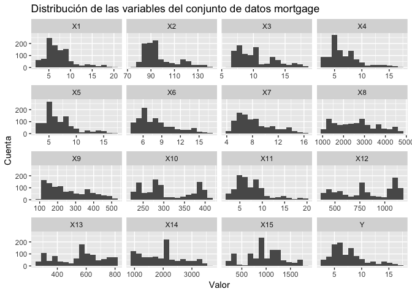

Se puede observar como parecen haber diversidad de distribuciones en los
valores de las variables. Así, parece que hay variables con
**distribuciones uniformes (X3, X8)**, con **distribucion con asimetría
derecha (X1, X2, X4...)** y con **múltiples campanas (X10, X12)**. El
caso de la asimetría derecha es el más común y tiene sentido entre las
variables que corresponen a los ratios, al representar la variación
entre periodos consecutivos, que cabe pensar que será normalmente baja o
tenderá a valores inferiores.

#### Test de normalidad

Es interesante saber si las variables siguen una distribución normal.
Por ello, calculamos su kurtosis, asimetría y los test estadísticos de
Saphiro-Wilk y Jarque-Bera:

    normality_tests(mortgage_ds)

    ##        Kurtosis   Skewness Shapiro_Wilk  Jarque_Bera
    ## X1   1.73359552  1.3281795 2.153975e-27 0.000000e+00
    ## X2   0.27693169  1.1081196 1.655740e-28 0.000000e+00
    ## X3  -0.24013063  0.8263090 2.273632e-24 0.000000e+00
    ## X4   1.14782186  1.2062746 2.206671e-26 0.000000e+00
    ## X5   1.14164019  1.1994865 2.806169e-26 0.000000e+00
    ## X6  -0.08284863  0.8626431 4.690727e-23 0.000000e+00
    ## X7  -0.26873571  0.8139356 5.455089e-23 0.000000e+00
    ## X8  -0.90854052  0.3116162 2.226746e-17 3.445022e-12
    ## X9  -0.92467825  0.5228948 2.724340e-22 0.000000e+00
    ## X10 -1.40514955  0.3380899 3.670243e-27 0.000000e+00
    ## X11  1.77905353  1.3414575 1.834836e-27 0.000000e+00
    ## X12 -1.40123170 -0.1719616 1.283104e-25 0.000000e+00
    ## X13 -1.05599627 -0.2097168 4.875242e-20 6.544765e-13
    ## X14 -0.81472939  0.3023447 1.405826e-17 1.922733e-10
    ## X15 -0.25973520 -0.1331363 8.632555e-14 5.133105e-02
    ## Y    0.49634176  1.0267593 2.816983e-24 0.000000e+00

En la distribución normal el valor de la asimetría es cero y el valor de
la curtosis es tres. Respecto a este supuesto, podemos ver como los
resultados arriba mostrados difieren, por lo que los dos test de
normalidad nos sacarán de dudas: - Jarque-Bera indica qué tanto se
desvían los coeficientes de asimetría y curtosis de los residuos con los
coeficientes de asimetría y curtosis de la distribución normal. **Para
este test, existe evidencia estadística para rechazar la hipótesis nula
en todos los casos y no podemos afirmar que no cumpla la normalidad**. -
Por su parte, para Shapiro-Wilk, \*\* en este test, se rechaza la
hipótesis nula en todos los casos y para todas las variables resultan
estar normalmente distribuidas\*\*.

### Relación entre variables

Un aspecto importante a tener en cuentra al analizar los datos, es el
posible duplicado de la información, al existir variables que puedan
aportar la misma información a los modelos. A continuación, se
visualizan en gráficos de dispersión la representación una a una de las
distintas variables con respecto a la variable a predecir a fin de
encontrar posibles relaciones entre las mismas:

    plot1v1(mortgage_ds)

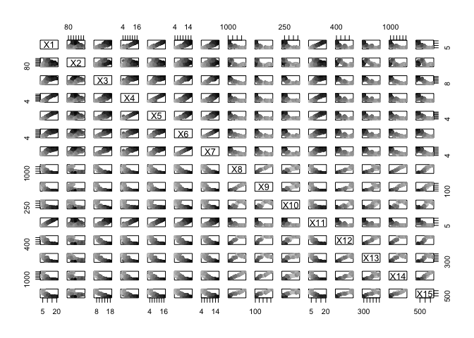

Parece que **hay varias variables que se encuentran correlacionadas y
altamente correlacionadas**. Para verificar esto, calculamos la
correlación entre variables y la representamos en un gráfico en forma de
matriz.

    corrplot.mixed(cor(mortgage_ds), number.cex=0.6)

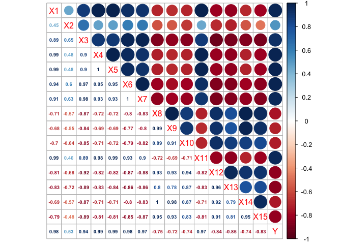

Tal y como indicaba la intuición, **hay muchas variables que se
encuentra perfectamente y altamente correlacionadas entre sí**. Los
casos más claros son, por ejemplo: **X4 y X5 (1)**, **X6 y X7 (1)**,
**X1 y X4 (0.99)**, **X1 y X5 (0.99)**...

#### Eliminación de variables correlacionadas

De acuerdo al análisis de la correlación entre variables anterior, se
desecharan aquellas más correlacionadas entre sí. Así, se eliminan las
variables que menos capacidad explicativa tienen debido a que la
información que desprenden se encuentra duplicada. Estas variables son:
**X1**, **X2**, **X3**, **X4**, **X7**, **X8**, **X9**, **X11**, **X12**
y **X14**.

    mortgage <- mortgage_ds[,c(-1,-2,-3,-4,-7,-8,-9,-11,-12,-14)]

Así pues, las variables estadísticamente independientes que permanecerán
en nuestro conjunto de datos son: **X5**, **X6**, **X10**, **X13** y
**X15**.

Regresión lineal simple
-----------------------

Para cada una de las distintas variables, se han creado modelos lineales
simples, a fin de determinar, con un único regresor, cual es el que
consigue un mejor ajuste lineal:

Modelo lineal para **X5**:

    lmfit1 <- lm(Y ~ X5, data=mortgage)
    summary(lmfit1)

    ## 
    ## Call:
    ## lm(formula = Y ~ X5, data = mortgage)
    ## 
    ## Residuals:
    ##      Min       1Q   Median       3Q      Max 
    ## -2.37518 -0.26782 -0.06079  0.26929  2.39573 
    ## 
    ## Coefficients:
    ##             Estimate Std. Error t value Pr(>|t|)    
    ## (Intercept) 0.425359   0.038267   11.12   <2e-16 ***
    ## X5          1.042352   0.005146  202.54   <2e-16 ***
    ## ---
    ## Signif. codes:  0 '***' 0.001 '**' 0.01 '*' 0.05 '.' 0.1 ' ' 1
    ## 
    ## Residual standard error: 0.4902 on 1047 degrees of freedom
    ## Multiple R-squared:  0.9751, Adjusted R-squared:  0.9751 
    ## F-statistic: 4.102e+04 on 1 and 1047 DF,  p-value: < 2.2e-16

    confint(lmfit1)

    ##                 2.5 %    97.5 %
    ## (Intercept) 0.3502698 0.5004475
    ## X5          1.0322535 1.0524505

    plot(Y ~ X5, mortgage, col = rgb(red = 0, green = 0, blue = 0, alpha = 0.2))
    points(mortgage$X5,fitted(lmfit1), col="green")

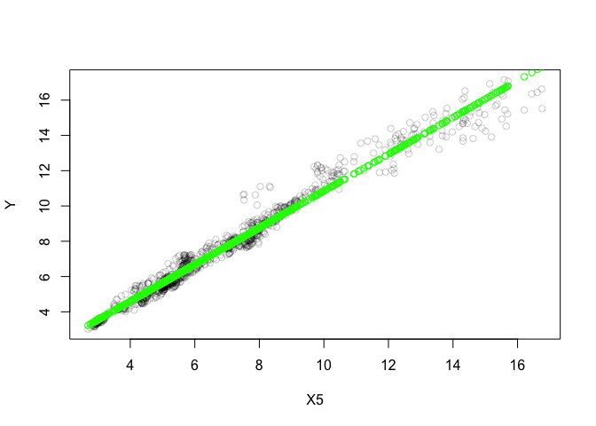

Modelo lineal para **X6**:

    lmfit2 <- lm(Y ~ X6, data=mortgage)
    summary(lmfit2)

    ## 
    ## Call:
    ## lm(formula = Y ~ X6, data = mortgage)
    ## 
    ## Residuals:
    ##      Min       1Q   Median       3Q      Max 
    ## -1.10658 -0.37752  0.00862  0.32976  2.33808 
    ## 
    ## Coefficients:
    ##              Estimate Std. Error t value Pr(>|t|)    
    ## (Intercept) -1.066373   0.049574  -21.51   <2e-16 ***
    ## X6           1.060725   0.005755  184.31   <2e-16 ***
    ## ---
    ## Signif. codes:  0 '***' 0.001 '**' 0.01 '*' 0.05 '.' 0.1 ' ' 1
    ## 
    ## Residual standard error: 0.5373 on 1047 degrees of freedom
    ## Multiple R-squared:  0.9701, Adjusted R-squared:  0.9701 
    ## F-statistic: 3.397e+04 on 1 and 1047 DF,  p-value: < 2.2e-16

    confint(lmfit2)

    ##                 2.5 %     97.5 %
    ## (Intercept) -1.163649 -0.9690976
    ## X6           1.049433  1.0720182

    plot(Y ~ X6, mortgage, col = rgb(red = 0, green = 0, blue = 0, alpha = 0.2))
    points(mortgage$X6,fitted(lmfit2), col="green")

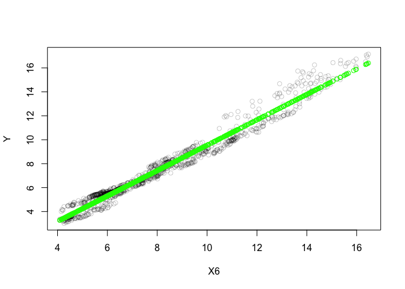

Modelo lineal para **X10**:

    lmfit3 <- lm(Y ~ X10, data=mortgage)
    summary(lmfit3)

    ## 
    ## Call:
    ## lm(formula = Y ~ X10, data = mortgage)
    ## 
    ## Residuals:
    ##     Min      1Q  Median      3Q     Max 
    ## -4.0824 -1.4379 -0.3336  1.2612  6.7580 
    ## 
    ## Coefficients:
    ##              Estimate Std. Error t value Pr(>|t|)    
    ## (Intercept) 19.332710   0.340603   56.76   <2e-16 ***
    ## X10         -0.038261   0.001085  -35.26   <2e-16 ***
    ## ---
    ## Signif. codes:  0 '***' 0.001 '**' 0.01 '*' 0.05 '.' 0.1 ' ' 1
    ## 
    ## Residual standard error: 2.101 on 1047 degrees of freedom
    ## Multiple R-squared:  0.5428, Adjusted R-squared:  0.5424 
    ## F-statistic:  1243 on 1 and 1047 DF,  p-value: < 2.2e-16

    plot(Y ~ X10, mortgage, col = rgb(red = 0, green = 0, blue = 0, alpha = 0.2))
    points(mortgage$X10,fitted(lmfit3), col="green")

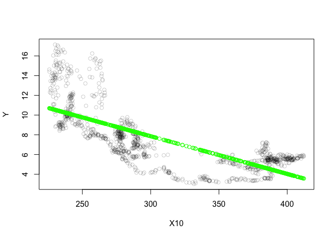

    confint(lmfit3)

    ##                   2.5 %      97.5 %
    ## (Intercept) 18.66436909 20.00105160
    ## X10         -0.04039032 -0.03613148

Modelo lineal para **X13**:

    lmfit4 <- lm(Y ~ X13, data=mortgage)
    summary(lmfit4)

    ## 
    ## Call:
    ## lm(formula = Y ~ X13, data = mortgage)
    ## 
    ## Residuals:
    ##     Min      1Q  Median      3Q     Max 
    ## -4.2486 -1.2480 -0.3401  1.0582  5.4469 
    ## 
    ## Coefficients:
    ##               Estimate Std. Error t value Pr(>|t|)    
    ## (Intercept) 16.7520050  0.1855978   90.26   <2e-16 ***
    ## X13         -0.0167515  0.0003247  -51.60   <2e-16 ***
    ## ---
    ## Signif. codes:  0 '***' 0.001 '**' 0.01 '*' 0.05 '.' 0.1 ' ' 1
    ## 
    ## Residual standard error: 1.651 on 1047 degrees of freedom
    ## Multiple R-squared:  0.7177, Adjusted R-squared:  0.7175 
    ## F-statistic:  2662 on 1 and 1047 DF,  p-value: < 2.2e-16

    plot(Y ~ X13, mortgage, col = rgb(red = 0, green = 0, blue = 0, alpha = 0.2))
    points(mortgage$X13,fitted(lmfit4), col="green")

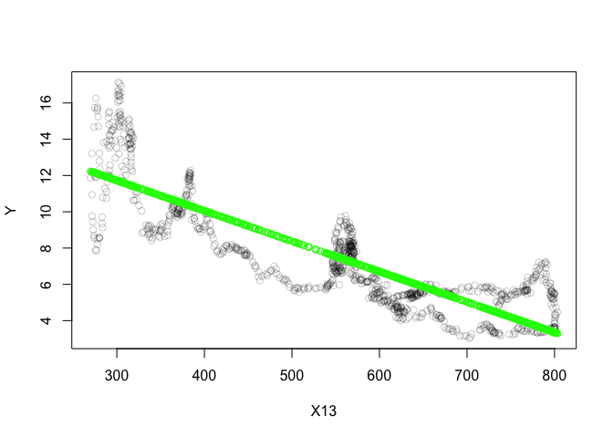

    confint(lmfit4)

    ##                   2.5 %     97.5 %
    ## (Intercept) 16.38781900 17.1161910
    ## X13         -0.01738852 -0.0161144

Modelo lineal para **X15**:

    lmfit5 <- lm(Y ~ X15, data=mortgage)
    summary(lmfit5)

    ## 
    ## Call:
    ## lm(formula = Y ~ X15, data = mortgage)
    ## 
    ## Residuals:
    ##     Min      1Q  Median      3Q     Max 
    ## -4.9956 -1.1258 -0.0796  0.9684  5.4414 
    ## 
    ## Coefficients:
    ##               Estimate Std. Error t value Pr(>|t|)    
    ## (Intercept) 14.1191497  0.1490586   94.72   <2e-16 ***
    ## X15         -0.0068874  0.0001455  -47.34   <2e-16 ***
    ## ---
    ## Signif. codes:  0 '***' 0.001 '**' 0.01 '*' 0.05 '.' 0.1 ' ' 1
    ## 
    ## Residual standard error: 1.753 on 1047 degrees of freedom
    ## Multiple R-squared:  0.6816, Adjusted R-squared:  0.6813 
    ## F-statistic:  2241 on 1 and 1047 DF,  p-value: < 2.2e-16

    plot(Y ~ X15, mortgage, col = rgb(red = 0, green = 0, blue = 0, alpha = 0.2))
    points(mortgage$X15,fitted(lmfit5), col="green")

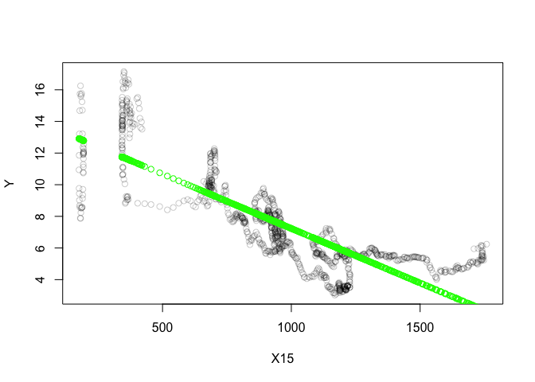

    confint(lmfit5)

    ##                    2.5 %       97.5 %
    ## (Intercept) 13.826662074 14.411637338
    ## X15         -0.007172881 -0.006601966

#### Mejor modelo lineal simple

Todos los modelos son significativos atendiendo al estadístico-t. A
continuación, se muestran los resultados de los modelos atendiendo a la
capacidad explicativa de los mismos:

    lmResults <- rbind(lmfit1 = summary(lmfit1)$r.squared)
    lmResults <- rbind(lmResults, lmfit2 = summary(lmfit2)$r.squared)
    lmResults <- rbind(lmResults, lmfit3 = summary(lmfit3)$r.squared)
    lmResults <- rbind(lmResults, lmfit4 = summary(lmfit4)$r.squared)
    lmResults <- rbind(lmResults, lmfit5 = summary(lmfit5)$r.squared)
    colnames(lmResults) <- "R Squared"
    lmResults

    ##        R Squared
    ## lmfit1 0.9751122
    ## lmfit2 0.9701011
    ## lmfit3 0.5428042
    ## lmfit4 0.7177322
    ## lmfit5 0.6816145

El mejor modelo lineal simple obtenido se es **lmdit1**, corresponde a
la variable **X5**, pues su capacidad explicativa es la mayor **(R^2
mayor)**.

Regresión lineal múltiple
-------------------------

A continuación, se tienen en consideración más predictores, la inclusión
de un orden mayor en los mismos e interacciones entre estos, a fin de
lograr un modelo con mayor capacidad explicativa.

### Modelo con todas las variables como regresores:

Se crea un modelo con todas las variables como regresores:

    lmfit6 <- lm(Y ~., data=mortgage)
    summary(lmfit6)

    ## 
    ## Call:
    ## lm(formula = Y ~ ., data = mortgage)
    ## 
    ## Residuals:
    ##      Min       1Q   Median       3Q      Max 
    ## -0.74155 -0.10531 -0.00497  0.09862  0.83737 
    ## 
    ## Coefficients:
    ##               Estimate Std. Error t value Pr(>|t|)    
    ## (Intercept) -1.799e+00  7.379e-02 -24.375  < 2e-16 ***
    ## X5           5.256e-01  6.243e-03  84.198  < 2e-16 ***
    ## X6           5.931e-01  7.104e-03  83.484  < 2e-16 ***
    ## X10          3.713e-03  2.072e-04  17.924  < 2e-16 ***
    ## X13         -4.013e-04  8.574e-05  -4.680 3.24e-06 ***
    ## X15          1.546e-05  2.999e-05   0.515    0.606    
    ## ---
    ## Signif. codes:  0 '***' 0.001 '**' 0.01 '*' 0.05 '.' 0.1 ' ' 1
    ## 
    ## Residual standard error: 0.1667 on 1043 degrees of freedom
    ## Multiple R-squared:  0.9971, Adjusted R-squared:  0.9971 
    ## F-statistic: 7.251e+04 on 5 and 1043 DF,  p-value: < 2.2e-16

Tal y como se puede apreciar, la variable **X15** no es significativa
para el modelo.

### Modelo sin la variable X15:

Así pues, se elimina la variable no significativa para el modelo
(**X15**):

    lmfit7 <- lm(Y ~.-X15, data=mortgage)
    summary(lmfit7)

    ## 
    ## Call:
    ## lm(formula = Y ~ . - X15, data = mortgage)
    ## 
    ## Residuals:
    ##      Min       1Q   Median       3Q      Max 
    ## -0.74195 -0.10611 -0.00545  0.09985  0.83391 
    ## 
    ## Coefficients:
    ##               Estimate Std. Error t value Pr(>|t|)    
    ## (Intercept) -1.788e+00  7.097e-02 -25.195  < 2e-16 ***
    ## X5           5.253e-01  6.212e-03  84.560  < 2e-16 ***
    ## X6           5.924e-01  6.953e-03  85.194  < 2e-16 ***
    ## X10          3.756e-03  1.903e-04  19.736  < 2e-16 ***
    ## X13         -4.021e-04  8.569e-05  -4.692 3.06e-06 ***
    ## ---
    ## Signif. codes:  0 '***' 0.001 '**' 0.01 '*' 0.05 '.' 0.1 ' ' 1
    ## 
    ## Residual standard error: 0.1667 on 1044 degrees of freedom
    ## Multiple R-squared:  0.9971, Adjusted R-squared:  0.9971 
    ## F-statistic: 9.071e+04 on 4 and 1044 DF,  p-value: < 2.2e-16

Podemos apreciar como la capacidad explicativa del modelo se mantiene
intacta.

### Mejor modelo lineal múltiple obtenido

Tras añadir una interacción entre todos los regresores e incrementar al
cuadrado el orden de X6, se ha obtenido el mejor resultado de acuerdo al
**R cuadrado ajustado (0.9986)**:

    lmfit8 <- lm(Y ~ X5*X6*X10*X13+I(X6^2), data=mortgage)
    summary(lmfit8)

    ## 
    ## Call:
    ## lm(formula = Y ~ X5 * X6 * X10 * X13 + I(X6^2), data = mortgage)
    ## 
    ## Residuals:
    ##      Min       1Q   Median       3Q      Max 
    ## -0.65004 -0.06663 -0.00183  0.06407  0.72728 
    ## 
    ## Coefficients:
    ##                 Estimate Std. Error t value Pr(>|t|)    
    ## (Intercept)    9.555e+00  1.362e+00   7.016 4.11e-12 ***
    ## X5            -2.077e+00  3.928e-01  -5.287 1.52e-07 ***
    ## X6            -5.262e-01  2.367e-01  -2.223   0.0264 *  
    ## X10           -2.798e-02  5.031e-03  -5.561 3.42e-08 ***
    ## X13           -2.804e-02  2.129e-03 -13.173  < 2e-16 ***
    ## I(X6^2)        5.056e-02  4.336e-03  11.661  < 2e-16 ***
    ## X5:X6          2.095e-01  2.192e-02   9.558  < 2e-16 ***
    ## X5:X10         1.073e-02  1.547e-03   6.937 7.08e-12 ***
    ## X6:X10         6.913e-04  7.103e-04   0.973   0.3307    
    ## X5:X13         7.135e-03  4.414e-04  16.163  < 2e-16 ***
    ## X6:X13         2.816e-03  4.047e-04   6.959 6.09e-12 ***
    ## X10:X13        8.401e-05  6.927e-06  12.128  < 2e-16 ***
    ## X5:X6:X10     -8.126e-04  8.641e-05  -9.404  < 2e-16 ***
    ## X5:X6:X13     -8.048e-04  4.576e-05 -17.587  < 2e-16 ***
    ## X5:X10:X13    -2.465e-05  1.791e-06 -13.764  < 2e-16 ***
    ## X6:X10:X13    -7.150e-06  1.245e-06  -5.743 1.22e-08 ***
    ## X5:X6:X10:X13  2.615e-06  1.651e-07  15.841  < 2e-16 ***
    ## ---
    ## Signif. codes:  0 '***' 0.001 '**' 0.01 '*' 0.05 '.' 0.1 ' ' 1
    ## 
    ## Residual standard error: 0.1165 on 1032 degrees of freedom
    ## Multiple R-squared:  0.9986, Adjusted R-squared:  0.9986 
    ## F-statistic: 4.648e+04 on 16 and 1032 DF,  p-value: < 2.2e-16

### Modelo con resultado muy bueno e interpretable

Este modelo utiliza únicamente las variables **X5** y **X6** y obtiene
un resultado parecido al anterior. Por lo que cabe tenerlo en
consideración, debido a la poca complejidad en su interpretación.

    lmfit8 <- lm(Y ~ X5+X6, data=mortgage)
    summary(lmfit8)

    ## 
    ## Call:
    ## lm(formula = Y ~ X5 + X6, data = mortgage)
    ## 
    ## Residuals:
    ##      Min       1Q   Median       3Q      Max 
    ## -0.79483 -0.14587  0.02164  0.13670  0.89020 
    ## 
    ## Coefficients:
    ##              Estimate Std. Error t value Pr(>|t|)    
    ## (Intercept) -0.465975   0.020192  -23.08   <2e-16 ***
    ## X5           0.561791   0.007080   79.34   <2e-16 ***
    ## X6           0.514113   0.007224   71.17   <2e-16 ***
    ## ---
    ## Signif. codes:  0 '***' 0.001 '**' 0.01 '*' 0.05 '.' 0.1 ' ' 1
    ## 
    ## Residual standard error: 0.2029 on 1046 degrees of freedom
    ## Multiple R-squared:  0.9957, Adjusted R-squared:  0.9957 
    ## F-statistic: 1.223e+05 on 2 and 1046 DF,  p-value: < 2.2e-16

**Interpretación**: Por cada unidad que se incrementan las variables X5
y X6, la variable a explicar se incrementa en 0.562 y 0.514,
respectivamente.

Análisis de la regresión usando k-NN
------------------------------------

A continuación, se usa el método de k-vecinos cercanos para llevar a
cabo el análisis de la regresión. En primer lugar se estudia la
aplicabilidad de este método sobre los modelos obtenidos en la regresión
lineal, a fin de ver si hay mejores resultados.

### k-NN sobre mejor modelo con un predictor

Se aplica k-NN sobre el mejor modelo obtenido anteriormente, el cual
solo hace uso de un predictor:

    knnfit1 <- kknn(Y ~ X5, mortgage, mortgage)
    plot(Y ~ X5, mortgage, col = rgb(red = 0, green = 0, blue = 0, alpha = 0.2))
    points(mortgage$X5, knnfit1$fitted.values, col="green")

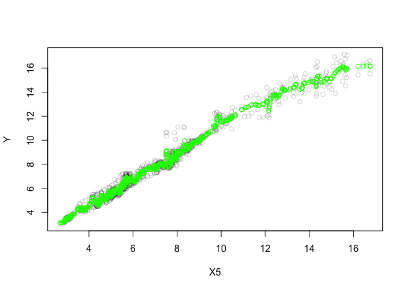

La distancia media cuadrática mínima para el modelo con la variable X5
solo es de:

    sqrt(sum((mortgage$Y - knnfit1$fitted.values)^2)/length(knnfit1$fitted.values))

    ## [1] 0.3562593

### Modelo con todos los predictores

A continuación, se utiliza el algoritmo de k-vecinos cercanos con todos
los predictores:

    knnfit2 <- kknn(Y ~ ., mortgage, mortgage)
    sqrt(sum((mortgage$Y - knnfit2$fitted.values)^2)/length(knnfit2$fitted.values))

    ## [1] 0.06950379

Tal y como podemos apreciar, la distancia media cuadrática mínima
disminuye significativamente con respecto al modelo con un único
predictor.

### k-NN en el mejor modelo obtenido en LM

A continuación, se ejecuta el algoritmo para el mejor modelo lineal
obtenido anteriomente:

    knnfit3 <- kknn(Y ~ X5*X6*X10*X13+I(X6^2), mortgage, mortgage)
    sqrt(sum((mortgage$Y - knnfit3$fitted.values)^2)/length(knnfit3$fitted.values))

    ## [1] 0.07011277

Se puede observar que no tiene un buen efecto sobre este algoritmo, pues
la distancia media cuadrática mínima se incrementa respecto al modelo
anterior.

### Mejor modelo obtenido para k-NN

Para k-NN, el mejor modelo que se ha obtenido consta de una interacción
de términos logarítmicos, que implica a todos los regresores y el
cuadrado del término X13:

    knnfit4 <- kknn(Y ~.+log(X5)*log(X6)*log(X13)*log(X15)+I(X13^2), mortgage, mortgage)
    sqrt(sum((mortgage$Y - knnfit4$fitted.values)^2)/length(knnfit4$fitted.values))

    ## [1] 0.05776201

**El error disminuye un 15%** sobre el mejor modelo que se había
obtenido hasta el momento.

Validación cruzada de los mejores modelos obtenidos
---------------------------------------------------

A continuación, se ejecuta validación cruzada sobre el mejor modelo
obtenido para cada uno de los algoritmos anteriores.

### CV en mejor LM

El mejor LM obtenido se corresponde con: &gt; Y ~ X5 \* X6 \* X10 \* X13
+ I(X6^2)

    mean(sapply(1:5,run_lm_fold,"mortgage","train",
                Y ~ X5*X6*X10*X13+I(X6^2)))

    ## [1] 0.01327059

    mean(sapply(1:5,run_lm_fold,"mortgage","test",
                Y ~ X5*X6*X10*X13+I(X6^2)))

    ## [1] 0.01408431

Se aprecia como si bien, el error es bastante bajo respecto al orden de
la variable dependiente, además la escasa diferencia entre train y test
nos deja entrever como el modelo está bien ajustado.

### CV en mejor k-NN

El mejor modelo k-NN se corresponde con: &gt; Y ~ log(X5) \* log(X6) \*
log(X13) \* log(X15) + I(X13^2)

    mean(sapply(1:5,run_knn_fold,"mortgage","train",
                Y ~ log(X5)*log(X6)*log(X13)*log(X15)+I(X13^2)))

    ## [1] 0.004422799

    mean(sapply(1:5,run_knn_fold,"mortgage","test",
                Y ~ log(X5)*log(X6)*log(X13)*log(X15)+I(X13^2)))

    ## [1] 0.01279527

Podemos observar como tanto para train y test, el error es inferior con
respecto al LM. Sin embargo, el incremento del error en el test, puede
significar que el modelo sobreajuste algo, aunque considerando tanto el
pequeño valor del error como el orden de la variable a predecir, este
efecto no tiene una gran influencia.

Comparativa entre distintos algoritmos
--------------------------------------

A continuación se lleva a cabo una comparativa de los algoritmos de
regresión utilizados (LM y KNN) a fin de determinar si existen
diferencias significativas entre los mismos.

### Modelos a comparar para el presente conjunto de datos

Para comparar los algoritmos es necesario ejecutar modelos en igualdad
de condiciones. En nuestro caso ejecutaremos 5 fold-cv tanto para train
y test, para cada uno de los dos algoritmos y con todas las variables
como regresores.

    out_train_lm <- mean(sapply(1:5,run_lm_fold,"mortgage","train",Y~.))
    out_test_lm <- mean(sapply(1:5,run_lm_fold,"mortgage","test",Y~.))

    out_train_knn <- mean(sapply(1:5,run_knn_fold,"mortgage","train",Y~.)) 
    out_test_knn <- mean(sapply(1:5,run_knn_fold,"mortgage","test",Y~.))

A continuación, guardamos dichos resultados en la celda correspondiente
dentro de la tabla de comparativas de estos algoritmos para distintos
conjuntos de datos:

    # leemos la tablacon los errores medios de test
    resultados <- read.csv("DATOS/regr_test_alumnos.csv")
    tablatst <- cbind(resultados[,2:dim(resultados)[2]])
    colnames(tablatst) <- names(resultados)[2:dim(resultados)[2]]
    rownames(tablatst) <-resultados[,1]
    # guardamos nuestros resultados para el test
    tablatst["mortgage","out_test_lm"] <- out_test_lm
    tablatst["mortgage","out_test_kknn"] <- out_test_knn

    # leemos la tablacon los errores medios de entrenamiento
    resultados<-read.csv("DATOS/regr_train_alumnos.csv")
    tablatra<-cbind(resultados[,2:dim(resultados)[2]])
    colnames(tablatra) <-names(resultados)[2:dim(resultados)[2]]
    rownames(tablatra) <-resultados[,1]
    # guardamos nuestros resultados para el train
    tablatra["mortgage","out_train_lm"] <- out_train_lm
    tablatra["mortgage","out_train_kknn"] <- out_train_knn

Normalización de los errores en LM

    ## lm (other) vs knn(ref)
    # + 0.1 porque wilcox R falla para valores == 0 enla tabla
    difs<-(tablatst[,1] -tablatst[,2]) / tablatst[,1]
    wilc_1_2 <-cbind(ifelse(difs<0, abs(difs)+0.1, 0+0.1), ifelse(difs>0, abs(difs)+0.1,0+0.1))
    colnames(wilc_1_2) <-c(colnames(tablatst)[1], colnames(tablatst)[2])
    head(wilc_1_2)

    ##      out_test_lm out_test_kknn
    ## [1,]   0.1909091     0.1000000
    ## [2,]   0.1000000     1.0294118
    ## [3,]   0.1000000     0.4339071
    ## [4,]   0.1000000     0.3885965
    ## [5,]   0.1548506     0.1000000
    ## [6,]   0.1000000     0.3061057

### Comparativa por pares de LM y KNN (Wilcoxon’s test)

El test de Wilcoxon es una prueba no paramétrica para comparar el rango
medio de dos muestras relacionadas y determinar si existen diferencias
entre ellas. En nuestro caso, estas dos muestras relacionadas son los
resultados para cada dataset obtenidos por medio de cada uno de los
algoritmos a comparar:

    LMvsKNNtst <- wilcox.test(wilc_1_2[,1], wilc_1_2[,2], alternative = "two.sided", paired=TRUE)
    Rmas <- LMvsKNNtst$statistic
    pvalue <- LMvsKNNtst$p.value
    LMvsKNNtst <- wilcox.test(wilc_1_2[,2], wilc_1_2[,1], alternative = "two.sided", paired=TRUE)
    Rmenos <- LMvsKNNtst$statistic
    Rmas

    ##  V 
    ## 78

    Rmenos

    ##  V 
    ## 93

    pvalue

    ## [1] 0.7660294

**No existen diferencias significativas entre ambos**. Sólo hay un
(1-0.7660) x 100 = **23.4%** de confianza en que sean distintos.

### Test de Friedman

Al igual que el test de Wilcoxon, el test de friedman sirve para
identificar si existen diferencias significativas entre al menos un par
de algoritmos, por medio de la comparación de la similitud de los
resultados de los mismos para los mismos datasets:

    test_friedman<-friedman.test(as.matrix(tablatst))
    test_friedman

    ## 
    ##  Friedman rank sum test
    ## 
    ## data:  as.matrix(tablatst)
    ## Friedman chi-squared = 8.4444, df = 2, p-value = 0.01467

**Existen diferencias significativas** al menos entre un par de
algoritmos.

### Post-hoc Holm

De acuerdo al resultado del test de Friedman, tenemos que realizar un
post-hoc que nos diga qué algoritmos pueden considerarse similares entre
sí:

    tam <-dim(tablatst)
    groups <-rep(1:tam[2], each=tam[1])
    pairwise.wilcox.test(as.matrix(tablatst), groups, p.adjust= "holm", paired = TRUE)

    ## 
    ##  Pairwise comparisons using Wilcoxon signed rank test 
    ## 
    ## data:  as.matrix(tablatst) and groups 
    ## 
    ##   1     2    
    ## 2 0.580 -    
    ## 3 0.081 0.108
    ## 
    ## P value adjustment method: holm

Existen diferencias significativas a favor de M5’ (3vs1 0.081 y 3vs2
0.108, con aprox. 90% de confianza) mientras que los otros dos pueden
ser considerados equivalentes

Clasificación en el conjunto de datos hayes-roth
================================================

En este epígrafe se presenta el uso de distintos algoritmos de
clasificación sobre el conjunto de datos **hayes-roth**, el cual
clasifica en dos clubes distintos o en ninguno a sujetos de acuerdo a
diferentes características personales de los mismos.

Conjunto de datos: hayes-roth
-----------------------------

El conjunto de datos a utilizar es el ***hayes-roth***, el cual contiene
información de disntintos sujetos humanos, que son clasificados en tres
clases distintas, correspondientes al club al que se les debería asignar
(club 1, club 2 o ninguno de estos). Así, el conjunto se compone de 4
variables de entrada (información del sujeto) y 1 de salida, así como
160 observaciones (personas). Todas las variables son de tipo entero.

Las variables son las siguientes:

-   **X1**: Hobby {chess, sport, stamps}
-   **X2**: Age {30, 40, 50, 60}
-   **X3**: Educational Level {junior high, high school, trade school,
    college}
-   **X4**: Marital Status {single, married, divorced, widowed}
-   **Y**: Club {club 1, club 2, neither}

### Lectura de datos:

A continuación, del fichero con los conjuntos de datos provistos para la
parte de regresión de este trabajo, extraemos aquellos ficheros
correspondientes a nuestro dataset (hayes-roth):

    unzipDAT(zipFile = "Datos/Datasets Clasificacion.zip", dataset = "hayes-roth", outDir = "DATOS")

Usando la librería *RKEEL*, cargamos el fichero con extensión *.dat*
correspondiente al conjunto de datos completo y visualizamos las
primeras líneas:

    hayes_ds <- read.keel(file = "Datos/hayes-roth.dat")
    head(hayes_ds)

    ##   Hobby Age EducationalLevel MaritalStatus Class
    ## 1     2   1                1             2     1
    ## 2     2   1                3             2     2
    ## 3     3   1                4             1     3
    ## 4     2   4                2             2     3
    ## 5     1   1                3             4     3
    ## 6     1   1                3             2     2

Análisis exploratorio de datos (EDA)
------------------------------------

A fin de tener una idea de la composición del conjunto de datos para
posteriomente llevar a cabo un análisis mas acertado, realizamos una
inspección del mismo.

### Estructura del conjunto de datos

En primer lugar comprobamos que las dimensiones se ajustan a las
características del conjunto de datos:

    dim(hayes_ds)

    ## [1] 160   5

De acuerdo a las características del conjunto de datos, **hay 5
variables y 160 observaciones**.

Comprobamos la estructura y tipo de cada una de las varibales del
conjunto de datos:

    str(hayes_ds)

    ## 'data.frame':    160 obs. of  5 variables:
    ##  $ Hobby           : Factor w/ 3 levels "1","2","3": 2 2 3 2 1 1 3 3 2 1 ...
    ##  $ Age             : Factor w/ 4 levels "1","2","3","4": 1 1 1 4 1 1 1 4 2 2 ...
    ##  $ EducationalLevel: Factor w/ 4 levels "1","2","3","4": 1 3 4 2 3 3 3 2 1 1 ...
    ##  $ MaritalStatus   : Factor w/ 4 levels "1","2","3","4": 2 2 1 2 4 2 2 4 1 1 ...
    ##  $ Class           : Factor w/ 3 levels "1","2","3": 1 2 3 3 3 2 2 3 1 1 ...

### Transformación de variables

Cambiamos el nombre de las etiquetas para mayor facilidad en su
nomenclatura:

    colnames(hayes_ds) <- c(paste("X", 1:(length(hayes_ds)-1), sep = ""), "Y")
    names(hayes_ds)

    ## [1] "X1" "X2" "X3" "X4" "Y"

Añadimos las etiquetas correspondientes a cada uno de los valores de las
variables, a fin de poder tener una mejor idea de lo que ocurre dentro
de los datos:

    # Etiquetado de cada uno de los valores
    hayes_ds$X1 = factor(hayes_ds$X1, 
                              levels = 1:3, 
                              labels = c("chess", "sport", "stamps"))
    hayes_ds$X2 = factor(hayes_ds$X2, 
                              levels = 1:4, 
                              labels = c(30,40,50,60))
    hayes_ds$X3 = factor(hayes_ds$X3, 
                              levels = 1:4, 
                              labels = c("junior high", "high school", 
                                         "trade school", "college"))
    hayes_ds$X4 = factor(hayes_ds$X4, 
                              levels = 1:4, 
                              labels = c("single", "married", "divorced", 
                                         "widowed"))
    hayes_ds$Y = factor(hayes_ds$Y, 
                              levels = 1:3, 
                              labels = c("club 1", "club 2", "neither"))

    head(hayes_ds)

    ##       X1 X2           X3      X4       Y
    ## 1  sport 30  junior high married  club 1
    ## 2  sport 30 trade school married  club 2
    ## 3 stamps 30      college  single neither
    ## 4  sport 60  high school married neither
    ## 5  chess 30 trade school widowed neither
    ## 6  chess 30 trade school married  club 2

### Valores perdidos

Comprobamos si hay valores perdidos y en qué columna se encuentran, para
así poderlos tratar con posterioridad:

    hayes_ds %>% summarise_all(funs(sum(is.na(.))))

    ##   X1 X2 X3 X4 Y
    ## 1  0  0  0  0 0

Tal y como se puede apreciar, **no hay valores perdidos** en este
conjunto de datos.

### Análisis descriptivo de las variables

A fin de tener una imagen de cada una de las variables, se muestran los
estadísticos descriptivos más importantes. Cabe tener en consideración,
que al tratarse de variables categóricas, se consideraran frecuencias y
densidades como las dos herramientas más útiles para su análisis:

    summary(hayes_ds)

    ##       X1      X2                X3            X4           Y     
    ##  chess :72   30:59   junior high :59   single  :59   club 1 :65  
    ##  sport :44   40:59   high school :59   married :59   club 2 :64  
    ##  stamps:44   50:29   trade school:29   divorced:29   neither:31  
    ##              60:13   college     :13   widowed :13

### Distribución gráfica de las variables

En diagramas de pastel, se muestra a continuación la distribución de
valores que se sigue en cada una de las variables:

    par(mfrow=c(2,3), oma = c(0, 0, 2, 0))
    pies <- sapply(colnames(hayes_ds), 
                   function(x) pie(table(hayes_ds[,x]), 
                                   radius = 1, main = x))
    mtext("Distribución de las variables", outer = TRUE, cex = 1.5)

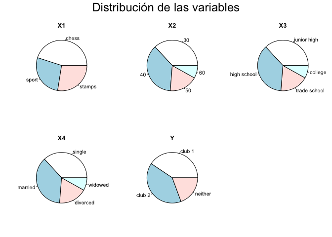

#### Distribución de acuerdo a la etiqueta

Se muestra en el siguiente panel, la distribución de cada una de las
variables condicionada al tipo de club al que se corresponde el sujeto:

    plot1 <- ggplot(hayes_ds, aes(x=X1,fill=Y))+geom_histogram(stat = "count")
    plot2 <- ggplot(hayes_ds, aes(x=X2,fill=Y))+geom_histogram(stat = "count")
    plot3 <- ggplot(hayes_ds, aes(x=X3,fill=Y))+geom_histogram(stat = "count")
    plot4 <- ggplot(hayes_ds, aes(x=X4,fill=Y))+geom_histogram(stat = "count")
    gridExtra::grid.arrange(plot1,plot2,plot3,plot4, 
                            top="Distribución de variables según etiquetas",
                            ncol = 2, nrow = 2)

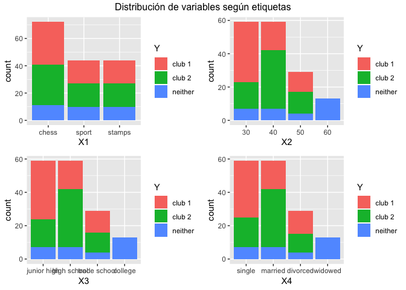
Se pueden observar hechos como que las personas jubiladas, personas de
60 años y las personas con estudios universitarios, no pertenecen a
clubes.

### Relación entre variables

Es necesario observar la existencia de posibles relaciones entre
variables, a fin de que estas puedan constituir criterios que distingan
a cada una de las clases de la variable de salida.

    corrplot.mixed(cor(data.matrix(hayes_ds)), number.cex=0.6)

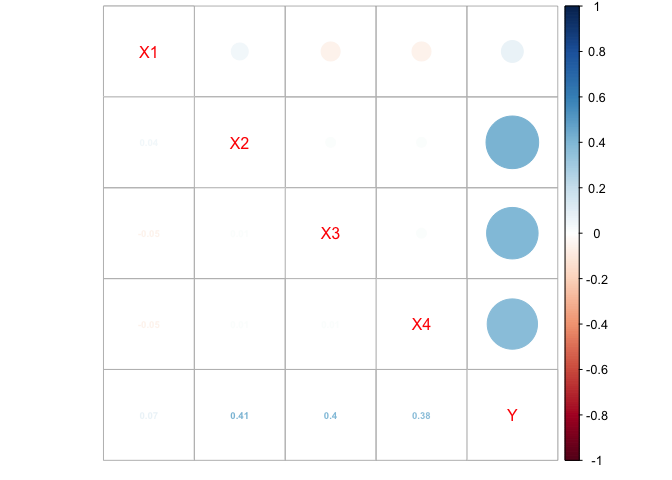

Tal y como se puede observar, no existe una relación clara a simple
vista. De todas formas, el cálculo del coeficiente de correlación lineal
de pearson tiene más sentido sobre variables contínuas o cuantitativas
con un número mayor de valores.

Por ello, a continuación se muestra de forma gráfica las relaciones
entre variables por medio de diagramas de mosaicos, los cuales tienen en
consideración la frecuencia de las ocurrencias de valores de variables,
condicionadas a los de otras.

**Y (Club) ~ X1 (Hobby) + X2 (Edad) | X4 (Estado civil)**

    mosaic(Y ~ X1 + X2 | X4, data = table(hayes_ds), 
           rot_labels=c(30,30,30,30), 
           offset_labels = c(0, 0, 0.5, 0.5))

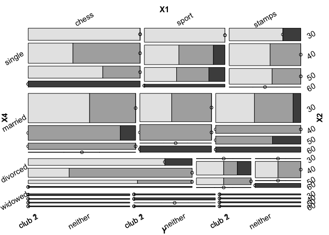

En este diagrama podemos apreciar distintos hechos:

-   En primer lugar vemos como todas las personas de 60 años no
    pertenecen a ningún club.
-   A su vez, ningún viudo pertenece a algún club.
-   La mayoría de personas de 40-50 años casadas, pertenecen al club 2,
    excepto a aquellos de 40 a quienes les gusta el deporte, los cuales
    no pertenecen a ninguno.
-   El grueso de componentes del club 1 se distribuye entre aquellos
    solteros de entre 30 y 50 años, casados de 30 años y divorciados de
    entre 30 y 50 años, menos aquellos de 30 años que les gustan los
    sellos y el deporte y los de 50 que les gustan los sellos.

**Y (Club) ~ X2 (Edad) + X3 (Nivel de educación) | X1 (Hobby)**

    mosaic(Y ~ X3 + X2 | X1, data = table(hayes_ds), 
           rot_labels=c(30,30,30,30), 
           offset_labels = c(0, 0, 0.5, 0.5))

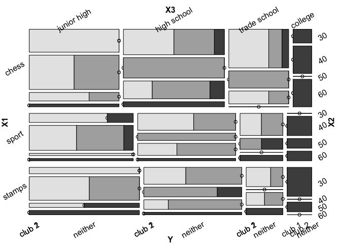

A su vez, en este diagrama podemos apreciar otros hechos:

-   Ningún universitario pertenece a algún club
-   El club 1 se conforma mayoritariamente se gente con educación
    primaria, principalmente de 30 y 50 años.
-   Las personas con educación secundaria y 40 años acuden generalmente
    al club 2.
-   **El hobby no parece significativo a la hora de elegir un club.**
    Pues no parece que existan patrones de comportamiento respecto a que
    esta variable condicione la elección del club.

Clasificación por medio de k-NN
-------------------------------

Llevaremos a cabo la clasificación de los sujetos en los clubes por
medio del algoritmo k-NN (k-vecinos cercanos) del paquete **caret**.

### Escalado de los datos

A fin de obtener unos mejores resultados en el modelo k-NN, se deben
escalar los datos:

    hayes_ds_n <- as.data.frame(lapply(as.data.frame(data.matrix(hayes_ds))[,1:4], 
                                       scale, center = TRUE, scale = TRUE))

### Valor óptimo de k

Separamos el conjunto de entrenamiento (en nuestro caso por cuestión de
tamaño, todo el conjunto de datos) de las etiquetas:

    hayes_train <- hayes_ds_n[,1:4]
    hayes_train_labels <- hayes_ds[,5]

Probaremos que valor de k es el que mejor se ajusta a nuestro problema.
Para ello generamos un set de semillas, a fin de que el resultado sea
replicable y efectuamos una validación cruzada con 10 folds.

    mySeeds <- setSeeds(method = "cv", numbers = 30, seed = 2468)
    trControl <- trainControl("cv", number = 10, seeds = mySeeds)

Ejecutamos el modelo con valor de k de 1 a 30, a fin de obtener con qué
valor tiene mayor precisión:

    compare.models <- train(hayes_train, 
                   hayes_train_labels, 
                   method="knn", 
                   trControl = trControl,
                   metric="Accuracy", 
                   tuneGrid = data.frame(.k=1:30))

    plot(compare.models)

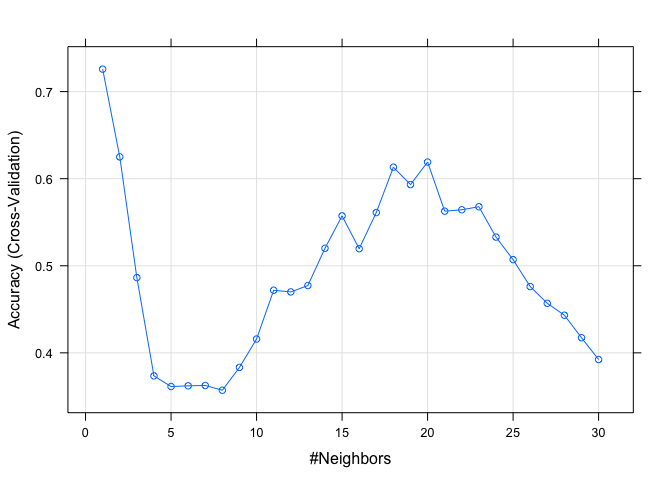

Como se puede apreciar, con **k = 1 el modelo obtiene los mejores
resultados**. Podemos estar seguros que con k = 1 el modelo no
sobreajustará, debido a que si bien la validación cruzada no es del todo
perfecta, tiende a minimizar el sobreajuste

### Mejor modelo k-NN

Una vez averiguado que el mejor valor de k es 1, ejecutamos el modelo:

    # Semilla y parámetros del algoritmo
    mySeeds <- setSeeds(method = "cv", numbers = 10, seed = 2410)
    trControl <- trainControl("cv", number = 10, seeds = mySeeds)
    # Modelo k-NN con 10-fold cross validation y k = 1
    knnfit <- train(hayes_train, 
                   hayes_train_labels, 
                   method="knn", 
                   trControl = trControl,
                   metric="Accuracy", 
                   tuneGrid = data.frame(.k=1))
    knnfit

    ## k-Nearest Neighbors 
    ## 
    ## 160 samples
    ##   4 predictor
    ##   3 classes: 'club 1', 'club 2', 'neither' 
    ## 
    ## No pre-processing
    ## Resampling: Cross-Validated (10 fold) 
    ## Summary of sample sizes: 144, 144, 144, 143, 144, 145, ... 
    ## Resampling results:
    ## 
    ##   Accuracy   Kappa    
    ##   0.7139951  0.5346367
    ## 
    ## Tuning parameter 'k' was held constant at a value of 1

Visualizamos la matriz de confusión para el modelo generado:

    confusionMatrix(knnfit)

    ## Cross-Validated (10 fold) Confusion Matrix 
    ## 
    ## (entries are percentual average cell counts across resamples)
    ##  
    ##           Reference
    ## Prediction club 1 club 2 neither
    ##    club 1    29.4    8.1     4.4
    ##    club 2    11.2   31.2     4.4
    ##    neither    0.0    0.6    10.6
    ##                             
    ##  Accuracy (average) : 0.7125

Como podemos observar:

-   El modelo se equivoca más veces (11.2%) al clasificar los miembros
    del club 1, a los cuales clasifica en el 2.
-   El modelo se equivoca en un 8.1% al clasificar a los miembros del
    club 2, que los clasifica en el 1.
-   El modelo se equivoca en un 4.4% tanto al clasificar a sujetos en el
    club 1 y en el 2, cuando realmente no le corresponden ninguno.

Clasificación por medio de LDA
------------------------------

Llevaremos a cabo la clasificación de los sujetos en los clubes por
medio del algoritmo LDA (Análisis Discriminante Lineal) del paquete
**caret**.

### Supuesto de normalidad

En primer lugar, es requisito para el correcto funcionamiento de LDA que
las variables se encuentren normalmente distribuidas, por lo que
realizamos los correspondientes tests de normalidad:

    normality_tests(hayes_train)

    ##     Kurtosis  Skewness Shapiro_Wilk Jarque_Bera
    ## X1 -1.498885 0.3336955 1.072203e-14 0.000148686
    ## X2 -0.546393 0.6398529 3.073812e-12 0.001583624
    ## X3 -0.546393 0.6398529 3.073812e-12 0.001583624
    ## X4 -0.546393 0.6398529 3.073812e-12 0.001583624

De acuerdo a los tests (Shapiro-Wilk y Jarque-Bera), las variables
siguen una distribución normal, por lo que podemos llevar a cabo el LDA.

### Igualdad entre varianzas

Otro requisito para la aplicación del algoritmo LDA es la igualdad entre
varianzas de las variables:

    apply(hayes_train, MARGIN = 2, var)

    ## X1 X2 X3 X4 
    ##  1  1  1  1

Tal y como se puede apreciar, las varianzas son iguales en todas las
variables.

### Modelo LDA

Teniendo en cuenta que se cumplen las hipótesis necesarias para que el
modelo LDA pueda aplicarse correctamente (normalidad de variables e
igualdad de varianzas), ejecutamos el modelo con todas las variables y
con una validación cruzada de 10-folds.

    # Semilla y parámetros del algoritmo
    mySeeds <- setSeeds(method = "cv", numbers = 10, seed = 2411)
    trControl <- trainControl("cv", number = 10, seeds = mySeeds)
    # Modelo LDA con 10-fold cross validation y todas las variables
    ldafit <- train(x = hayes_train, y = hayes_train_labels, 
                    method = "lda",
                    tuneLength = 10,
                    trControl = trControl)
    ldafit

    ## Linear Discriminant Analysis 
    ## 
    ## 160 samples
    ##   4 predictor
    ##   3 classes: 'club 1', 'club 2', 'neither' 
    ## 
    ## No pre-processing
    ## Resampling: Cross-Validated (10 fold) 
    ## Summary of sample sizes: 145, 143, 144, 144, 142, 145, ... 
    ## Resampling results:
    ## 
    ##   Accuracy   Kappa    
    ##   0.5479003  0.2818255

Obtenemos una precisión de **54.79%**, bastante inferior al modelo de
k-NN.

Visualizamos la matriz de confusión para el modelo generado:

    confusionMatrix(ldafit)

    ## Cross-Validated (10 fold) Confusion Matrix 
    ## 
    ## (entries are percentual average cell counts across resamples)
    ##  
    ##           Reference
    ## Prediction club 1 club 2 neither
    ##    club 1    24.4   19.4     0.0
    ##    club 2    15.6   16.9     5.6
    ##    neither    0.6    3.8    13.8
    ##                           
    ##  Accuracy (average) : 0.55

Como podemos observar:

-   El modelo se equivoca más veces (19.4%) al clasificar los miembros
    del club 2, a los cuales clasifica en el 1.
-   El modelo se equivoca en un 15.6% al clasificar a los miembros del
    club 1, que los clasifica en el 2.
-   El modelo se equivoca en un 5.6% al clasificar a sujetos en ningún
    club, cuando lo hace en el club 2.

Clasificación por medio de QDA
------------------------------

Llevaremos a cabo la clasificación de los sujetos en los clubes por
medio del algoritmo QDA (Análisis Discriminante Cuadrático) del paquete
**caret**. Este algoritmo debe cumplir los supuestos de normalidad de
sus variables e igualdad de varianzas, al igual que LDA. Como esto ya se
comprobó en el epígrafe correspondiente al LDA, se omitirá dicho paso.

### Modelo QDA

Ejecutamos el modelo con todas las variables y con una validación
cruzada de 10-folds.

    # Semilla y parámetros del algoritmo
    mySeeds <- setSeeds(method = "cv", numbers = 10, seed = 2411)
    trControl <- trainControl("cv", number = 10, seeds = mySeeds)
    # Modelo LDA con 10-fold cross validation y todas las variables
    qdafit <- train(x = hayes_train, y = hayes_train_labels, 
                    method = "qda",
                    tuneLength = 10,
                    trControl = trControl)
    qdafit

    ## Quadratic Discriminant Analysis 
    ## 
    ## 160 samples
    ##   4 predictor
    ##   3 classes: 'club 1', 'club 2', 'neither' 
    ## 
    ## No pre-processing
    ## Resampling: Cross-Validated (10 fold) 
    ## Summary of sample sizes: 145, 143, 144, 144, 142, 145, ... 
    ## Resampling results:
    ## 
    ##   Accuracy  Kappa    
    ##   0.608317  0.3883002

Obtenemos una precisión de **60.832%**, mejorando significativamente al
LDA.

Visualizamos la matriz de confusión para el modelo generado:

    confusionMatrix(qdafit)

    ## Cross-Validated (10 fold) Confusion Matrix 
    ## 
    ## (entries are percentual average cell counts across resamples)
    ##  
    ##           Reference
    ## Prediction club 1 club 2 neither
    ##    club 1    25.0   16.9     1.2
    ##    club 2    13.8   19.4     1.2
    ##    neither    1.9    3.8    16.9
    ##                             
    ##  Accuracy (average) : 0.6125

Como podemos observar:

-   El modelo se equivoca más veces (16.9%) al clasificar los miembros
    del club 2, a los cuales clasifica en el 1.
-   El modelo se equivoca en un 13.8% al clasificar a los miembros del
    club 1, que los clasifica en el 2.
-   El modelo clasifica notablemente mejor a los sujetos sin club que el
    modelo LDA.

### Comparativa entre algoritmos

A continuación, se lleva a cabo una comparativa entre los resultados
obtenidos para cada uno de los algoritmos utilizados para clasificación.

    barplot(c(knnfit$results$Accuracy, ldafit$results$Accuracy, qdafit$results$Accuracy), 
            main="Comparación de los algoritmos de clasificación", 
            names.arg=c("KNN", "LDA", "QDA"), ylim=c(0.50,0.75))

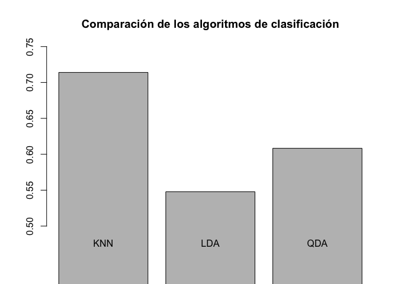

Tal y como se puede apreciar, para este conjunto de datos, el modelo
k-NN con k = 1 resulta la mejor aproximación, seguido por el QDA, con
casi un 10% menos de precisión y del LDA, con un resultado que apenas
logra un 55%.

Apéndice
========

A continuación se exponen todas aquellas librerías y funciones
utilizadas durante el presente análisis:

Librerías a utilizar
--------------------

    library(ggplot2)
    library(reshape2)
    library(fBasics)
    library(RKEEL)
    library(dplyr)
    library(corrplot)
    library(kknn)
    library(caret)
    library(vcd)
    library(gridExtra)

Lectura de datos
----------------

    # Extracción de .dat del zip de conjuntos de datos
    unzipDAT <- function(zipFile, dataset, outDir){
        analysis.files <- grep(paste(dataset,'.*\\.dat', sep = ""), 
                               unzip(zipFile, list=TRUE)$Name, 
                               ignore.case=TRUE, value=TRUE)
        if(sum(file.exists(file.path(outDir,basename(analysis.files))))!=length(analysis.files)){
            unzip(zipFile, files=analysis.files, exdir = outDir, junkpaths = TRUE)
        }
    }    

EDA
---

    # Crea un panel de histogramas con cada una de las variables
    histAllVars <- function(df, name = ""){
        ggplot(melt(df),aes(x = value)) + 
        facet_wrap(~variable,scales = "free_x") + 
        geom_histogram(bins = 15, binwidth = 1) +
        labs(title = paste("Distribución de las variables del conjunto de datos", name), 
             y = "Cuenta", x = "Valor" )
    }

    # Crea un panel de histogramas condicionado a la etiqueta
    histAllVarsCond <- function(df, name = ""){
        ggplot(melt(df, "Y"),aes(x = value, fill=Y)) + 
        facet_wrap(~variable,scales = "free_x") + 
        geom_histogram(bins = 15, binwidth = 1) +
        labs(title = paste("Distribución de las variables del conjunto de datos", name), 
             y = "Cuenta", x = "Valor" )
    }

    #Función para la obtención de tests de normalidad y parámetros de kurtosis y asimetría
    normality_tests <- function(df){
        df <- as.data.frame(data.matrix(df))
        kur <- colKurtosis(df)
        skew <- colSkewness(df)
        shap <- apply(df, MARGIN = 2, function(x) shapiro.test(x)$p.value)
        jarque <- apply(df, MARGIN = 2, function(x) jarqueberaTest(x)@test[["p.value"]])
        cbind(Kurtosis = kur, Skewness = skew, Shapiro_Wilk = shap, Jarque_Bera = jarque)
    }

    # Panel de gráficos de dispersión entre variables y la variable de salida 
    plot1v1 <- function(data){
        plot(data[,-dim(data)[2]],pch=16,
             col=gray(1-(data[,dim(data)[2]]/max(data[,dim(data)[2]]))))
    }

Regresión
---------

    # Validación cruzada para modelo lineal haciendo uso de particiones .dat
    run_lm_fold<-function(i, x, tt= "test", fun) {
        file <-paste("DATOS/",x, "-5-", i, "tra.dat", sep=""); 
        x_tra<-read.csv(file, comment.char="@")
        file <-paste("DATOS/",x, "-5-", i, "tst.dat", sep=""); 
        x_tst<-read.csv(file, comment.char="@")
        In <-length(names(x_tra)) -1
        names(x_tra)[1:In] <-paste ("X", 1:In, sep=""); names(x_tra)[In+1] <-"Y"
        names(x_tst)[1:In] <-paste ("X", 1:In, sep=""); names(x_tst)[In+1] <-"Y"
        if (tt== "train") { test <-x_tra}
        else { test <-x_tst}
        fitMulti=lm(fun,x_tra)
        yprime=predict(fitMulti,test)
        sum(abs(test$Y-yprime)^2)/length(yprime) ##MSE
    }

    # Validación cruzada para k-NN haciendo uso de particiones .dat
    run_knn_fold<-function(i, x, tt= "test", fun) {
        file <-paste("DATOS/",x, "-5-", i, "tra.dat", sep=""); 
        x_tra<-read.csv(file, comment.char="@")
        file <-paste("DATOS/",x, "-5-", i, "tst.dat", sep=""); 
        x_tst<-read.csv(file, comment.char="@")
        In <-length(names(x_tra)) -1
        names(x_tra)[1:In] <-paste ("X", 1:In, sep=""); names(x_tra)[In+1] <-"Y"
        names(x_tst)[1:In] <-paste ("X", 1:In, sep=""); names(x_tst)[In+1] <-"Y"
        if (tt== "train") { test <-x_tra}
        else { test <-x_tst}
        fitMulti=kknn(fun,x_tra,test)
        yprime=fitMulti$fitted.values
        sum(abs(test$Y-yprime)^2)/length(yprime) ##MSE
    }

Clasificación
-------------

    # Función para generar set de semillas.
    setSeeds <- function(method = "cv", numbers = 1, repeats = 1, tunes = NULL, seed = 1237) {
        B <- if (method == "cv") numbers
        else if(method == "repeatedcv") numbers * repeats
        else NULL
        if(is.null(length)) {
            seeds <- NULL
        } else {
            set.seed(seed = seed)
            seeds <- vector(mode = "list", length = B)
            seeds <- lapply(seeds, 
                            function(x) sample.int(n = 1000000, 
                                                   size = numbers + ifelse(is.null(tunes), 
                                                                           0, tunes)))
            seeds[[length(seeds) + 1]] <- sample.int(n = 1000000, size = 1)
        }
        seeds
    }
