Carga del fichero de funciones y librerías

    nombre<-"california"
    source("functions.R")
    library(RKEEL)

    ## Warning: package 'RKEEL' was built under R version 3.4.4

    library(kknn)

Se carga del dataset y visualización de las primeras líneas

    California <- read.keel("DATOS/california.dat")
    head(California)

    ##   Longitude Latitude HousingMedianAge TotalRooms TotalBedrooms Population
    ## 1   -117.03    32.78               17       5481          1618       2957
    ## 2   -118.23    33.80               26        239           135        165
    ## 3   -122.46    37.71               39       2076           482       1738
    ## 4   -122.06    37.94               19       4005           972       1896
    ## 5   -122.87    38.68               32       4073           718       2053
    ## 6   -122.47    37.66               18       4172           806       3226
    ##   Households MedianIncome MedianHouseValue
    ## 1       1537       2.5707           171300
    ## 2        112       1.3333           187500
    ## 3        445       3.1958           232100
    ## 4        893       2.5268           235700
    ## 5        629       3.7352           228000
    ## 6        790       5.7535           297900

Transformación de variable de salida (factor) a tipo numérico.

    California$MedianHouseValue <- as.numeric(California$MedianHouseValue)

Búsqueda de posibles relaciones entre cada una de las variables y la
salida

    par(mfrow=c(3,3))
    plotY(data = California, dep_var = 9)
    par(mfrow=c(1,1))

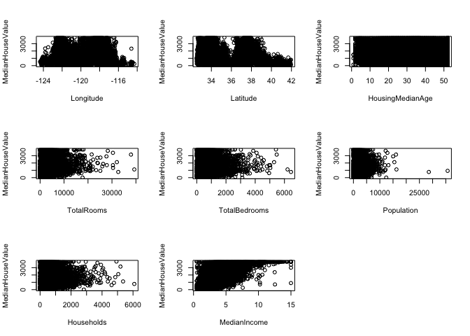

En una primera instancia podemos ver como las variables **TotalRooms**,
**TotalBedrooms** y **Households** tienen una relación parecida con la
variable dependiente, lo que podrá estudiarse por medio de una
visualización de variables a pares posteriormente para analizar la
posible correlación entre variables existente. Por su parte, parece
apreciarse una cierta relación entre la variable **MedianIncome** y la
variable dependiente.

    plot1v1(California)

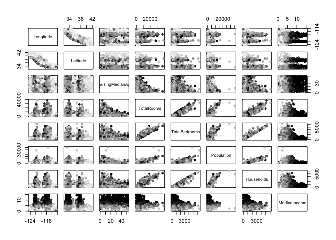

Tal y como se suponía, las variables **TotalRooms**, **TotalBedrooms** y
**Households** parecen estar aportando información parecida. En
**Longitud** y **Latitud** tambien parece existir una relación entre sí.

Para mayor facilidad en su nomenclatura, cambiamos los nombres de las
variables:

    colnames(California) <- c(paste("X", 1:(length(California)-1), sep = ""), "Y")
    names(California)

    ## [1] "X1" "X2" "X3" "X4" "X5" "X6" "X7" "X8" "Y"

Modelos lineales
----------------

Modelo lineal para **X1 Longitude**.

    fit1 <- lm(Y ~ X1, data=California)
    summary(fit1)

    ## 
    ## Call:
    ## lm(formula = Y ~ X1, data = California)
    ## 
    ## Residuals:
    ##     Min      1Q  Median      3Q     Max 
    ## -1676.7  -803.2  -203.4   616.5  2322.8 
    ## 
    ## Coefficients:
    ##              Estimate Std. Error t value Pr(>|t|)    
    ## (Intercept) -1218.114    425.221  -2.865  0.00418 ** 
    ## X1            -23.510      3.556  -6.612 3.89e-11 ***
    ## ---
    ## Signif. codes:  0 '***' 0.001 '**' 0.01 '*' 0.05 '.' 0.1 ' ' 1
    ## 
    ## Residual standard error: 1023 on 20638 degrees of freedom
    ## Multiple R-squared:  0.002114,   Adjusted R-squared:  0.002065 
    ## F-statistic: 43.72 on 1 and 20638 DF,  p-value: 3.886e-11

    plot(Y ~ X1, California, col = rgb(red = 0, green = 0, blue = 0, alpha = 0.2))
    points(California$X1, fitted(fit1), col="green")

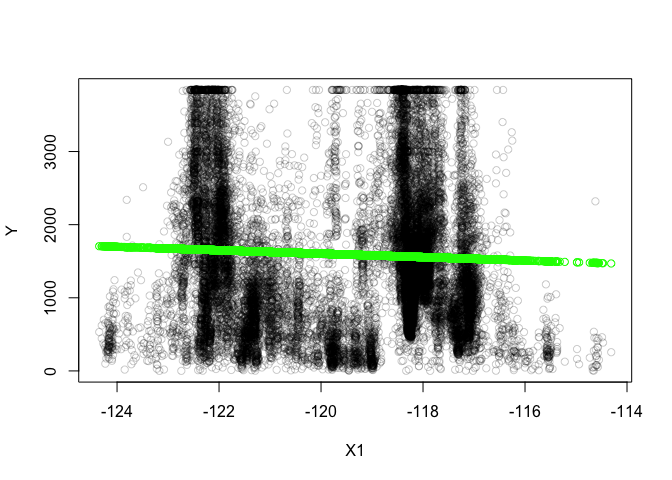

    confint(fit1)

    ##                   2.5 %     97.5 %
    ## (Intercept) -2051.58162 -384.64719
    ## X1            -30.48004  -16.54089

Modelo lineal para **X2 Latitude**.

    fit2 <- lm(Y ~ X2, data=California)
    summary(fit2)

    ## 
    ## Call:
    ## lm(formula = Y ~ X2, data = California)
    ## 
    ## Residuals:
    ##     Min      1Q  Median      3Q     Max 
    ## -1804.5  -780.9  -239.0   620.9  2489.6 
    ## 
    ## Coefficients:
    ##             Estimate Std. Error t value Pr(>|t|)    
    ## (Intercept)  4208.13     117.78   35.73   <2e-16 ***
    ## X2            -73.39       3.30  -22.24   <2e-16 ***
    ## ---
    ## Signif. codes:  0 '***' 0.001 '**' 0.01 '*' 0.05 '.' 0.1 ' ' 1
    ## 
    ## Residual standard error: 1012 on 20638 degrees of freedom
    ## Multiple R-squared:  0.02341,    Adjusted R-squared:  0.02336 
    ## F-statistic: 494.8 on 1 and 20638 DF,  p-value: < 2.2e-16

    plot(Y ~ X2, California, col = rgb(red = 0, green = 0, blue = 0, alpha = 0.2))
    points(California$X2, fitted(fit2), col="green")

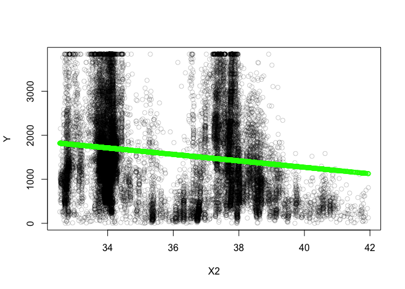

    confint(fit2)

    ##                  2.5 %     97.5 %
    ## (Intercept) 3977.27540 4438.98999
    ## X2           -79.85975  -66.92505

Modelo lineal para **X3 HousingMedianAge**.

    fit3 <- lm(Y ~ X3, data=California)
    summary(fit3)

    ## 
    ## Call:
    ## lm(formula = Y ~ X3, data = California)
    ## 
    ## Residuals:
    ##     Min      1Q  Median      3Q     Max 
    ## -1780.4  -791.3  -199.9   628.6  2463.8 
    ## 
    ## Coefficients:
    ##              Estimate Std. Error t value Pr(>|t|)    
    ## (Intercept) 1362.0364    17.6392   77.22   <2e-16 ***
    ## X3             8.0654     0.5639   14.30   <2e-16 ***
    ## ---
    ## Signif. codes:  0 '***' 0.001 '**' 0.01 '*' 0.05 '.' 0.1 ' ' 1
    ## 
    ## Residual standard error: 1020 on 20638 degrees of freedom
    ## Multiple R-squared:  0.009816,   Adjusted R-squared:  0.009768 
    ## F-statistic: 204.6 on 1 and 20638 DF,  p-value: < 2.2e-16

    plot(Y ~ X3, California, col = rgb(red = 0, green = 0, blue = 0, alpha = 0.2))
    points(California$X3, fitted(fit3), col="green")

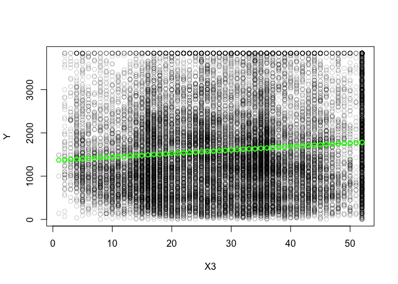

    confint(fit3)

    ##                   2.5 %      97.5 %
    ## (Intercept) 1327.462156 1396.610549
    ## X3             6.960167    9.170601

Modelo lineal para **X4 TotalRooms**.

    fit4 <- lm(Y ~ X4, data=California)
    summary(fit4)

    ## 
    ## Call:
    ## lm(formula = Y ~ X4, data = California)
    ## 
    ## Residuals:
    ##     Min      1Q  Median      3Q     Max 
    ## -2909.0  -802.7  -210.2   605.8  2423.6 
    ## 
    ## Coefficients:
    ##              Estimate Std. Error t value Pr(>|t|)    
    ## (Intercept) 1.418e+03  1.107e+01  128.06   <2e-16 ***
    ## X4          6.646e-02  3.236e-03   20.54   <2e-16 ***
    ## ---
    ## Signif. codes:  0 '***' 0.001 '**' 0.01 '*' 0.05 '.' 0.1 ' ' 1
    ## 
    ## Residual standard error: 1014 on 20638 degrees of freedom
    ## Multiple R-squared:  0.02003,    Adjusted R-squared:  0.01998 
    ## F-statistic: 421.7 on 1 and 20638 DF,  p-value: < 2.2e-16

    plot(Y ~ X4, California, col = rgb(red = 0, green = 0, blue = 0, alpha = 0.2))
    points(California$X4, fitted(fit4), col="green")

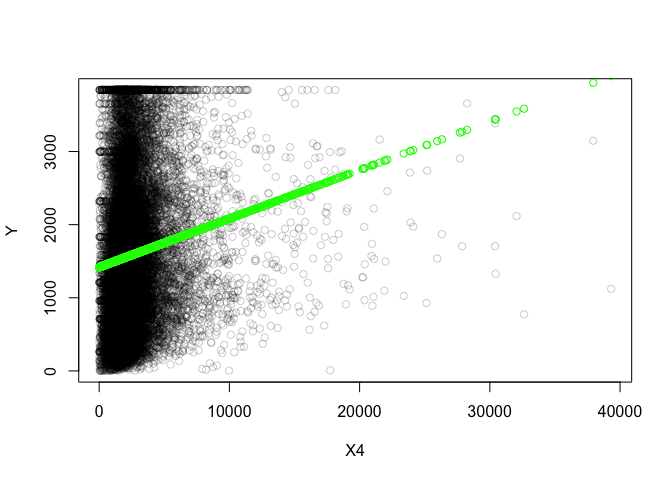

    confint(fit4)

    ##                    2.5 %       97.5 %
    ## (Intercept) 1.396156e+03 1.439561e+03
    ## X4          6.011462e-02 7.280052e-02

Modelo lineal para **X5 TotalBedrooms**.

    fit5 <- lm(Y ~ X5, data=California)
    summary(fit5)

    ## 
    ## Call:
    ## lm(formula = Y ~ X5, data = California)
    ## 
    ## Residuals:
    ##     Min      1Q  Median      3Q     Max 
    ## -1954.1  -812.1  -217.3   620.4  2325.9 
    ## 
    ## Coefficients:
    ##              Estimate Std. Error t value Pr(>|t|)    
    ## (Intercept) 1515.9677    11.5465 131.292   <2e-16 ***
    ## X5             0.1433     0.0169   8.476   <2e-16 ***
    ## ---
    ## Signif. codes:  0 '***' 0.001 '**' 0.01 '*' 0.05 '.' 0.1 ' ' 1
    ## 
    ## Residual standard error: 1023 on 20638 degrees of freedom
    ## Multiple R-squared:  0.003469,   Adjusted R-squared:  0.003421 
    ## F-statistic: 71.85 on 1 and 20638 DF,  p-value: < 2.2e-16

    plot(Y ~ X5, California, col = rgb(red = 0, green = 0, blue = 0, alpha = 0.2))
    points(California$X5, fitted(fit5), col="green")

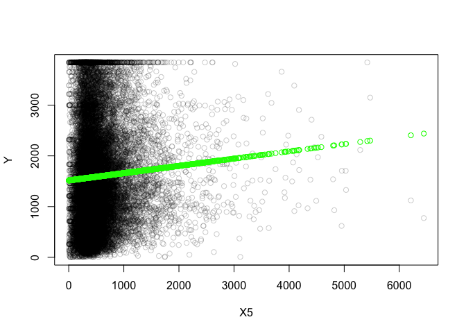

    confint(fit5)

    ##                    2.5 %      97.5 %
    ## (Intercept) 1493.3356952 1538.599776
    ## X5             0.1101299    0.176382

Modelo lineal para **X6 Population**.

    fit6 <- lm(Y ~ X6, data=California)
    summary(fit6)

    ## 
    ## Call:
    ## lm(formula = Y ~ X6, data = California)
    ## 
    ## Residuals:
    ##     Min      1Q  Median      3Q     Max 
    ## -1611.8  -809.6  -209.3   629.3  2333.3 
    ## 
    ## Coefficients:
    ##               Estimate Std. Error t value Pr(>|t|)    
    ## (Intercept)  1.613e+03  1.146e+01  140.71   <2e-16 ***
    ## X6          -1.404e-02  6.297e-03   -2.23   0.0258 *  
    ## ---
    ## Signif. codes:  0 '***' 0.001 '**' 0.01 '*' 0.05 '.' 0.1 ' ' 1
    ## 
    ## Residual standard error: 1024 on 20638 degrees of freedom
    ## Multiple R-squared:  0.0002409,  Adjusted R-squared:  0.0001925 
    ## F-statistic: 4.973 on 1 and 20638 DF,  p-value: 0.02576

    plot(Y ~ X6, California, col = rgb(red = 0, green = 0, blue = 0, alpha = 0.2))
    points(California$X6, fitted(fit6), col="green")

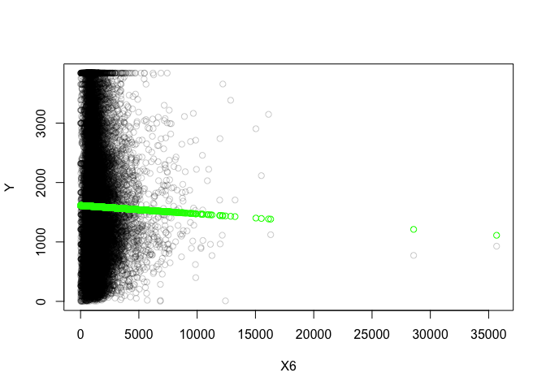

    confint(fit6)

    ##                     2.5 %        97.5 %
    ## (Intercept) 1590.57147074  1.635510e+03
    ## X6            -0.02638356 -1.699524e-03

Modelo lineal para **X7 Households**.

    fit7 <- lm( Y ~ X7, data=California)
    summary(fit7)

    ## 
    ## Call:
    ## lm(formula = Y ~ X7, data = California)
    ## 
    ## Residuals:
    ##     Min      1Q  Median      3Q     Max 
    ## -2056.6  -807.2  -218.8   616.7  2350.0 
    ## 
    ## Coefficients:
    ##              Estimate Std. Error t value Pr(>|t|)    
    ## (Intercept) 1491.7745    11.7002   127.5   <2e-16 ***
    ## X7             0.2027     0.0186    10.9   <2e-16 ***
    ## ---
    ## Signif. codes:  0 '***' 0.001 '**' 0.01 '*' 0.05 '.' 0.1 ' ' 1
    ## 
    ## Residual standard error: 1022 on 20638 degrees of freedom
    ## Multiple R-squared:  0.005721,   Adjusted R-squared:  0.005673 
    ## F-statistic: 118.8 on 1 and 20638 DF,  p-value: < 2.2e-16

    plot(Y ~ X7, California, col = rgb(red = 0, green = 0, blue = 0, alpha = 0.2))
    points(California$X7, fitted(fit7), col="green")

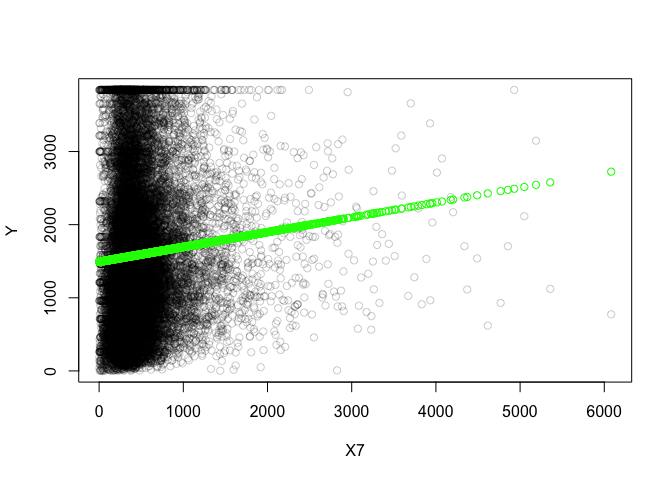

    confint(fit7)

    ##                    2.5 %      97.5 %
    ## (Intercept) 1468.8412169 1514.707760
    ## X7             0.1662305    0.239144

Modelo lineal para **X8 MedianIncome**.

    fit8 <- lm(Y ~ X8, data = California)
    summary(fit8)

    ## 
    ## Call:
    ## lm(formula = Y ~ X8, data = California)
    ## 
    ## Residuals:
    ##     Min      1Q  Median      3Q     Max 
    ## -4779.7  -529.2  -139.0   392.3  3486.1 
    ## 
    ## Coefficients:
    ##             Estimate Std. Error t value Pr(>|t|)    
    ## (Intercept)   172.44      11.86   14.54   <2e-16 ***
    ## X8            367.01       2.75  133.44   <2e-16 ***
    ## ---
    ## Signif. codes:  0 '***' 0.001 '**' 0.01 '*' 0.05 '.' 0.1 ' ' 1
    ## 
    ## Residual standard error: 750.7 on 20638 degrees of freedom
    ## Multiple R-squared:  0.4632, Adjusted R-squared:  0.4631 
    ## F-statistic: 1.781e+04 on 1 and 20638 DF,  p-value: < 2.2e-16

    plot(Y ~ X8, California, col = rgb(red = 0, green = 0, blue = 0, alpha = 0.2))
    points(California$X8, fitted(fit8), col="green")

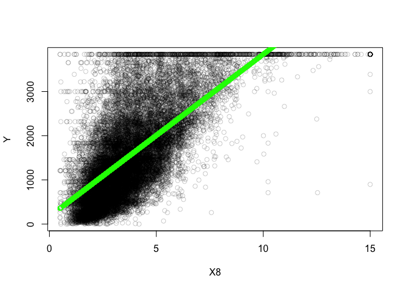

    confint(fit8)

    ##                2.5 %   97.5 %
    ## (Intercept) 149.1960 195.6851
    ## X8          361.6214 372.4034

Cálculo manual de la raiz del ECM
---------------------------------

    sqrt(sum(fit1$residuals^2)/length(fit1$residuals))

    ## [1] 1023.416

Predicción sobre nuevos valores
-------------------------------

    predict(fit1, data.frame(X1 = c(-120,-110), check.names = FALSE))

    ##        1        2 
    ## 1603.141 1368.037

Modelo con todas las variables
------------------------------

    fit9 <- lm(Y ~., data=California)
    summary(fit9)

    ## 
    ## Call:
    ## lm(formula = Y ~ ., data = California)
    ## 
    ## Residuals:
    ##     Min      1Q  Median      3Q     Max 
    ## -4862.4  -396.3   -90.2   313.8  7151.4 
    ## 
    ## Coefficients:
    ##               Estimate Std. Error t value Pr(>|t|)    
    ## (Intercept) -3.550e+04  5.520e+02 -64.317  < 2e-16 ***
    ## X1          -4.211e+02  6.293e+00 -66.915  < 2e-16 ***
    ## X2          -4.190e+02  5.942e+00 -70.516  < 2e-16 ***
    ## X3           9.097e+00  3.810e-01  23.877  < 2e-16 ***
    ## X4          -5.672e-02  6.956e-03  -8.154 3.72e-16 ***
    ## X5           8.955e-01  6.092e-02  14.701  < 2e-16 ***
    ## X6          -3.491e-01  9.522e-03 -36.664  < 2e-16 ***
    ## X7           4.955e-01  6.632e-02   7.471 8.25e-14 ***
    ## X8           3.441e+02  2.957e+00 116.347  < 2e-16 ***
    ## ---
    ## Signif. codes:  0 '***' 0.001 '**' 0.01 '*' 0.05 '.' 0.1 ' ' 1
    ## 
    ## Residual standard error: 613.7 on 20631 degrees of freedom
    ## Multiple R-squared:  0.6414, Adjusted R-squared:  0.6412 
    ## F-statistic:  4612 on 8 and 20631 DF,  p-value: < 2.2e-16

Modelo aditivo
--------------

Modelo a priori bueno, con pocas variables (menos complejidad).

    fit10 <- lm(Y ~ X1 + X2 + X8, data=California)
    summary(fit10)

    ## 
    ## Call:
    ## lm(formula = Y ~ X1 + X2 + X8, data = California)
    ## 
    ## Residuals:
    ##     Min      1Q  Median      3Q     Max 
    ## -4470.9  -438.4  -121.1   325.7  4151.3 
    ## 
    ## Coefficients:
    ##               Estimate Std. Error t value Pr(>|t|)    
    ## (Intercept) -40049.679    546.571  -73.27   <2e-16 ***
    ## X1            -476.221      6.144  -77.51   <2e-16 ***
    ## X2            -463.881      5.781  -80.25   <2e-16 ***
    ## X8             317.767      2.475  128.39   <2e-16 ***
    ## ---
    ## Signif. codes:  0 '***' 0.001 '**' 0.01 '*' 0.05 '.' 0.1 ' ' 1
    ## 
    ## Residual standard error: 654.6 on 20636 degrees of freedom
    ## Multiple R-squared:  0.5918, Adjusted R-squared:  0.5918 
    ## F-statistic:  9973 on 3 and 20636 DF,  p-value: < 2.2e-16

Inclusión de **MedianIncome** al cubo

    fit11 <- lm(Y ~ X1 + X2 + I(X8^3) + I(X8^2) + X8, data=California)
    summary(fit11)

    ## 
    ## Call:
    ## lm(formula = Y ~ X1 + X2 + I(X8^3) + I(X8^2) + X8, data = California)
    ## 
    ## Residuals:
    ##     Min      1Q  Median      3Q     Max 
    ## -3044.3  -431.0  -118.7   314.4  4148.3 
    ## 
    ## Coefficients:
    ##               Estimate Std. Error t value Pr(>|t|)    
    ## (Intercept) -39143.150    539.218  -72.59  < 2e-16 ***
    ## X1            -467.861      6.076  -77.00  < 2e-16 ***
    ## X2            -455.614      5.721  -79.65  < 2e-16 ***
    ## I(X8^3)         -2.883      0.153  -18.84  < 2e-16 ***
    ## I(X8^2)         47.332      3.148   15.04  < 2e-16 ***
    ## X8             121.207     18.200    6.66 2.81e-11 ***
    ## ---
    ## Signif. codes:  0 '***' 0.001 '**' 0.01 '*' 0.05 '.' 0.1 ' ' 1
    ## 
    ## Residual standard error: 644.2 on 20634 degrees of freedom
    ## Multiple R-squared:  0.6048, Adjusted R-squared:  0.6047 
    ## F-statistic:  6315 on 5 and 20634 DF,  p-value: < 2.2e-16

Interacción de **X3** a **X8**. Mejora notablemente el modelo con
respecto al anterior.

    fit12 <- lm(Y ~ X1 + X2 + I(X8^3) + I(X8^2) + X3 * X4 * X5 * X6 * X7 * X8, data=California)
    summary(fit12)

    ## 
    ## Call:
    ## lm(formula = Y ~ X1 + X2 + I(X8^3) + I(X8^2) + X3 * X4 * X5 * 
    ##     X6 * X7 * X8, data = California)
    ## 
    ## Residuals:
    ##     Min      1Q  Median      3Q     Max 
    ## -2822.3  -352.9   -71.4   275.5  4797.7 
    ## 
    ## Coefficients:
    ##                     Estimate Std. Error t value Pr(>|t|)    
    ## (Intercept)       -3.108e+04  5.303e+02 -58.606  < 2e-16 ***
    ## X1                -3.787e+02  6.098e+00 -62.106  < 2e-16 ***
    ## X2                -3.782e+02  5.892e+00 -64.198  < 2e-16 ***
    ## I(X8^3)           -3.265e+00  1.573e-01 -20.752  < 2e-16 ***
    ## I(X8^2)            5.103e+01  3.576e+00  14.273  < 2e-16 ***
    ## X3                -7.702e-01  2.098e+00  -0.367 0.713618    
    ## X4                -2.247e-01  8.029e-02  -2.799 0.005137 ** 
    ## X5                 4.414e+00  7.348e-01   6.008 1.91e-09 ***
    ## X6                 1.202e-01  1.341e-01   0.896 0.370278    
    ## X7                -3.629e+00  8.680e-01  -4.181 2.91e-05 ***
    ## X8                 3.998e+01  2.766e+01   1.445 0.148445    
    ## X3:X4             -1.267e-02  2.706e-03  -4.684 2.83e-06 ***
    ## X3:X5             -5.042e-02  3.280e-02  -1.537 0.124281    
    ## X4:X5             -2.065e-04  9.942e-05  -2.077 0.037787 *  
    ## X3:X6             -2.224e-02  3.769e-03  -5.901 3.68e-09 ***
    ## X4:X6              1.218e-05  4.093e-05   0.297 0.766125    
    ## X5:X6             -5.989e-04  4.730e-04  -1.266 0.205450    
    ## X3:X7              7.946e-02  3.752e-02   2.118 0.034228 *  
    ## X4:X7              5.626e-05  1.474e-04   0.382 0.702746    
    ## X5:X7             -8.904e-04  4.939e-04  -1.803 0.071422 .  
    ## X6:X7              8.381e-04  4.400e-04   1.905 0.056848 .  
    ## X3:X8              4.327e-01  4.489e-01   0.964 0.335101    
    ## X4:X8              1.426e-01  1.640e-02   8.695  < 2e-16 ***
    ## X5:X8             -1.136e+00  1.795e-01  -6.331 2.48e-10 ***
    ## X6:X8             -1.453e-01  3.344e-02  -4.345 1.40e-05 ***
    ## X7:X8              6.194e-01  2.094e-01   2.959 0.003095 ** 
    ## X3:X4:X5           1.468e-05  5.474e-06   2.682 0.007323 ** 
    ## X3:X4:X6          -2.525e-07  1.857e-06  -0.136 0.891865    
    ## X3:X5:X6          -9.960e-06  2.278e-05  -0.437 0.661911    
    ## X4:X5:X6           3.850e-08  3.163e-08   1.217 0.223483    
    ## X3:X4:X7           8.604e-06  7.362e-06   1.169 0.242556    
    ## X3:X5:X7          -1.659e-05  1.541e-05  -1.077 0.281669    
    ## X4:X5:X7           1.033e-07  2.909e-08   3.552 0.000383 ***
    ## X3:X6:X7           3.614e-05  2.285e-05   1.582 0.113673    
    ## X4:X6:X7          -3.794e-08  3.182e-08  -1.192 0.233237    
    ## X5:X6:X7          -3.032e-08  4.994e-08  -0.607 0.543742    
    ## X3:X4:X8          -4.510e-03  5.461e-04  -8.259  < 2e-16 ***
    ## X3:X5:X8           5.488e-02  8.466e-03   6.482 9.25e-11 ***
    ## X4:X5:X8           3.460e-05  2.468e-05   1.402 0.160912    
    ## X3:X6:X8           4.677e-03  8.284e-04   5.645 1.67e-08 ***
    ## X4:X6:X8          -5.519e-06  9.052e-06  -0.610 0.542055    
    ## X5:X6:X8           1.852e-04  1.099e-04   1.686 0.091894 .  
    ## X3:X7:X8          -1.234e-02  9.442e-03  -1.307 0.191210    
    ## X4:X7:X8          -8.940e-05  3.636e-05  -2.459 0.013936 *  
    ## X5:X7:X8           4.806e-04  1.305e-04   3.683 0.000231 ***
    ## X6:X7:X8          -1.050e-04  9.959e-05  -1.055 0.291586    
    ## X3:X4:X5:X6       -3.465e-09  2.210e-09  -1.568 0.116948    
    ## X3:X4:X5:X7       -4.351e-09  1.556e-09  -2.795 0.005190 ** 
    ## X3:X4:X6:X7        5.239e-10  2.441e-09   0.215 0.830058    
    ## X3:X5:X6:X7       -4.301e-09  2.512e-09  -1.712 0.086913 .  
    ## X4:X5:X6:X7       -4.111e-12  1.153e-12  -3.567 0.000362 ***
    ## X3:X4:X5:X8       -5.295e-06  1.539e-06  -3.440 0.000583 ***
    ## X3:X4:X6:X8        7.447e-07  4.209e-07   1.769 0.076863 .  
    ## X3:X5:X6:X8       -2.643e-06  6.011e-06  -0.440 0.660172    
    ## X4:X5:X6:X8       -1.094e-08  7.018e-09  -1.559 0.118971    
    ## X3:X4:X7:X8        5.520e-06  1.940e-06   2.846 0.004438 ** 
    ## X3:X5:X7:X8       -1.682e-05  5.001e-06  -3.363 0.000773 ***
    ## X4:X5:X7:X8       -1.081e-08  6.448e-09  -1.677 0.093577 .  
    ## X3:X6:X7:X8       -1.227e-05  5.990e-06  -2.048 0.040568 *  
    ## X4:X6:X7:X8        1.455e-08  6.823e-09   2.133 0.032950 *  
    ## X5:X6:X7:X8       -4.771e-08  1.321e-08  -3.611 0.000306 ***
    ## X3:X4:X5:X6:X7     6.829e-13  1.076e-13   6.349 2.21e-10 ***
    ## X3:X4:X5:X6:X8     1.291e-09  5.366e-10   2.407 0.016099 *  
    ## X3:X4:X5:X7:X8    -1.386e-11  3.582e-10  -0.039 0.969135    
    ## X3:X4:X6:X7:X8    -9.914e-10  5.581e-10  -1.776 0.075682 .  
    ## X3:X5:X6:X7:X8     5.149e-09  8.143e-10   6.323 2.61e-10 ***
    ## X4:X5:X6:X7:X8     9.625e-13  2.150e-13   4.478 7.58e-06 ***
    ## X3:X4:X5:X6:X7:X8 -1.460e-13  2.030e-14  -7.193 6.57e-13 ***
    ## ---
    ## Signif. codes:  0 '***' 0.001 '**' 0.01 '*' 0.05 '.' 0.1 ' ' 1
    ## 
    ## Residual standard error: 558.7 on 20572 degrees of freedom
    ## Multiple R-squared:  0.7035, Adjusted R-squared:  0.7026 
    ## F-statistic: 728.7 on 67 and 20572 DF,  p-value: < 2.2e-16

Se añade la **X6** al cuadrado. Mejora algo, si bien el aumento de la
complejidad hace que se pueda desprender del este.

    fit13 <- lm(Y ~ X1 + X2 + I(X6^2) + I(X8^3) + I(X8^2) + X3 * X4 * X5 * X6 * X7 * X8, 
                data=California)
    summary(fit13)

    ## 
    ## Call:
    ## lm(formula = Y ~ X1 + X2 + I(X6^2) + I(X8^3) + I(X8^2) + X3 * 
    ##     X4 * X5 * X6 * X7 * X8, data = California)
    ## 
    ## Residuals:
    ##     Min      1Q  Median      3Q     Max 
    ## -2827.8  -346.4   -66.6   272.4  3730.6 
    ## 
    ## Coefficients:
    ##                     Estimate Std. Error t value Pr(>|t|)    
    ## (Intercept)       -3.103e+04  5.261e+02 -58.981  < 2e-16 ***
    ## X1                -3.793e+02  6.049e+00 -62.699  < 2e-16 ***
    ## X2                -3.800e+02  5.845e+00 -65.013  < 2e-16 ***
    ## I(X6^2)            7.934e-05  4.335e-06  18.302  < 2e-16 ***
    ## I(X8^3)           -3.103e+00  1.563e-01 -19.852  < 2e-16 ***
    ## I(X8^2)            4.657e+01  3.555e+00  13.097  < 2e-16 ***
    ## X3                -3.697e+00  2.088e+00  -1.771 0.076610 .  
    ## X4                -4.708e-01  8.077e-02  -5.828 5.68e-09 ***
    ## X5                 7.423e+00  7.472e-01   9.935  < 2e-16 ***
    ## X6                 9.259e-03  1.332e-01   0.070 0.944573    
    ## X7                -6.116e+00  8.717e-01  -7.017 2.34e-12 ***
    ## X8                 5.962e+01  2.746e+01   2.171 0.029952 *  
    ## X3:X4             -7.296e-03  2.700e-03  -2.702 0.006893 ** 
    ## X3:X5             -1.074e-01  3.269e-02  -3.284 0.001023 ** 
    ## X4:X5             -5.591e-04  1.005e-04  -5.564 2.66e-08 ***
    ## X3:X6             -2.163e-02  3.739e-03  -5.784 7.41e-09 ***
    ## X4:X6             -5.353e-05  4.076e-05  -1.313 0.189147    
    ## X5:X6             -1.476e-03  4.716e-04  -3.129 0.001757 ** 
    ## X3:X7              1.406e-01  3.737e-02   3.762 0.000169 ***
    ## X4:X7              1.149e-03  1.579e-04   7.274 3.61e-13 ***
    ## X5:X7             -1.824e-03  4.926e-04  -3.702 0.000214 ***
    ## X6:X7              1.468e-03  4.379e-04   3.353 0.000800 ***
    ## X3:X8              8.176e-01  4.458e-01   1.834 0.066674 .  
    ## X4:X8              1.799e-01  1.640e-02  10.971  < 2e-16 ***
    ## X5:X8             -1.756e+00  1.812e-01  -9.689  < 2e-16 ***
    ## X6:X8             -1.887e-01  3.326e-02  -5.672 1.43e-08 ***
    ## X7:X8              1.327e+00  2.112e-01   6.281 3.43e-10 ***
    ## X3:X4:X5           1.850e-05  5.434e-06   3.404 0.000665 ***
    ## X3:X4:X6           2.145e-06  1.847e-06   1.161 0.245553    
    ## X3:X5:X6          -6.965e-06  2.260e-05  -0.308 0.757898    
    ## X4:X5:X6           1.192e-07  3.168e-08   3.762 0.000169 ***
    ## X3:X4:X7          -1.583e-05  7.424e-06  -2.132 0.033048 *  
    ## X3:X5:X7          -2.307e-07  1.532e-05  -0.015 0.987980    
    ## X4:X5:X7           1.825e-08  2.923e-08   0.624 0.532372    
    ## X3:X6:X7           3.141e-05  2.266e-05   1.386 0.165832    
    ## X4:X6:X7          -1.681e-07  3.236e-08  -5.194 2.08e-07 ***
    ## X5:X6:X7           8.385e-08  4.993e-08   1.679 0.093118 .  
    ## X3:X4:X8          -4.906e-03  5.422e-04  -9.050  < 2e-16 ***
    ## X3:X5:X8           6.812e-02  8.429e-03   8.081 6.75e-16 ***
    ## X4:X5:X8           1.038e-04  2.477e-05   4.191 2.79e-05 ***
    ## X3:X6:X8           4.514e-03  8.218e-04   5.493 3.99e-08 ***
    ## X4:X6:X8          -2.069e-06  8.981e-06  -0.230 0.817803    
    ## X5:X6:X8           4.488e-04  1.100e-04   4.082 4.48e-05 ***
    ## X3:X7:X8          -2.921e-02  9.412e-03  -3.104 0.001912 ** 
    ## X4:X7:X8          -2.378e-04  3.696e-05  -6.432 1.29e-10 ***
    ## X5:X7:X8           3.700e-04  1.296e-04   2.856 0.004296 ** 
    ## X6:X7:X8          -3.119e-04  9.943e-05  -3.137 0.001711 ** 
    ## X3:X4:X5:X6       -1.131e-09  2.196e-09  -0.515 0.606572    
    ## X3:X4:X5:X7        1.378e-09  1.575e-09   0.875 0.381854    
    ## X3:X4:X6:X7       -1.789e-09  2.425e-09  -0.738 0.460628    
    ## X3:X5:X6:X7       -5.499e-09  2.493e-09  -2.205 0.027435 *  
    ## X4:X5:X6:X7        2.264e-12  1.195e-12   1.894 0.058217 .  
    ## X3:X4:X5:X8       -6.508e-06  1.528e-06  -4.259 2.06e-05 ***
    ## X3:X4:X6:X8        4.972e-07  4.177e-07   1.190 0.233993    
    ## X3:X5:X6:X8       -6.629e-06  5.967e-06  -1.111 0.266578    
    ## X4:X5:X6:X8       -2.932e-08  7.034e-09  -4.168 3.08e-05 ***
    ## X3:X4:X7:X8        8.503e-06  1.931e-06   4.403 1.07e-05 ***
    ## X3:X5:X7:X8       -1.391e-05  4.963e-06  -2.803 0.005062 ** 
    ## X4:X5:X7:X8        4.889e-09  6.454e-09   0.758 0.448748    
    ## X3:X6:X7:X8       -7.267e-06  5.948e-06  -1.222 0.221865    
    ## X4:X6:X7:X8        3.651e-08  6.874e-09   5.312 1.10e-07 ***
    ## X5:X6:X7:X8       -4.611e-08  1.311e-08  -3.518 0.000436 ***
    ## X3:X4:X5:X6:X7     3.845e-13  1.079e-13   3.562 0.000368 ***
    ## X3:X4:X5:X6:X8     1.069e-09  5.324e-10   2.008 0.044657 *  
    ## X3:X4:X5:X7:X8    -6.412e-10  3.570e-10  -1.796 0.072470 .  
    ## X3:X4:X6:X7:X8    -6.932e-10  5.538e-10  -1.252 0.210714    
    ## X3:X5:X6:X7:X8     4.269e-09  8.092e-10   5.276 1.33e-07 ***
    ## X4:X5:X6:X7:X8     5.340e-14  2.189e-13   0.244 0.807305    
    ## X3:X4:X5:X6:X7:X8 -1.066e-13  2.025e-14  -5.264 1.42e-07 ***
    ## ---
    ## Signif. codes:  0 '***' 0.001 '**' 0.01 '*' 0.05 '.' 0.1 ' ' 1
    ## 
    ## Residual standard error: 554.3 on 20571 degrees of freedom
    ## Multiple R-squared:  0.7083, Adjusted R-squared:  0.7073 
    ## F-statistic: 734.5 on 68 and 20571 DF,  p-value: < 2.2e-16

KNN
---

KNN para todas las variables.

    fitknn1 <-kknn(Y~., California, California)
    plot(Y ~ X8, California, col = rgb(red = 0, green = 0, blue = 0, alpha = 0.2))
    points(California$X8, fitknn1$fitted.values, col="green")

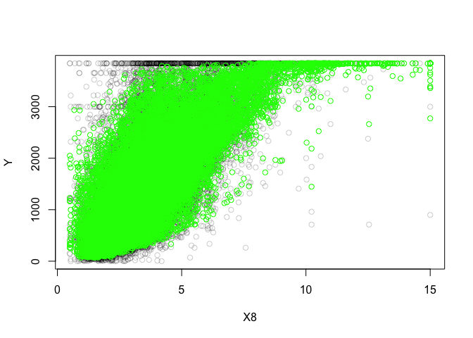
RMSE para modelo con todas las variables

    yprime <- fitknn1$fitted.values
    sqrt(sum((California$Y-yprime)^2)/length(yprime))

    ## [1] 339.597

Modelo con interacción entre variables **X3** a **X8**. Menos error que
el modelo anterior.

    fitknn2 <- kknn(Y ~ X1 + X2 + I(X8^3) + I(X8^2) + X3 * X4 * X5 * X6 * X7 * X8, 
                    California, California)
    sqrt(sum((California$Y - fitknn2$fitted.values)^2)/length(fitknn2$fitted.values))

    ## [1] 326.3407

Se añade la **X6** al cuadrado. Al igual que en el LM, el modelo mejora
levemente, si bien *la complejidad ganada no lo merece*.

    fitknn3 <- kknn(Y ~ X1 + X2 + I(X6^2) + I(X8^3) + I(X8^2) + X3 * X4 * X5 * X6 * X7 * X8,
                    California,California)
    sqrt(sum((California$Y - fitknn3$fitted.values)^2)/length(fitknn3$fitted.values))

    ## [1] 326.286

Mejor modelo que los anteriores, con predictores en grado 1 y omisión de
**X3** al cubo.

    fitknn4 <- kknn(Y ~ . + X3 * X4 * X5 * X6 * X7 * X8, California,California)
    sqrt(sum((California$Y - fitknn4$fitted.values)^2)/length(fitknn4$fitted.values))

    ## [1] 324.5168

Validación cruzada de los mejores modelos obtenidos.
----------------------------------------------------

El mejor LM obtenido se corresponde con: &gt; Y MedianHouseValue ~ X1
Longitude + X2 Latitude + I(X8 MedianIncome^3) + I(X8 MedianIncome^2) +
X3 HousingMedianAge \* X4 TotalRooms \* X5 TotalBedrooms \* X6
Population \* X7 Households \* X8 MedianIncome

    mean(sapply(1:5,run_lm_fold,nombre,"train",
                            Y~X1+X2+I(X8^3)+I(X8^2)+X3*X4*X5*X6*X7*X8))

    ## [1] 3963761203

    mean(sapply(1:5,run_lm_fold,nombre,"test",
                           Y~X1+X2+I(X8^3)+I(X8^2)+X3*X4*X5*X6*X7*X8))

    ## [1] 4281212519

Se puede apreciar que la diferencia entre el training y el test no es
tan elevada, pues el modelo no tiende a sobreajustar en exceso.

El mejor KNN obtenido se corresponde con: &gt; Y MedianHouseValue ~ . +
X3 HousingMedianAge \* X4 TotalRooms \* X5 TotalBedrooms \* X6
Population \* X7 Households \* X8 MedianIncome

    mean(sapply(1:5,run_knn_fold,nombre,"train",
                            Y~.+X3*X4*X5*X6*X7*X8))

    ## [1] 1394873986

    mean(sapply(1:5,run_knn_fold,nombre,"test",
                           Y~.+X3*X4*X5*X6*X7*X8))

    ## [1] 4196806075

En este modelo, si bien arroja los mejores resultados para ambas
validaciones, la diferencia con respecto al entrenamiento es notable, lo
que podemos suponer que se debe a un sobreajuste elevado.

Comparativa general entre distintos algoritmos
----------------------------------------------

    #leemos la tablacon los errores medios de test
    resultados<-read.csv("DATOS/regr_test_alumnos.csv")
    tablatst<-cbind(resultados[,2:dim(resultados)[2]])
    colnames(tablatst) <-names(resultados)[2:dim(resultados)[2]]
    rownames(tablatst) <-resultados[,1]
    #leemos la tablacon los errores medios de entrenamiento
    resultados<-read.csv("DATOS/regr_train_alumnos.csv")
    tablatra<-cbind(resultados[,2:dim(resultados)[2]])
    colnames(tablatra) <-names(resultados)[2:dim(resultados)[2]]
    rownames(tablatra) <-resultados[,1]

Normalización de los errores en LM

    ## lm (other) vs knn(ref)
    # + 0.1 porque wilcox R falla para valores == 0 enla tabla
    difs<-(tablatst[,1] -tablatst[,2]) / tablatst[,1]
    wilc_1_2 <-cbind(ifelse(difs<0, abs(difs)+0.1, 0+0.1), ifelse(difs>0, abs(difs)+0.1,0+0.1))
    colnames(wilc_1_2) <-c(colnames(tablatst)[1], colnames(tablatst)[2])
    head(wilc_1_2)

    ##      out_test_lm out_test_kknn
    ## [1,]   0.1909091     0.1000000
    ## [2,]   0.1000000     1.0294118
    ## [3,]   0.1000000     0.4339071
    ## [4,]   0.1000000     0.3885965
    ## [5,]   0.1548506     0.1000000
    ## [6,]   0.1000000     0.3061057

#### Comparativa por pares de LM y KNN (Wilcoxon’s test)

    LMvsKNNtst<-wilcox.test(wilc_1_2[,1], wilc_1_2[,2], alternative = "two.sided", paired=TRUE)
    Rmas<-LMvsKNNtst$statistic
    pvalue<-LMvsKNNtst$p.value
    LMvsKNNtst<-wilcox.test(wilc_1_2[,2], wilc_1_2[,1], alternative = "two.sided", paired=TRUE)
    Rmenos<-LMvsKNNtst$statistic
    Rmas

    ##  V 
    ## 78

    Rmenos

    ##  V 
    ## 93

    pvalue

    ## [1] 0.7660294

No existen diferencias significativas entre ambos. Sólo hay un
(1-0.7660) x 100 = **23.4%** de confianza en que sean distintos.

#### Test de Friedman

    test_friedman<-friedman.test(as.matrix(tablatst))
    test_friedman

    ## 
    ##  Friedman rank sum test
    ## 
    ## data:  as.matrix(tablatst)
    ## Friedman chi-squared = 8.4444, df = 2, p-value = 0.01467

**Existen diferencias significativas** al menos entre un par de
algoritmos

#### Post-hoc Holm

    tam <-dim(tablatst)
    groups <-rep(1:tam[2], each=tam[1])
    pairwise.wilcox.test(as.matrix(tablatst), groups, p.adjust= "holm", paired = TRUE)

    ## 
    ##  Pairwise comparisons using Wilcoxon signed rank test 
    ## 
    ## data:  as.matrix(tablatst) and groups 
    ## 
    ##   1     2    
    ## 2 0.580 -    
    ## 3 0.081 0.108
    ## 
    ## P value adjustment method: holm

Existen diferencias significativas a favor de M5’ (3vs1 0.081 y 3vs2
0.108, con aprox. 90% de confianza) mientras que los otros dos pueden
ser considerados equivalentes
